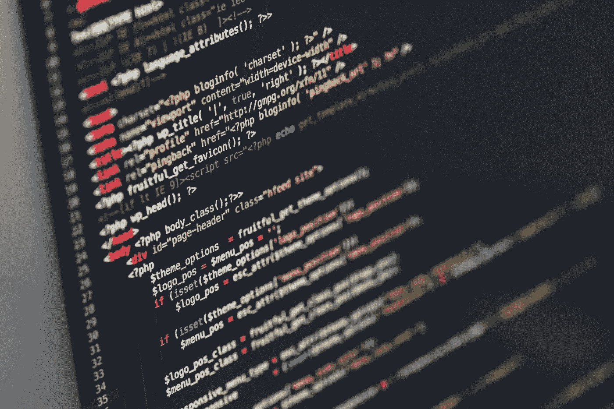
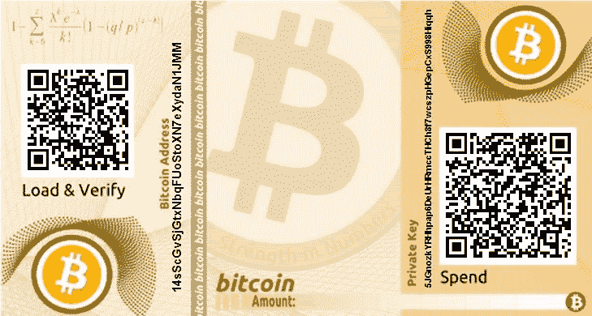
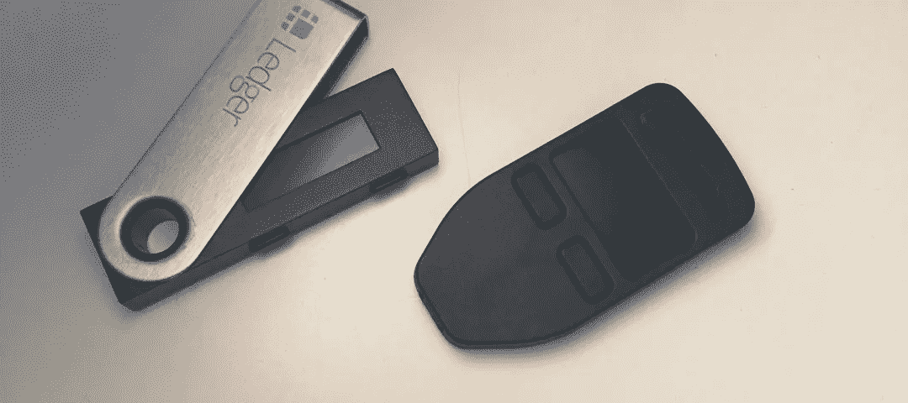
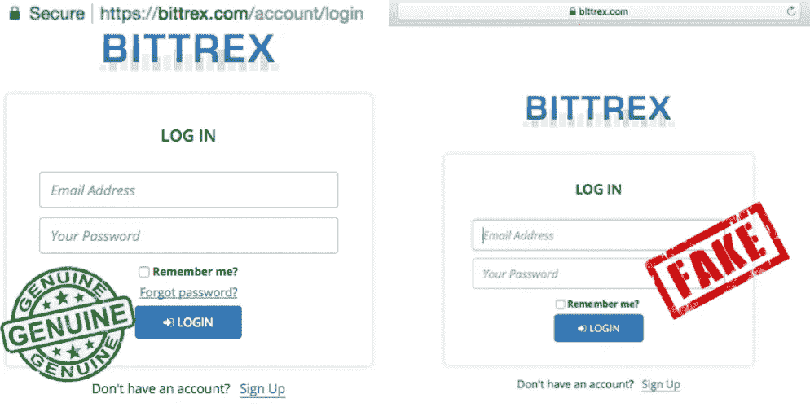

# 如何保护您的加密投资

> 原文：<https://medium.com/swlh/how-to-secure-your-crypto-investments-f8ea58b70023>

[https://unsplash.com/photos/OqtafYT5kTw](https://unsplash.com/photos/OqtafYT5kTw)

好吧，你已经买了你的第一个比特币或莱特币或任何你决定投资的其他硬币，但你也听到许多人谈论交易所被黑客攻击，你应该持有自己的投资。

那么你是如何做到这一点的呢？

区块链的设计不需要信托或第三方，实际上允许你成为自己的银行。但是随之而来的是存储您自己的私钥的责任。

在这篇文章中，我分享了一些我从个人的反复试验、与比我聪明得多的人的交谈以及大量阅读中学到的东西。

我希望这些要点能帮助您更好地保护您的加密资产。

# 钱包

让我们从钱包开始。

作为对新手的快速介绍，钱包是用来存放你的私人钥匙的。这些私钥用于签署您的交易，并实际控制您的所有资金，因此保护您的钱包/私钥是您的首要任务。

这里我也要做几个假设。我假设您想要存储大量资产，并且希望它们尽可能安全。这意味着你愿意付出一点额外的努力来确保你的投资是安全的。如果你的投资还没那么大，手机钱包、网络钱包或者把它放在交易所都是不错的选择。不过，我个人并不推荐这些储存大额投资的选择。

# 纸质钱包

纸质钱包是你的首选，也可能是最安全的，类似于传统资产。一张纸可以存放在保险箱或保险柜里，就像黄金或重要文件一样，使用你一直使用的安全性。

要使用纸质钱包，必须有人能够实际接触到它，并恢复私人密钥才能使用你的资产。这个过程的本质使它更加安全，但也更加难以使用。因此，当您打算定期发送交易时，此选项并不实用。你必须恢复你的钱包，然后在每次交易后通过[相当的过程](https://99bitcoins.com/create-99-9-secure-bitcoin-paper-wallet/)创建一个新的钱包。

使用纸质钱包时需要考虑的几点:

*   **加密你的私人密钥**——永远使用加密你私人密钥的纸质钱包。私钥用恢复它所需的密码加密。对于比特币，这是由比特币改进项目 38 (BIP-38)标准化的。

如果没有这种安全特性，任何能接触到你的纸质钱包的人都可以拍下私人钥匙的照片并控制你的资金。

*   **安全地存储您的密码短语** —与第一点同时，您现在还必须安全地存储您的密码短语，并决定与谁共享。如何做到这一点取决于每个人，但请不要将您的密码短语和纸质钱包放在一起，这违背了您所经历的整个练习的目的。
*   **存放你的纸钱包时使用防篡改封条**以确保银行或其他机构好奇的工作人员在你不知情的情况下无法偷看你的私人钥匙。
*   **为你的纸质钱包**制作一份副本，并确保它安全存放。

洪水发生，水管爆裂，虽然纸钱包非常安全，但纸本身不能很好地处理水。所以，确保你的钱包存放在一个安全的地方，不会被损坏。此外，要确保有一个备份，它的存储与原始文件一样安全。

*   一些不错的比特币纸质钱包有[bitaddress.org](http://bitaddress.org/)和[比特币纸质钱包](https://bitcoinpaperwallet.com/)。

# 硬件钱包

目前，硬件钱包可能是存储加密资产的最佳选择之一。这些都是小设备，你可以存储你的私人和公共密钥，以确保你的资产是安全的。这些设备有自己的操作系统，这意味着它们是安全的，即使你将它们连接到受感染的计算机，因为私钥永远不会离开实际的设备。这使得它们非常安全。

[https://blockbullreview.com/reviews-bitcoin-investing/best-hardware-wallets/](https://blockbullreview.com/reviews-bitcoin-investing/best-hardware-wallets/)

使用硬件钱包时需要考虑的几点:

*   **安全存放您的硬件钱包**以及访问设备的 pin 码。这些设备大多需要你亲自确认交易，所以对钱包的物理控制非常重要。他们还需要一个 pin 来打开设备，所以请始终确保您有一个 pin，以防您的设备落入坏人之手。
*   **考虑买 2 个硬件钱包**。这有两个目的。首先，您可以将第二个钱包作为备份存储在不同的位置，以防主钱包损坏。这样你就不必在订购后等待新钱包的到来(由于对这些设备的高需求，这可能需要很长时间)。其次，这可以作为一种安全措施。如果您怀疑您的主钱包已经受损，您可以使用您的种子短语在第二个钱包上恢复私钥，以将资产安全地移动到新钱包。

每个钱包大约 100 美元，这是一笔非常值得的花费。

*   安全存储您的种子短语。您的种子短语是在您设置钱包时显示的 12 到 24 个单词。这些可以用来在任何类似的设备上恢复你的钱包，你应该安全地保存它们。任何人发现这些词，并知道它们是什么，将能够恢复你的钱包和花你的资金。还可以考虑将种子短语分散到不同的位置，这样会更加安全。
*   **总是用新版本更新你的固件**。这些设备是由人类制造的，并且 [Trezor](/@Zero404Cool/trezor-security-glitches-reveal-your-private-keys-761eeab03ff8) 和 [Ledger](https://techcrunch.com/2018/03/21/a-15-year-old-hacked-the-secure-ledger-crypto-wallet/) 都被发现有安全缺陷，这些缺陷很快被团队修复。
*   **直接从供应商处购买硬件钱包**，而不是通过第三方。已经有许多人购买了“预先设置好的”钱包，却损失了所有投资的恐怖故事。
*   要考虑的好的硬件钱包提供商是 [Ledger](https://www.ledgerwallet.com/products/ledger-nano-s) 和 [Trezor](https://shop.trezor.io/?h=676f6f676c652e636f6d) 。

# 桌面钱包

好了，现在我们进入正题。

如果你投资的资产不太知名，也不被硬件钱包支持，你很可能只和桌面钱包打交道。

在这一点上，如何保护这些资产是你的选择，但特别是如果这是你的大量个人财富，我建议考虑创建一个安全的桌面钱包来存储这些资产。

(如果您不在此级别，请跳到“交流和在线安全”部分)

需要考虑的要点:

*   **你在哪里下载的钱包？这听起来可能有点偏执，但黑客很容易就能把你引向他们的页面，让你下载他们的钱包版本。**

你最好的选择是自己导航到团队的 [Github](https://github.com/) 页面，从那里下载钱包。

*   检查代码 —如果你正在处理大量代码，你可能也想下载代码，亲自检查，然后编译，以确保其中没有任何有趣的内容。如果没有公开的源代码需要检查，你必须问自己为什么会这样？一些黑客甚至创造硬币和钱包来让你在你的机器上安装软件。
*   一旦你下载了钱包**，用提供商的散列检查你下载的(使用[http://onlinemd5.com/](http://onlinemd5.com/)或类似的可信服务)的 MD5、SHA1 或 SHA-256 散列**，如果散列不匹配，丢弃下载的文件。(感谢@notsofast 在[他的文章](https://steemit.com/bitcoin/@notsofast/4-ways-to-secure-your-bags-bitcoin-altcoins-cryptoasset-tokens-whatever-a-notsofast-security-primer)中的这一点，我之前都没想到这一点)
*   通过**病毒扫描程序**运行你的下载，在运行之前确保它是安全的。(我用 Bitdefender，但是你的 AV 解决方案是你的选择)
*   考虑你要用哪个操作系统？我会推荐 Mac OS 或 Linux 版本，因为它们不像 Windows 那样容易感染病毒。
*   考虑使用一个**虚拟机** (VM)来分割你的电脑，确保即使你从一个钱包安装了恶意软件，也不会影响到其他钱包。(这是一种高度的偏执，但我假设你是一个密码百万富翁，你有重要的资产要保护)
*   保持这台机器**完全离线(气隙)**只有当你必须执行交易时才连接到互联网。
*   连接时，**切勿使用公共 Wi-Fi** 。最好用你的手机网络连接，这样更安全，也更容易破解。
*   **使用 VPN** 。这将确保您通过互联网连接发送的所有信息都经过加密，不会被拦截。
*   **用 Bitlocker/VeraCrypt 之类的东西加密你的硬盘**,确保即使笔记本电脑被盗，小偷也无法拿到私钥。
*   全都备份起来。就像纸质钱包一样，笔记本电脑不喜欢水和火，所以要确保你的设备有安全的备份。这个备份应该是您的私钥以及种子短语，并且应该存储在不同的位置。

当你添加新的钱包时，也要确保你定期更新你的备份。以确保在发生灾难时不会损失任何资产。

*   **加密您的备份**。很多人忘记了这一点，但是您的备份和主设备一样重要。许多黑客宁愿追求备份，而不是主要资产，因为它们通常也不受保护。

# 交流和在线活动

[http://debuglies.com/2017/08/19/fake-bittrex-cryptocurrency-exchange-site-stealing-user-funds/](http://debuglies.com/2017/08/19/fake-bittrex-cryptocurrency-exchange-site-stealing-user-funds/)

一旦你尽了最大努力来保护你的钱包，你就不想成为互联网上的骗局或聪明黑客的牺牲品。因此，在与交易所打交道时，或者当您连接到互联网时，请始终考虑以下几点:

*   在与交易所或任何其他网站打交道时，始终使用**双因素认证(2FA)** 。

—不要使用 SMS 2FA —这很容易被黑客攻击，而且不安全。

—使用基于软件的 2FA，其中代码由您的手机生成。如果你真的想成为偏执狂，那就用一部保持离线的旧手机——这样更安全。

—为了获得最高的安全性，请使用基于硬件的 2FA 解决方案，如 [Yubikey](https://www.yubico.com) 。

—在您的电子邮件地址上也使用 2FA，这增加了另一层安全性，因此黑客无法轻易侵入您的帐户并重置密码。

*   不要使用你在交易所等网站上日常使用的电子邮件。

—每个人都知道这个地址，它将是黑客在试图登录您的帐户时攻击或尝试的第一个地址。

—使用完全独立的电子邮件地址，该地址不容易被猜到，仅用于登录这些网站。

—终极偏执等级 9000 —每个网站使用一个单独的电子邮件地址。尤其是如果你是一家公司或者你拥有一个域名，电子邮件地址很容易创建。

*   不要在所有这些网站上使用**相同的密码**。

—这听起来很蠢，但是很多人都忘了。如果其中一个网站遭到黑客攻击，而你使用了相同的电子邮件和密码，黑客现在可以访问你所有的账户。

—始终使用不同的密码。您可以通过创建一个长密码来实现这一点，该密码根据网站名称在每个站点发生变化，或者您可以使用密码管理器，如 [Keepass](https://keepass.info/) 或 [LastPass](https://www.lastpass.com/) 。

*   不要点击电子邮件、不和谐信息等中的链接。

—任何黑客的目标都是让你点击某个东西。要么下载一些恶意的东西，要么把你带到一个他们控制的网站，这个网站看起来和原来的一模一样。

—当你收到邮件时，总是将鼠标悬停在链接上，查看它们真正指向哪里。

—如果某件事听起来好得不像真的，那它很可能就是真的。

—如果信息是紧急的，永远保持更多的怀疑。黑客利用紧迫性让你不假思索地点击东西。(例如，您的帐户已被入侵，请点击链接……)

*   总是**仔细检查网站的 URL** 。

—这与“不要点击电子邮件、不和谐信息等中的链接”密切相关

—黑客会利用 URL 之间的微小差异将你引向网站，并在你进入网站时窃取你的所有凭据。

*   总是检查你的浏览器中的绿色安全锁。

—如果您经常使用某些网站，请将这些网站加入书签，并使用书签导航到这些网站。

—不要搜索并点击顶部链接。黑客会购买附加服务，并使用智能搜索引擎优化工具将他们的网站放在搜索结果的顶部，这样你就可以点击它。

*   安装一个**广告拦截器**来拦截可能被点击的广告。
*   **连接网站时不要使用公共 Wi-Fi** 。公共 Wi-Fi 不安全，一些孩子甚至不用真正尝试就可以获得你所有的登录信息。
*   始终使用 **VPN** 。

—这可以保护您通过互联网发送的所有信息，如果您要进行大量转账并且不想让他人知道您的实际位置，也可以使用它来隐藏您的位置。

*   **不要在线存储备份**。(Dropbox、Googled rive、ICloud 等)

—这适用于备份您的密码和私钥。

—如果这些服务遭到黑客攻击，您的所有关键信息也会遭到黑客攻击。

*   训练你自己/训练你的人。

—特别是如果你是一家大公司，培训你的员工知道在钓鱼邮件中寻找什么。这仍然是黑客武器库中最有效的工具之一。即使最近有消息称[币安被黑客攻击](https://mashable.com/2018/03/08/binance-phishing-attack/#Vk70OWzVyiqu)，结果证明这是一次网络钓鱼攻击，导致用户放弃他们的凭证，这就是问题所在。

—别吹牛了。

—我知道这很难，但这是最好的规则之一。如果你告诉互联网上的每个人你的百万密码，你最终会成为一个目标。

—如果你经营一家公司，教育你的员工不要告诉任何人他们在做什么，也不要透露交易是如何进行的任何具体细节等。

—您最好的安全措施是永远不要成为目标。

我真的希望这能帮助你保护你的资产。当我开始我的旅程时，我希望这是一个向导。

如果你觉得我错过了什么，或者有其他人可能会觉得有用的补充，请在下面评论，这样我们都可以学习。我肯定有些事情我错过了。

对于任何想知道密钥分片或 multisig 解决方案的人，我有意将他们排除在这篇文章之外，因为我认为这值得一篇完全独立的文章，这是我正在做的。

## 这个故事发表在 [The Startup](https://medium.com/swlh) 上，这是 Medium 最大的创业刊物，拥有 319，583+人关注。

## 在这里订阅接收[我们的头条新闻](http://growthsupply.com/the-startup-newsletter/)。

