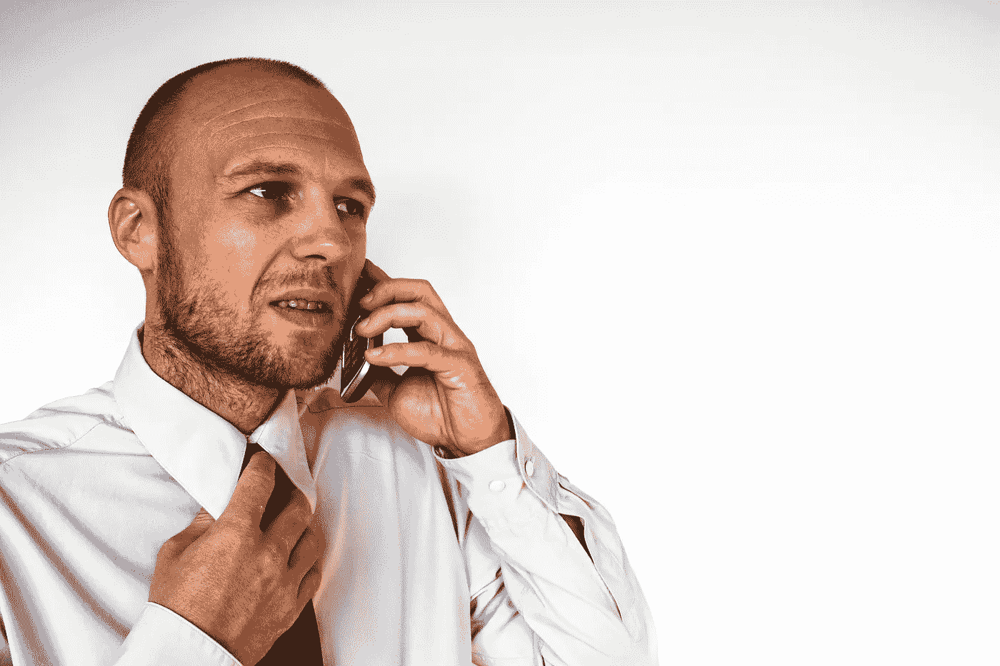

# 如何更好更快地销售

> 原文：<https://medium.com/swlh/how-to-sell-better-and-faster-719bf0a9dcb>

## 通过公开演讲来学习。

Don’t want to read? Just press play.

像金克拉、大卫·奥格威和戴尔·卡耐基这样的传奇人物知道如何打动观众，但最重要的是，他们知道如何销售。作为一名职业演讲者，我被他们为与客户沟通而设定的标准所鼓舞。这些行业领导者知道沟通是成功销售的核心。

> 一个优秀的销售人员知道如何以一种让人们不仅注意到而且采取行动的方式说话和倾听。

HubSpot 的 Leslie Ye 在她的文章《 [13 种对销售成功至关重要的沟通技巧](https://blog.hubspot.com/sales/communication-skills-sales)》中详细探讨了这一主题，她写道:“销售成功的根本在于收集和提供信息的能力，这种能力会让潜在客户愿意与你做生意。”

当我教授研讨会或做主题演讲时，我的目标是提供可操作的信息。要做到这一点，我必须确保我不仅仅是在和房间里的人说话，而是我的信息被接收到了。除非建立这种联系，否则沟通是无效的。

你如何建立这种联系？

你必须准备，练习和表演。精心构思你的想法，练习你的沟通技巧，使之有效。通过研讨会、演讲者论坛和实践，演讲者发展了与听众沟通的技能，并让他们敞开心扉(有时也敞开钱包)

这就是为什么学习专业演讲者可以让一个好的销售人员变得更好。一个了解产品和客户的销售人员，一旦他或她也知道如何像专家一样沟通，他或她就会成为三重威胁。

# 以下是一些能提升你销售水平的演讲天赋:

**自信和真实**——想象一下，一旦你掌握了与一群陌生人分享你的故事，与单个客户或潜在客户交谈将会变得多么容易。提高你的演讲技巧可以帮助你克服大多数人在陌生人面前做演讲时的自然紧张感。随着你成为一个更好的演讲者，你也会成为一个更真实的交流者。

肢体语言和情景意识——学习在观众面前说话的一个重要部分是自我意识。演讲者需要能够使用动作和手势来补充他们的演讲，而不是分散注意力。要想在舞台上真正舒服，你必须控制自己，但不要自我意识。那项技能需要一点练习。

**声音调制和控制** —当你说话时，你的声音不仅会传达话语，还会传达情感和强调。像乐器一样，你可以调整你的节奏和音调来增强你的演示。学会识别你的跑调是专业演讲发展的另一项技能。

**故事制作**——说话是一种能力，讲故事是一门艺术。专业演讲者学会通过讲述一个伟大的故事来鼓励和激励他人。能够以客户为主角讲述令人信服的故事的销售人员拥有成功之路。

***

**Kit Pang** 传播专家、 [TEDx](http://www.youtube.com/watch?v=OE3nUrTp_KQ) 、 [Inbound](http://www.youtube.com/watch?v=fJj8ZsAmXt0&t=3s) 主讲人、[Boston speakers](http://www.bostonspeaks.com/)创始人。他的使命是帮助个人成为杰出的演说家和沟通者。基特的研讨会和讲座被认为非常有趣、引人入胜、发人深省和富有洞察力。[www.bostonspeaks.com](http://www.bostonspeaks.com)| @ kit pangx，@Boston_Speaks

## 这篇文章发表在 [The Startup](https://medium.com/swlh) 上，这是 Medium 最大的创业刊物，拥有 336，210 多名读者。

## 在这里订阅接收[我们的头条新闻](http://growthsupply.com/the-startup-newsletter/)。

