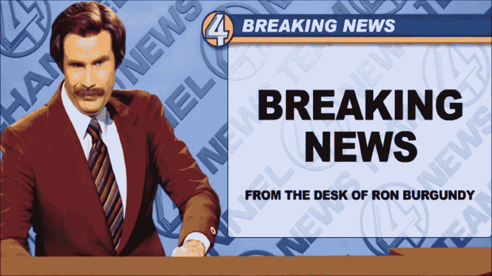
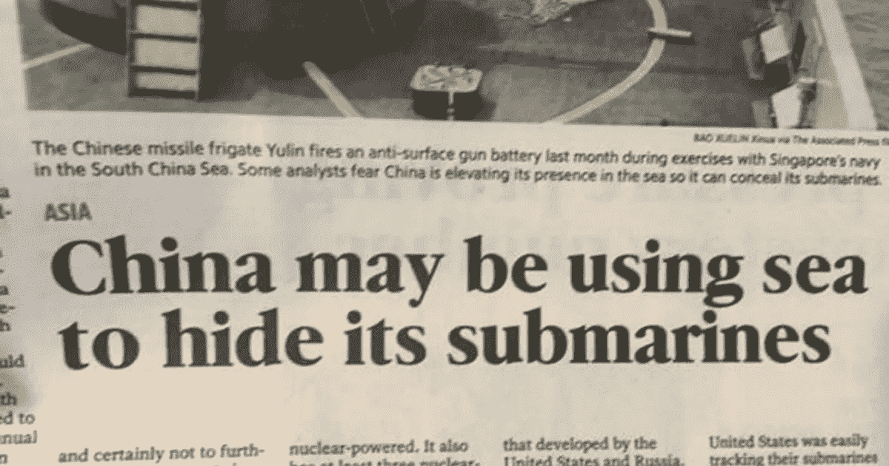
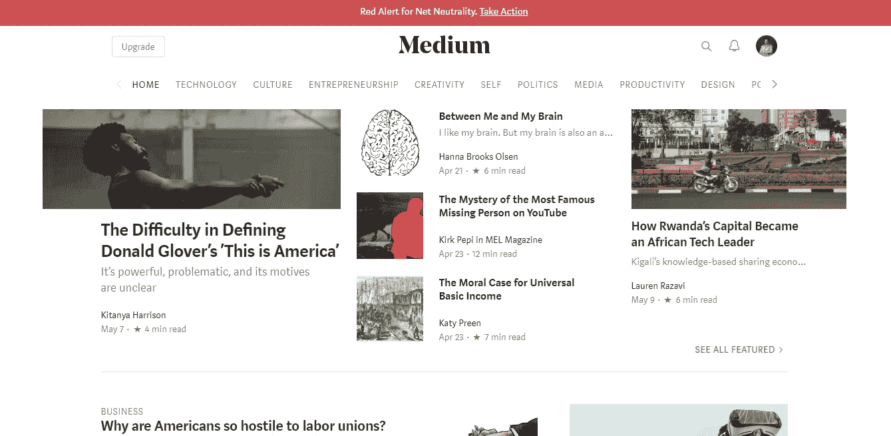
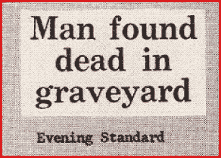

# 如何通过完美的标题销售更多商品并击败竞争对手

> 原文：<https://medium.com/swlh/how-to-sell-more-and-beat-your-competition-with-perfect-headlines-92ba47617cab>

Breaking News

你读过一些听起来很无聊的东西吗？

**我也没有。**

那是因为我们不参与带有糟糕标题的内容**。**

# 什么是标题？

标题是吸引注意力的抓手。

它可以是一个标题、一行间距、一幅图像等等。

标题的目标是抓住你的注意力。

Ya think?

看看上面这个标题**。**

无意中，这份出版物通过其幽默的标题 snaffoo 获得了大量的免费宣传和内容参与。

# 征服头条，否则你的内容无关紧要

如果你写了一篇**精彩的文章**但是你的标题很烂，有人会给它一个机会并参与其中吗？

大概不会。

用一个销售类比来说，你的标题为你购买了某人的前 10 秒钟时间。

对你内容的介绍为你赢得了接下来的 60 秒。而你的内容质量决定了他们是看完内容还是离开。

想要**证明？**

看看现在 Medium 的首页，上面显示了最受欢迎的文章。

你有没有看到标题在某种程度上不能引起你兴趣的东西？

Catchy headlines

# 如何写出完美的标题

写完美的标题其实很容易。

像这样做。

*   决定你想写什么。
*   生成标题
*   完善它，直到它让你点击这篇文章。)

# 标题类型

完美的标题可以有不同的形式。

这里有一些标题选项供您参考:

*   写一个会引起讨论的两极分化的标题(为什么脸书的广告很烂，你在浪费时间)。
*   写一个**有趣的**标题，让读者想了解更多(了解我如何使用直邮在 3 周内赚到 93，000 美元)。
*   写一个不言自明的**信息性**标题(自由职业者的 50+最佳 WordPress 主题)。
*   写一个**利益驱动的**标题(如何以更少的工作量达成更多的交易)。

或者，写一个这样的标题:

开玩笑的。

# 实在不行的话(还可以…)

**抄袭**别人。

从某个在你的目标市场上取得成功的人那里获得灵感。

看他们用的**标题**复制格式。

日光之下无新事。

模仿那些写杀手级标题的人会帮助你抓住它的要点，在你意识到之前，你就可以自己写了，**卖得更多，击败你的竞争对手。**

你保持中等水平。

## 你可能也喜欢这个:

## [如何通过成为出版作家来发展你的业务](/swlh/how-to-grow-your-business-by-becoming-a-published-author-8d8503c8ee4)

## 这个故事发表在[的创业](https://medium.com/swlh)上，这是 Medium 最大的创业刊物，有 325，962+人关注。

## 订阅接收[我们的头条新闻](http://growthsupply.com/the-startup-newsletter/)。

