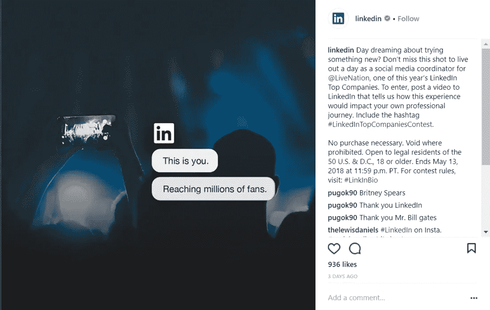

# 如何在社交媒体上销售:B2B 和 B2C 营销人员指南

> 原文：<https://medium.com/swlh/how-to-sell-on-social-media-a-guide-for-b2b-and-b2c-marketers-d01ef60c26ac>

销售人员依靠电话推销为公司创造商机的日子已经一去不复返了。现在，这一过程的主要部分是通过社交销售进行的。营销人员正在转向社交媒体来挖掘线索，因为旧的方法更耗时，需要更多的努力。他们在确认销售线索方面的效率也大大降低了。

社交销售包括许多步骤，营销人员试图通过这些步骤来影响目标受众的购买决策。这些步骤包括回答他们的问题，回复评论，并在整个过程中提供高质量的内容，直到潜在客户准备购买。

这篇文章简要讨论了社交销售的所有重要方面，以及如何利用它们。

# B2B 和 B2C 卖家社交销售策略的差异

为了最大化和改进你自己的社交销售方法，理解这两种类型的企业之间的战略差异是很重要的。社交销售背后的主要目的是利用社交媒体平台来创造品牌知名度，吸引目标受众，并产生销售线索。

B2B 和 B2C 公司采用的方法互不相同，因为它们面向不同的受众。B2C 公司利用消费者的情感因素，而 B2B 公司则通过使用信息图表、统计数据和其他可衡量的数据来证明这一点，从而将自己定位为市场领导者。

# #1 内容

对于 B2B 社交销售，内容需要更长，也更详细。这是因为客户正在为他们的公司寻找解决方案，并且对他们正在寻找的东西更加认真和直接。

因此，他们需要关于产品和服务的更详细的信息，并需要关于产品功效的具体证明。一般来说，B2B 买家不是个人买家，而是代表一个团队或公司进行采购。

因此，B2B 社交销售策略需要吸引与购买相关的所有团队成员。正如你在下面的例子中看到的，IBM 的内容，虽然是 Instagram 帖子，但不是你的普通内容。它是为那些被鼓励去查看他们的简历上的内容链接以获取详细信息的小众观众准备的。

另一方面，B2C 卖家创造的内容是轻松的，同时也是有趣和吸引人的。这主要是因为他们的潜在客户在寻找特定的商品或服务时，通常会有一种更随意、更愉快的心情。他们更喜欢同时具有娱乐性和吸引力的内容，而不是商业类的、只基于事实的内容。

# #2 目的

由于社交销售意味着通过社交媒体销售，B2B 和 B2C 营销人员正在努力主导不同的社交媒体渠道，如脸书、Twitter、Instagram、LinkedIn 等。B2B 卖家的主要目的是建立知名度，提高参与度，这样他们就能为自己的网站带来更多流量。为此，他们努力创造可以病毒式传播的内容。他们还在不同的在线论坛上谈论自己的品牌。

对于 B2C 营销人员来说，增加网站流量通常会增加销售额。B2C 买家的决策过程只需要 B2B 买家的一小部分时间。B2C 营销人员主要瞄准社交媒体平台，如脸书、Twitter、Pinterest 和 Instagram。

正如你在下面的例子中看到的，销售手表的 B2C 品牌 CLUSE 利用母亲节的机会在网上销售。他们鼓励他们的追随者赠送手表给他们生活中的母亲。而且，他们甚至包括在他们的故事中描绘他们的追随者的动机。

另一方面，看看 LinkedIn 如何更注重利用内容建立知名度和参与度，而不仅仅是销售。对于 B2B 品牌来说，销售就没那么简单了。它必须通过大规模的品牌认知和参与。越多的人在他们的圈子里谈论一个品牌，这个品牌转化的机会就越大。

B2B 买家的决策过程更长。以下平台是最有效的社交媒体平台:

*   LinkedIn — [97%的 B2B 营销人员](https://contentmarketinginstitute.com/wp-content/uploads/2017/09/2018-b2b-research-final.pdf)说他们使用 LinkedIn 进行营销，78%的人认为它是最有效的。
*   Twitter——87%的 B2B 营销人员使用 Twitter 进行营销，48%的人认为它非常有效。
*   脸书——86%的 B2B 营销人员使用脸书进行营销，42%的人认为它很有效。

B2B 营销人员可以分享电子书、播客、指南和网络研讨会等内容，甚至通过这些渠道推广活动。像脸书这样的平台也在他们的页面上提供直接订阅按钮。所以也有可能通过他们找到新的线索。

然而，最成功的 B2C 公司发现脸书、Twitter、Instagram 和 YouTube 是最有效的。

你可以在这些平台上分享各种内容，不仅可以增加参与度，还可以促进销售。例如，你可以在你的脸书或 Twitter 帖子上添加产品页面的链接，鼓励观众购买。

在 Instagram 上，你可以在你的简历上链接到你的网站，并利用你的帖子鼓励粉丝点击它。如果你在 Instagram 上有不止一个 10K 粉丝，你甚至可以直接把他们从 Stories 引导到你的网站。

# 你应该考虑在社交媒体上多卖的东西

无论是 B2B 公司还是 B2C 公司，无论是什么平台，你都需要记住一些基本的东西来提高社交媒体上的销售额。这些只是你需要做的一些基本调整，以优化你的社交销售努力，从而在竞争中保持领先。

# #1 确定客户经常光顾的社交平台

有一些平台比 B2C 更适合 B2B 公司。所以，在你开始计划你的社交销售策略之前，你需要找到你的目标受众最喜欢的社交媒体平台。当用户通过社交链接访问您的网站时，您还应该确定哪些社交网络平台具有最高的转化率。

例如，假设你销售 18 到 35 岁年龄段女性的化妆品。想想你的目标受众最有可能花时间上网的平台。也许是脸书，但你怎么能确定呢？检查相关平台的用户统计数据。

根据最新的研究，13%的 25 至 34 岁的女性和 9%的 18 至 24 岁的女性在脸书。所以很明显，你需要把社交媒体营销的重点放在脸书。

此外，还有不同的社交媒体监测工具，如 [Hootsuite](https://hootsuite.com/) 、 [Sparkcentral](https://www.sparkcentral.com/) 、 [SproutSocial](https://sproutsocial.com/) 等。这些工具可用于跟踪和参与关于您的品牌的对话，以及通过不同的社交媒体渠道与您的定位相关的其他对话。

定期的社交媒体监测将帮助你识别目标受众最活跃的社交网络。这是一个很好的方法，可以让你随时了解与你的品牌相关的所有话题，无论谈话中有没有提到这家公司，也是一个更好地吸引潜在客户的方法。

# #2 通过 CTA 简化采购

购买过程过于复杂意味着失去客户。没有人愿意经历一个漫长而复杂的旅程去买一件自己只是碰巧喜欢的东西。事实上，如果顾客的购买之旅快捷方便，他们更有可能推荐一种产品。

潜在客户应该能够轻松地从社交网络导航到登录页面。你为社交销售创造的内容应该能够引导你的观众找到他们想要的东西。所以，你的社交文案应该尽可能直截了当，并带有很强的 CTA。

社交网站提供了大量的 CTA 选项供选择。例如，在[脸书](https://www.facebook.com/business/help/587674254642386)上，你可以从 11 种不同的 CTA 中进行选择，添加到你的业务页面上。

例如，*现在购物*按钮对于 B2C 品牌推广他们的产品非常有用。或者，如果他们正在推广他们的服务，也可以使用*立即预订*、*了解更多信息*或*联系我们*。

对于 B2B 品牌来说，*了解更多*，*观看更多*，*下载*，*请求时间*，或*现在预订*对于产生销售线索非常有用。

Instagram 为您发布的视频或图像广告提供了 8 种 CTA 选择。通过将 Instagram *Shop Now* 功能添加到你在页面上分享的内容中，可以让喜欢这些产品的人购买它们。

除了 Instagram 的可视化功能可以提高其平台上潜在客户对您产品的兴趣之外，“立即购买”功能还可以通过将潜在客户引导到您的网站来帮助您向他们销售这些商品。

无论你使用哪种社交媒体平台，你都需要确保有合适的 CTA。这些不仅能引导你的顾客完成购买之旅，还能增加紧迫感。

以下是有效行动号召的特征:

*   为您的 CTA 制作一份引人注目的副本。只有按钮是不够的，除非你恰当地鼓励用户点击它。
*   确保您的 CTA 副本清晰可见。例如，Instagram 会截断帖子上的长标题，这样在 feed 中只能看到其中的一部分。您需要确保您的 CTA 出现在该空间内。

# #3 针对移动设备优化您的网站

主要在手机或平板电脑上活跃的社交媒体用户数量相当高，并且还在增长。作为营销人员，你需要为移动用户优化你的网站，这样他们在访问你的网站时就不会有任何困难。

检查您的站点在移动设备上使用的性能，例如加载页面所用的时间。这一方面在决定网站性能时非常重要。你可以借助像谷歌页面速度这样的工具来评估你的网站在移动设备和桌面上的页面速度。你也可以使用同样的工具来检查你的网站是否是手机友好的。

如果潜在买家使用移动设备访问你的网站的第一次体验是复杂的和不友好的，你将会失去他们。请记住，在社交媒体上销售的底线是确保客户易于使用，这样从 A 到 b 就不会出现任何复杂情况。

# #4 获得尽可能多的顾客评论

社交媒体上关于你的品牌或产品的对话，以及对吸引和建立与你的观众的关系至关重要的顾客评论。皮尤研究中心的一项研究显示，40%的美国消费者称他们在网上购物前会阅读在线评论。

也许让评论对你的品牌认知产生积极影响的最佳方式是与有影响力的人合作。这适用于 B2C 和 B2C 品牌。

因为影响者的建议受到他们的追随者的信任，甚至被付诸行动，所以要好好利用它们。事实上，众所周知，来自有影响力的人的推文与来自品牌的推文相结合，会使[的购买意愿增加 5.2 倍](https://blog.twitter.com/marketing/en_us/a/2016/new-research-the-value-of-influencers-on-twitter.html)。

如果你是一个 B2C 品牌，在你的领域找到有影响力的人并与之合作相对容易。请他们尝试你的产品，并在社交媒体上分享他们的诚实评论。你可以使用像 [Grin](https://www.grin.co/) 这样的平台来联系那些真实的、相关的、值得信赖的有影响力的人。

对于 B2B 品牌来说，找到相关的影响者稍微困难一些，但并非不可能。你可以在你的社交网络上分享行业专家对你的产品的评论。你甚至可以利用被认为是行业领导者的客户的客户评价。

跟踪提及你的品牌的在线对话，并捕捉客户发布的评论(正面和负面的)。使用社交监控工具来简化这个过程。

如果你遇到[负面评论](https://www.inc.com/john-rampton/8-steps-for-fixing-negative-online-reviews.html)，不要灰心丧气，也不要防御。评估这种批评是否有道理，不管不顾地回应这种评论。试着礼貌地将对话快速转移到电话或电子邮件等离线媒介。最重要的是，要有礼貌和人性化，承认问题，然后主动提出尽早解决。

回复评论对于与客户建立关系至关重要。因此，无论他们对你的产品或服务是好是坏，你都必须努力定期回应。

# #5 你可以用来支持社交销售的工具

## **Facebook Marketplace**

去年 10 月，脸书注意到很多人在使用其平台买卖产品后，向买家和卖家开放了平台。

脸书手机应用程序上的这个特殊部分被称为“市场”，这个 Craiglist 风格的部分允许页面所有者和品牌发布待售商品。

然而，市场只是一个帮助卖家与买家见面的平台。它不参与双方之间的任何金融交易，也不参与产品从卖方到买方的交付。

Facebook Marketplace 适合那些在特定地理区域寻找买家或卖家的人。

## **Shopial**

社交销售对你的业务至关重要，你知道这一点，但你没有时间在每个社交媒体平台上做广告。 [Shopial](http://www.shopial.com/) 为这个问题提供了完美的解决方案。你只需要将你的脸书或 Pinterest 账户连接到应用程序，剩下的交给 Shopial。

它将导入您的产品，然后设计、定位和优化广告，帮助您在社交媒体平台上自由推广您的产品。Shopial 的报告功能使用户能够监控其性能。

# 结论

社交媒体创造的虚拟世界有大量用户全天候查看他们感兴趣的产品或服务。此外，越来越多的零售商需要快速响应客户的查询或投诉，这意味着您的团队需要准备好处理来自所有社交媒体网络的此类信息。

如果你知道如何实施和遵循最成功的方法，社交销售可以促进你的销售突飞猛进。

*最初发表于* [***年代*erpstat.com**](https://serpstat.com/blog/how-to-sell-on-social-media-a-guide-for-b2b-and-b2c-marketers/)***。***

**关于作者**

谢恩·巴克是[内容解决方案](https://contentsolutions.io/)和 [Gifographics](http://gifographics.co/) 的创始人兼首席执行官。你可以在[推特](https://twitter.com/shane_barker)、[脸书](https://www.facebook.com/ShaneBarkerConsultant/)、 [LinkedIn](https://www.linkedin.com/in/shanebarker/) 、 [Instagram](https://www.instagram.com/shanebarker/) 上和他联系。

## 这篇文章发表在《初创企业》杂志上，这是 Medium 最大的创业刊物，有 333，253 人关注。

## 订阅接收[我们的头条](http://growthsupply.com/the-startup-newsletter/)。

