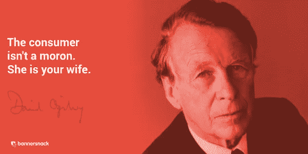

# 如何向千禧一代 B2B 客户销售？

> 原文：<https://medium.com/swlh/how-to-sell-to-millennial-b2b-customers-e608fbc0c17f>

## 如今，73%的千禧一代员工参与了 B2B 购买决策，所以这里有一些提升你的销售游戏的技巧，以便你满足他们的独特需求。

Photo by [rawpixel.com](https://unsplash.com/photos/CabUqKlvKX0?utm_source=unsplash&utm_medium=referral&utm_content=creditCopyText) on [Unsplash](https://unsplash.com/search/photos/millenial?utm_source=unsplash&utm_medium=referral&utm_content=creditCopyText)

T 何广告界的传奇人物曾有一句名言:**“消费者不是低能儿。她是你的妻子。”**

他的意思是，如果你想从广告中赚钱，你必须尊重你的观众。

他认为仅仅一句口号和几个花哨的形容词不足以打动顾客——她需要更多相关信息来说服她。

Source: BannerSnack

那都是 80 年代的事了。现在是 2018 年，是时候升级了。更准确地代表我们时代的名言是:

> 顾客不是傻瓜。她是千禧一代。— [KP](https://twitter.com/thisiskp_)

是的，这意味着对于今天的营销人员/广告商/销售人员来说，情况更加糟糕。掌中握有互联网的千禧一代客户更加多疑，因此比大卫引用的 80 年代“妻子”更需要相关信息。

以下是一些帮助你更好地为现代 B2B 千禧一代客户服务的建议:

1.  **承认千禧一代:**首先，承认他们在这里。73%的千禧一代参与 B2B 采购决策。千禧一代很重要。
2.  **了解千禧一代的心态:**千禧一代如今拥有比以往更多的选择，他们不怕改变。现代人的忠诚度很低，因此投资于卓越的客户成功非常重要。
3.  **以价值为导向:**千禧一代要求透明度、价值观、相关性和参与度。(IBM 商业价值研究所，2015 年)
4.  **使用现代工具:**仍在使用古老的流程([如 VMs](https://www.inc.com/ryan-jenkins/5-reasons-millennials-aren-t-answering-your-phone-call.html) )，因为这只会帮助你更好地完成工作？不好。比起传统，千禧一代更倾向于尊重最新科技。与时俱进，更新您的堆栈。
5.  **制作优秀的内容:**发布引人注目的内容，并保持领先。最近的一个趋势是，人正在成为品牌，品牌正在变得更加人性化。坚持这一点，使用社交和电子邮件渠道，以更人性化的方式吸引他们。
6.  保持销售个性化:最后，让每个销售接触点个性化。你没有理由不在网上了解大多数千禧一代(通过 Linkedin 等[),所以丢掉那些千篇一律的电子邮件，写一封表明你花时间去了解对方的邮件。](https://business.linkedin.com/sales-solutions/blog/4/4-ways-to-personalize-your-social-selling)

*感谢阅读。现在，轮到你了。你对销售给现代 b2b 千禧一代客户有什么建议？欢迎分享你的想法和经验。*

## 如果你相信以一种更现代、更愉快的方式跟进你的客户，请查看[关闭页面](http://www.getclosingpage.com)。有一个免费计划，今天就注册。

## 这篇文章发表在 [The Startup](https://medium.com/swlh) 上，这是 Medium 最大的创业刊物，拥有 306，072+读者。

## 在这里订阅接收[我们的头条新闻](http://growthsupply.com/the-startup-newsletter/)。

