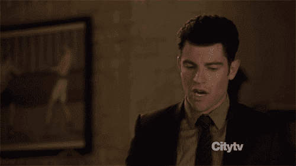
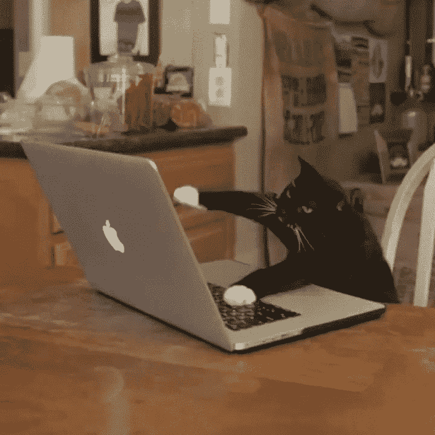
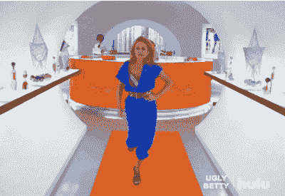
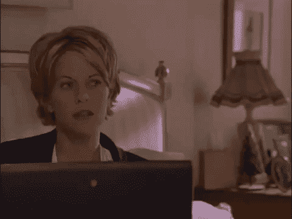

# 如何推销自己(以一种完全不低俗的方式)

> 原文：<https://medium.com/swlh/how-to-sell-yourself-in-a-totally-non-sleazy-way-c618a08c0e99>

Photo by [Jens Lindner](https://unsplash.com/@lindnerfoto?utm_source=medium&utm_medium=referral) on [Unsplash](https://unsplash.com?utm_source=medium&utm_medium=referral)

我不知道你怎么样，但是每当我不得不说一些关于我自己的好话，或者吹嘘我的技能时，我就保持沉默。我手心冒汗，喉咙发干。夸自己只会让我觉得不舒服。

但是，如果你想引起潜在客户或未来雇主的注意，你必须能够说服自己。

或者——至少— *而不是*说服自己。

你完全有办法做到这一点。

# 对你所做的感到惊讶

Image courtesy of Giphy.

当你不仅擅长自己的工作，而且非常聪明时，好事就会降临到你头上。

不要误解我——你仍然需要努力工作——但是努力工作会带来技能。

有了技巧，结果就会显示你知道自己在做什么。

你越了解自己在做什么，越多人会对你的能力赞不绝口。然后，你有多棒的消息就会传开。你甚至不需要推销自己，因为你的技能会为你说话。

# 让你的激情闪耀

Image courtesy of Giphy.

没有什么比阅读一个不关心他们所写主题的人写的东西更糟糕的了。不在乎的人写的内容会让人觉得无聊。你看到的时候就知道了，因为树懒的能量更大。

这就是为什么做自己关心的事情如此重要。当你这样做的时候，你对它的热情就会自然而然地迸发出来。人们会像磁铁一样被你的热情所吸引。

# 展现你的个性

Image courtesy of Giphy.

有一种误解认为，如果你在一个“严肃”的领域工作，你就无法展示自己的个性。

展现个性并不意味着表现得像个孩子或者不成熟。让你的声音和激情贯穿于你所做的一切。

> 展现个性并不意味着表现得像个孩子或者不成熟。

我遇到过一些人，他们对自己所做的事情充满热情，但当他们写下这些事情时，给人的感觉就像是他们试图让读者厌烦到睡着，因为他们的作品太缺乏个性了。

有时这是因为害怕如果他们在写作中加入个性，他们将不会被认真对待。其他时候，错误的假设是专业是无聊的同义词。

> 看你的文章是否有个性的最好方法是大声朗读。

看你的文章是否有个性的最好方法是大声朗读。如果你大声朗读时听起来像机器人，你需要改变它。问问你自己，如果你和一个人面对面完全放松地交谈，你会怎么说。你需要以诚实、真实的方式与人交流。如果你对自己的身份和工作感到满意，你完全可以在保持专业水准的同时做到这一点。最终，这就是所有的一切。

*真实的意思其实是你，而不是你认为这个世界会最喜欢的你。真实不是谄媚，而是诚实。

# 拍拍自己的背

Image courtesy of Giphy.

“你知道你做的很了不起，对吧，”我的朋友说。

我:😶

我不擅长给自己应得的信任。大多数人似乎对我在一年内写、编辑、排版、出版和营销一本书感到非常震惊(并且也在那一年学会了所有这些技能)，同时全职工作并搬家。因为是我做的，我太专注于过程而不是最终结果，我忘记了这实际上是多大的成就。

这是女人不擅长的事情，我们这些自谦的英国人也很不擅长。

这种情况必须停止。

> 不要害怕和自己击掌。

自吹自擂和自吹自擂是有区别的。如果你已经超过了一天的字数，或者完成了待办事项清单上的所有事项，不要害怕和自己击掌。你值得击掌。

# 无所畏惧

Image courtesy of Giphy.

不要担心别人怎么想。做你为自己做的事。如果你擅长这个(并且不自大)，人们自然会对你趋之若鹜。

更好的是，朋友和客户会推荐你，因为你太棒了。

这些事情都不是特别具有突破性。然而，知道它们是什么和实际做它们是非常不同的事情。

# 想要更多感觉美妙的方法吗？

Image courtesy of Giphy.

我书中的人物 [*纽约发生的事情*](http://Image courtesy of Giphy.) 正是你需要的！你再也不会以同样的方式看待名人了。

## 这篇文章发表在《T4》杂志《创业》(The Startup)上，这是 Medium 最大的创业刊物，拥有 335，210 多名读者。

## 在这里订阅接收[我们的头条新闻](http://growthsupply.com/the-startup-newsletter/)。

