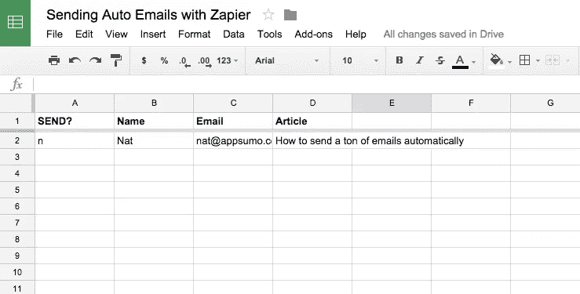
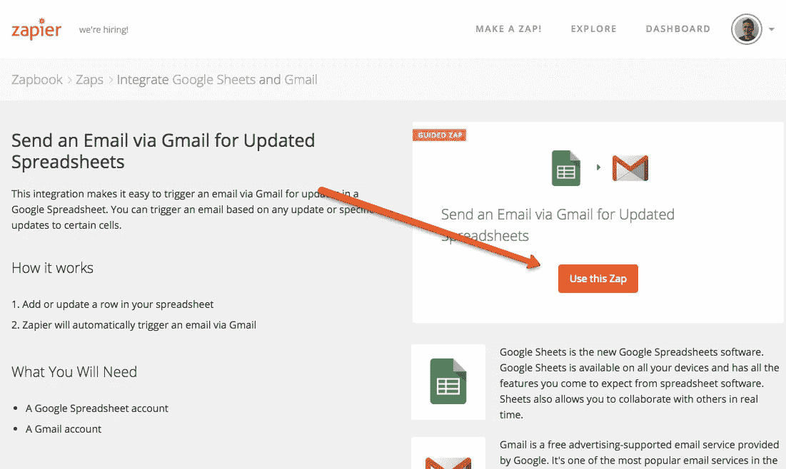
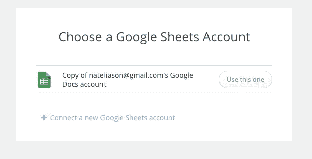
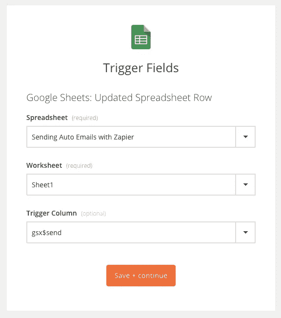
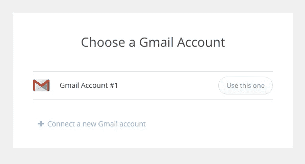
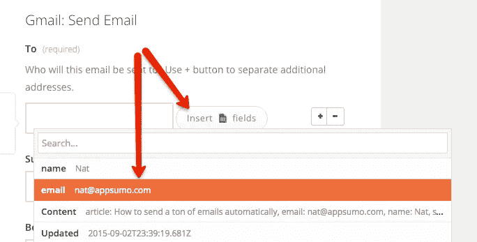
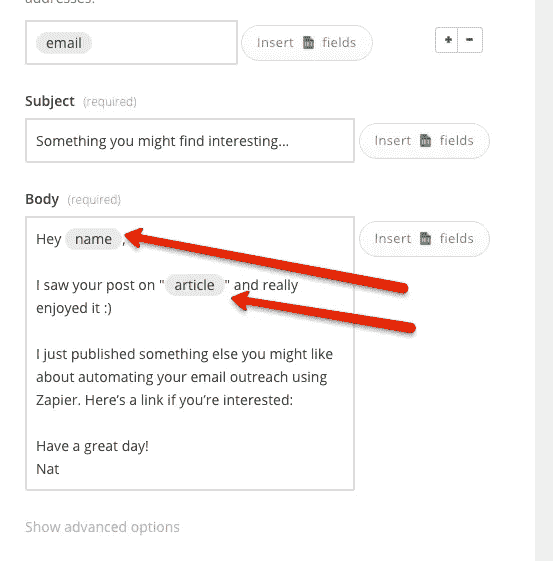
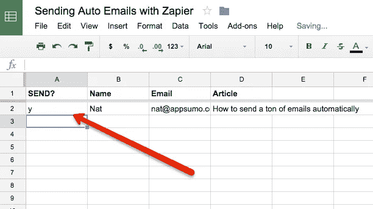
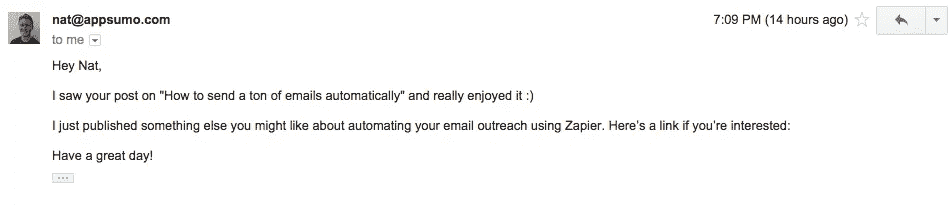

# 如何自动发送大量个人邮件

> 原文：<https://medium.com/swlh/how-to-send-a-ton-of-personal-looking-emails-automatically-22dc2a9d361e>

当你推广一篇新文章、一本书或其他任何东西，并希望一群人帮助你时，给他们发电子邮件并提出要求是值得的。

但是一次给一群人发邮件看起来很懒(我会忽略大多数抄送给我的邮件)，而且也不人性化。

同时，虽然…你不想写 50 封基本相同的电子邮件。

你可以在一个像 Yesware 这样的服务中使用一个模板，但是这是有限制的。你仍然需要做大量的手工输入。

这是我想出的自动发送大量私人邮件的窍门。

# 第一步:加入 Zapier

如果你还不是 Zapier 的用户，就去注册吧。干得好，这是第一步。

# 第二步:制作电子邮件模板

现在，为你将要发送的所有个人风格的电子邮件制作一个模板。

为个性化信息要去的地方留下位置标记。例如:

> 嘿名字，
> 
> 我在文章上看到了你的帖子，真的很喜欢:)
> 
> 我刚刚发表了一些你可能会喜欢的关于使用 Zapier 自动发送邮件的东西。如果你感兴趣，这里有一个链接:[https://medium . com/@ nateliason/how-to-send-ton-of-personal-looking-emails-automatically-22d C2 a9 d 361 e](/@nateliason/how-to-send-a-ton-of-personal-looking-emails-automatically-22dc2a9d361e)
> 
> 祝您愉快！
> 
> 精灵

好了，模板放下，现在第三步…

# 第三步:制作电子表格

现在，您需要一个电子表格，其中包含他们的姓名、电子邮件地址以及您想要包含的任何其他个人信息。在这种情况下，这只是文章。

电子表格必须像这样格式化，否则它不能工作。你需要每列都有清晰的标题，并且每列至少有一个例子。例如:

如果你想复制那个电子表格，[这里有个链接](https://docs.google.com/spreadsheets/d/1cauP9Wjz3A-TWDWELbi6i6H5IDeMQRyaJIOKmB0w6co/edit?usp=sharing)。

“发送？”列是我们用来告诉 Zapier 发送电子邮件的。让他们都“n”或任何你想要的“不”。

# 第四步:做出你的“Zap”

Zapier 称其整合为“Zap”。您将创建一个来发送所有电子邮件。

首先，[进入这个 Zap 编辑器](https://zapier.com/zapbook/zaps/144/send-an-email-via-gmail-for-updated-spreadsheets/)，点击“使用这个 Zap”

在提示符下点击 continue，我们已经这样做了。

如果您尚未设置 Google 文档帐户，请设置:

选择您的电子表格、工作表(可能是工作表 1)，然后选择“发送”列作为触发器。

接下来，您将设置您的 Gmail 帐户:

然后你就可以设置邮箱了！

对于“收件人”，请从“文档”中选择“电子邮件”列。

然后在主题和正文中，根据您拥有的其他字段，您可以放入任何您想要的内容。

现在你可以保存并完成，然后测试你的 Zap！

我建议先在你身上测试一下，以确保一切正常。如果是，那么您可以继续并触发所有的电子邮件发送。

要触发它们，你所要做的就是回到你的电子表格，把所有的“n”条目改成其他的(我通常把它们改成“y”)。

这将触发 Zap，因为这是一个“对电子表格行的更新”，你所有的电子邮件都会发送出去！

那很简单:)

我曾用这种方法在某个产品发布时(比如说在 ProductHunt 上)立即给几十个人发电子邮件。

你会用它做什么？

Nat 为 SumoMe 做市场营销。 [*从他这里得到更多的牛气*](http://nateliason.com/join) *。*

*发表于* **创业、旅游癖和生活黑客**

-