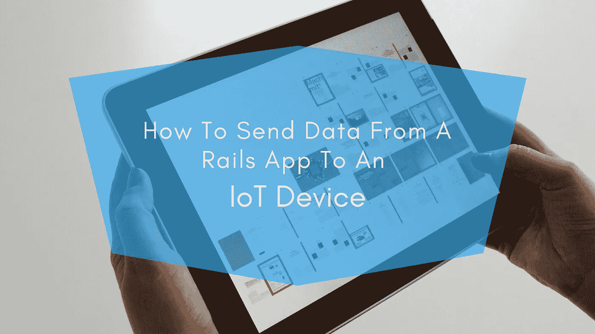
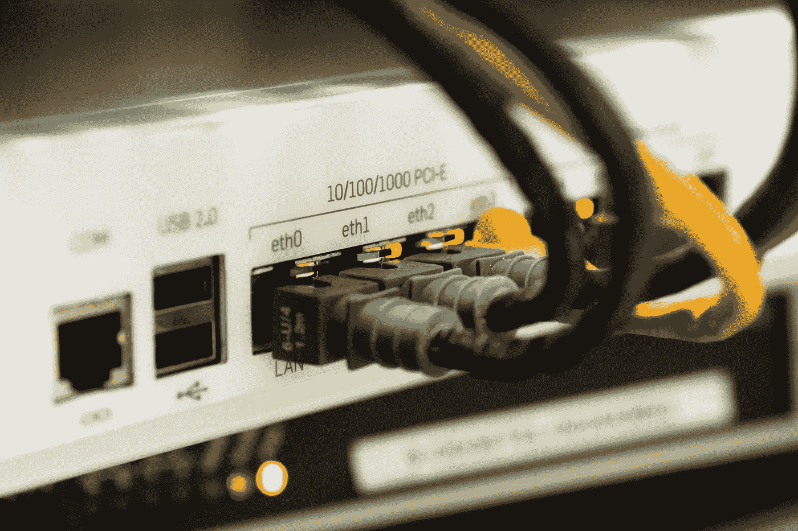

# 如何将数据从 Rails 应用程序发送到物联网设备？

> 原文：<https://medium.com/swlh/how-to-send-data-from-a-rails-application-to-an-iot-device-fc47a709d267>

如今，我们的手机更加智能，互联网更加便捷，甚至我们的宠物也有了联网配件。这些设备并不都是由著名组织制造的。大多数都与年轻的工程师、程序员以及迄今为止资金来源不明的初创企业有关。掌握了编程并配备了正确的工具，您可以立即制作自己的连接设备。

[Ruby on Rails](https://www.cognitiveclouds.com/custom-software-development-services/ruby-on-rails-development-company) 已经被用来驱动现代网站大约十年了，包括许多在 CognitiveClouds 建立的网站。Ruby 多年来一直是我们最喜欢的编程语言之一，因为 Rails 使得在短时间内构建功能齐全的网站和应用程序变得越来越容易。Ruby 是一种漂亮优雅的编程语言。它更容易学习和理解，编码速度更快，背后有一个活跃的社区，专注于面向对象编程，有很多有用的包和框架，特别是关于[网络应用](https://www.cognitiveclouds.com/custom-software-development-services/web-application-development-company)。

# Ruby on Rails 和物联网:有未来吗？

如果你选择在低功耗端点上运行，那么没有。但是，很多物联网并不是低功耗端点。但相反，如果你在 RasPi-Zero 类型的平台上运行 Ruby，就不会有问题，而且这个平台正在物联网项目中迅速流行起来。在低功耗、低 CPU 的环境中，最好使用编译语言。你可以使用 C 之类的编译语言，有时也可以使用轻量级的脚本语言。很快，Ruby 就可以主要用于联网设备的快速原型 web API。

# 如何向物联网设备发送数据？

我们都有过服务器被各种物联网设备和应用程序的数据淹没的日子。最近，我们升级了整个后端，并增加了容量来支持我们的增长。在我们的重新设计中，一个关键决策是选择 Phusion 客运企业来支持物联网 API。Phusion Passenger 的多线程、混合事件、多进程设计非常适合物联网模式应用。

Phusion Passenger 是 Ruby、Node.js、Python 和其他 web 应用程序的应用服务器和 web 服务器。通过管理我们的应用程序流程和资源，它帮助简化了 web 应用程序的部署。它的零拷贝架构、C++内核、看门狗系统和多线程、混合事件、多进程设计使它同时具备快速和可靠的性能。

通常，当涉及到与物联网设备的通信时，如果设备有直接端点，您可以使用 REST API，但许多物联网设备可能没有。物联网设备通常使用低功耗协议，如与代理主题交互的 MQTT、CoAP。因此，理想情况下，如果您想从 rails 应用程序发送数据，请发送到发布/订阅模型，通常是发送到主题。已订阅该主题的物联网设备将从特定主题中获取数据并相应地工作。

*原载于* [***产品洞察***](https://www.cognitiveclouds.com/insights/how-to-send-data-from-a-rails-application-to-an-iot-device/)***:***[***物联网应用开发公司***](https://www.cognitiveclouds.com/custom-software-development-services/internet-of-things-iot-application-development-company)

## 这个故事发表在 [The Startup](https://medium.com/swlh) 上，这是 Medium 最大的企业家出版物，拥有 294，522+人。

## 在这里订阅接收[我们的头条新闻](http://growthsupply.com/the-startup-newsletter/)。

