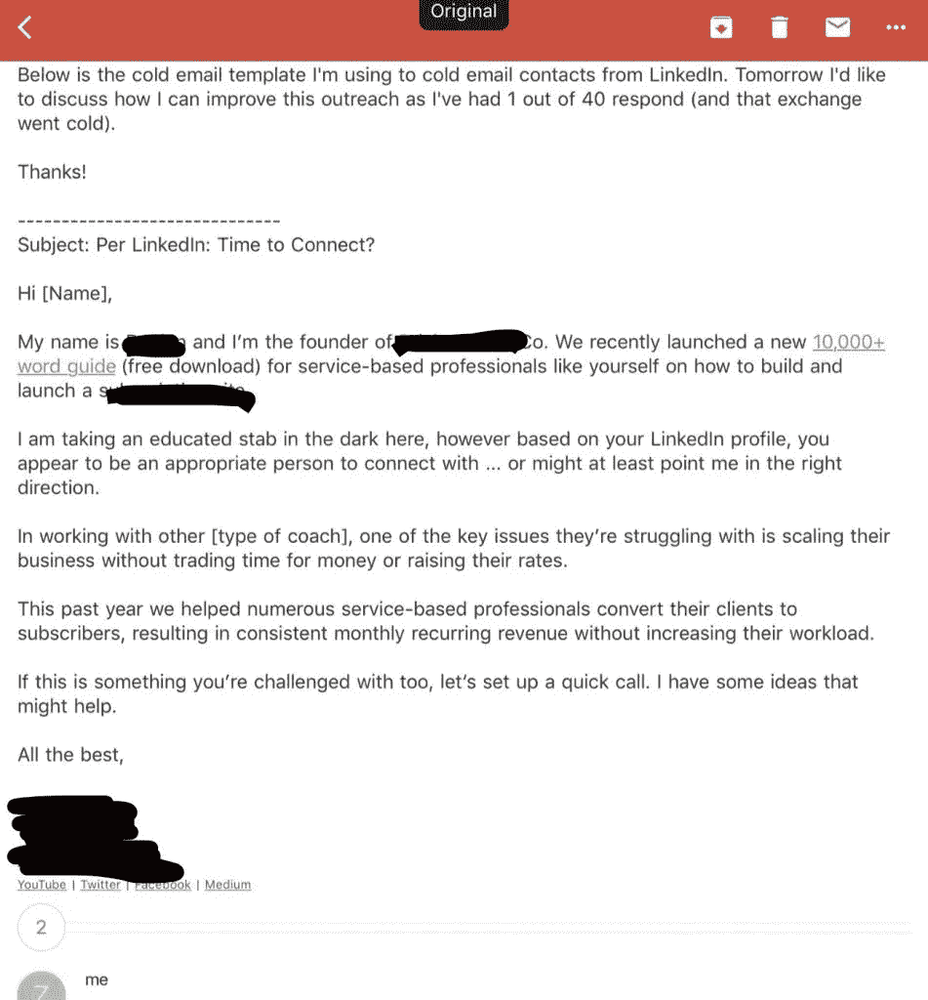
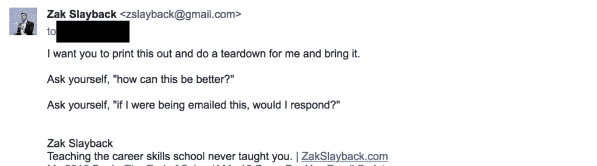
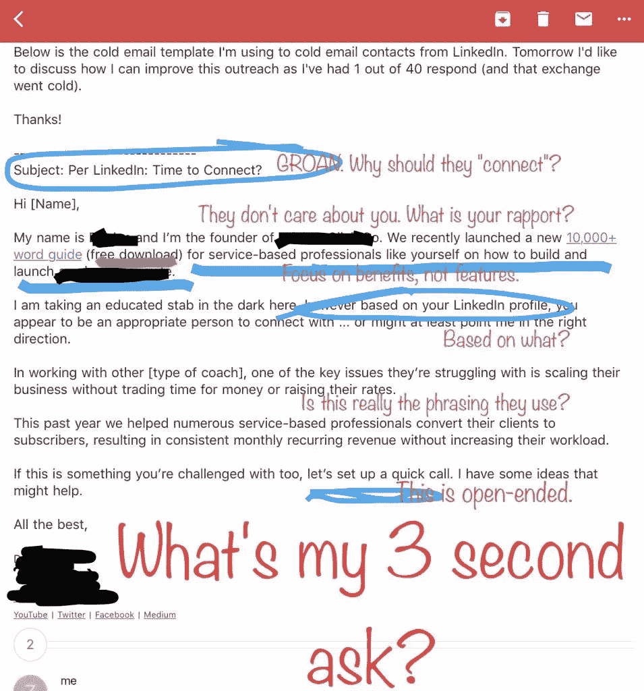

# 如何在 LinkedIn 上连接后发送销售电子邮件(以及案例分析)

> 原文：<https://medium.com/swlh/how-to-send-sales-emails-after-connecting-on-linkedin-and-a-case-study-teardown-6622ef278b8a>

You should know what the people you’re emailing do and what they want to achieve before you click send. (pc: YouTube/Office Space)

冒着听起来像个十足的呆子的风险，我真的很喜欢 LinkedIn。这是一个非常强大的工具，可以让你以相对较低的价格获得对业内大多数人的可操作的见解(它允许在一位前同事悄悄接近你的个人资料后进行非常尴尬的谈话，你会收到通知，他们一周内查看了三次，真有趣！).

然而很少有人知道如何有效地使用它。大多数人要么只在找工作的时候建立一个网站(因为这是你“应该做的”事情之一)，要么就像在脸书一样到处闲逛。如果你对使用 LinkedIn 很有策略，它可以成为你业务的一个强大的潜在客户生成工具，特别是如果你向销售人员、高管或企业主销售的话。

LinkedIn 提供的资源之一是访问用户的电子邮件地址。如果你曾经收到过你在 LinkedIn 上联系过的人发来的简讯或垃圾邮件，但你从未告诉他们你的电子邮件地址，他们会从 LinkedIn 的工具中删除这些信息。

如果你聪明地使用它，你可以生成一个潜在客户的列表，而不必搜索电子邮件地址。

然后你可以在连接后给他们发电子邮件。

因此，这里有两个重要步骤需要记住:

1.  向正确的人发送连接请求。你希望与更有可能对你的服务或产品感兴趣的人联系。向任何人发送冰冷的电子邮件是让你的电子邮件地址被标记为垃圾邮件的好方法。
2.  向你的联系人发送精彩的电子邮件。

第一步是更多的常识。当发送连接请求时，告诉人们你为什么想连接，你对他们感兴趣的地方，并告诉他们你不会给他们发垃圾邮件或浪费他们的时间。企业主和高管都是非常忙碌的人。

不要浪费时间。

第二步需要更多的关注。

# 案例研究:为教练建立网站

我的一个一对一客户为专业服务人员建立了网站，这样他们就可以扩大他们的产品供应，而不必管理更多的人。他在职业教练——商业教练、写作教练等——周围找到了一个有利可图的利基市场。

他和我一直致力于通过编写专门为他量身定制的有趣而有用的内容来构建他的收入漏斗。最近我们把注意力又回到了做外呼销售上。为此，他首先通过 LinkedIn 与他的客户群中的企业主联系，然后立即跟进，向他们发送电子邮件，让他们知道他可以如何帮助他们发展业务。

在我们最近一次一对一之前，他给我发了一封邮件:

正如他所指出的，这得到了 40 个回复中的 1 个，或者 2%的回复率。那个回答主要是说潜在客户不感兴趣。

这并不是因为他自己写了一封糟糕的邮件。他从 HubSpot 博客的一篇关于 LinkedIn 跟进的电子邮件脚本的文章中摘录了这一点。这是互联网上最受欢迎的脚本之一，因为它在谷歌上排名很高。

呀。

那周见面前，我问了他两个问题:

我们一坐下，他就承认不会回复那封邮件。

为了强调这一点，我进一步问他:“如果你一整天都在开会，你的公司突然发生了几起火灾，你家里的水龙头漏水，你的儿子生病了，*和*你必须归还租来的汽车，你会回复那封电子邮件吗？”

“不，当然不。”

“好吧，假设这是你发邮件的人的普通一天，你会得到更好的回复率。”

# 电子邮件拆除:这都是关于激励

这封邮件还能更好吗？

[记住，给非常忙碌的人发电子邮件](/the-mission/how-to-send-emails-to-very-busy-people-and-a-case-study-teardown-8dd7b3428f8e)，尤其是向他们要东西的时候，是要做出符合他们动机的推销。

这可能会对世界产生特定的影响(对于崇高的慈善家来说)，节省时间，更有效率*以便*花更多时间与家人在一起，花更少时间管理人，花更少时间在没有结果的线索上，或者任何数量的要实现的目标或要避免的恐惧。

这是我们谈话期间我给他的拆解:

这里有几件事，它们都是为了让这个人更容易、更值得现在就做出回应，而不是推迟到以后。

首先，**主题行**。主题行就像名片。有一个好的不会给你带来机会，有一个不好的或者根本没有会让你失去机会。使用“Per LinkedIn”并不坏，如果你只是和这个人联系的话——他们可能会认为你是在谈论他们的一些相关经历(但如果你是，为什么不用一些相关经历的东西来个性化主题，比如“Per 你作为写作教练的经历”)。

“我们联系吧，”没有明确的理由是一个经常被时代的人使用的短语，他们喜欢在没有任何明确理由的情况下打电话，占用你的宝贵时间。这类似于一句话，“我很乐意向你请教。”为什么？关于什么？为什么我们不能在我有更多时间的时候通过电子邮件来做呢？

**如何更好:**用与那个人的经历相关的东西来个性化这个主题。

接下来，**开场。**你确实想介绍自己(如果你亲自见到某人，而他们不介绍自己，那会很奇怪)，但一旦你这样做了，你应该试着回答的问题是:“我为什么要在乎？”或者，用激励的话来说，“你能为我做什么？”他的电子邮件接着立即告诉他们听起来像是他开发的产品。贪睡&滥发。

**这样会更好:**介绍一下自己，然后继续。有没有默契点？你们俩住在同一个城市还是在同一所学校上学？也许认识同一个人？值得注意的是:他*收到的一封回复是来自他所居住城市的另一位企业主，他在邮件的这一部分添加了关于那个城市的信息。*

接下来，**关于他生意的简介。**他向潜在客户*讲述他的业务是做什么的，概述了一个特点(“建立并启动[特定类型的网站]”)。他没有告诉他们建立这样的网站有什么好处。“我为什么要在乎？”这也是你在描述你给他们发邮件的内容时要问的问题。你可以从激励和问题的角度来思考这个问题。你的产品为他们解决了什么问题？用了有什么好处？*

**如何更好:**不要谈论他的业务具体做什么，他可以告诉他们与他合作会给他们带来什么好处(即功能与好处)。

接下来，**LinkedIn 连接。HubSpot 脚本让他告诉这个人，他联系这个人是因为他们的个人资料……但不是具体原因。**

**这样会更好:**他可以提到这个人的具体经历，这引起了他的兴趣。现有的措辞让这听起来太过照本宣科。

接下来，**共同的痛点。**提出他为当前客户解决的一个痛点是很棒的*如果他用客户使用的语言表达出来。*真人不说商业行话。

**如何更好:**根据与真实客户的交谈，确认这是正确的措辞。如果 Jane 有这个问题，他已经为她解决了，而 Jack 也有和 Jane 一样的业务，那么用 Jane 的情况作为例子应该可以激励 Jack 回复。

最后，**该问了。这可能是这个剧本被一家主流媒体兜售的最令人恼火的地方。没有明显的要求！**

如果你从我写的关于给人发邮件的文章中吸取一点东西，记住给非常忙碌的人发邮件就是为了让他们回复邮件变得简单得可笑。最重要的部分是明确你想要他们做什么。

最后一行有一个要求，但是不清楚也不清楚，“让我们安排一个快速呼叫。”这就提出了几个问题:什么是快，多长时间？为什么？什么时候？你具体想谈什么？

如果你打算要求安排一次通话，给对方一些时间让他们回复。例如:

> 我可以在周二下午 2 点、4 点和周四下午 3 点打 20 分钟的电话。或者，如果这些对你都没用，我可以在星期五早上腾出时间。

这使得非常忙碌的人不必登记这个问题，“我什么时候有空？”搜索他们的整个大脑——这是一个相对费力的行为。相反，他们可以问，“我在那三个时间有空吗？如果是，回复其中一个。”

我在邮件中使用的启发式方法是**3 秒提问。**如果你不能在 3 秒或更短的时间内清楚地理解提问和肯定或否定的回答，就应该重新起草邮件。

# 如果你对脚本进行个性化处理，它就能发挥作用

关于脚本([，我是它的忠实粉丝，并在我的网站上建立了自己的脚本](https://zakslayback.com/12-done-for-you-email-scripts-free/))的事情是，如果它们是个性化的，它们就能工作*。对你发邮件的人进行调查，不要依赖脚本，要依靠你为他们的生活增加价值的能力。*

## 这篇文章发表在 [The Startup](https://medium.com/swlh) 上，这是 Medium 最大的创业刊物，有 303，461+人关注。

## 在这里订阅接收[我们的头条新闻](http://growthsupply.com/the-startup-newsletter/)。

