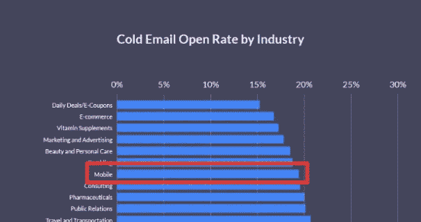

# 如何向投资者发送完美的冰冷邮件

> 原文：<https://medium.com/swlh/how-to-send-the-perfect-cold-email-to-an-investor-edfe9d45475>

你是否曾花数小时为潜在投资者起草一封你认为完美的冷冰冰的电子邮件，结果却遇到了一群讨厌鬼？

你并不孤单。

冰冷的电子邮件世界有时会很残酷。你可以花几个小时推敲一封电子邮件中的每一个字，并且进行总共*零*次跟进电话。

在移动应用行业，一封冰冷邮件的平均打开率[不到 20%。](https://www.propellercrm.com/blog/cold-email-statistics)这意味着超过 80%的冷邮件在打开之前就被删除了。

那么，这是否意味着冷冰冰地给投资者发电子邮件是对时间的巨大浪费，相反，你应该把时间花在通过共享关系和社交活动寻找投资者上？

一点也不。

事实是，给潜在投资者发电子邮件并不像看上去那么难。你需要做的就是后退一步，改变你的方法。从研究阶段*(是的，有一个研究阶段)*到最后的行动号召，你发送的每一封冷冰冰的电子邮件都将专注于完成一件事:

**你希望** [**引起投资者**](https://www.mindsea.com/attract-angel-investors-vcs/) **的注意，以便建立对话。**

在这篇文章中，我将分解你可以遵循的 5 个步骤，开始向投资者发送更好的冷邮件。这些关键步骤是:

1.  *做你的研究*
2.  *价值领先*
3.  告诉他们你做什么
4.  告诉他们为什么应该关心
5.  *建立对话*

我是不是在说，你冷漠的电子邮件方式的转变会给你带来 100%的打开率？不完全是。好消息是，你不需要 100%的开放率就能成功地给潜在投资者发邮件。

现在我们来谈谈细节。

# 第一步。做你的研究。

在你开始拼凑一封给潜在投资者的电子邮件之前，有一个关键步骤是太多的创始人倾向于跳过的。这第一步是什么可以把你的冷电子邮件从即时删除到感兴趣的开放。

秘密是这样的:

研究，研究，研究。

如果你没有对你发邮件的投资者做一点研究，你所做的就是在黑暗中扔飞镖，祈祷奇迹发生。

想想看:不进行任何研究，你怎么能指望知道他们想要什么？如果你找不到吸引他们的角度，他们永远不会给你时间。你需要了解潜在投资者感兴趣的是什么，什么可能会让他们对你感兴趣，以及你可以采取什么独特的角度来打开你的大门。

*他们以前投资过什么公司？*

*他们的投资决策有什么趋势吗？*

他们只投资某些行业吗？

他们通常会在一家公司投资多少钱？

*他们投资的公司平均估值是多少？*

*他们在 LinkedIn 上分享最多的内容是什么？*

*他们发推和转发的话题是什么？*

通过研究为自己的成功做好准备。

不要认为所有投资者都是平等的。花点时间研究一下这个投资者喜欢什么，什么最有可能吸引他们的注意力。在你发送任何电子邮件之前，利用像 [AngelList](https://angel.co/) 和 [Crunchbase](https://www.crunchbase.com/) 这样的平台，确保你的公司是他们可能有兴趣投资的公司。

# 第二步。用价值引领。

当谈到给投资者发邮件时，你需要爬的第一座山不是“我怎样才能给他们打电话？”(这绝对不是“我如何才能让他们投资？”)

第一个障碍是这样的:

让他们打开你的电子邮件。

同样，一封冰冷邮件的平均打开率在 15%到 25%之间。这意味着平均来说，75%到 85%的冷邮件在被阅读之前就被删除了。

如果一封邮件进入了收件箱，却没有人打开它，那它还存在吗？

换句话说，你可以写一封有史以来最棒的冷漠邮件，但是如果你不能让别人打开它，它永远不会给你带来任何真正的结果。你的邮件在到达的第一秒就会被扔进垃圾桶。

让我们诚实地说:

收件箱是一个非常嘈杂的地方。

你试图联系的投资者都很忙，他们的收件箱里塞满了初创公司创始人发来的冷冰冰的电子邮件。如果你所做的只是加入千篇一律的电子邮件模板游行，你的电子邮件将会被毫不犹豫地删除。

利用你在第一步中所做的研究，[构思一条主题线](https://hackernoon.com/how-to-write-better-cold-emails-to-vcs-bd20d3020470)，这将有助于你脱颖而出，吸引投资者的注意力。

**不说:***手机 App 投资机会*

**做说:** *“刚砸 100 万美元 ARR，找种子 VC”*

写好主题的关键在于用一句话立刻展示投资者的价值。如果你幸运的话，投资者会花几秒钟读完那一句话。用主题激起他们的兴趣，你就成功了。

# 第三步。告诉他们你是做什么的。

我们知道，一封好的冷漠邮件可能会被一个糟糕的主题所抵消。太多的创始人似乎忽视了反过来也是正确的。

即使你有一个**很棒的**主题行，可以大幅提升你的打开率，但是如果你的邮件正文很糟糕，那么所有的打开都将毫无意义。

仅仅因为你让某人打开了你的电子邮件 ***并不意味着*** 他们会全神贯注地阅读你写的每一个字。如果你的电子邮件文本过多，看起来很无聊，那它就不会被阅读。它会被扔进垃圾桶。

保持势头。

主题线激起了他们的兴趣，让他们点击；现在是时候扩展你的主要价值主张了。你需要快速地告诉投资者你的公司是什么样的，并且要用他们不需要思考的语言。

你想避免在你的主题行中使用无聊的千篇一律的模板，同样的道理也适用于邮件的开头几句。

如果你以此开头:

*“嗨[他们的名字]，我是[你的名字]，我是[公司名称]的创始人兼首席执行官。我已经做了 XX 年的企业家，之前在[X 公司]、[Y 公司]和[Z 公司]工作过。我于[年]就读于[大学]，并获得了 T25 的硕士学位*

**…删除！**

以下是给投资者发冰冷邮件的残酷事实:

他们现在不关心你是谁。

如果你以他们不关心的事情为主题，他们不会在这里停留足够长的时间来讨论他们*关心的部分。用一两句话告诉他们你的公司是做什么的，然后把重点转移到第四步:*

# 第四步。告诉他们为什么应该关心。

到目前为止，你已经激起了潜在投资者的兴趣，并向他们简要介绍了你所在的行业和你的公司。你需要回答的下一个问题是:

他们为什么要关心？

如果你想最终让这个人成为投资者，你需要让他们相信你在做的事情很重要，值得关注。要做到这一点，你可以在邮件中加入一些内容:

# 1.社会证明

如果你有其他知名投资人或业内有影响力人士的有价值的推荐书，那就提一下。如果一个受到你发邮件的投资者尊敬的人对你有积极的评价，这种社会证明可以鼓励他们和你一起打电话了解更多。

# 2.新闻报道

你是否出现在任何知名出版物中，如 [TechCrunch](https://techcrunch.com/) 、[福布斯](https://www.forbes.com/)或[商业内幕](http://www.businessinsider.com/why-most-top-food-apps-are-red-2017-5)？如果你有，一定要提到它，如果你有房间，快速报价。媒体特征是你公司可信度的标志。

# 3.关键统计数据和数字

你有什么基于研究的证据来支持你所在的行业，你在做什么，你做得有多好？例如，如果你正在开发一个移动应用程序，用数字来解释为什么创业公司会优先考虑移动应用[，比如现在 95%的美国人都拥有一部手机。](https://www.mindsea.com/startups-go-mobile-first/)

# 4.沥青甲板

当谈到将你的推介材料附在一封冷冰冰的电子邮件上时，有两种流行的观点。一方面，创始人不想显得咄咄逼人，不经允许就送一副牌。另一方面，附上一份推介材料可以让投资者轻松获得更多关于你公司的信息，而不必开口询问。

以下是我的看法:如果你让他们索要你的宣传资料，你所做的只是为你的邮件被删除创造了另一个机会。包括你的资料，如果他们愿意，可以让他们浏览一下，但要把注意力集中在一件事上:

# 第五步。建立对话。

当你给投资者发一封冷冰冰的邮件时，你应该有一个目标，而且只有一个目标。你不是想马上卖掉它们，也不是当场就要钱。你想做的就是这个:

**建立一对一的对话。**

你不会通过电子邮件来接近投资者。你的冷漠邮件的目标是[引起潜在投资者的注意](https://www.mindsea.com/attract-angel-investors-vcs/)，并安排时间与他们通话。你发送的每封冷冰冰的电子邮件都应该有一个行动号召，而且这个行动号召应该简短而甜蜜:

***“下周你有空打个电话过来吗？”***

一旦你和他们通了电话，你就可以更深入地了解你的推销，并回答他们提出的任何问题。在促成这一通话时，请记住一点:

**永远不要让他们和你预约时间。**

你需要安排电话，在对他们最合适的时间。即使他们同意接听电话，他们也很有可能不会真的关心到自己安排电话时间。让这个过程对他们来说尽可能没有痛苦，你和他们通电话的机会就会增加。

# 现在轮到你了

冰冷的电子邮件不一定是你不惜一切代价要避开的可怕的大怪兽。事实是，你发送的冷冰冰的邮件越多，你就越擅长于此，你就能得到越多的结果。

请记住，你不会关闭每一个投资者你的电子邮件，这完全没问题。关键是要事先做好调查，确保你只给最有可能对你的工作感兴趣的投资者发邮件，然后集中精力建立对话。

**下面是要遵循的 5 个关键冷邮件步骤的快速回顾:**

1.  *做研究*
2.  *值为*的销售线索
3.  *告诉他们你做什么*
4.  *告诉他们为什么应该关心*
5.  *建立对话*

不确定应该联系谁？MindSea 团队整理了一份名单，列出了拥有移动点石成金 **的** [**十大风险投资公司，你现在就可以免费下载。**](http://content.mindsea.com/mobile-midas-touch)

*原载于 2018 年 7 月 13 日*[*www.mindsea.com*](https://www.mindsea.com/perfect-cold-email/)*。*

## 这个故事发表在 [The Startup](https://medium.com/swlh) 上，这是 Medium 最大的企业家出版物，拥有 351，974+人。

## 在这里订阅接收[我们的头条新闻](http://growthsupply.com/the-startup-newsletter/)。

