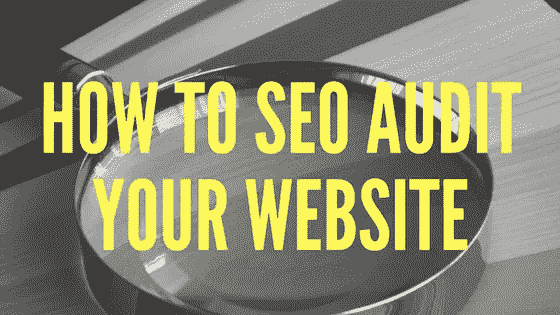

# 如何 SEO 审计你的网站并开始提高你的有机排名——采访专家斯蒂芬·斯潘塞

> 原文：<https://medium.com/swlh/how-to-seo-audit-your-website-start-improving-your-organic-rankings-interview-w-expert-stephan-84fc303a17cf>

SEO

在内容营销的 SEO 游戏中保持领先意味着掌握最佳实践、趋势等等。

但是——这是一个很大的“但是”——你怎么知道你做得够不够？你如何发现错误，更重要的是，发现改进的机会？

为了找到答案，我们采访了斯蒂芬·斯潘塞，他是国际公认的搜索引擎优化专家、畅销书作家、播客和通用优化大师。

你可能从他合著的书《SEO 的艺术》中知道他的名字，这本书在大学课堂上被用作教材。他还为搜索引擎土地、赫芬顿邮报、市场营销教授和实用电子商务等做出了贡献。

特别是，我们和 Stephen 讨论了 [SEO 审计](https://www.shweiki.com/blog/2017/08/stay-ahead-game-seo-audit/)的艺术，以及它能帮你在竞争中保持领先。

# 什么是搜索引擎优化审计？

斯蒂芬说，搜索引擎优化审计是对你的网站进行“深度取证分析”。这意味着你在挖掘和查看你的 SEO 的每一个方面，以确定你是否达到了每一个目标。这是一个双管齐下的过程，您需要关注以下主题:

*   **页面因素**是在幕后运作的 SEO 技术。这是你可以直接控制的东西，比如 HTML 代码和内容中的关键字。
*   **离页因素**是你无法控制的影响你排名的事情。这些都发生在站点外，比如从其他来源指向你的页面的链接。

这些因素进一步分为三个主题。基本上，您需要进行三种类型的审计来覆盖您的基础:

*   **技术审核**—SEO 的技术方面，包括 HTML 标签。你的代码设置给你最好的优势了吗？
*   **内容审核** —你发布到网络上的信息是内容方面的。关键词、标题等等都会影响你的 SEO。
*   **链接审计** —斯蒂芬称之为你的“链接邻居”谁在链接你，他们是怎么做的？他们用的是什么样的锚文本，在什么样的背景下？

一旦你理解了 SEO 审计的基础，你就可以开始了。

# 如何做搜索引擎优化审计

一个 [SEO 审计](https://moz.com/blog/how-to-perform-the-worlds-greatest-seo-audit)可以帮助你改善薄弱领域的优化，让你在各个方面都很强大。这会给你最好的机会来提高你的排名和权威。

但是，您可能不知道从哪里开始。

# 1.你从哪里开始？

Stephan 说，对你的搜索引擎优化进行全面的审计可能需要几个月的时间。如果你不确定从哪里开始处理这个项目，从你最弱的地方开始。

你从哪里*知道*自己需要改进？你确定缺少什么？从那里开始，从简单的修复开始，以轻松进入这个过程。

例如，你可以从检查链接开始，确保它们指向正确的地方。如果你有基本相同内容的多个版本，你可以确保你的代码告诉谷歌你想在搜索结果中显示哪个页面，这被称为[规范化](https://yoast.com/rel-canonical/)。

# 2.下一步:可访问性和可索引性

为了继续进行搜索引擎优化审计，Stephan 建议从漏斗的顶端开始，一路向下。

最重要的是你的可达性。这就是你的网站对爬虫和访问者的友好程度。他们会不会一看就知道是怎么回事？他们能容易地浏览它吗？

当机器人可以抓取你的网站，他们可以索引它。当你的站点被索引时，用户可以在搜索时找到它。

与手动检查哪些页面是可访问的并在 Google 中被索引相比，你可以使用一些工具。Stephan 建议:

*   【OnPage.org】T4(现在叫“Ryte”)
*   [尖叫的青蛙](https://www.screamingfrog.co.uk/seo-spider/)
*   [深度爬行](https://www.deepcrawl.com/)

# 3.检查您的 XML 站点地图

接下来，你可以确保谷歌正在抓取你网站上最重要的页面，并索引你选择的层次结构。

Stephan 说，可以用 XML 站点地图来实现。这是您所有权威站点 URL 的列表，即您的网站主页。这些被编译在你的站点的 robots.txt 文件中，并且可以根据重要性列出。

当然，您不必自己写下来——根据您的平台，有相应的工具。例如，对于 WordPress，Stephan 推荐了 [Yoast SEO](https://yoast.com/wordpress/plugins/seo/) 插件。另一个检查谷歌如何索引你的网页的工具是 Google.com/webmasters。

# 4.优化您的网站架构

您可以通过链接到您主页上最重要的产品/功能来利用您的网站排名。您还可以通过从排名页面轻松访问来提高页面的排名。然而，要小心选择你链接的内容，因为谷歌会因为大量的链接和链接混乱而惩罚你。

# 5.清理你的 HTML

Stephan 介绍了一些方法来确保你的 HTML 是为 SEO 设置的，但是这些是最重要的:

*   确保你的关键词在 HTML 中是突出的(例如，在标题标签和标题标签中)，忘记关键词密度。
*   确保你的标题标签和元描述包含丰富的关键字，并且易于阅读。

# SEO 审计的其他考虑因素

搜索引擎优化审计是对你的网站的全面概述。有一大堆要检查的东西和要查看的信息。以下是需要您注意的其他因素:

*   站点速度——你需要快速的加载时间来优化搜索引擎优化友好性
*   **Flash/JavaScript 元素** — Stephan 说“Flash 已死”，所以要避免使用它。JavaScript 也不是 SEO 友好的。 [HTML5](https://en.wikipedia.org/wiki/HTML5) 优先用于交互页面。
*   **有机流量与付费流量** —检查你没有购买可以有机排名的关键词。
*   **重复内容** —消除重复内容，告诉谷歌哪些页面是重要的。

你的审计应该是一个有条不紊的过程，你做严格的测试和挖掘。这可能是一项笨拙的努力，所以 Stephan 建议查看他的书《SEO 的艺术》以及他网站上的资源。也可以上他的[在线课程](http://www.stephanspencer.com/seo-audit-course-stephan-spencer/)。

虽然审计看起来是一项巨大的任务，但是完全有必要弄清楚你在哪里，你可以在哪里改进，以及你如何才能在搜索引擎优化方面突飞猛进。

# 关于斯蒂芬·斯宾塞

斯蒂芬是国际公认的搜索引擎优化专家和畅销书作家。他是《搜索引擎优化的艺术》一书的合著者，《T21》一书的作者，《谷歌力量搜索》一书的合著者，《社交电子商务》一书的合著者。《搜索引擎优化的艺术》( The Art of SEO)现在已经出了第三版，将近 1000 页，被认为是搜索引擎优化的圣经，拥有塞斯·戈丁和谢家华等行业巨头的推荐，甚至被用作大学的教科书。

Stephan 于 1995 年创建了 [Netconcepts](http://www.netconcepts.com/) ，并将其发展成为一家跨国搜索引擎优化机构，然后在 2010 年将其出售给付费和有机搜索软件/服务机构 Covario，Covario 在 2014 年被广告代理集团电通 Aegis 收购。Stephan 发明了一种名为 GravityStream 的按绩效付费的 SEO 技术，该技术也被收购，现在是 Rio SEO 的一部分。在 2010 年完成挣得后，Stephan 继续在在线营销、电子商务和 SEO 领域担任备受追捧的 SEO 和数字战略顾问。他收购后的客户包括 Zappos、索尼商店、Quiksilver、Best Buy Canada、Bed Bath & Beyond 和香奈儿等等。

史蒂芬已经在无数的互联网营销活动中发表过演讲，包括所有主要的搜索和电子商务会议(SES，SMX，PubCon，互联网零售商，Shop.org，eTail 等。).他曾为《赫芬顿邮报》、《多渠道商人》、《实用电子商务》、《搜索引擎天地》、《DM 新闻》和《营销利润》等杂志撰稿。

Stephan 还是为期三天的 SEO 研讨会[交通控制](http://trafficcontrol.co/)的创始人，与联合创始人克里斯·琼斯(Kris Jones)共同创建了为期三天的专业发展研讨会[激情转化为利润](http://www.passionsintoprofits.com/)，并主持了两个播客节目[优化极客](http://www.optimizedgeek.com/)和[营销演讲](http://www.marketingspeak.com/)。

Stephan 是 Impact Network 的董事会成员，Impact Network 是一个 501c3 非营利组织，在赞比亚建设和运营学校。

他拥有威斯康星大学麦迪逊分校的生物化学硕士学位。

Magnificent Marketing — Austin, TX Digital Marketing Agency

## 这篇文章发表在 [The Startup](https://medium.com/swlh) 上，这是 Medium 最大的创业刊物，拥有 338，320 多名读者。

## 在此订阅接收[我们的头条新闻](http://growthsupply.com/the-startup-newsletter/)。

