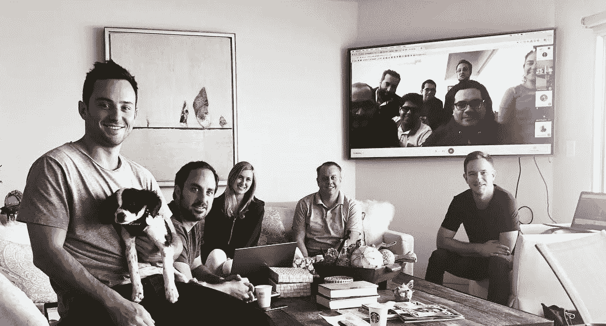

# 如何制定更好的季度目标

> 原文：<https://medium.com/swlh/how-to-set-better-quarterly-goals-5f2d6ccbafd4>

## 目标和关键结果——成功的秘诀

你可能听说过 OKR 氏症。目标和关键结果(OKR)是一个非常受欢迎的系统，公司使用它来定义、传达和跟踪组织内的季度目标。我花了多年的时间管理，直到我终于从我的朋友迪伦·弗林那里听说了 OKR 的书，迪伦·弗林让我借了约翰·杜尔登的《T2》《T3》《衡量重要的事情》《T4》。我希望我在管理自己的时候就有这本书。我想告诉你这本书是如何在 [King Tide](https://kingtide.la/) 影响我们的季度目标体系的，尽管我们仍处于旅程的早期。

我们一生中的大部分时间都在设定目标，尽管我们可能没有意识到。无论是在你的 sat 考试中取得好成绩，被一所好大学录取，找到一份好工作，为你的企业创造收入，还是清理你的房间以便你可以出去玩。生活是一系列大大小小的目标，而幸福是你如何设定自己的目标并拥抱实现目标的旅程。当一个目标完成时，另一个目标就产生了，重要的是我们要设定正确的目标来帮助我们到达我们的北极星，我们未来真正想去的地方。

我学到的是，我们大多数人设定的目标都是错误的。我们设定需要实现的目标，但不一定与你的长期愿景一致，我们的*北极星*。例如:

*   创造 100 万美元的收入
*   参加设计课程
*   雇佣一名软件工程师

虽然这些目标一旦实现，可能会对你的业务产生积极的影响，但它们并没有回答“为什么？”。他们不具体。它们不可测量。最重要的是，它们与更大的愿景不一致。

> "如果你不知道你要去哪里，你可能到不了那里。"—约吉·贝拉

# OKR 的历史

OKR 系统最初是由英特尔在 20 世纪 70 年代开发和实施的，目的是帮助该公司扭转局面，夺回其作为微处理器领先开发商的地位。该系统运行得非常好，后来被谷歌采用，现在被成千上万的个人和小企业使用，包括 LinkedIn、Intel、Zynga、Sears、Oracle 和 Twitter 等财富 500 强企业。

Andy Grove — The Father of OKRs

## OKRs 之父

Andrew 'Andy' Grove 是匈牙利出生的美国商人、工程师、作家，也是半导体行业的先驱。作为一个激励人心但又执着的领导者，安迪在 20 世纪 70 年代担任英特尔总裁时首次开发了 OKR 氏症。

> “成功滋生自满。自满滋生失败。只有偏执狂才能生存。”—安迪·格罗夫

## OKR 信使报

约翰·杜尔登是美国投资者，凯鹏华盈风险投资公司的风险投资家，也是《衡量什么是重要的》一书的作者，这本书是 OKR 的圣经，可以让你的简单想法变成 10 倍的增长。约翰了解到 OKR 在安迪手下的英特尔工作，后来他把这个系统带到了他投资的许多公司。作为谷歌的早期投资者，他把 OKR 系统带给了谢尔盖·布林(Sergey Brin)和拉里·佩奇(Larry Page)，当时这是一个由谷歌员工组成的小团队，在一间狭小的办公室里工作，拉里·佩奇谦逊地写下了这本书的序言，称“这对我们来说效果相当好。”

约翰是救世主，他重塑了我们管理业务的方式。他的 OKR 系统是我们走向成功的另一块巨大的垫脚石。

> “想法很容易。执行力就是一切。需要一个团队才能赢。”—约翰·杜尔登

# OKR 是如何工作的

在成功实施 OKR 之前，你首先需要为你的公司定义价值观、使命和愿景，因为 OKR 的成功之处在于它们符合你公司的长期愿景。

我写了这篇文章来解释我们如何在 King Tide 定义我们的价值观。共同的价值观构成了你如何建立一个伟大的文化，共同努力实现你的愿景。

 [## 核心价值观:创业的第一步

### 你的价值观是你文化的圣经，是你所做一切的框架。

medium.com](/@jro620/core-values-the-first-step-in-starting-a-business-71b64f420aca) 

## 目标

一个“目标”是你想带领公司前进的方向。1 年、5 年、10 年后，你想成为什么样的人？**目标是什么。**

*   表达目标和意图。
*   既积极又现实。
*   必须是有形的、客观的、明确的。
*   目标的成功实现必须为企业提供
    明确的价值。

> ***待办事项:*** *在公司和团队层面定义 3-5 个关键目标。目标是雄心勃勃的、定性的、有时限的和可操作的。*

这方面的一个例子是“提高客户满意度”。

## 主要结果

关键结果是可衡量的*任务，如果完成，将有助于实现您的目标。**关键结果是如何实现的**。*

*   表达可衡量的里程碑，如果实现了这些里程碑，
    将会以一种对其
    成员有用的方式推进目标。
*   必须描述结果，而不是活动。如果你的 KRs 包含
    像“咨询”、“帮助”、“分析”或“参与”这样的词，它们描述的是活动。
*   必须包括完成的证据。该证据必须
    可用、可信且易于发现。证据的例子包括变更列表、文档链接、注释和
    发布的度量报告。

> ***待办事项:*** *在每个目标下，定义 3-4 个可衡量的结果，不要多。关键结果应该是可量化的，可实现的，导致客观的分级，并且是困难的，但不是不可能的。OKR 的结果可以基于增长、业绩、收入或参与度。通常它们是数字，但它们也可以显示某件事是否完成，所以是二进制 0 或 1。*

对于客观示例，您可以将这些作为关键结果:

*   定义一个跟踪客户满意度的系统。
*   向 20 个现有客户发送客户满意度调查。
*   在 3 个月内将客户满意度提高到第 95 个百分点。

Harrison Metal — Objectives and Key Results (YouTube)

# OKR 在行动

> “OKR 不是银弹。它们不会取代强大的文化或更强的领导力，但当这些基础到位时，它们可以带你登上顶峰。”

King Tide — Q3 2018 OKR Meeting

感谢你阅读关于 OKR 氏症的文章。我希望你学到了如何以更有效的方式定义、沟通和管理你的季度目标。下面是一些我觉得有用的资源。

# 资源

衡量重要的事情:约翰·杜尔登极力推荐的一本书

[Weekdone](https://weekdone.com/?utm_source=resources.weekdone.com&utm_campaign=resources) :周计划+季度目标软件

[谷歌的 OKR 剧本](https://assets.ctfassets.net/cn6v7tcah9c0/4snZXJ821G6KYUoc08masK/58ffcbc7c607d7c6056c7da507727135/Google_OKR_Playbook_V1JS.pdf):了解谷歌如何实现 OKRs

[OKR 电子表格](https://docs.google.com/spreadsheets/d/107V_Mu-jjfgivlaHbbdsqS8gZRoQxUOWwsmij7k8_6I/edit?usp=sharing):我创建了一个模板，我们将每周用它来跟踪 OKR

## 谢谢！

Jordan Rothstein-King Tide 首席执行官

jordan@kingtide.la

## 这个故事发表在 [The Startup](https://medium.com/swlh) 上，这是 Medium 最大的企业家出版物，拥有 343，876+人。

## 在这里订阅接收[我们的头条新闻](http://growthsupply.com/the-startup-newsletter/)。

