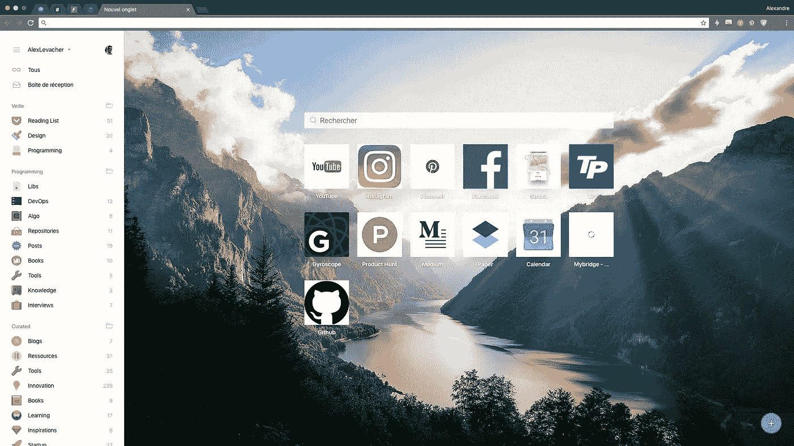
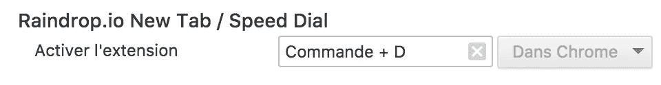
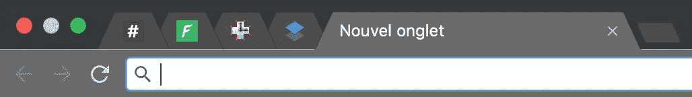

# 如何设置 Chrome 以提高工作效率

> 原文：<https://medium.com/swlh/how-to-setup-chrome-for-productivity-260eaa4ad369>

很长一段时间，我一直坚持使用 safari，我想是因为我喜欢它干净的一面。但是到了要定制它或者安装梦想插件的时候，真的很失望。由于 Safari 到目前为止没有满足我的要求，我点燃了一支蜡烛，希望 Tim 有一天会原谅我，然后我换成了 Chrome。

当我开始配置它时，我想

*   有一个干净的界面，没有干扰
*   能够管理我的书签
*   安装一些必要的插件

# 1.移除所有书签，使用 Raindrop.io

对你来说这将会改变游戏规则。有了 raindrop，我可以像专业人士一样管理我的书签。我在网上保存了很多内容，我希望能够方便地检索它们。使用 raindrop，您可以创建所有您想要的类别，为您的书签添加标签并更改它们的描述。他们还提供像搜索引擎这样的工具来在你的书签中查找。

雨滴**免费**但是你可以解锁少于 **3$** 的**功能。我是一个专业会员，更多的是支持这个项目，而不是额外的功能。免费版真的很全。**

**要充分利用雨滴，你需要:**

1.  导出你所有的 chrome 书签。[如何？](https://support.google.com/chrome/answer/96816?hl=en)
2.  安装[镀铬雨滴](http://bit.ly/AlexL-Raindrop)
3.  导入您的书签。[如何？](https://raindrop.io/other/import/import.html#/)
4.  隐藏 chrome 书签栏以获得屏幕空间:`View` > `*Always Show Bookmark bar*`
5.  覆盖默认的 chrome 快捷键`cmd+D`或`ctrl+D`保存新书签。在 chrome://extensions/ 页面向下滚动。然后点击“键盘快捷键”。找到 Raindrop.io，定义一个新的快捷方式。

# 2.大头针标签

如果像我一样，有一些你日常使用的网站，就把它们钉上。这将释放一些空间。`right click on your tab`T25`pin tab`

Slack / ForestAdmin / RescueTime / Dropbox paper

如果你的浏览器中有太多的应用程序，这会降低你的工作效率或可见度，我建议你看看[站](http://bit.ly/AlexL-Station)应用程序。它的目标是为您的所有工作应用程序创建一个单一的位置，并保留您的默认浏览器用于…浏览。

# 3.安装插件

**森林** *(* [*安装*](http://bit.ly/AlexL-Forest) *)*

提供了一个解决方案，让你远离网瘾。你可以在森林里种下一颗种子。在接下来的 30 分钟里，这颗种子会逐渐长成一棵树。然而，如果你不能抵制诱惑，开始浏览黑名单上的网站，你的树就会枯萎。

**Pinterest 保存按钮** *(* [*安装*](http://bit.ly/AlexL-Pinterest) *)*

保存你在网上找到的任何想法，这样你以后就可以很容易地找到它。

**水银阅读器** *(* [*安装*](http://bit.ly/AlexL-Mercury) *)*

去除广告和干扰，只留下文本和图像，让每个网站都有一个清晰一致的阅读视图。

**托比** *(* [*关于*](http://bit.ly/AlexL-Toby) *) (* [*安装*](http://bit.ly/AlexL-Toby-install) *)*

> “我不想再打开 3000 个标签页了”——来自 Toby 的新用户

Toby 帮助您将浏览器选项卡组织成一个选项卡，这样您就可以一键访问关键资源。我使用 Toby mini 是因为我想将雨滴保存在“新标签”中，但我使用 Toby 作为临时标签，例如当我对某个主题进行研究时，我想将所有内容保存在一个地方。

Toby

我还使用[WhatsRun](http://bit.ly/AlexL-WhatsRun)/[font face ninja](http://bit.ly/AlexL-Fontface)和[占卜](https://chrome.google.com/webstore/detail/augury/elgalmkoelokbchhkhacckoklkejnhcd?hl=en)用于我的工作相关用途。

我用的主题是:[材质黑暗](http://bit.ly/AlexL-Theme)

希望你会觉得有用。如果你有任何建议，请告诉我。

## 这个故事发表在 [The Startup](https://medium.com/swlh) 上，这是 Medium 最大的创业刊物，拥有 289，682+人关注。

## 在这里订阅接收[我们的头条新闻](http://growthsupply.com/the-startup-newsletter/)。

