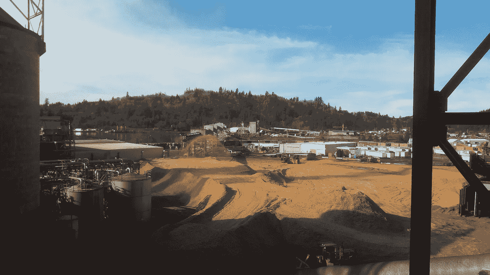

# 如何从初级员工转变为核心员工

> 原文：<https://medium.com/swlh/how-to-shift-from-entry-level-to-entre-employee-64d8348b3d27>

## 我如何将我的工作自动化到一个真正的产品

在大学中途，我决定离开，因为我想获得关于我如何度过我的时间和我想做什么职业的观点。我没有行业经验，但我决心无论做什么都要创新。

Perspective is everything when you are experiencing the challenges of life. — Joni Eareckson Tada

# 从实习生到创新

我对纸是如何制成的有一个粗略的概念，但我的大部分知识都来自我在采访前的维基百科狂欢。由于我的经验，我被分配了面向技术人员的工作，并将与全职工程师一起从事更多的技术工作。有些工作需要我建立数据集并分析工厂内的单个流程。

以下是我所学的概述:

 [## 硫酸盐法制浆~碎成脏浆

### 纸浆厂的开端

medium.com](/lucas-moyer/kraft-pulping-chip-to-dirty-pulp-743ebd9543a4)  [## 洗涤~脏浆至高密度储存

### 走向洗衣机

medium.com](/lucas-moyer/washing-dirty-pulp-to-high-density-storage-566f66de9174)  [## 清洗到高密度存储

### 冲洗黑液，储存在储罐中

medium.com](/lucas-moyer/washing-to-high-density-storage-22529c247473)  [## 机器的纸张

### 纸浆在机器前的改性

medium.com](/lucas-moyer/paper-stock-to-the-machine-41279d7cd7c7)  [## 纸浆到流浆箱

### 造纸机的湿端

medium.com](/lucas-moyer/pulp-to-the-head-box-9be7f1db52e8)  [## 造纸机湿部至干部

### 我们有纸

medium.com](/lucas-moyer/wet-end-to-dry-end-of-the-paper-machine-77c73e23e05f) 

当我被赋予这项工作并完成了它；这是最低的期望。我的目标是始终为我热爱的事情增加尽可能多的价值。随着我对纸张属性以及造纸过程如何实现这些属性的了解越来越多，我想到了在纸张形成之前自动化和预测纸张最终结果的想法。我开始收集所有我认为在决定纸张性能时重要的信息。我自学了如何使用深度学习来建立与线性不可分数据集的相关性，并为我的经理演示了一个计算机程序，该程序可以在纸张形成之前**预测纸张属性。**现在我的软件有了一个**未来客户**。

 [## 使用深度学习将环压与其他纸张测试相关联

### 消除测试，节省资金，深度学习

medium.com](/lucas-moyer/using-deep-learning-to-correlate-ring-crush-with-other-paper-tests-ec6a879feddb) 

# 如何开始你的工作

不要依赖别人来建立你的知识。我们生活在一个有足够的免费信息来建立一个真正的产品的时代。永远拓宽你的工作范围，让它成为你生活故事的一部分。当我在实验室工作时，我后退了几步，做出了一个创新的产品，它有可能节省数百万美元的成本。当你为一家公司工作时，成为一名企业家，在你的层面上创新，为公司增值。

## 这篇文章发表在 [The Startup](https://medium.com/swlh) 上，这是 Medium 最大的创业刊物，有+ 372，747 人关注。

## 订阅接收[我们的头条新闻](http://growthsupply.com/the-startup-newsletter/)。

