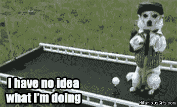
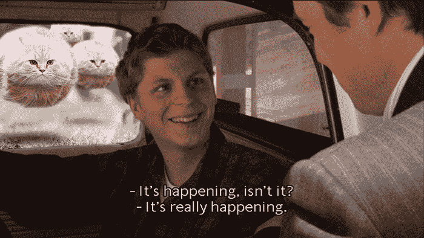

# 如何运送辅助项目

> 原文：<https://medium.com/swlh/how-to-ship-side-projects-329e7220daed>

PC: [Andrew Illarionov](https://twitter.com/Andyillarionov)

做兼职项目帮助我学习新技术，提高作为工程师和设计师的能力，并锻炼我的创造力。通过构建辅助项目(从[稍微有用的](http://www.andyjiang.com/sw)到[完全空洞的](http://bottomofproducthunt.com/)，我已经了解到*势头*对于让事情越过终点线是至关重要的(我的 GitHub repos 经常变成鬼城，因为我不能决定用什么技术前进或可视化最终的用户流)。这里有一些有价值的个人项目管理技巧，帮助我始终保持专注，保持动力。

# 问为什么？

首先，问自己*为什么？你从事副业的动机是什么？是为了学习新的技术和框架吗？来制造人们想用的东西？或者只是为了钓你的朋友，杰克？*

你的目标决定了你从事副业的方式。例如，如果你想学习新技术，那么也许你不应该在*发布*一个完整的产品上进行优化。相反，如果你想制造人们使用的东西，那么就选择你最有效率的堆栈。

对我来说，是为了 troll Jake，所以我坚持我的栈 [Koa](http://koajs.com/) 和 heavy， *heavy* [jQuery](https://jquery.com/) (开玩笑，虽然不是真的)。

# 写下来！

每个人都会在一天中的不同时间受到灵感的冲击。养成写下每一个随机的潜在想法的习惯(有时甚至不是一个完整的想法，而是一个*探索*:写下一个能启发你想到完整想法的句子)。确保从想到这个想法到用一种容易理解的方式记住它的过程尽可能的顺畅。

有些人喜欢给自己发邮件或者在 Slack 上聊天。

我使用 [nvALT](http://www.macworld.com/article/2047073/nvalt-review-makes-writing-and-finding-plain-text-notes-simple.html) (这是一个免费的纯文本 mac 应用程序，我可以通过热键调用它，并直接跳转到一个空白笔记)和[简单笔记](http://simplenote.com/)后端(也是免费的；他们有一个 iPhone 应用程序，所以我可以在旅途中使用它)。我有一个关于“想法”的巨大注释(也是一个关于“博客想法”的单独注释):

They don’t even have to make sense! Well, maybe just a little.

这意味着下次你有空的早晨或晚上，你可以回顾你的想法。然后，你可以开始计划你最喜欢的或者特别受启发的。

# 一次戴一顶帽子

兼职项目的一个危险是想一次跳到所有方面。您开始创建线框，编写您的服务器路由逻辑，并考虑用例。停下来。大量的微观环境转换和决策会导致精神和情绪上的疲劳，最终让你慢下来。

相反，一次只做一件事。这意味着首先要戴上产品经理的帽子，回答以下问题:

*   目的/最终目标是什么？
*   主要用例有哪些？(理想情况下，你应该只从*一个*用例开始)
*   有什么工具可供我使用来构建它？
*   谁是我的目标用户，我如何在互联网上找到他们？
*   我该给这个东西取什么名字？！*

对我来说，选择一个聪明有趣的名字常常能激励我在正常时间的十分之一内完成一些事情。因此，我喜欢花一两天的时间来思考这个名字。如果我找不到很棒的东西，我就用一个模糊的项目名称，希望以后我会发现一些很棒的东西。

其他产品管理任务包括:

*   关于理想用户流的思考
*   创建一个松散的模型，它应该看起来像什么，等等。
*   研究 API、文档等。并准备好这些信息，这样当您开始开发时，资源就可以随时使用了
*   大致计划一下*什么时候*你会戴上工程师和设计师的帽子

因为我有一份全职工作，所以当我晚上回家时，很容易忽略这些重要的步骤。为了让自己专注于任务，我喜欢添加谷歌日历事件，并把它们的描述作为需要完成的独立小任务:

I typically have one or two of these events in the evening.

通过把它写在日历上，我可以腾出一些时间来做其他事情，因为我知道当时间到来时，我可以马上投入到后面列出的任务中。

## 额外提示:积极削减范围

因为我喜欢为发布而优化，所以大幅削减范围对我来说很重要。这种哲学通常指导我首先编写一个库或 CLI，从中我可以制作一个具有前端 UI 的 web 服务(尽管我制作的许多东西最终只是一个 CLI)。

考虑最终产品应该如何工作的认知开销，尤其是考虑最终用户与您完成的项目进行交互的数百种方式的利弊，通常会破坏您项目的动力并中断生产力。重要的是将你的项目分成更小的部分来考虑:你希望工程师如何与你的库交互？你希望应用开发者如何与你的 API 交互？

这种方法意味着你将问题分解成更小更简单的部分，这通常比一次解决所有问题更容易管理。

# 同情你的用户

你的用户(无论是你自己还是你心目中的特定受众)如何使用你的项目应该决定了它的结构。有大量的文献定义了如何设计故事板等等。所以这里就不一一列举了。

要记住的关键是，这些用户流可以引导用户操作必要的数据，以便用户完成他们的工作。

在图书馆工作？对于你的用户来说，最少的调用，最少的参数是什么？

API 怎么样？你的开发者用你的 API 完成了什么工作？这如何决定提供什么路线和公开什么参数呢？

web 或移动应用程序？用户界面需要如何进行足够的交流，以便用户可以轻松地浏览它，而不会感到困惑或沮丧？

就 web 应用程序的实际设计而言，我通常对这个阶段的最终产品会是什么样子有一个粗略的想法。但是我不写任何 CSS 或` margin:0 auto；“直到最后一刻。再加上我非常依赖 [*Twitter 的 Bootstrap*](http://getbootstrap.com/) *，因为我对它很熟悉也很快。*

到这个时候，我会把工程任务分解成离散的待办事项，然后把它们写下来(通常是在一期[GitHub](https://github.com/lambtron/snoobear/issues/1)中)。这样，当我开始开发时，我就不必重新考虑这些决定，而这些决定会阻碍我的动力。

# 先写，后重构

如果你曾经不得不写一篇文章或博客，你知道有时这并不容易。我学到的对我有帮助的写作方法是*而不是*同时写作和编辑。

写作(创建内容)和编辑(提炼和删除内容)的行为使用了你大脑的两个部分。同时做两件事可能会适得其反:三个小时和两杯咖啡后，你仍然在拼写同一个句子。

写代码也是如此。如果你的目标是发布，那么谁会在乎(至少现在)你是在复制代码而不是被[弄干](http://blog.andyjiang.com/how-to-ship-side-projects/)。将第十个回调放入这个只有 400 行的 index.js 文件中，让它正常工作，然后在戴上“编辑”帽子之后再重构它。

*如果你对继续改进和/或维护你的代码感兴趣，那么，为了将来的你，以后重新访问它，清理它，使它可读。*

## 额外收获:了解你的用户

如果你确实打算把你的兼职项目放在其他人面前，那么为以后的分析添加一些粗略的跟踪会有所帮助。我的首选是启用了[谷歌分析](https://www.google.com/analytics/)的[细分市场](https://www.segment.com/)(都是免费的！).

这让你可以衡量你的应用程序的流量和使用情况，以及找出流量来自哪里(如果是一个 web 应用程序)。你也可以设置关键转换事件来衡量你的漏斗，看看人们在哪里下降，等等。，这样你就可以改进你的产品。

如果你想更彻底地进行分析，并打算发展你的副业，这里有一篇关于使用每月 9 美元的营销堆栈的文章。

*声明:本人为* [*段*](https://www.segment.com) *工作。*

# 装运它！

这是项目开发生命周期中最困难的部分，当你完成了 90%的时候，它大部分都能工作，看起来还算过得去。还是那句话，这最终取决于你的目标:如果你只是想做一些你的朋友可以用的东西，把它展示给他们以获得反馈；或者，如果你想把它列在[产品搜索](https://www.producthunt.com/)上，那就多花一周时间润色设计，编写测试，确保分析到位。

通常，当我构建某个东西时，我会想到一个用户。我会找出这些用户喜欢在互联网上闲逛的地方(他们通常使用什么工具，他们浏览什么论坛，他们阅读哪些[子编辑](http://blog.andyjiang.com/snoobear-easily-manage-multiple-reddit-submissions/)，他们在什么空闲频道，他们阅读什么时事通讯/博客)，并在那里分享最终产品。如果我认真对待客户开发，我会尽可能多地得到反馈。

主要的收获是考虑你的动机，然后针对它们进行优化。如果你正在为运输进行优化，那么有意识地计划、研究、设计和建造将有助于保持专注，更重要的是，*势头*，这将有助于把成品推出门外，呈现在你的用户面前。

如果你觉得这有帮助，请💚它在下面，跟我来！

*安迪在* [*段*](https://www.segment.com) *为互联网工作。当他不在工作中恶作剧的时候，你可以发现他在表演即兴表演，构建* [*无用的应用*](http://www.bottomofproducthunt.com/) *，或者弹奏他的尤克里里。*

*原载于***。**