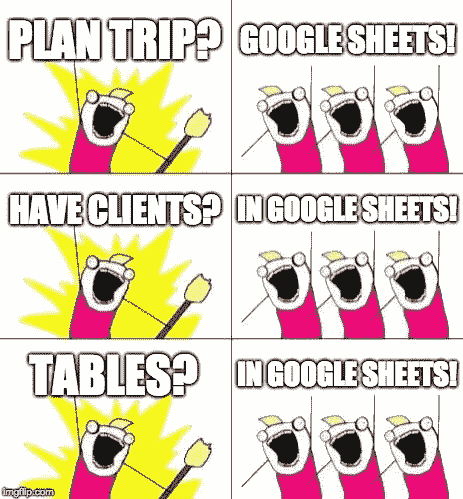
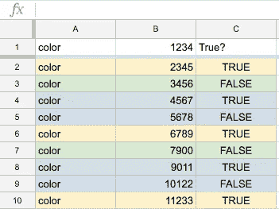
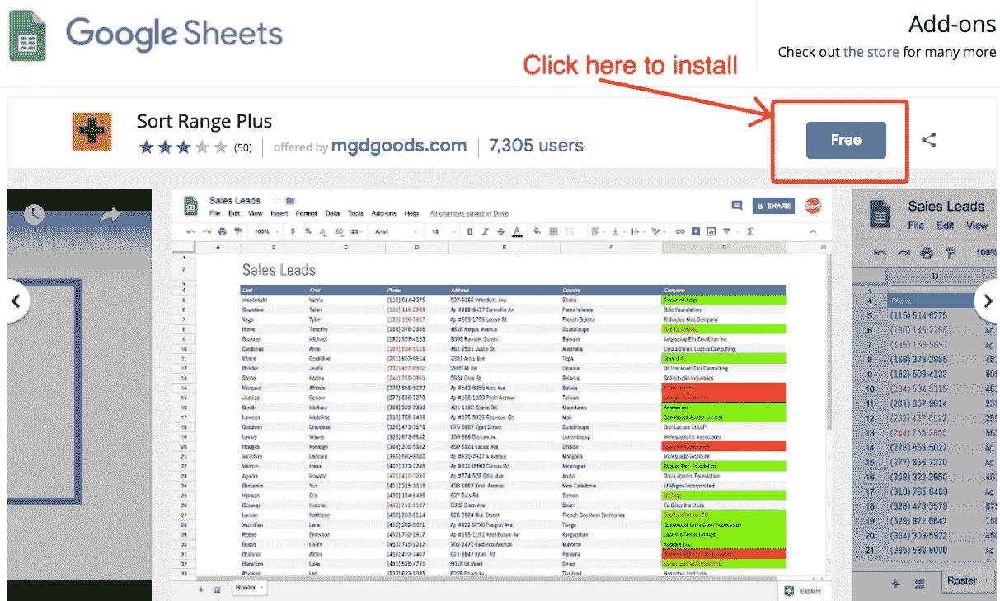
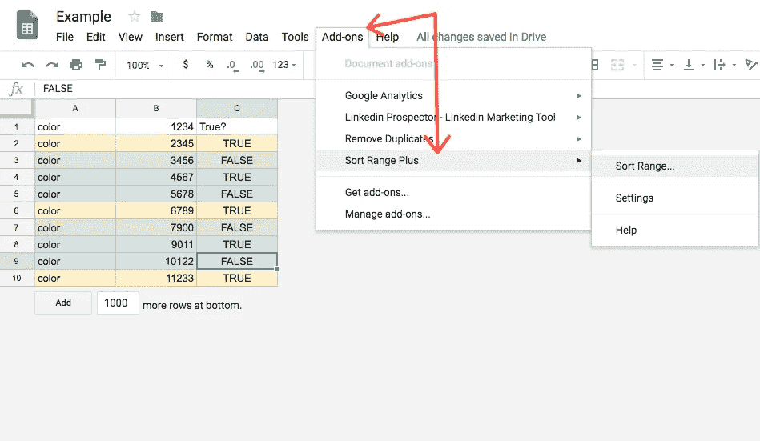
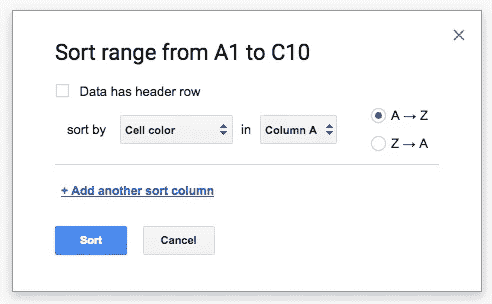
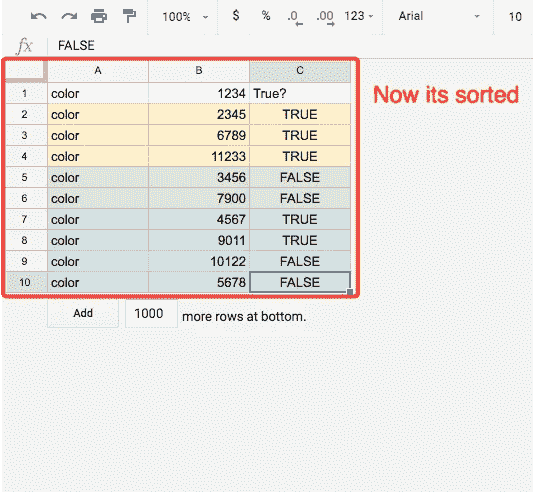

# 如何在谷歌工作表中按颜色对单元格排序

> 原文：<https://medium.com/swlh/how-to-sort-cells-by-color-the-in-the-google-sheet-ede1043a33c2>

How to sort cells by color in Google Sheets

每个人都使用 Google Sheets。

其中一些是为了家庭预算👍
有的作为 CRM😔

我已经用了几年了。(从上大学那段美好时光开始)—却不知道这个简单的功能— **按颜色排序。**

我喜欢用颜色标记行/列/单元格，所以我的文档很可能是红-黄-绿-任何颜色的表格。🌈

很亮但是没有条理。

How to sort cells by color in Google Sheets

昨天我需要按颜色分类我的桌子。

并且发现**没有内置功能**(在 Excel 2007
中但是发现了这个快捷解决方案。

它叫做"[排序范围加](https://chrome.google.com/webstore/detail/sort-range-plus/gpnmmpfnieilimfbfnnklafihmeffaaa?hl=en&fbclid=IwAR3XCN8oGjzBycxAE4V5yLKWd2WlmwBDD39cJjLrFmZOJKliluiDmBnYnWM)"

它是免费的。很简单。😀

两次点击，我的表格就排序了。

# 如何按颜色对表格进行排序:

## 1-安装附加组件:

你需要去谷歌工作表附加市场，找到“[排序范围加](https://chrome.google.com/webstore/detail/sort-range-plus/gpnmmpfnieilimfbfnnklafihmeffaaa?hl=en&fbclid=IwAR3XCN8oGjzBycxAE4V5yLKWd2WlmwBDD39cJjLrFmZOJKliluiDmBnYnWM)”。然后安装它。

## 2-选择数据范围并选择加载项

在你安装了“排序范围增强版”之后，你的谷歌表单将会有一个新的功能。只需选择单元格范围并启用插件。

## 3-选择排序参数

现在选择您将根据哪一列对表格进行排序。

## 4-就这样

一旦你点击“排序”，你的表格将被排序。

# 摘要

如果你使用 Google Sheets(我敢打赌你会)，这个简单的东西可以让你的生活变得更好。所以希望它能行！

## 这篇文章发表在 [The Startup](https://medium.com/swlh) 上，这是 Medium 最大的创业刊物，有+398，714 人关注。

## 在此订阅接收[我们的头条新闻](http://growthsupply.com/the-startup-newsletter/)。

