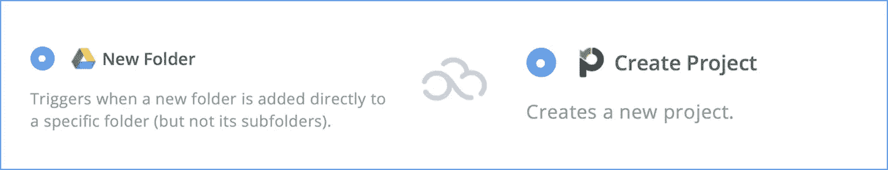
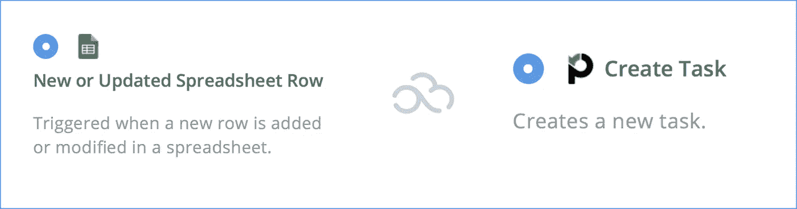
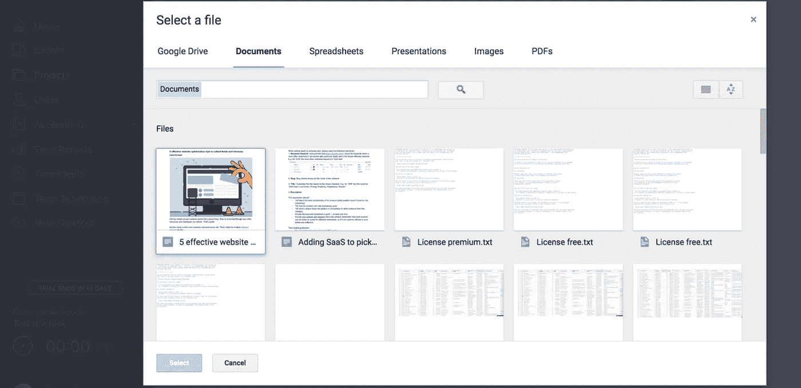
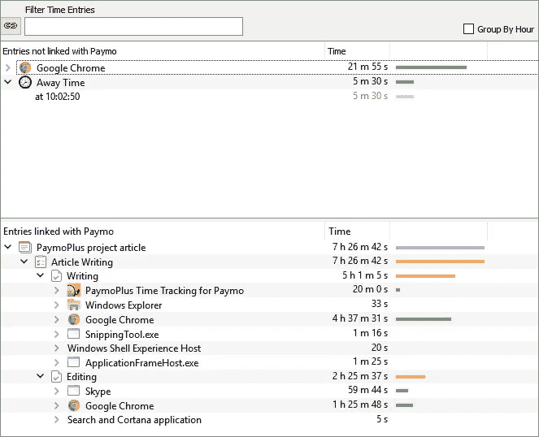
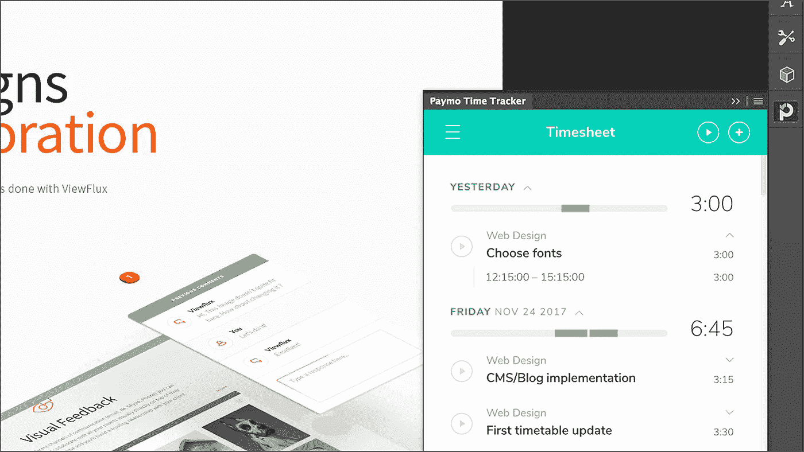
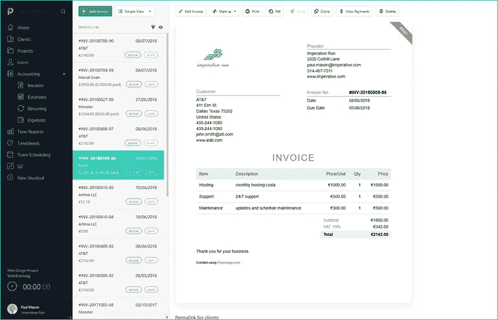
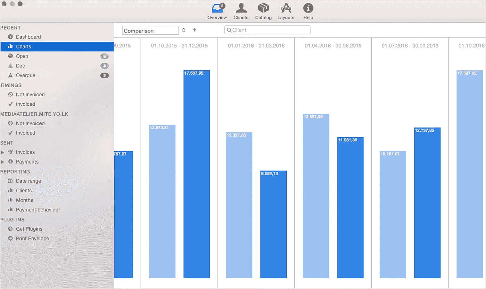
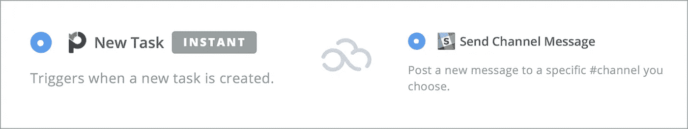

# 如何使用 5 款 SaaS 应用程序加快您的项目管理流程

> 原文：<https://medium.com/swlh/how-to-speed-up-your-project-management-process-with-5-saas-apps-7c6e217b8b25>

每当你开始一个新项目或一个重要的新举措时，你不会一头扎进任务中。

第一步总是计划。

这是因为你计划的步骤可能不总是像你一开始想的那样。为你的行动制定路线图对于有效执行任务和充分利用你的资源至关重要。

# 项目管理流程瓶颈

到目前为止，我注意到项目管理过程的三个主要方面:

*   **计划的步骤越详细，实现的可能性就越小**

简而言之，如果你计划了项目工作流程的每一个细节，那么这些细节极有可能无法完成。这是由项目的动态驱动的，因为通常会出现新的情况，这意味着你的工作计划会发生巨大的变化。

**项目管理流程提示** - >尽量把项目组织成更一般的里程碑，而不是进入详细的具体任务。

*   **如果不及早解决，项目期间的沟通会变慢**

通常，你会从团队会议开始，在那里每个人都可以分享他们的想法并提前计划他们的行动。但是，项目一启动，沟通减弱，问题就出现了。建立项目成员之间的后续沟通模式。这真的可以加快您的工作方式，让每个接收项目更新的人都清楚，如何以及何时发送反馈，以及出现错误时该做什么。

**项目管理流程提示** - >使用 SaaS 工具，尝试自动化团队成员之间的更新和沟通。我所说的更新是指在整个项目中发生的任何进展或变化，例如，一个已完成的任务或截止日期的变化。

*   **糟糕的任务优先级会破坏项目的有效性**

运行一个项目时，最常见的事情就是做很多不必要的事情。他们会让你觉得想做些有成效的事情，但实际上，他们是在浪费时间(是的，帕累托法则也适用于项目管理😉).事实上，这也是我发现自己在日常工作中犯的错误。任何团队会议的目标都应该是确定相关任务的优先级，并计划首先执行优先级。

**项目管理流程提示** - >使用项目管理工具对你的任务和项目进行优先级排序。在结构中将最重要的任务排在更高的位置，并确保所有任务都按照商定的顺序执行。

借助现代云技术和 [SaaS 应用](https://picksaas.com/blog/what-is-saas-software/?utm_source=blog&utm_campaign=Paymo)，您可以自动化项目管理流程的重要部分。当然，项目管理并不是完全自动化的。但是，有一些特定的步骤可以非常快速和容易地简化。

可以自动化的项目管理流程的几个要素:

*   **文件共享/发送自动化**

将项目文件保存在我们自己的驱动器上对我们大多数人来说很方便。然而，当你需要将文件发送给另一个人，并花时间在自己的文件中查找时，问题就出现了。为了避免这种情况，你可以将所有文件保存在共享的 Google Drive 或 Dropbox 中。任何时候有人想访问你的文件，他们只需要去你的驱动器，并从那里获取它们。

很多时候，项目需要你根据它们来跟踪时间——特别是如果你在一家按小时收费的公司工作。这包括手动记下在特定活动上花费的时间，这转化为在任务上花费的更多时间。相反，你可以使用一个时间跟踪工具，自动测量你投入到生产任务中的时间。

*   **项目更新自动化**

你不想每次更新任务或上传文件时都用电子邮件打扰你的队友。这只会分散他们对主要工作的注意力，使他们陷入一种来回的状态。另一种方法是建立一个系统，自动通知他们即将到来的项目更新。这可以节省你的时间，加强沟通，这样你就可以在截止日期前完成项目，并且符合所有的要求。

还有许多自动化可以节省您的时间和资源，所以让我们更深入地研究它们在实践中是如何工作的。

# 使用 SaaS 应用程序实现项目管理自动化

那么，如何在不落后于项目的情况下实现项目自动化呢？让我们看看下面的例子。

# 1.从 Google Drive /电子表格开始

如果你仍然使用微软 Office 等传统软件工作，并且只在自己的硬盘上存储数据，你应该考虑改变你的习惯！为什么？因为只要你使用桌面应用程序，你就大大限制了你与队友有效沟通的可能性。

假设您需要建立一个包含客户数据库(包括电子邮件、电话号码、地址等)的电子表格。现在，你有两个选择:

1.  创建一个 Excel 电子表格，并通过电子邮件发送给你的队友，或者
2.  创建一个谷歌电子表格，并与你的队友实时协作

你喜欢哪一个？

在线存储数据似乎会给你的企业带来额外的风险。然而，随着如今云变得越来越安全，在线存储带来的好处远远超过了欺诈风险。

Google Drive 是一个可以帮助你的工具，因为它有几个连接的机会。通过应用它们，你可以轻松地将数据推送到你使用的其他工具，比如 [Paymo](https://picksaas.com/project-management/paymo?utm_source=blog&utm_campaign=Paymo) 、 [MailChimp](https://picksaas.com/mailing-automation/mailchimp?utm_source=blog&utm_campaign=Paymo) 或 [Slack](https://picksaas.com/communication-tools/slack?utm_source=blog&utm_campaign=Paymo) 。

让我们看看 GDrive 如何融入您的项目管理流程。

# 2.基于新的 GDrive 元素自动创建项目和任务

Google Drive 中的每个动作都可能触发项目管理应用程序中的特定动作，比如 Paymo。

如何实现它并为你所用？你可以使用 [Zapier](https://zapier.com/) 让它工作。这里有几个例子:

*   **在 Google Drive 中创建新文件夹时，自动创建新项目。**

你可以在你的 Google Drive 里建立一个名为“项目”的文件夹。然后，设置自动化，这样每当您创建一个新的子文件夹时，就会在您的 Paymo 项目管理应用程序中自动创建一个项目。

New/updated row in Google Spreadsheet –> new task in Paymo

*   **根据你的谷歌电子表格条目创建任务**

我可以想象，在谷歌电子表格中写任何东西都比在应用程序中键入要容易得多，不是吗？您可以将您的 Google 电子表格与 Paymo 连接起来，这样每当您的电子表格中创建或更新一个新行时，就会有一个新任务添加到您的 Paymo 项目管理应用程序中。

New/updated row in Google Spreadsheet –> new task in Paymo

*   **直接从 Google Drive 向 Paymo 项目添加文件(原生集成)**

通过 Paymo 的原生 Google Drive 集成，可以毫不费力地将任何文件从云目录添加到项目中。只需将任何文件/文档附加到您的项目中，就像您从物理驱动器中所做的那样。您还可以在任务级别上这样做，以便将所有任务更新保持在上下文中。

Adding files from Google Drive to Paymo

# 3.使用 PaymoPlus 自动跟踪在特定项目上花费的时间

测量在特定任务上花费的时间可能有助于你估计项目的盈利能力，监控你的效率，并识别分散注意力的活动。

虽然有些人可能会使用时间跟踪作为一种控制和监督的形式，但它主要是关于利用您收集的数据以及您和您的团队的工作方式。

使用 [PaymoPlus](https://www.paymoapp.com/blog/automatic-time-tracking/) ，您可以自动跟踪您在桌面上进行的活动所花费的时间，深入了解您花费最多时间的网站，或者查看花费您一天大部分时间来完成的任务。

PaymoPlus — automatic time tracking

## 在其他应用程序中手动跟踪时间

如果你不想自动跟踪所有的活动，并以更手动的方式来做，你可能仍然会使用你的项目管理应用程序。通过连接其他应用程序使其更加方便。

当你在做一个项目时，很有可能你没有经常打开你的项目管理应用程序。你使用大量不同的工具和资源来完成你的工作，尤其是如果你是一名设计师。

如果你可以直接从你正在使用的应用程序，比如 Adobe Creative Cloud，来追踪花费在特定任务上的时间，为什么要在不同的应用程序之间切换呢？

集成您的 Paymo 项目管理应用程序，您可以在 Adobe 应用程序中轻松跟踪花费在设计上的时间。无需在两个不同的应用程序之间切换，并在后台保持它们打开。

Integration between Paymo <> Adobe

示例流程是什么样的？

1.  您在 Adobe Illustrator 中为一个客户开始设计项目。
2.  您在 Adobe 中打开 Paymo 时间跟踪器，并开始根据任务跟踪时间。
3.  完成设计后，你停止计时。
4.  您在 Adobe Photoshop 中为另一个客户端启动项目，并开始跟踪另一个项目的时间。
5.  完成后，您再次停止计时，并在 Paymo Adobe extension 或 Paymo web 应用程序中查看特定任务的工作时间摘要。

# 4.通过连接总计应用程序自动处理发票

既然你已经成功有效地跟踪了你的时间，那么是时候处理与财务相关的问题了。

将所有需要的数据存储在项目管理应用程序中，根据项目流程自动开具发票非常容易。

您可以通过使用内置的发票功能和定制特定元素(如发票模板、货币、在线支付网关、逾期付款提醒等)直接在 Paymo 中创建发票。).

Invoicing in Paymo

然而，如果你想单独处理发票，包括它们的分析，你最好将你的项目管理应用程序与一个额外的外部发票软件相连，如 GrandTotal。

**有什么好处？**您可以在一个地方即时访问所有发票和支付数据，从而充分利用存储在 Paymo 中的数据。

Invoicing analytics in GrandTotal

# 5.让您的工作组随时了解时差通知

沟通是项目中最重要的部分之一。确保您的团队及时了解与项目流程相关的任何变更是值得的。怎么做？

你可以发送包含项目更新的总结邮件，这可能会浪费你很大一部分时间。或者，您可以通过专用的 [Slack](https://picksaas.com/communication-tools/slack?utm_source=blog&utm_campaign=Paymo) 通道将通知自动发送到您的团队，从而使您的工作自动化。

**它是如何工作的？**

Project’s update in Paymo -> automatic message in Slack

您可以使用 Zapier 来设置特定的触发器，这将导致通知出现在项目的松弛时间频道中。然后，项目中的每一个新变化，比如新任务，都可以通过 Slack 自动发送给你的团队。不再有电子邮件，不再有不断的问题和关于变化的更新。您的团队可以随时随地保持最新状态:🎉

# 自动化您的工作流程，节省时间和资源，并优化您处理项目的方式

在处理你和你的员工的工作过程中，有几种[项目管理方法](https://www.paymoapp.com/academy/project-management-methodologies/)可以使用。

无论您选择哪种方法，您都将发现大量的项目瓶颈。提前确定它们的范围，并想出一种方法使你的工作方式变得更有效。

使用本机集成，您可以通过在第三方应用程序之间共享数据来优化许多任务。尽管如此，你不需要本地集成来实现它。使用像 [Zapier](https://zapier.com/) 、[integra mat](https://www.integromat.com/en/)或 [PieSync](https://app.piesync.com/users/new) 这样的工具，您可以轻松地在许多不同的应用程序之间进行同步，轻松设置特定的触发器，从而实现特定的操作和数据传输。

利用连接不同应用程序的机会，开始自动化您的工作流程，并通过互联的 SaaS 应用程序更有效地管理您的项目。🚀

*在*[*picks as*](https://picksaas.com/?utm_source=blog&utm_campaign=Paymo)*，我们帮您找到 saas 软件，发展您的业务。*

*与我们聊天，关注我们的* [*推特*](https://twitter.com/picksaas) *，或者* [*订阅*](https://picksaas.us16.list-manage.com/subscribe/post?u=0a811ad254e7cd14718599e3a&id=bdf0cfd955) *我们每周的 SaaS 软件更新。*

*原载于* [*Paymo 博客*](https://www.paymoapp.com/blog/saas-applications/) *。*

## 这篇文章发表在 [The Startup](https://medium.com/swlh) 上，这是 Medium 最大的创业刊物，有 355，974 人关注。

## 在这里订阅接收[我们的头条新闻](http://growthsupply.com/the-startup-newsletter/)。

