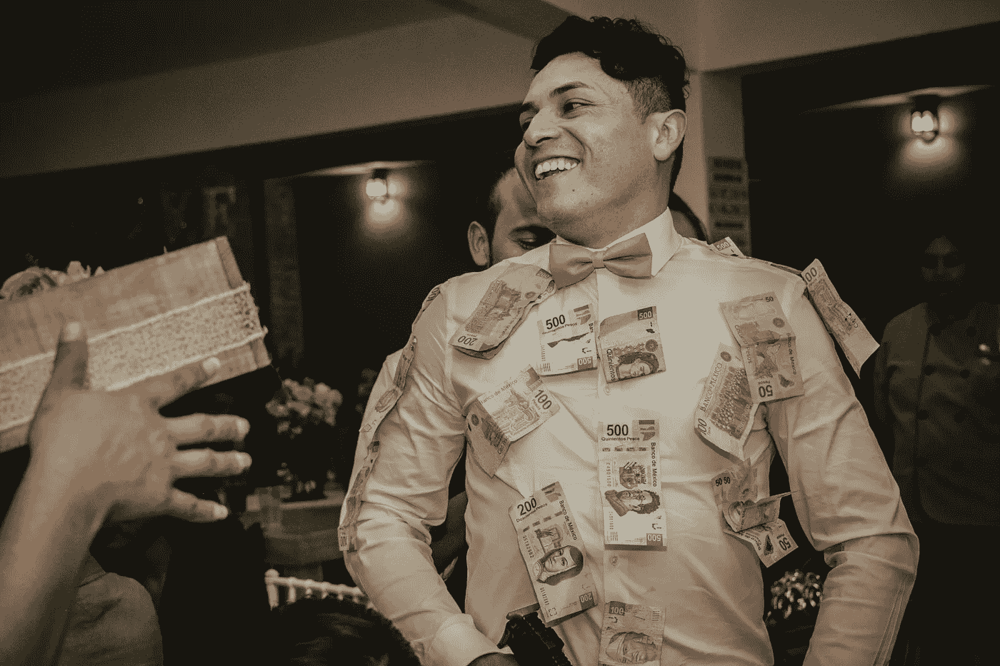
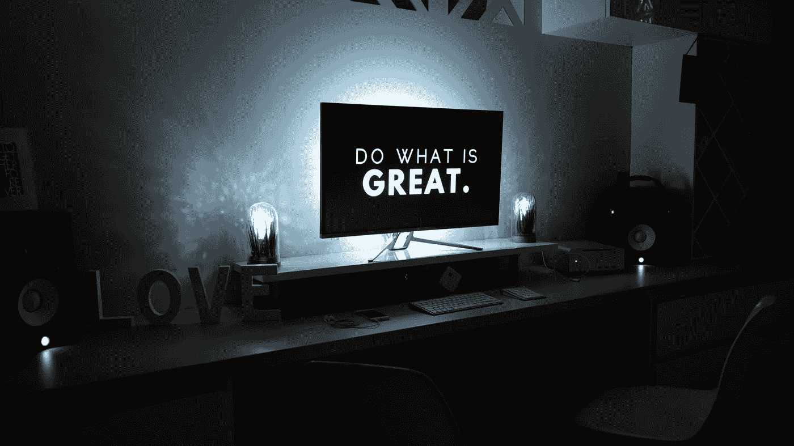
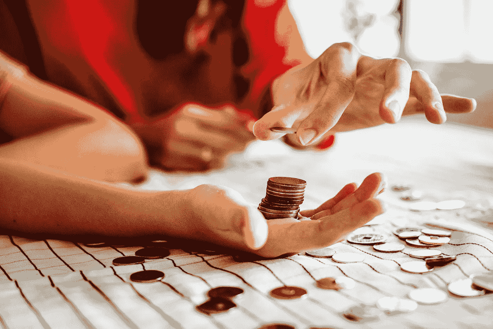
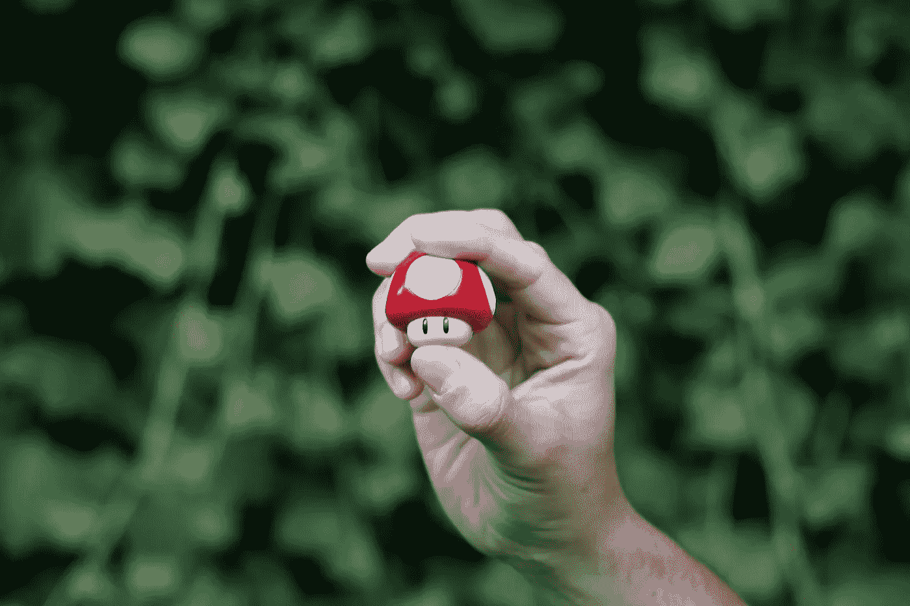

# 作为一家初创公司，如何花费你的第一个 5 万美元

> 原文：<https://medium.com/swlh/how-to-spend-your-first-50k-as-a-startup-fdd8a608ff45>

你设法有了一个不错的商业想法，在你周围聚集了一个优秀的团队，甚至设法说服一些人向你投资，获得了你的第一笔种子前资金 50，000 美元！恭喜你！

This is the beginning of the Startup Monopoly game (Photo by [Jonathan Saavedra](https://unsplash.com/photos/bKW1ZEUu7m4?utm_source=unsplash&utm_medium=referral&utm_content=creditCopyText) on [Unsplash](https://unsplash.com/?utm_source=unsplash&utm_medium=referral&utm_content=creditCopyText))

开始时，这看起来是一大笔钱，取决于你在哪里，你打算做什么，特别是如果你以前的余额为零。然而，现实情况是，它非常少，你才刚刚开始创业生活的整个旅程。在我的几个项目中，我已经筹集了类似或更多的资金，今天我将与你分享一个由许多失败和成功打造的思维框架，如何在创业初期最好地推进你的创业，并在尽可能花最少的钱的同时获得最大的回报。这些都不是你的实际例子，把它当作一个框架，你可以在产品适应市场之前应用于任何创业支出。

# 产品上市前的适应性

正如埃隆·马斯克(Elon Musk)的名言所说，创建一家初创公司就像嚼玻璃，凝视深渊，没有什么比这更真实的了，尤其是在你实现产品与市场的契合之前。在你带着你的产品出去并让人们为它买单之前，你基本上一无所知，只有两种意见:

*   **怀疑者**——他们会试图关闭你的企业
*   **支持者**——通常是朋友和熟人，他们会提升你的想法并支持你

然而，在你寻找一个真正的产品市场契合点的过程中，除了急需的情感支持，这两者都是不可用的。

问题仍然是:我们如何跨越到一个有效的产品？

# 从你的目标开始

创业时设定几个目标很重要，你可以通过回答以下问题来实现这些目标:

*   我为什么要这么做？
*   如果一切都如我所愿，最后会是什么样子？
*   如果我能拥有一切，那会是什么样子？

这些问题可以引导你回答不同的问题，这些问题的答案你应该坚持一段时间。当我创立[decisio](http://decissio.com)时，目标是*帮助投资者做出更好的投资决策，*现在有了所有的客户和额外的加薪，目标仍然保持不变。同样，在 Blocknify，我们的目标是*帮助人们授权和批准文件，而不牺牲他们的隐私*。这些答案将成为你多年的背景音乐，所以明智地选择它们，让它们引导你的旅程。我创办每家公司的原因是，我认为风险投资应该有更高的成功率，而且每当我进行会计变更时，我都必须打印文件、签字并使用物理邮件将它们邮寄到我的银行，这让我感到沮丧。这两个都是对我为什么的回答。如果“我可以拥有一切”,我希望每一项投资决策都是违背决策的，每一份文件都是用 Blocknify 签署和批准的。爱上“如果我能有我的方式”练习作为一个创始人，真的。他们可以帮助你在日常琐事之外巩固你的视野。

当我分享我对这些问题的答案时，用它们来寻找你自己的创业目标，或者说你的北极星。想想你的“为什么”,作为一名企业家，哪些“为什么”能引起你内心的共鸣。

You do you! (Photo by [Martin Shreder](https://unsplash.com/photos/5Xwaj9gaR0g?utm_source=unsplash&utm_medium=referral&utm_content=creditCopyText) on [Unsplash](https://unsplash.com/search/photos/why-do-you-do?utm_source=unsplash&utm_medium=referral&utm_content=creditCopyText))

酷，你的目标缩小了，接下来呢？

# 怀疑

在我们的创业旅程中，我们与客户、投资者、联合创始人、导师和熟人交谈。我们写像这样的博客，我们测试看看我们的信息在世界上坚持。发布的过程给了我们一些反馈，告诉我们什么是有效的，什么是无效的，通过这些迭代过程，一些创始人的疑虑产生了。

如果你是一个创始人，你对你的业务有疑问，请为这篇文章鼓掌！我见过的所有创始人都对他们的公司、产品和流程心存疑虑。其中一些是人类的思想沉思，并不重要，其余的非常重要。

在我们部署新应用程序时，我和我的联合创始人坐下来，讨论了我们对自己的私人签名产品和业务的一些疑虑。在进入之前，确保这些都是合理的怀疑，在某种程度上也是从你的投资者、客户和商业伙伴那里得到证实的。因为我们现在是后 MVP，我们制定了我们需要知道是否:

*   我们的 B2C 产品是可用的(*客户喜欢它吗，或者感觉像‘meh*)？
*   如何衡量公测成功(*实际数字是多少)*？
*   对于加密基金来说，我们是一个有吸引力的投资吗？
*   天使投资人呢(*能不能说服 10 个人每人给我们 10k*)？
*   我们的中东欧地区怎么样(*启动资金低，我们能做到吗)*？

这些是我们已知的一些未知情况，现在这就是钱来了。为了经营一家初创公司，你需要每月烧钱。通常，作为一个企业家，你的资源非常有限，尤其是现金，所以企业家的主要工作是最大限度地利用你银行账户上的每一个单位。像微软和苹果这样的大公司可能会犯一些错误，浪费一些钱，但仍然能够生存下来。在初创公司的早期阶段，你经常会做出 2 到 3 个错误的决定，这将使你所有的梦想和抱负彻底破灭。这就是为什么你应该如何花钱的问题非常重要。

Every Penny Matters (*Photo by* [*rawpixel*](https://unsplash.com/photos/ixqauhAL34o?utm_source=unsplash&utm_medium=referral&utm_content=creditCopyText) *on* [*Unsplash*](https://unsplash.com/search/photos/coins?utm_source=unsplash&utm_medium=referral&utm_content=creditCopyText))

尽管在你的探索之旅中有许多未知的东西等待着你，但我的观点是，你应该把你的时间、金钱和精力集中在消除你的疑虑上，并选择那些能为公司提供最大价值的活动来回答这些问题。毕竟，**每一家早期创业公司在某种程度上都是一次产品与市场匹配的实验，如果你是创始人，你就是实验室的负责人。你希望通过实验找到的治疗方法是一个$1B+评估**。用精神术语来说，低于这个水平的任何东西都意味着你是一个寻找者，而不是一个发现者。

在你确定了你的合理怀疑后，头脑风暴活动并把资源价值与它们联系起来是个好主意。

例如，如果您不知道您的产品是否完全可用，您可以从以下活动中挑选:

1.  执行用户测试(*付费和免费，记录用户与你的应用程序的互动*)
2.  实施应用程序用户行为分析(*让数据说话)*
3.  执行 A/B 测试
4.  找一家公司做试点

这些子实验应该以这样一种方式进行，最终它会为你的疑问提供一个布尔答案，在这种情况下，答案是:*是的，我们的应用程序是可用的*或*不太可用。*

现在，这些都是好主意，但是资源分配应该放在旁边。意思是——从他们每个人那里得到一个答案有多贵？

如果我让 5 个朋友测试我的应用程序，并在他们测试的时候记录下来，我可能要给他们每人买一杯咖啡或一顿午餐，包括我自己的时间，我可能要花 3 个小时来协调他们，5-7 个小时来运行测试，以及总共 100 美元的午餐。我们为此投入了大量的时间和金钱。如果我们做了这些测试，我们将更清楚地了解人们是如何使用我们的应用程序的。

第二个要求我们实现后端和前端功能，因此，我们可能要花费 sprint 的 80%或整个 sprint 的成本，这要昂贵得多。

继续，直到你得到所有的选项和旁边所有的价格标签。然后对照主要目标，决定哪一个会用最少的资源带来最多的结果。

如果你设法通过这个镜头运行每个决定，拥有可靠的低烧钱率$50k 可以让你在产品市场适合搜索上走很长的路。

我已经把产品周期看做一个超级马里奥游戏，你需要足够的生命来进入下一个级别，然后你会得到提升。创业也是如此，你从一点点开始，如果你能设法验证并获得良好的牵引力，你就会得到“神奇的蘑菇( *read: funding* )”来提升你到下一个水平。有时候你会在一个特别困难的水平上停滞很长时间，在这种情况下，看看并重新评估什么是有效的，什么是无效的。

Get that mushroom boost as soon as you can (Photo by [Geeky Shots](https://unsplash.com/photos/hQ4BQ3wdHsQ?utm_source=unsplash&utm_medium=referral&utm_content=creditCopyText) on [Unsplash](https://unsplash.com/search/photos/super-mario-mushroom?utm_source=unsplash&utm_medium=referral&utm_content=creditCopyText))

在这个充满挑战的旅程中，我祝你一切顺利！如果以上任何一点引起了你的共鸣，请鼓掌并关注我以获得更多的创客故事！

## 这篇文章发表在[《创业](https://medium.com/swlh)》上，这是 Medium 最大的创业刊物，拥有+ 375，041 读者。

## 订阅接收[我们的头条新闻](http://growthsupply.com/the-startup-newsletter/)。

