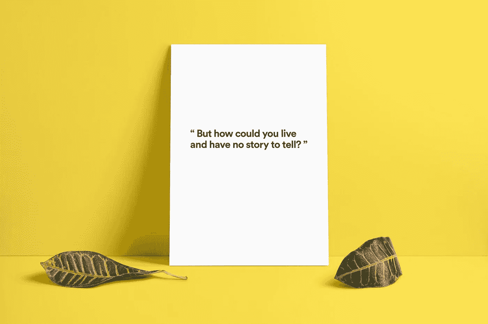

# 如何在有史以来最混乱的市场上开一个博客

> 原文：<https://medium.com/swlh/how-to-start-a-blog-in-the-most-cluttered-marketplace-in-history-ef50db328a09>

Credit: [Quote](https://www.goodreads.com/quotes/132639-but-how-could-you-live-and-have-no-story-to) | [Image](http://graphicburger.com/poster-mockup-psd-portret-landscape/)

> 只有当我有重要的事情要说时，我才会发表文章。

每当以自我为中心的“我”想要更频繁地发表文章并成为关注的焦点时，这就是我提醒自己的。

抗拒并不容易。