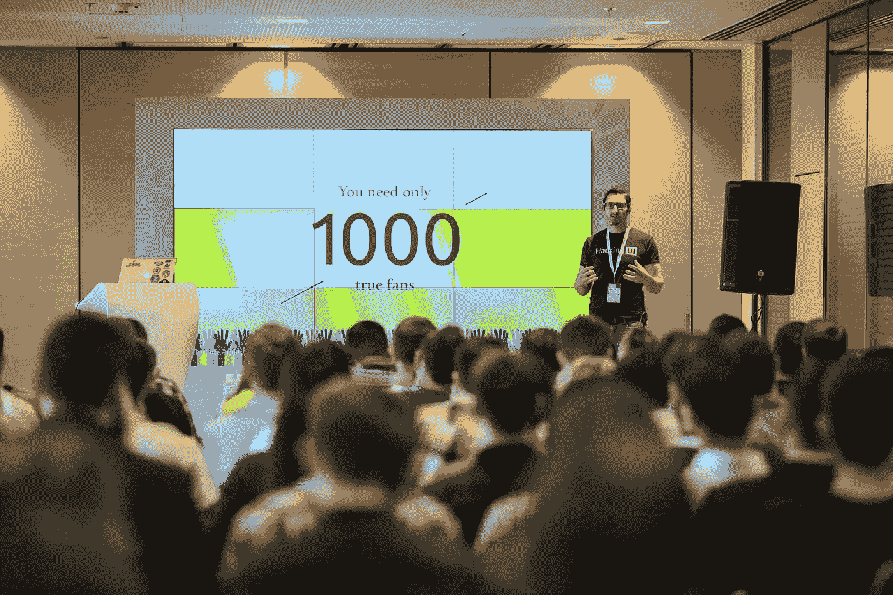
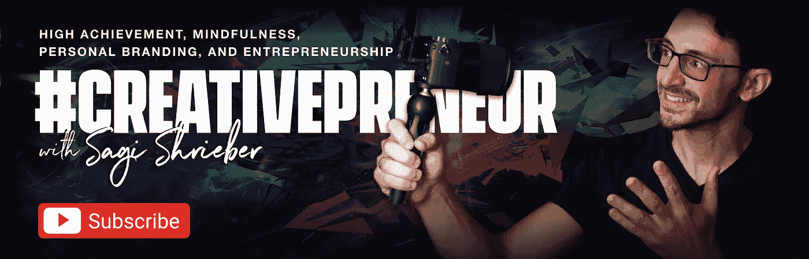
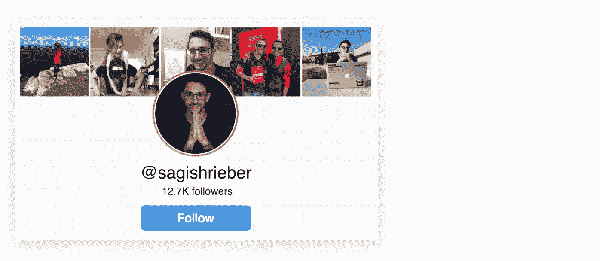
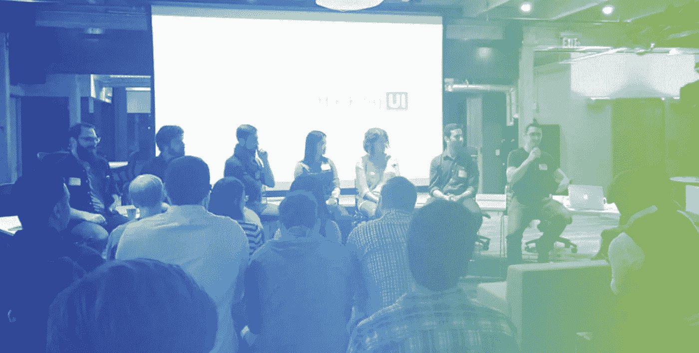
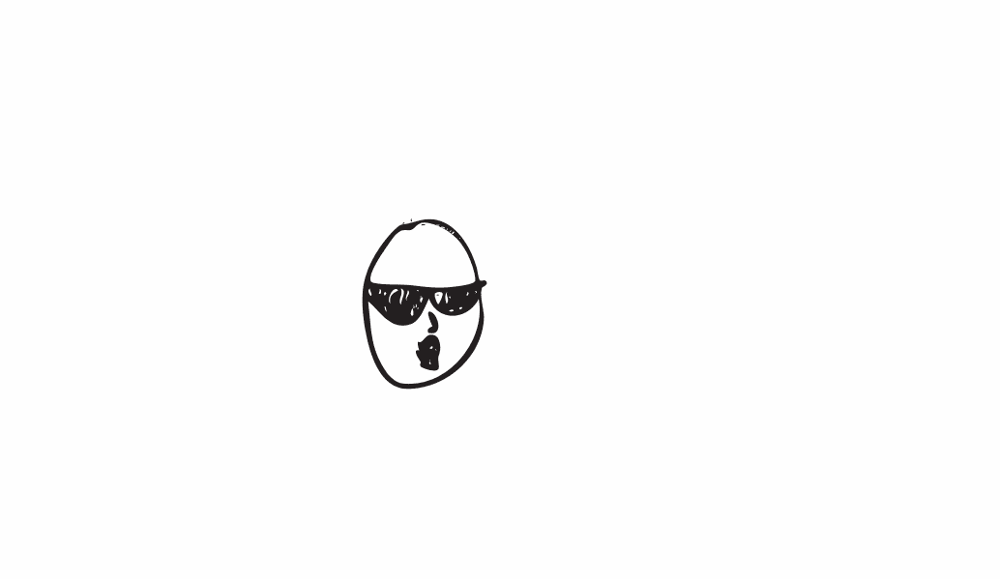

# 当你还没有任何听众时，如何开始建立听众

> 原文：<https://medium.com/swlh/how-to-start-building-an-audience-when-you-dont-have-any-audience-yet-f484d7dfdcd3>

> 我们开始黑 UI 的时候，没有追随者，没有读者，没有人知道黑 UI 是什么，没有人关心，没有人在我们的邮件列表上。快进 3 年后…

Yeah, that’s me, on stage, after being invited to talk in front of hundreds of people in a conference abroad.

好吧，所以你要开始走出去。你想写作，博客播客，或者其他任何事情。

这可能是为了发展你的个人品牌。这可能是为了扩大你的客户范围。这可能只是为了与他人分享经验。

问题是——你已经做出了一个至关重要的决定:*你希望你的想法被公开交流。你想要*获得追随者。

你自己弄明白了[格兰特·卡尔多内](https://medium.com/u/9706bb953458?source=post_page-----f484d7dfdcd3--------------------------------)在他的书[中所说的 10x 法则](https://amzn.to/2Emt3KK):“默默无闻是你的敌人”。

> “默默无闻是你的敌人”——格兰特·卡尔多内

# 但是，一个可怕的想法出现了

______

一个恼人的声音在你脑海中回响:

> “我到底在为谁写作？我还没有观众。即使是我写的，谁会看到我的文章？如果我一开始就没有观众，我怎么能建立起一个观众群呢？”。

通常这是大多数人放弃的地方，根本不开始写。但这很遗憾。你绝对不应该就此打住，在这篇文章里我会彻底分解为什么。

此外，在本文中，我们将:

*   定义什么是真正的“观众”
*   对于我们这些有抱负的内容创作者来说，这个定义更加清晰
*   学期结束&解释“蜜月期”及其重要性
*   术语下降&解释获得听众的“圈子方法”
*   进入你现在可以做的实际可行的项目，开始建立你的听众
*   解释如何建立和维护每周简讯
*   讨论网上写作，以及即使你忙得像只蜜蜂，你如何能完成它
*   我们将以一些灵感和思考来结束

听起来不错？我们走吧！

— — — — — — — — — — — — — — — — — — — — — — — — — — — — — — —

## 🚦方法停止:

现在，我知道大多数人在看到松鼠之前都在阅读，所以…
我现在想问你两件事，即使在你读完这篇文章之后，这两件事也能帮到你，并确保我们保持联系:

**🖐** [**订阅我的 Youtube 频道** →](https://sagishrieber.com/Youtube)
了解更多关于建立个人品牌&生活方式业务的建议

🤜💥🤛也欢迎你在 insta gram**上关注我(也可以随意给我发一条 DM，这样我就知道你在看完这篇文章后关注了我，并会再次关注你)**

****

**🎙Last:但同样重要的是，如果你喜欢播客，我邀请你去听听 iTunes 上的 Creativepreneur 秀或者任何你喜欢的播客应用**

**— — — — — — — — — — — — — — — — — — — — — — — — — — — — — — —**

**我已经经历过三次没有观众的情况了。这三次中有两次是在我的博客上。两者都是从零观众开始的。但我第一次处于这种“没有观众”的鸡和蛋的情况是在 9 年前，当时我决定成为一名自由设计师。**

**我不得不从零经验开始，零客户。我认为这是获得任何“观众”最难的一点，但我仍然设法做到了，并发展了一个不错的客户群。**

**现如今，我经营着两份内容刊物，其中一份是我的全职工作和主营业务。**

**5 年前，我创办了 [Pixel Perfect Magazine](http://www.pixelperfect.co.il/) ，如今，它是以色列最受欢迎的设计博客(希伯来语)。然后，3 年后，我推出了 [Hacking UI](https://medium.com/u/8e826402228a?source=post_page-----f484d7dfdcd3--------------------------------) ，和我的搭档 [David](https://medium.com/u/435c55ce5023?source=post_page-----f484d7dfdcd3--------------------------------) 。**

****

**From the Hacking UI ‘Scaling a Design Team’ event in San Francisco, Nov 2015 ([more pictures from the event are here](https://flickr.com/photos/pennycooke/sets/72157659007553733/), [audio recording here](http://hackingui.com/podcast/episode-2-design-panel-event-at-sf/))**

**借助 Hacking UI，我们仅用 3 年时间就成功地将我们的受众增长到了 23，500 多名电子邮件订阅者，所有这些都是有机的。**

**如今，黑 UI 是我们的全职工作。**我们的*观众*让我们有可能辞掉(相当体面的)工作**，现在我们可以更好地为观众服务！**

**好了，说够了我们，让我们来谈谈你。**

# **让我们来定义“观众”**

**______**

**在我们开始为你的内容获取观众的实际方法之前，让我们澄清一下“观众”实际上是什么:**

**我会这样定义它:**

*****你的观众是由真实的人(人类)组成的那:*****

*   *****读过你的东西一次，但后来又有意识地回头去读你的内容*****
*   *****主动寻求消费来自你的新内容*****

****根据这个定义，我们不是在谈论那些仅仅访问你的网站一次的人，或者阅读你的一篇文章并继续前进的人。我们谈论的是那些消费了你的内容，然后认为‘这太棒了！!'并报名获得更多，然后实际获得更多。****

# ****让我们更深入地了解一下“观众”对你来说意味着什么****

****______****

****就我个人而言，我将我的核心受众视为我的电子邮件订户。****

****那些**主动**订阅的人会在他们的收件箱里收到我的内容(顺便说一下，你[也欢迎订阅黑客 UI 时事通讯](http://hackingui.com/sign-up/))。****

****我很感激社交媒体上的任何“赞”或转发，但我不能把这些人算作我的核心受众。****

****作为一个作家，你博客的流量，或者社交媒体的关注者，对你来说只是随机的人。他们来来去去。你可以称他们为‘观众’，但他们肯定不是你的**核心**观众。****

****当你在任何社交平台上发帖，希望将你的信息传达给你的受众时:****

*   ****你受该平台算法的支配(我们都知道这些算法变化有多频繁)****
*   ****你被一天中你的观众访问他们的提要的时间所支配。如你所知，feed 中的任何项目在社交网络上的寿命都非常短(除非你付费来提升它们)。****
*   ****你在和那个人的朋友争夺他/她的注意力。****
*   ****你无法控制谁离开你或加入你。这些人可能某一天喜欢你的 FB 页面，然后第二天就不像你了，你不能问他们‘嘿，你要去哪里？“你为什么要走？”****

****另一方面，电子邮件更加私人化:****

*   ****您可以完全控制注册漏斗****
*   ****你(几乎)完全控制了退订渠道****
*   ****此外，给你电子邮件的人显示出对你的高度信任(除非你骗他们给你电子邮件，这是错误的做法)****

****使用电子邮件仍然有一些你无法控制的因素。例如，当谷歌决定在 Gmail 中创建“促销”标签时，大多数简讯都消失在该标签中，永远不会出现在“收件箱”中。然而，在我看来，电子邮件是你与听众交流的最安全的工具。****

****有很多方法可以收集人们的电子邮件。大多数邮件列表创建技术是这样的:****

> *****人们看到你的内容→你通过下载一些东西为他们提供价值→他们注册，但对你不屑一顾*****

****但我希望你用不同的方式来做:****

> ****人们看到你的内容→你给了他们这么多价值，然后你才告诉他们可以注册→他们注册了，迫不及待地消费你提供的更多东西。****

****第二种选择的有趣之处在于，一旦人们像那样加入了你的名单，他们就会通过你的邮件开始所谓的“蜜月期”。他们会焦急地等待你的下一封邮件，他们会分享你的内容，只要你继续为他们提供价值，他们就会保持这种关系。****

****通过给他们价值，你让他们成为真正的粉丝。顺便说一下——[你只需要 1000 个真正的粉丝](http://kk.org/thetechnium/1000-true-fans/)就能成功。****

****因此，无论何时我写或发布任何内容，我都只有一个主要目的:**对人们的生活产生积极影响**。****

****无论是通过激励他们，取悦他们，还是教他们一些对他们的工作或生活有益的东西。****

****不要仅仅为了赢得观众而写或发布内容。如果你这样做，你很可能会产生没有价值的内容。****

****如果有人读了你的文章，而你设法对他们产生了影响，他们就是你的了(以一种好的方式)。****

****想想你自己。你遇到过多少黄色或“点击诱饵”的文章？你经常会看到多少聪明但却很平庸的文章，它们没有教给你任何新东西？****

****但是，有时候，只是有时候，你会看到一篇惊人的文章，你会对自己说“哇！！！我得跟着写这个的人走！我想阅读她所说的一切”。****

****好的，我们一致认为获得观众的最佳方式是制作能激发情感并产生影响的内容。****

> ****“内容”这个词有一个坏名声。让我们称之为“公开的思想”****

****如果你通过你高质量的宣传思想赢得了一批观众，当你有东西要卖的时候，这些观众最终会在双赢的情况下支持你。****

****是的，我说了那个“S”字。“销售”不是诅咒语。这让我能够辞去我的日常工作，将 UI 编程从一个兼职项目转移到我的全职工作中。现在我可以更好地服务于黑客 UI 社区。****

****你的观众应该是那些你愿意在喝咖啡时见到并与之交谈的人。****

****如果你去他们的家乡组织一次聚会，这些人会出现，并迫不及待地和你打招呼。****

****因此，我努力争取有一个邮件列表，并积极经营一份每周时事通讯。****

# ****“好的，萨吉，我同意你在邮件列表上的观点，我现在知道‘观众’对我来说意味着什么。但是我如何开始构建它呢？”****

****_____****

****好的，所以我想以这个 2 分钟的短片开始，它来自我在乌克兰周末的一次演讲:****

****让我们称我在这个视频中描述的方法为*圆圈方法*。****

# ****赢得观众的圈子方法****

****____****

## ******配料:******

*   ****你的脸书、推特、Instagram 和任何你已经注册的社交账户****
*   ****你的朋友和家人****
*   ****意志力****
*   ****一丝耐心****

## ****方法:****

1.  ****注册，并在 [Mailchimp](https://mailchimp.com/) 上打开一个邮件列表(10 分钟)。也可以在任何其他电子邮件营销平台上使用，但我使用 Mailchimp，它对多达 2000 名订户免费。****
2.  ****获取一个链接，推荐人们注册您的列表(Mailchimp 为您提供了一个注册页面以供共享)。这里的[文章将教你如何做到这一点](http://kb.mailchimp.com/lists/signup-forms/share-your-signup-form)。****
3.  ****请你的家人和朋友注册你的邮件列表。打电话给你的妈妈/爸爸，你的兄弟/姐妹。让他们报名。你的朋友也一样。在任何场合谈论你的时事通讯。当你和你的朋友见面喝酒时，让他们注册(Mailchimp 有一个移动应用程序，可以在旅途中将人添加到你的名单中，我敢打赌任何其他电子邮件提供商也有)。****
4.  ****在社交媒体上联系你所有的朋友:
    **a)** 在 facebook 上公开发布消息:
    ***“大家好，我有一个新的时事通讯，希望你们能注册！这会让你了解我在职业生涯中的最新进展。会喜欢你的支持！更重要的是，如果你能分享这篇文章，那将是非常棒的，这将帮助我联系到你的一些脸书朋友，他们可能会发现我的内容与他们相关。【链接报名】"* b)** 给你所有的密友发私信。
    **c)** 在 Instagram & Snapchat 上发送 DM 和故事给朋友注册
    **d)** 在 Twitter 上发送 DM 给朋友和熟人，并在 Twitter 上公开发布。****
5.  ****在你的社交媒体档案上发布注册链接:无论是 Twitter、Instagram、脸书、Linkedin、Dribbble 还是任何其他相关平台。****

## ****接下来会发生什么:****

****你的第一个核心圈子现在将开始喜欢和分享你的内容。****

****例如，假设你写了关于设计的文章，并在 FB 上分享。****

****现在，你的兄弟可能会分享你的帖子，尽管他不知道你在说什么。但是他关心你，相信你，所以他分享。所以现在他的一个朋友碰巧对你写的主题感兴趣。她看到你的帖子，阅读它，并享受它。她现在订阅了你的名单，你得到了你的第一批“第二圈”观众！****

****这些圈子只会扩大并不断增长，而且每个圈子(显然)都比后者大。****

********

****圈子方法只是你开始通过你当前的观众传播信息。****

****是的，你的家人和朋友是你的第一批圈子观众。他们可能不是你最相关的观众。见鬼，它们可能和你写的东西一点关系都没有。但是……**他们是你最大的粉丝和传道者。******

****他们会在任何可能的情况下分享关于你的信息，并且会一直这样做下去。****

****我的一些帖子仍然会得到妈妈的喜欢和分享，对此我没有任何问题。👍****

# ****激活了你的第一个圈子？太好了！现在是时候开始发展与你的观众的关系了****

****____****

****换句话说，是时候开始你的每周时事通讯了。****

******开始每周给你的听众的邮箱发一次东西**。为什么一周一次？因为与你的观众接触少于这个时间是无法让他们留下来并相信你的。更别说信任你了。你必须把你的名字刻在观众的脑海里。****

****但是你如何每周写一次足够好的文章呢？
嗯，你不用。在 Hacking UI 中，我们有一个策划链接时事通讯，我们建议你也开始做一个。分享过去一周你已经读过/听过/看过的内容的链接非常简单。****

****每当你看到一篇好文章，就把它保存在电子表格里。然后，每周一次，去 Mailchimp，列出这些链接，写一个超级短的顶部段落，描述你上周做了什么，或者只是描述你喜欢这个链接的什么，然后发送出去。****

****即使你的名单上一开始只有 3 个人，也要马上发送你的第一期，对待每一次发送，就像你的名单上已经有数百人一样。****

****这实际上是有史以来最好的事情，因为你可以一点一点地调整你的简讯，让它变得很棒，直到你有更多来自第二个圈子的人加入你的名单。****

****从第一天起就和你的观众建立关系也是非常重要的。再说一遍，无论你的名单上有 3 个人还是 20，000 人都没关系。对待你的观众，就像你希望观众的规模和行为一样。****

# ****开始发送每周综述了吗？太好了，现在该开始写了？****

****____****

****开始写吧。开始吧。****

****这是一个完全不同的话题，但是你必须毫无畏惧地写下[。只是用任何能激励你的方式去激励别人。](/hackingui/3-ways-i-use-to-overcome-my-career-fears-84531d435c5)****

****写下来教人们一些你最近学到的，你认为在你的行业/环境中至少有 50%的人还没有学到的东西。写下你的经历。写一篇文章展示你读到的内容。写一篇文章描述你的工作流程和工具。****

****你想在世界上产生影响吗？很好，但是坐下来做吧。你也可以[使用这个免费的电子邮件课程](http://hackingui.com/start-writing/)来扩展你关于如何开始有效写作的知识。****

****美妙的是——如果你已经有一份每周时事通讯，就不必那么频繁了！****

****自从我们有了全职工作，大卫和我每两个月就写一次关于黑客 UI 的文章，但是我们每周都保持通讯。****

****每两个月写一次的惊人效果是**人开始期待我们的文章**。****

****我们发表了高质量的文章，我们的观众很喜欢。此外，在今天内容超载的情况下，拥有一份不慌不忙地撰写内容的出版物令人耳目一新(只要最终创作的内容对读者有价值)。****

****每两个月写一篇文章是你可以真正完成的任务。只要每周拿出 1.5 英镑来写作，两个月后你就能写好一篇长篇文章了。想想你能在哪里挤出一个半小时。也许在早上，也许在晚上，也许在周末。但是无论你做什么，告诉你爱的人，并把它记在你的日历上。当你最终到达那里时，确保将你的 iPhone 打开飞行模式，并关闭任何其他干扰。****

****每当你发表一篇文章时，一定要在底部放一个注册表格。****

****表单应该像这样写:**“你喜欢这篇文章吗？注册我的时事通讯，这样你就不会错过另一篇文章"**。****

****要放置表单，如果你在 Wordpress 上，使用 [MC4WP](http://mc4wp.refr.cc/5CXSX7G) ，或者只使用 Mailchimp 的默认嵌入小部件。如果你在 Medium 上，使用 [Upscribe](https://medium.com/u/36e782ad10b9?source=post_page-----f484d7dfdcd3--------------------------------) (或者任何其他允许注册的服务)。****

****别忘了以后把你写的每篇文章分享到脸书、推特、Instagram 和你的任何社交账户上。****

****以下是你在制作每一个内容时应该做的一些事情(我仅列举几个):****

*   ****在 facebook 上，列出要发布的相关群组。将该列表保存为 excel 格式，并在您撰写的每篇新文章中使用。确保阅读每个小组的社区指南，并遵守它们。****
*   ****将每篇文章发布到你不太活跃的其他网络上。也许是 Linkedin，也许是你所在领域的一些松弛频道，在 Reddit 上分享(通过谷歌搜索'*【你的文章主题】*')找到相关子编辑)。****
*   ****用 Instagram！贴一张你的文章的图片，并更新它的链接作为你的主要 Instagram 个人资料链接。在 Instagram 中，你不能从图片描述中链接，你只有一个行动号召，那是来自你的主个人资料。在你的图片描述中，解释文章的内容，并以“简历中的链接”结尾。然后在你自己的图片上添加第二条评论，并附上相关的标签。这个网站的标签太棒了。****
*   ****在相关的向上投票平台上发帖，如 [DN](https://www.designernews.co/) 或 [HN](https://news.ycombinator.com/) 或 [GH](https://growthhackers.com/) ，并请你的朋友给你最初的几个向上投票，这样它就会增加(顺便说一下，没有人会告诉你这样做，但每个人都这样做)。不要给他们发送你在这些平台上的帖子的直接链接，但一定要告诉他们去平台的主页，在那里找到你的帖子，并投票支持它。****

# ****我们都是白手起家****

****____****

****我们开始黑 UI 的时候，没有追随者，没有读者，没有人知道黑 UI 是什么，没有人关心，没有人在我们的邮件列表上。****

****想想你追随的所有人，欣赏他们的作品。他们也是从零观众开始。[蒂姆·费里斯](https://medium.com/u/56d3bc91794f?source=post_page-----f484d7dfdcd3--------------------------------)从零开始，[帕特·弗林](https://medium.com/u/5a8c400169ef?source=post_page-----f484d7dfdcd3--------------------------------)从零开始，[杰夫·戈因斯](https://medium.com/u/b176436e91b1?source=post_page-----f484d7dfdcd3--------------------------------)从零开始，[保罗·贾维斯](https://medium.com/u/d3829eda3c33?source=post_page-----f484d7dfdcd3--------------------------------)从零开始，[杰森·祖克](https://medium.com/u/f0543a6a8dc4?source=post_page-----f484d7dfdcd3--------------------------------)从零开始，[本杰明·p·哈迪](https://medium.com/u/5153880ce2ee?source=post_page-----f484d7dfdcd3--------------------------------)从零开始，[托拜厄斯·范·施耐德](https://medium.com/u/7ee29b787e9?source=post_page-----f484d7dfdcd3--------------------------------)从零开始，[朱莉·卓](https://medium.com/u/b8a4e5ae7490?source=post_page-----f484d7dfdcd3--------------------------------)从零开始，其他任何思想领袖也是如此。顺便说一句——如果你还没有遵循以上任何一条，你真的应该这样做！****

# ****把那个瓶子扔进海里****

****_____****

****最后，我想谈谈尼尔·盖曼鼓舞人心的毕业典礼演讲中的一段话:“[创造优秀的艺术](https://www.youtube.com/watch?v=ikAb-NYkseI)”。****

****他把“把一个瓶子放进海里”作为写作的类比:每次你写作，就像把一个瓶子放进海里，期待有人在另一端收到它。****

****不仅要收到它，还要回信让你知道他们收到了。****

****开始时，似乎没有人明白你的意思。似乎没有人读你的文章，甚至不在乎。你必须耐心地发送一个信息，然后是另一个，然后是另一个。要始终如一，不要放弃。要有信心。****

****慢慢地，你会开始看到那些瓶子回归，一旦你开始看到它们回归——它们永远不会停止。****

****你只需要坚持不懈。永不放弃。
继续写作。耐心点。
做好艺术！****

****现在去开始培养你的观众吧！****

******有问题吗？我很乐意帮忙。我已经建立了一个创意企业家的社区&数字创作者，叫做 **Creativepreneur！********

**欢迎您:**

## **🚦欢迎您:**

**📧订阅[周刊 **Creativepreneur 简讯**](https://creativepreneurmagazine.com/newsletter/)**

****🖐** [**订阅我的 Youtube 频道** →](https://sagishrieber.com/Youtube)
了解更多打造个人品牌的小技巧&生活方式商业**

****

**🤜💥🤛 [**在 Instagram 上关注我**](https://www.sagishrieber.com/IG)——然后一定要给我发一条 DM，这样我就知道你在读完这篇文章后关注了我，并会再次关注你。**

****

**🎙Last:但并非最不重要的是，如果你喜欢播客，我邀请你去听听 iTunes 上的 Creativepreneur 秀**

**您真诚的， [萨基·施莱博](https://medium.com/u/16d3c2fbe603?source=post_page-----f484d7dfdcd3--------------------------------)**

# **本文的参考资料:**

*   **如果你想了解我是如何开始的，然后将我的作品作为副业项目，你可以在这里阅读(并听听我制作的音频版本): [**我是如何建立(现在扩展)我的副业项目的:故事、见解和实用技巧**](http://hackingui.com/product-hacking/side-projects/)**
*   **我邀请你加入脸书的 Creativepreneur 社区[，订阅每周](https://www.facebook.com/groups/mindfulandruthless/)[的 Creativepreneur 简讯](https://creativepreneurmagazine.com/newsletter/)，并在 iTunes (或 [Spotify](https://sagishrieber.com/spotify) ，或 [Youtube](http://www.youtube.com/subscription_center?add_user=sagishrieber) 上订阅视频格式的[creative preneur 播客](https://sagishrieber.com/itunes)**
*   **尼尔·盖曼全谈(必看):**

**- — — — — — — — — — — — — — — — — — — — — — — — — — — — — — -**

***关注我的工作&生活上的* [*Creativepreneur 简讯*](https://creativepreneurmagazine.com/newsletter/) *，我的*[*Youtube*](http://www.youtube.com/subscription_center?add_user=sagishrieber)*频道，*[*insta gram*](https://sagishrieber.com/instagram)*，我的个人简介上的*[**&**](http://facebook.com/sagishrieber)*[*Twitter*](http://twitter.com/sagishrieber)***