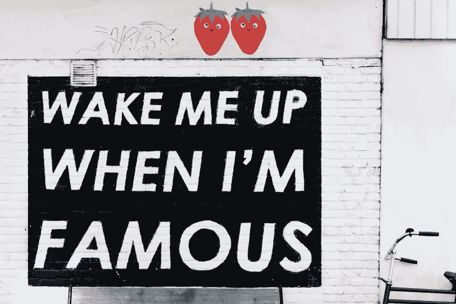

# 如何像一个胜利者一样开始构建你的生活？

> 原文：<https://medium.com/swlh/how-to-start-building-your-life-like-a-winner-f36bab3f7f0f>

Wake me up when I´m famous. Credit Unsplash.

生活就像一盒巧克力。你永远不知道你会得到什么。俗话不是这么说的吗？

如果你问我的话，绝对是垃圾。

事实上，大多数人都是这样生活的，生活就像某种东西撞击着他们。他们对环境做出反应，但从不回应生活。

## 旅程

我喜欢把生活想象成“旅程”，而大多数人甚至不知道他们为什么要走。他们正沿着一条为他们设计好的道路前进。有些人知道他们要去哪里，并接受它。有些人知道他们要去哪里，但并不满意，剩下的人不知道他们要去哪里，他们要多快到达那里，或者他们为什么要去那里。

**生活不就是这样吗？**

这是对生活的一个很好的比喻，因为如果你环顾四周，你会发现大多数人都是追随者。他们只是对生活强加给他们的一切做出反应。做他们能忍受的工作，保持他们喜欢的关系，做其他人都在做的事情。大多数人就是这样度过一生的。他们没有目标，也没有任何他们真正想在生活中实现或完成的事情。他们更愿意走舒适的道路，而不是充满挑战的道路。

**多么无趣。**

 [## 让自己在余生保持动力的 3 种方法。

### 1.目标

medium.com](/@rasmuspersson/3-ways-to-keep-yourself-motivated-for-the-rest-of-your-life-f3b7f49d6528) 

# 通往更好生活的道路。

你的路不像我的路，你的路也不像任何人的路。我们都是不同的，有着不同的需求和梦想。有些人甚至喜欢日常生活的舒适。我他妈的凭什么说你错了。不，请，只要适合你的船。

所以看起来我能给你的最好的建议也是最难的。

1.  做任何你认为有趣的事。
2.  想办法从做这件事上赚钱。

关于我。我做出了选择。我偏离了普通的生活道路，我厌倦了做一个追随者。是时候找到我的路，以某种方式创造我的理想生活了。所以我不再做我周围的人在做的事情，我不再每个周末都在外面喝得烂醉。我不再把一天中的每一分钟都花在追女孩上。有时候，我几乎感觉自己径直走进了森林，我是说，我在追逐我对更好生活的梦想。但是独自一人是很可怕的。我知道我做的是对的，不是那样的。是那种没有安全感的感觉。如果…会怎样..

不久前我对自己说:如果我继续沿着我的路走下去，那么我很清楚我的生活将会如何结束。10 年后，我可能会有“瑞典梦”，这个梦没有错，只是不适合我。

## 瑞典梦；

一栋房子，一个妻子，一条狗，一辆沃尔沃和一栋海滨别墅。

听起来很可爱，不是吗？对我来说不是..

这就是我的意思，我们都是不同的。我渴望刺激和冒险。我希望我的生活充满新的经历，新事物，新的人。我想我真的有些事情搞砸了，但是我讨厌例行公事，讨厌一遍又一遍地做同样的事情。我今年 25 岁，我的整个人生都在前面。我有一长串的待办事项。我很想完成这个单子。

我真心希望你能找到你的人生之路。

**感谢您的阅读。**

如果你喜欢这篇文章，请按住**按钮**。非常感谢！

 [## 拉斯莫斯·佩尔松培养基

### 阅读拉斯莫斯·佩尔松在媒介上的作品。我希望学习，成长，保持专注，成为一个更好的人。我喜欢…

中等。](/@rasmuspersson) 

## 这篇文章发表在 [The Startup](https://medium.com/swlh) 上，这是 Medium 最大的创业刊物，有 288，884+人关注。

## 订阅接收[我们的头条新闻](http://growthsupply.com/the-startup-newsletter/)。

