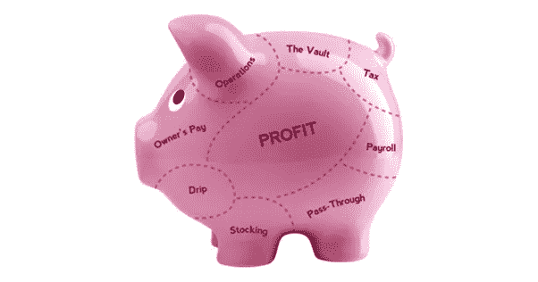

# 如何从今天开始盈利

> 原文：<https://medium.com/swlh/how-to-start-making-profit-today-a00f3454ce5d>

## 一个简单却被低估的策略

我们被教导利润是最后从商业中产生的东西。

见鬼，它甚至被称为底线。

我们都知道的等式是…

**收入—费用=利润**

因此，对于企业家来说(尤其是在他们公司的早期阶段)，利润就是剩下的东西。

当我们没有达到我们想要的盈利能力时，我们会找借口合理化，比如“*我们在* *对公司*”进行再投资…

今年，有人告诉我一本名为《利润第一》的书，作者是迈克·米哈洛维奇，这本书彻底改变了我对公司利润的看法。

总之，它改变了我的心态，从…

**收入—费用=利润**

至…

**收入—利润=费用**

这种变化如此简单，很容易被认为是微不足道的。但这与事实相去甚远。

让我们深入了解利润第一系统，以及如何将它用于您的业务。

# **工作原理**

## **第一步:创建 5 个银行账户**

这 5 个银行账户如下:

*   收入
*   利润
*   营业费用
*   业主补偿
*   税

所有现金收入将流入您的收入银行账户。你将每月两次把所有的钱从收入账户转到另外 4 个银行账户。以下是确定多少的方法。

## **第二步:确定你的目标分配百分比(TAPs)**

为四个帐户(利润、营业费用、所有者报酬和税收)中的每一个创建 tap。它们是分配到每个账户的收入百分比。

本页的即时评估可以帮助你确定这些([http://www.mikemichalowicz.com/r...](http://www.mikemichalowicz.com/resources/))

## **第三步:根据你的点击量将收入转入你的账户**

每月两次，根据你的点击量，你将从收入银行账户转账到另外四个账户。

例如，假设您将所有收入的 5%分配到您的利润帐户。你的收入账户里有 2 万美元。你要把 1000 美元转到你的利润账户。

# **好处**

## **帕金森定律应用于金融**

工作扩大以填补完成工作的时间。

这就是帕金森定律。

我们总是看到它被用于完成事情。

例如，如果你有两周时间来完成一个项目，那么它需要两周时间来完成。或者，如果你有 24 小时来完成一个大项目，你会惊奇地发现你总能完成它。

同样的心理学原理也适用于金融。

如果我们的银行账户里有 10 万美元，我们会比有 5000 美元时更加节俭。

通过从你的主要经营账户中提取利润，你给自己的支出现金变少了——迫使你更有意识地花钱。

## **每季度获得分红**

每年，我们都会给股权合伙人分红，但我们从来都不确定具体会有多少。利润第一让认识变得极其简单。

方法是每个季度支付一次分配。分配金额是利润账户余额的 50%。

我喜欢登录我的网上银行账户，看着钱在我的利润账户里累积。通过一些简单的数学计算，我就能准确地知道我将得到多少钱的分配。

## **知道在哪里优先考虑**

大多数会计师会用权责发生制来管理你的账簿。有很多理由说明这是一种很好的记账方式，但是它并不能给你银行中实际现金的准确表示。

没有银行实际现金的准确表示会使你更难区分业务工作的优先次序。

例如…你的运营费用、银行账户和即将到来的工资中的钱越来越少？这是一个非常明确的信号，你应该优先考虑获得一些现金来支付它。

—

归根结底，这是关于改变你对利润的心态。开始思考如何围绕你想要的盈利数字建立你的业务，你将建立一个更好的业务，今天就盈利。

## 这篇文章发表在[《创业](https://medium.com/swlh)》上，这是 Medium 最大的创业刊物，有+ 374，357 人关注。

## 在这里订阅接收[我们的头条新闻](http://growthsupply.com/the-startup-newsletter/)。

