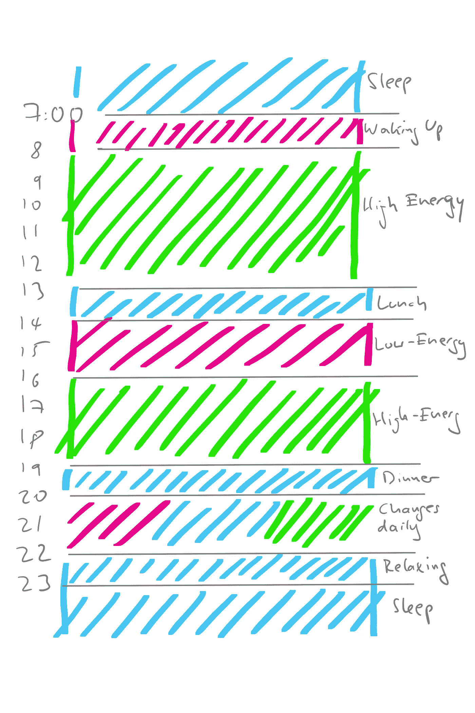

# 如何开始管理你的精力水平而不是时间

> 原文：<https://medium.com/swlh/how-to-start-managing-your-energy-levels-instead-of-your-time-f1f6b4c05534>

Photo by [Shane Rounce](https://unsplash.com/@shanerounce?utm_source=medium&utm_medium=referral) on [Unsplash](https://unsplash.com?utm_source=medium&utm_medium=referral)

## 你有多少精力应该决定你做什么

我们大多数人都遵循着稳定的日常节奏:早上 6 点到 8 点起床，朝九晚五工作，晚上呆在家里。在学校，情况类似:学校从早上开始，到午餐或下午结束。大多数营业时间都符合这种模式(至少在西方国家是这样)。即使是我们可以在一天中的所有时间几乎没有延迟地进行全球通信这一事实也没有改变多少。仔细一看，这个固有的问题就显现出来了。我们被期望在某些时候保持警觉、清醒和高效。

> 我们在管理我们的时间，假设我们一整天都一样有效率——即使我们知道我们没有。

**相反，你应该开始观察自己一整天的能量水平，并相应地改变时间表、会议和工作。**

如果我们知道什么时候我们的能量水平高(以及我们如何才能达到这些水平)，我们就可以更好地计划，将需要创造性能量或决策的任务放在那些“高时间”，同时将需要常规的工作转移到能量较低的领域。

这包括三个步骤:第一步，确定你目前的能量水平，第二步，相应地计划你的一天，第三步，平衡能量水平，根据我们的愿望改变它们。

## 1.观察能量水平

你会注意到在一天中的某些时候，你会觉得充满了想法，准备出发，充满了能量。**在这个高能量的时代，做创造性的工作、做决定和看到更大的图景都很容易。**

对你来说，这些高能量的时间是在早上，还是在深夜都没关系。“早起把事情做完”似乎很时髦，但这确实是个人选择的问题。如果你精力充沛地工作到很晚，结果睡得很晚，你最终会得到同样的结果。

还有一些低能量的时候，你会觉得脑袋里充满了木屑，思维缓慢而低沉。对我们中的一些人来说，这些状态出现在早上(可能在喝咖啡之前)，通常在午饭后。在那些时候，*我们不想思考*，所以我们冲浪，在智能手机上玩游戏，盯着作品看，就像它是古埃及作品一样(或者，如果你碰巧是一名考古学家，就像它是量子力学)。在那些时候，强迫积极参与工作是没什么用的。

**最后，我们有时需要放松，实际上什么也不做，把能量放回你的身体。重要的是我们也尊重这些时间，给我们足够的时间来再生和恢复活力。**

你可以写日记或日历来记录你的能量水平，简单地标记一天中你能量较高、较低和放松的时间。当然，您也可以添加额外的级别和状态，但是为了简单起见，我将它保持在三个级别。

这可能是我一天的样子，但我给自己自由去观察和相应地回应:

## 2.根据能量水平制定计划

在你观察了一段时间你的能量后，你可以相应地计划。如果你大概知道什么时候你能达到一定的能量水平，把你的任务放在这些时间里。

**对于高能级:**创造性工作(提出新颖的想法)、创造性团队讨论、做出困难或高风险的决定、中长期规划、积极学习新内容、进行演示和推介、思考和反思、试验和尝试新事物、写待办事项清单。

**对于低能量水平:**日常工作，维护和清洁，完成有明确目标和过程的任务，写信件和电子邮件，回顾你所学，写发票。

**放松级别:**吃饭、睡觉、运动、户外活动、冥想、社交、游戏、购物、电影等。

## 3.优化你的能量水平

当你开始把任务放到适当的能量水平时，你应该会看到实际工作产出的增加。

> 在高能量水平下进行 30 分钟的创造性工作，与你在低能量水平下用 2 小时做同样的工作一样有效。

在高能量时期*要做的一件重要事情是为低能量时期*计划任务。这就是为什么我把“写待办事项清单”放在高能量时间:当你有一个概览时，计划就容易得多。实际的繁重工作可以在精力较低的时候完成——前提是这些任务本身不需要太多的精神能量。

开启高能量时代有很多策略，有些建议早起，有些从运动、某种饮食或另一种仪式开始。你可以尝试这些方法中的任何一种，使用适合你生活方式的方法。

有迹象表明，你在放松时做什么决定了你开始高能量水平的难易程度。运动、睡眠、健康饮食和冥想似乎有助于触发和延长你的高能量时间。

如果你觉得你的高能量时间很短，很累，那就看看你的食物摄入量吧。高能量的工作需要大量的精神能量，最终是身体能量。寻找蛋白质和缓慢释放的碳水化合物，它们将提供长期的营养，而不是短期的爆发，就像来自简单糖的那些。

另一个重要因素是审视你的习惯，并在必要时改变它们。一个例子是:通勤通常被视为“死亡时间”，但事实上可能是做高能量工作的黄金机会。如果你在车里，你有思考的空间，可以用语音听写把想法记下来。在火车上，时间可以用来阅读和学习——取决于你的感受。

> 如果你发现自己无论如何都醒得很早，满脑子都是想法，那就起来利用那股高能，哪怕只持续 20 分钟！

**在你精力充沛的时候，排除干扰，尤其是电子邮件和非语言交流。**如果你在精力充沛的时候做某件事，给自己时间完全沉浸其中，专注于这项特殊的任务。像电子邮件、信息和琐碎的任务这样的外部输入会争夺你的注意力，但在能量较低的时候它们很容易得到回应。[我写了另一篇文章，内容是通过与他人的想法保持距离，在早上进入一种高能量状态。](/swlh/here-is-a-method-that-is-helping-creatives-to-start-the-day-off-right-184ead5ca301)

好好利用你的放松时间。他们可能能够快速补充能量:清淡的午餐和 15 分钟的冥想可能会让你回到精力充沛的状态，而丰盛的午餐和滚动脸书半个小时可能会让你昏昏欲睡，毫无灵感。

> 花心思在娱乐活动上，你可以更积极地放松。这些可能包括冥想、有意识地烹饪和饮食、关注运动和你的身体、在平静的音乐中洗澡或进行户外活动。

**被动放松更耗费脑力，看电视或滚动社交信息，漫无目的地冲浪，吃饭只是为了填饱肚子。你休息时间的质量很可能会影响你工作时间的质量！**

但是正如我上面提到的，你必须找到最适合你的，没有适合每个人的黄金方案。

> 总结一下:注意你的能量水平，并据此计划你的一天。

**它会帮助你在更短的时间内达到更好的效果。你可以尝试不同的习惯来触发和保持更高的能量状态，但最重要的是在这个过程中倾听你自己。**

*感谢阅读！让我知道你每天的能量水平如何！*

## 这个故事发表在 [The Startup](https://medium.com/swlh) 上，这是 Medium 最大的企业家出版物，拥有 296，127+人。

## 在这里订阅接收[我们的头条新闻](http://growthsupply.com/the-startup-newsletter/)。

