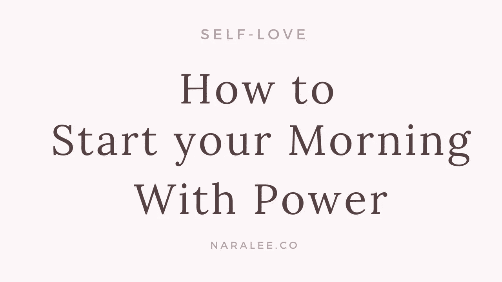
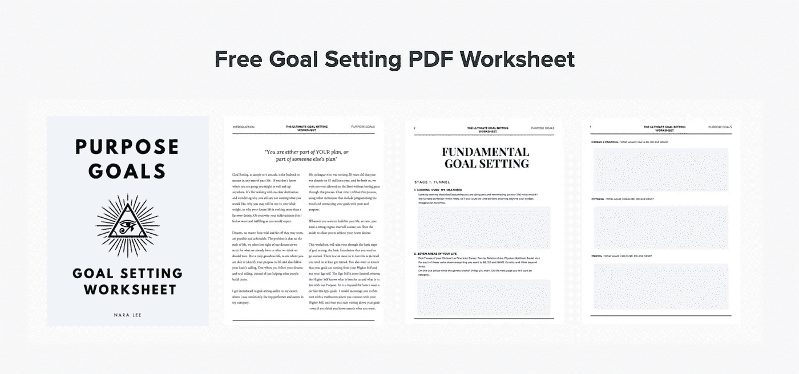

# 如何用电力开始你的一天

> 原文：<https://medium.com/swlh/how-to-start-your-morning-with-power-5f1963200500>

> 每天早上从唤醒你内心的力量开始。当你增加心中爱的层次，你的整个生活都会改变。
> 
> —奈良·李

早晨，不仅是全新一天的开始，也是全新生活、全新未来的开始。如果我们能把自己锚定在当下，并记住过去不再存在，未来也不存在，这意味着我们所拥有的只是我们醒来的那一天。

但是大多数早晨会发生什么呢？你每天早上是做那些能滋养你的灵魂、让你微笑、给你能量的事情，还是因为你想到了未来而匆忙开始你的早晨？或者你做了相反的事情，几乎不能从羽绒被里出来？当你起床的时候，你会做什么？

我学到了一个重要的技巧，现在我虔诚地遵循它:那就是在我处理*和其他事情之前，先处理好*。这一点很重要，因为无论我们做什么工作，无论我们遇到谁，与谁互动，甚至我们在生活中做出的任何决定，都是从我们开始的。无论我们去哪里，或者我们做什么，我们都是共同的分母。因此，我们只有从自己开始早晨才有意义，然后我们才能从一个给予和分享的中心出现在这个世界上，从一个充满满足和爱的地方出现，而不是出现，寻求通过任何外部事物来完成和满足。**

# ***那么，你应该如何开始充满活力的一天呢？***

# *1.早上的第一件事就是调整你的心态*

*当你开始新的一天时，你必须首先授权给自己。给自己力量，意味着用积极的信息充实你的头脑，本质上是为成功重新编程。*

*我们的外部世界是我们内心世界的反映。就像放映机一样，如果你想在屏幕上看一部不同的电影，你不会走到屏幕前改变它。你先换带子。然后你会看一部不同的电影。*

*我们的生活也是如此——我们必须首先改变我们告诉自己、关于自己的信息，这样我们才能永远记住我们是谁，并从力量和权力的角度采取行动。这就是为什么[肯定](https://awakeningyourgoddess.teachable.com/p/self-love-affirmations)如此强大的原因，因为当你几乎不能起床时，有了正确的肯定，你就会找到力量。如果你感觉非常正常，并且只是去说一份销售工作，你的自信心越强，你的自我对话越积极，你就能做更多的销售。这实际上已经被研究、测试和证明了。*

*一切从我们的头脑开始。强化你的思想，强化你的生活。*

# *2.理清你的思绪*

*你的大脑就像一台 24 小时不间断工作的机器。它就是不停止。这就是为什么，当你最终决定坐在冥想枕头上时，一开始会很难，因为几乎对每个人来说，思想都在控制之中。我们只有在真正坐下来冥想的那一天才会意识到这一点，我们发现让头脑安静下来是非常具有挑战性的。*

*为什么“理清思路”很重要？因为我们有“两个自我”——我们有带来更高指导的更高自我，我们有大多数时候与更高自我断开的“人格自我”。人格自我基于它所能看到的有限的 3D 现实做出“明智的”决定。高我对你的整个生活有更广阔的视野。因此，当你听从你断开的人格自我时，它会把你引入歧途。因为它脱离了真正的能量来源。所以我们想要的，是从我们更高的自我开始运作。为了做到这一点，我们必须静下心来，这样我们才能接收和听到我们所有人都可以得到的更高的指导。*

*整理思绪的一个好方法就是写作。你可以在床头柜上放一本日记和一支笔，当你一醒来，你就写下你的想法。当你完成时，你会以清晰和更多的能量开始新的一天，而不是以混乱的大脑开始新的一天。*

# *3.承诺在早上 9 点前做一件让你有灵感的事情。*

*我认识的每个人都有目标和梦想。他们也有一个清单，上面列有他们热爱、想做但却从来没有时间去做的事情。*

*我想挑战你每天只做一件真正发自内心激励你的事情。滋养你灵魂的东西。不要等到一天结束，从这件事开始你的一天。*

*为什么？因为你的快乐水平会直线上升。你会更加享受你的一天，你甚至不会期待一天的结束，因为你已经开始了你的一天，首先喂养最重要的人:你。*

# *4.参加某种形式的体育锻炼——除了你自己的内在工作*

*下坡路，一天一天开始。而上山的路也是一天一天开始的。锻炼不仅有益于你美丽的身体，还能增强你的心智。运动增加了血清素的产生，血清素是大脑中发现的一种重要的神经递质，与健康和心理健康有关，它可以通过提高你的能量和幸福水平来充当天然的抗抑郁剂。*

# *5.写下并回顾你的目标*

*每天回顾你的目标，确保你在正确的轨道上，并且你真的在朝着与你的目标一致的方向前进。当我们做不到这一点时，我们每天都在努力——一次一个，然后几周，然后几个月，追寻甚至不属于我们的梦想和目标。如果你还没有一个目标设定系统，如果你想创造并过上真正满足自己的生活，那么拥有一个目标设定系统是至关重要的。*

***下载免费的目标设定计划工具***

*[https://purpose goals . teachable . com/p/goal-setting-planner-worksheet/](https://purposegoals.teachable.com/p/goal-setting-planner-worksheet/)*

**

*[https://purposegoals.teachable.com/p/goal-setting-planner-worksheet/](https://purposegoals.teachable.com/p/goal-setting-planner-worksheet/)*

# *6.用爱开始你的早晨*

*最后，同样重要的是，用爱开始你的早晨。激活并增加你内心的爱，以及对自己的爱。从这个自爱的地方，与你一天中遇到的其他人分享你的幸福、快乐和爱。万一你醒来时脾气暴躁，立即想一些你能欣赏、喜爱和感激的事情，然后继续想象更多你喜爱和欣赏的快乐和美好的事情。爱情是一种练习，我们必须有意识地锻炼，就像锻炼肌肉一样。我们会认为这很“正常”——的确如此，但生活在地球上，人们、环境和事件会很快让我们偏离中心，因此每天都必须培养自己的内在力量。*

# *晨练的参考资料和工具*

*免费[目标设定策划师](https://purposegoals.teachable.com/p/goal-setting-planner-worksheet)*

*[自爱](https://awakeningyourgoddess.teachable.com)自我肯定*

*[自我接纳](https://awakeningyourgoddess.teachable.com/p/self-acceptance-affirmations)自我肯定*

# ***关于作者***

**

*[Nara Lee](http://www.naralee.co) | [Facebook](https://www.facebook.com/naralee.co/) | [Instagram](https://www.instagram.com/naralee.co/)| [LinkedIn](https://www.linkedin.com/in/naramlee/)|*

*奈良·李是一位精神导师、社会企业家和艺术家。她通过她的通灵信息、书籍和课程，帮助人们觉醒到他们的生活目标和他们真正真实的自我，以达到有目的的成功。她的精神教导是实用的和可操作的，消除了许多模糊性，使生活中许多重要的主题变得清晰。*

*此前，奈良曾担任一家国际房地产公司的首席执行官和董事总经理，之前是高纬物业的经理。她在国际豪华房地产和旅游专业领域拥有超过 12 年的经验，代表各种国际房地产开发商和基金管理的项目通常从 2 亿到 10 亿以上。奈良毕业于商业管理(旅游)和性别与女性研究和社会转型专业。*

# ***连接奈良李:***

*www.naralee.co*

*我:[https://www.instagram.com/naralee.co/](https://www.instagram.com/naralee.co/)*

*女:https://www.facebook.com/naralee.co/*

*https://twitter.com/naralee_*

*https://www.linkedin.com/in/naramlee/*

**

## *这篇文章发表在[《创业](https://medium.com/swlh)》上，这是 Medium 最大的创业刊物，有 281，454+人关注。*

## *在这里订阅接收[我们的头条新闻](http://growthsupply.com/the-startup-newsletter/)。*

**