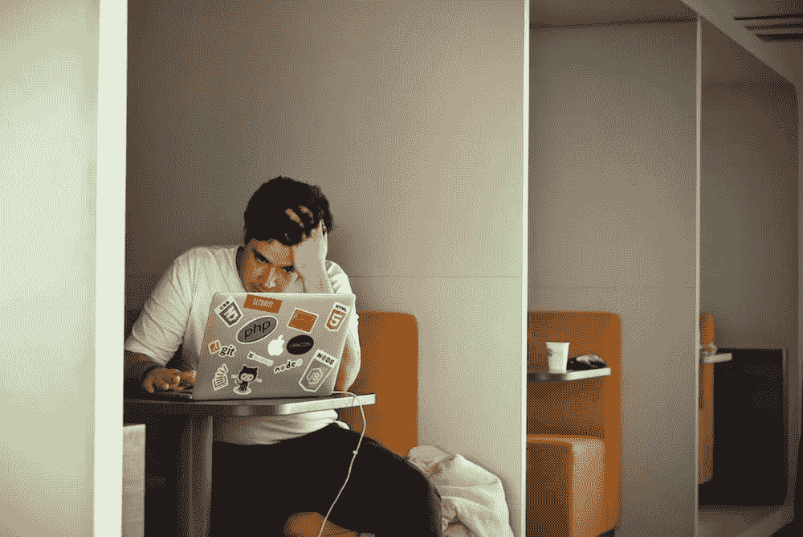
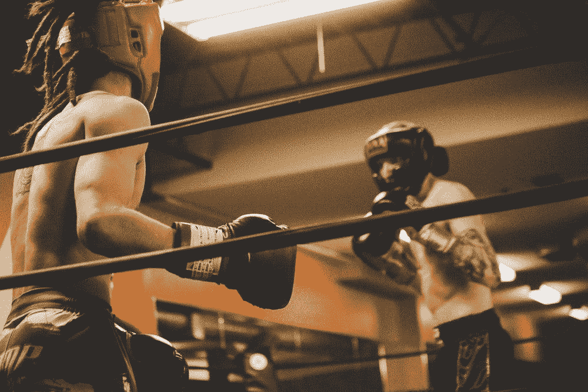
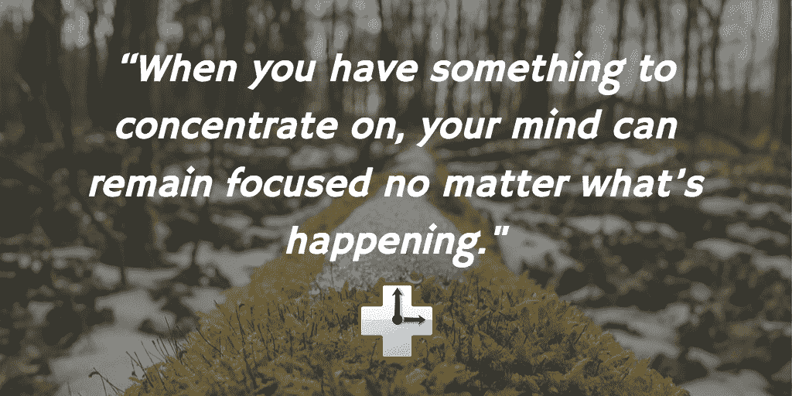

# 如何在工作让你紧张时保持冷静(根据拆弹专家的说法)

> 原文：<https://medium.com/swlh/how-to-stay-calm-when-work-is-stressing-you-out-according-to-bomb-disposal-experts-93dfaee49965>

## 实话实说吧，你的生命没有危险。但感觉确实如此。

假设你要在工作中做一个演示。你花了几周时间整理研究。在任何愿意听的人身上练习。早做准备，确保一切准备就绪。

你发射进入你的谈话然后**T3 嘭！** 突然，你的老板打了你一拳*“我觉得这不太对劲……”*

突然，你的心开始怦怦直跳。你的手掌变得光滑，你感觉你的脸变热变红。你想的最后一件事就是保持冷静。

如果你没有经历过这种情况，我保证你也经历过类似的情况。正如迈克·泰森的名言，

> “每个人都有自己的计划，直到他们被打脸。”

但是我们能做什么呢？

为了在工作中真正富有成效，我们需要学会控制自己的情绪，处理意外的压力。还有什么比从世界上压力最大的职业中学习更好的地方呢？

以下是我们从拆弹专家那里找到的关于如何在工作中保持冷静的最佳建议。

# 通向压力炸弹的时刻:准备和练习

这听起来可能难以置信，但一项又一项研究表明，当拆弹专家面对一件可能结束他们生命的设备时，他们的心率实际上会下降。

当你的生活岌岌可危时，就没有被压力压垮的余地了。在紧张的情况下，我们大多数人都会渴望那种禅宗般的平静。那么他们是怎么做到的呢？

在英国军队中有 5 年拆弹经验的老兵安迪·托贝特解释说，控制你的压力反应归结于对你所获得的技能和工具充满信心:

> “努力和压力应该在这一点之前，在花了几个月的时间来做好这项工作，在花了几周的时间准备这次手术，在最后几分钟整理计划。”

当然，这并不意味着你不能被意想不到的问题吓到。

然而，Torbet 说，应该尽可能提前处理这些问题，考虑每一种负面情况，并为每一种情况制定应急计划。在军队中，他们称之为**威胁评估:**预先识别和理解可能威胁你成功的因素，并加以应对。

> “如果我呼吸气体的主要来源在深潜到 50 英尺时失败了，但我有完美的备用系统在手，可以安全地跳伞，那是千钧一发吗？
> 
> “我会说没有。我已经发现了潜在的风险，并在它发生之前就建立了一个系统来处理它，所以当它发生时，它看起来就像是计划的一部分。”

在你的[工作环境](https://blog.rescuetime.com/work-environment/)，这意味着从局外人的角度看待你的项目或决定。他们可能在哪里戳洞？你能事先发现这些问题并准备好谈论它们吗？

# 前 15 秒:面对意外压力如何保持冷静

现在，正如我们之前所说的，尽管你投入了所有的时间去练习和训练，意想不到的问题仍然会出现。当这种情况发生时，托贝特说，你需要首先认识到并接受你正处于精神压力状态。

我们的身体对压力的反应和我们对身体危险的反应一样。因此，你可能会感到手心出汗，心率加快，甚至因肾上腺素而变得有些紧张。

这是好事。你越快发现压力的迹象，你就能越快让自己进入正确的心态，以平静和镇定的方式应对压力。

Torbet 建议花点时间让自己脱离这种情况，直到你的压力反应得到控制。在工作中，这可能意味着停下来做几个深呼吸，从即时消息或电子邮件的对话中离开，或者在你整理思绪的时候要求休息一会儿。

# 一旦压力炸弹爆炸，该怎么办:保持冷静，做出正确的决定

如果你走不开，你必须处理现场的紧张局势，你还可以从拆弹专家那里借用一些练习来帮助你保持冷静。

当作家埃里克·巴克采访一名海军 EOD(爆炸物处理)小组组长(出于安全原因，他要求匿名)时，他提供了处理极端压力时刻的三步计划。

# 第一步:避开“兔子洞”

当你面临一个充满压力的局面，必须做出选择时，很容易陷入“如果……会怎样”的游戏。你感到恐慌，你的大脑开始运行每一个可能的场景。

虽然这看起来是解决问题的好方法，但实际上它会把你带得更远。

EOD 称之为“兔子洞”，并教导说，要走出这个洞，你需要阻止你的思想失控:

> “想一想你以前经历过的类似情况，就像现在这样。你是怎么解决的？什么奏效了？也许你从未经历过和现在一模一样的情况，但没关系。概括一下。你可能处理过类似的事情，或者你见过别人这样做。”

如果你已经在你的工作岗位上工作了一段时间，你肯定不得不为你过去的选择辩护或证明自己是正确的。不要让你的大脑失控。相反，回想那些时刻，看看你如何将你学到的东西应用到你现在的处境中。

# 第二步:强调积极的一面，关注你能控制的事情

一旦你停止了兔子洞螺旋，你需要专注于你能*实际上*控制的东西。这比听起来要难。我们的大脑天生会寻找威胁，这意味着我们太容易关注负面而不是正面。

巴克的《EOD》讲述了他自己的上级军官的故事，他发现自己在试图拆除水下的地雷时被卡住了，手脚都不能动了。

然而，他没有对他*不能*做的事情感到恐慌，而是选择关注积极的方面:

> *“如果你能摆动你的手指，缠绕在你身上的线，或者无论你处于什么情况，如果你能做一件小事让它变得更好，那么就去做吧。如果你能做一件事又一件事，那么你就能拥有级联式的积极情绪，而不是螺旋式上升的消极情绪。”*

不要因为一个问题或负面反馈而感到被攻击或措手不及，而是关注你能控制的事情。不能指望你总是知道所有的事情。所以不要抱有这种期望，从你所知道的开始，从那里开始。

# 第三步:做出选择，知道你的下一步

既然你已经掌握了主动权并保持乐观，最后一步就是做出选择。神经科学家发现，做决定实际上可以减少担忧和焦虑，甚至可以改变你对世界的看法。这正是 EOD 的解释:

> 当你有事情要集中注意力时，无论发生什么事情，你的头脑都能保持专注。如果你坐在那里，不知道该做什么，那真的很可怕。但当你心中有了下一步，那才是你关注的重点。”

但是如果你不知道该做什么选择，你会怎么做？

如果你完全迷路了，是时候回到第二步了。但是这一次，倾听你脑海中闪过的想法，然后问每一个人:“这有帮助吗？”

慢慢地，你会剔除那些只会让你偏离轨道的干扰。

> 然后，突然间，你回到了理性的思考中，远离了任何自私的恐惧

当我们有事情可以集中注意力时，我们的大脑工作得更好。所以，把你的思维从“发生了什么？”到“我们下一步去哪里？”

# 跟进并坚持你的选择

到目前为止，你干得不错，但还没有完全脱离危险。当你被迫做出选择时，很容易质疑自己。但是，每个拆弹专家都同意的是，你必须避免可怕的“如果”

“如果呢？”问题会加剧恐惧，让你失去积极的心态。如果你似乎无法摆脱他们，那么[打电话给你信任的朋友或导师寻求支持是个好主意](https://www.entrepreneur.com/article/237694)。

这不仅有助于你脚踏实地，而且对这种情况没有感情投入的人也能从不同的角度看待困境。你甚至可能从大声谈论这个问题中产生新的想法。

在工作和生活中，紧张的情况随时都可能出现。但我们不必被他们蒙蔽。正如英国作家[詹姆斯·艾伦](https://www.brainyquote.com/quotes/james_allen_148461)所解释的:

> 一个人变得越平静，他的成功、影响力和向善的力量就越大。头脑冷静是智慧的美丽宝石之一。”

保持冷静。虽然你的选择可能不是生与死，但你可以从那些每天面临生命威胁的人身上学到很多东西。如果他们能做到，我相信你也能。

# 嗨，我是乔里！

我帮助公司和有趣的人通过巧妙而专注的写作讲述他们的故事。想一起工作吗？在 hello@jorymackay.com 给我发邮件

*这篇文章的一个版本最初发表在* [*改版博客*](https://blog.rescuetime.com/stay-calm-strategies/) *上。查看更多关于生产力、专注和动力的文章。*

## 这个故事发表在 [The Startup](https://medium.com/swlh) 上，这是 Medium 最大的企业家出版物，拥有 294，522+人。

## 在这里订阅接收[我们的头条新闻](http://growthsupply.com/the-startup-newsletter/)。

