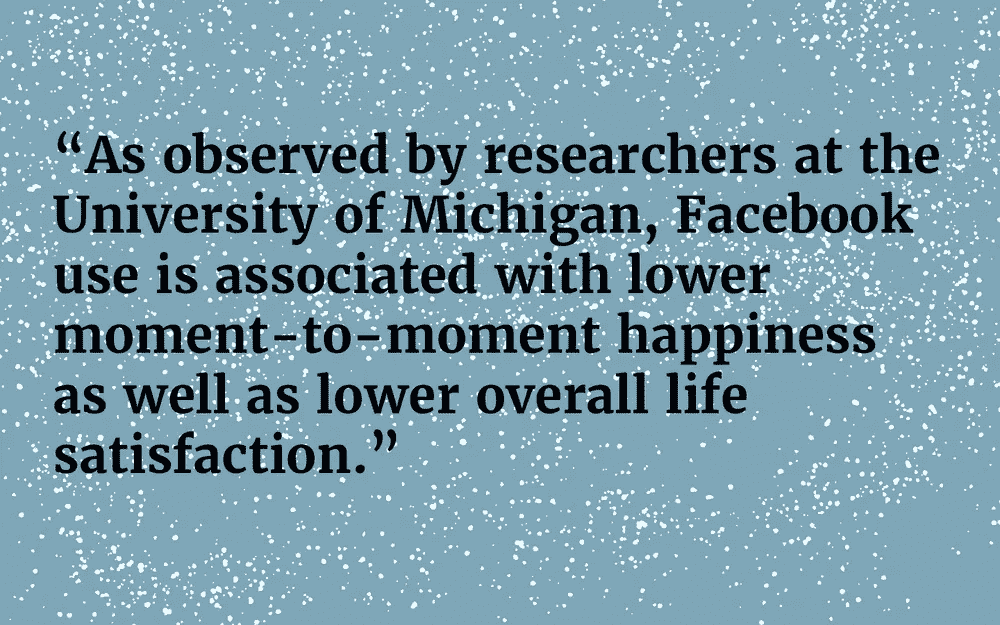

# 在家工作时如何保持高效

> 原文：<https://medium.com/swlh/how-to-stay-productive-when-you-work-from-home-bd75e65ce6d5>

作为一名自由职业者，后来又成为全职远程员工，我的职业生涯有一半时间是在办公楼外度过的，但不一定是在家工作。只要我有笔记本电脑和互联网连接，我就和任何在隔间农场、开放的办公空间或公司生产力舱工作的人一样高效。我想这是事实，对吧？

在家人、宠物和微波炉听得见的地方工作并不容易。当我开始远程办公时，我积极训练自己的自律、注意力和职业道德。我并不总是成功，但最终我学会了如何在同一个空间里平衡我的个人生活和职业生活。

以下是我学到的 10 条经验，它们让我在家工作时更有效率:

# 1.理解“在家工作”可能意味着很多事情

作为一名远程员工，我在舒适的家中完成了大部分项目，但我也发现自己在一些非常陌生的地方工作。在我作为“WFH”员工的三年里，我与以下公司开展业务:

*   我童年的卧室。
*   我妻子小时候的卧室。
*   一辆车，在目标停车场。
*   一辆汽车，在去洛杉矶的路上被堵在早晨的交通中。
*   全国几十家咖啡店。
*   机场休息室——不是那些花哨的。

作为一名远程工作者或自由职业者，没有人真正知道你在哪里，或者你穿什么，或者你在高速公路上开得有多快。这在很多方面都是一种优势，但是这种情况很容易被滥用。你有责任知道何时何地你工作得最好，并在必要的时候与你的经理沟通。在一个典型的日子里，那是在我的书桌上，在家里，离冰箱几步之遥。

# 2.制定一个对你(和你的老板)都有效的时间表

我喜欢在早上 9 点或更早开始我的一天。如果我早点开始工作，我就能在下午 5 点前完成——甚至更早！我选择了一个模仿典型工作日的时间表，因为它对我有用。在夜幕的掩护下，当世界变得更安静时，你可能会工作得更好。我认识的许多有创造力的人在白天很难被激励。

自 20 世纪 70 年代以来，人们一直在研究夜猫子和早起的鸟儿之间的差异，当时瑞典职业健康部的研究人员在一组自我评估的内向和外向者中发现了不同的精力和警觉水平。2016 年，利用 23andMe 收集的 DNA 数据进行的研究证实了这些发现，显示了猫头鹰和云雀之间的[明显的遗传差异](https://blog.23andme.com/23andme-research/rise-and-shine/)。所以，如果你在凌晨时分没有精力充沛，你也不应该感觉不好——夜间活动可能是你的基因。

如果你是一名自由职业者，你可能对自己的日程安排有更大的控制权。除了客户会议，你应该能够找到一个适合你其他职责的时间表，并且不会打乱你的生理节奏。

作为一名远程工作人员，我需要在特定时间上网，与遍布全国的同事一起参加会议。当我登录时，我在东海岸的同事正在去吃午饭，但是我在夏威夷的队友可能刚刚起床。这使得安排会议变得很困难，但是使用正确的技术，也不是不可能。

一旦你确定了你的理想时间表——并和你的经理确认了它的可行性——你就需要尽可能严格地遵守它。这应该成为习惯，否则你会遇到像睡过头这样的问题。季节变化会使这变得困难。我住在太平洋西北部，一年到头都经历着日照的剧烈变化。夏天，太阳要到晚上 10 点才下山。冬天，下午 5 点天就黑了。在这些轮班期间，我的身体很难适应。我制定策略来减轻这种负担。在冬天，这意味着我一脚着地就打开窗户喝咖啡。在夏天，这意味着设置一个提醒，开始放松一天，即使天空仍然明亮。保持有规律的锻炼也有帮助。

不可避免地，你会打乱你的时间表。它发生在最善意的远程工作人员身上。不要为此责备自己。最好的办法就是尽快按计划恢复。在大多数情况下，只要你在完成工作，你的老板就不会注意或在意。毕竟，如果有人担心你管理时间的能力，他或她不会让你在家工作。

# 3.在下班时间结束一天

设定一个固定的时间来结束每一天的工作。记住这一小时，以免工作时分心。如果没有预先确定的结束时间，用 grow 完成工作所需的时间，就像一种有毒气体充满了一个罐子。时间限制使工作受到限制。如果有帮助的话，使用一个计时器应用程序来记录你在任务上花了多长时间。

工作不是你一天中唯一要做的事情。你需要记住这个事实，尤其是当你发现你的工作量越来越大的时候。当然，偶尔的项目可能需要额外的时间，但是如果你发现自己每天在工作上花费的时间持续超过八个小时，那就向你的老板提出来。如果你认为工作比一天中的时间要多，那就有问题了。

当你工作到深夜的时候，第二天早上你就不会精神焕发了。你对自己没有任何好处。没有人能看到你付出的额外努力，而且，说实话，很少有人真的在乎。如果你经常加班，你的同事和经理可能会预料到你的这种行为。尊重你的时间，别人也会跟着做。为了保持精神健康，你的大脑需要休息。

# 4.在完成的任务之间休息一下

休息对你的大脑有益。事实上，在你从事某项活动和无所事事之间，大脑活动几乎没有减缓。当你为一个即将到来的会议感到焦虑，或者在交通中为一个十英里前让你插队的家伙感到愤怒时，你大脑的某些区域会变亮——这被称为默认模式网络。

练习正念——以非判断的方式意识到你的想法的行为——可以训练你的 DMN 以不同的方式行动。哈佛大学的研究人员发现，有规律的正念练习实际上可以在物理层面上改变你的大脑。正念练习者体验到与压力和焦虑相关的大脑区域的灰质减少，同时体验到与冷静和自我控制相关的灰质增厚。此外，耶鲁大学的研究人员发现，练习正念[的人在冥想时和不冥想时都有较不活跃的 DMN](https://www.ncbi.nlm.nih.gov/pmc/articles/PMC4529365/) 。

为了有效地工作，你需要在你的时间表中加入休息时间。你不能假设你会记得休息，因为不可避免的，工作会接管，你会错过宝贵的休息时间。以我的经验来看，设定确切的休息时间是无效的，因为我的日程安排并不是一成不变的。相反，我像对待其他任务一样对待休息。我列出一天的责任，然后在适当的地方加上休息时间。例如，如果我必须写一篇长白皮书和两篇短文，我可能会在早上喝咖啡时处理第一篇文章，休息一下，完成第二篇文章，然后在午饭后继续写白皮书。

在外面吃午饭应该限制在一个月几次。我更喜欢在家吃饭，因为这样省钱，更健康，也更方便。然而，如果你不计划你的午餐，你最终会花很多时间做饭——这不利于一个富有成效的工作日。同样，中午吃太多会消耗你的能量。

计划是做出健康饮食选择的有效方法，它不会占用你一天中的太多时间。我计划一周内的所有膳食，这确保我最大限度地利用我的食物预算。我喜欢为一周计划两到三顿专门的午餐，然后计划在其他日子吃晚餐的剩菜。

家务活对打破你的工作日程很有帮助。例如，你可以放入一堆要洗的衣服，用它作为你下一个任务的计时器。在蜂鸣器响起之前告诉自己你将完成一项任务，这将阻止你的思想开小差。

你可以在白天跑腿——只要你完成工作，不错过会议。如果你是自由职业者，按小时计费，记得准确记录你不工作的时间。最终，你会掌控自己的时间表。我喜欢能够在中午跑到邮局，以避免排长队。医生的预约也是如此。你在家工作得越多，你就能更好地判断你一天能适应多少。

我把手机带在身上，这样我就可以回复聊天和电话，但当我不在电脑上时，我不会查看电子邮件。在我看来，电子邮件不值得立即回复。每当我注意到有同事给我发邮件希望我尽快回复时，我都会告诉他或她，如果他们在 Google Hangouts 或 slack 上给我发消息，我会得到更快的回复。

# 6.防患于未然

你的朋友和家人不会理解你的时间表。他们不会理解你什么时候以及为什么需要优先考虑工作。这听起来可能有点愤世嫉俗，但我遇到的几乎每个人都是如此。这是 WFH 和自由职业者在线社区中常见的话题。

我的建议是:习惯说不，很多次。

朋友和家人会希望你帮他们做家务，跑腿，照看邻居的猫。他们会希望你早点停止工作，或者和他们一起吃一顿长长的午餐。如果你一天的工作量很轻，那么尽一切可能多花一个小时吃午饭。但是你也需要设定硬性的界限。你可能需要重申这一点，直到它变得清晰。当有人让你分心的时候，你需要告诉他们你在工作，你什么时候有空，以及那时你是否能够帮助他们。

我每天都要写一整天，这需要一种别人称之为“超人”、“恶心”或“不可能”的专注程度。我在这里承认，每天都写作是非常困难的。然而，正如许多人在我之前发现的那样，当专注成为你把面包放在桌子上的唯一方式时，不可能的专注壮举变得更容易，甚至是例行公事。

除非有孩子在你耳边尖叫，或者窗外有游行的鼓声，否则你的分心很可能是你自己大脑的产物。我的平面设计师同事可能可以整天听播客，而其他远程工作人员会开着电视作为背景，以分散他们大脑中想要偏离方向的部分的注意力。对我来说，音乐是唯一有用的东西。不是所有的音乐，它必须是轻词重弹吉他。

有一个专用的工作空间会有所帮助。如果你有一个房间或一张桌子，你可以专门用来工作，当你坐下来的时候，你会训练你的大脑专注于工作。创建一个物理边界会在你的头脑中形成一个推论。

我想在这里写下我每天早上起床，洗澡，穿上工作服。许多其他远程专家在网上给出了这样的建议，但我不同意。如果我知道我一天要完成几个大项目，我可能永远不会换下睡衣。为什么不呢？我老婆不管，我也忙得出不了家门。不影响我工作。没有一个编辑在退回我的作品时会说，“很好，但是读起来好像你写这篇文章的时候没有穿裤子。”

需要说明的是，大多数时候我早上第一件事就是洗澡，但我很少穿得像是要去办公室——对我来说，休闲服装是在家工作的主要好处之一。

如果你发现穿睡衣的时候你不能完全醒来，那么你应该在你的时间表中建立一个穿衣程序。如果你发现有扣子的衬衫和领带让你更有效率，那么自豪地穿上它们。找到适合你的方法。显然，如果你需要通过网络摄像头进行会议，你会想穿上一件漂亮的衬衫，梳梳头发——但你仍然可以穿那些篮球短裤。

# 9.远离社交媒体

在我看来，社交媒体是影响你工作效率的最大风险。它在你的日程表上没有位置——它只会占用你的时间，让你感到有压力。我的建议是尽可能避免社交媒体，即使你不工作。据密执安大学的研究人员观察，[脸书的使用与较低的时刻幸福感](https://journals.plos.org/plosone/article?id=10.1371/journal.pone.0069841&mbid=synd_msnhealth)以及较低的整体生活满意度有关。至少，你应该试着等到完成一天的工作后再登录社交媒体网站。

如果你像我一样是新闻迷，同样的警告也适用。在工作日阅读有关政治的文章肯定会让你失去节奏。考虑在午休期间或午休后立即阅读时事新闻。无论如何，午饭后的半个小时通常很难集中注意力，所以这是做一些与工作无关的阅读的理想时间。训练自己在该回去工作的时候停止阅读。这是一种习惯，就像其他事情一样，你可以控制它。

我认为社交媒体成瘾是一个真实的风险，诺丁汉特伦特大学研究人员进行的心理学研究的荟萃分析表明，各行各业的人都报告说对他们的新闻提要感到上瘾。这是一个可能会悄悄逼近你的问题。注意你的习惯，考虑安装一个追踪软件，看看你到底在这些网站上花了多少时间。同样，一个浏览器扩展，如[屏蔽网站](https://chrome.google.com/webstore/detail/block-site-website-blocke/eiimnmioipafcokbfikbljfdeojpcgbh?hl=en)，给你权力来限制特定的域名和子域对你可用。

# 10.在所有在线交流中力求清晰

作为一名远程工作者或自由职业者，你需要注意如何在电子邮件、聊天和电话中展示自己。当你在大厅经过时，你没有机会向同事点头致意，或者在毫无意义的会议上相互看一眼。你需要确保你的沟通总是清晰易懂。

我每天大部分时间都在通过电子邮件与团队成员和客户交流。和所有的写作一样，你应该在点击发送按钮之前校对你的信息。同样，我建议养成习惯，将所有客户沟通抄送给你的经理，这样你的谈话就有了透明的记录。

经过一年的远程工作，我关掉了手机上的电子邮件通知，我的生活得到了极大的改善。从那以后已经两年了，它没有引起任何问题。我发现我会在早上醒来，看到十几封来自东海岸同事的邮件，然后马上进入工作状态。这给了我充足的时间来放松自己。这对我的精神健康不利，对任何人都没有好处。现在，我只在工作时间和电脑上查看邮件。

使用您的假期自动回复。你可能已经期待你的旅行几个月了，但是没有人是这样的。因为你从不在办公室，没人会注意到你不在。确保每个人都知道你在哪里，你会离开工作多久。同样，不要在假期工作。你的家人会反感的。你不会得到任何休息，你也不会得到老板的任何好感。你只是在免费工作。如果你不尊重自己的自由时间，别人凭什么？

在工作周期间，尽你所能与他人交流。我相当自主地工作，我不会每天和我的经理交谈，因为他知道我在完成我的工作。尽管如此，当我可能长时间离线时，我一定会通知他。我把我所有的医生预约都放在一个共享日历上，并在我上飞机前发了一封邮件。这只需要一分钟，并且确保我的老板知道我为什么不回复聊天或电话。

关于语气的最后一点:我知道我有一个矜持的名声，这可能给人以冷漠或冷淡的印象，尽管这不是我的本意。结果，我明白了，这里的表情符号和那里的 gif 可以清楚地表明我正在使用的语气。如今，大多数办公室还没有古板到看不起在内部交流中偶尔使用笑脸的人。由于我工作的专业性，我不会和客户使用 gif 和表情符号。

# 最后的想法

在家工作有起有落。一方面，把你的工作生活和家庭生活分开会变得很困难。你将冒不断工作和从不放松的风险。另一方面，它可以让你自由地过更灵活的生活，有更多的机会按照适合你和你独特目标的时间表工作。

有一天我可能会回到办公室；这当然不是不可能的。作为一名远程员工，我养成的自律和职业道德将帮助我在任何类型的工作环境中取得成功。如果你努力养成健康、高效的习惯，你将能够完成你的职业目标，并保持健康的工作生活平衡。

*原载于 2018 年 10 月 8 日*[*【alexsanto.com】*](https://alexsanto.com/blog/stay-productive-when-working-from-home)*。*