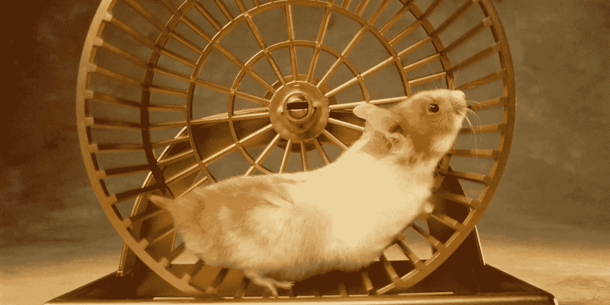

# 如何不再是一只仓鼠&掌控你的生活

> 原文：<https://medium.com/swlh/how-to-stop-being-a-hamster-take-control-of-your-life-cd08929d79a2>

## 这篇文章就是你想的那样。

Courtesy of [HuffPost](https://www.huffingtonpost.com/)

显然你不是仓鼠。

你是一个人。一个智人。直立行走的脊椎动物。我明白了。

但我不明白的是，你的脑袋里怎么会有这么大又漂亮的大脑，但行为却像仓鼠一样。