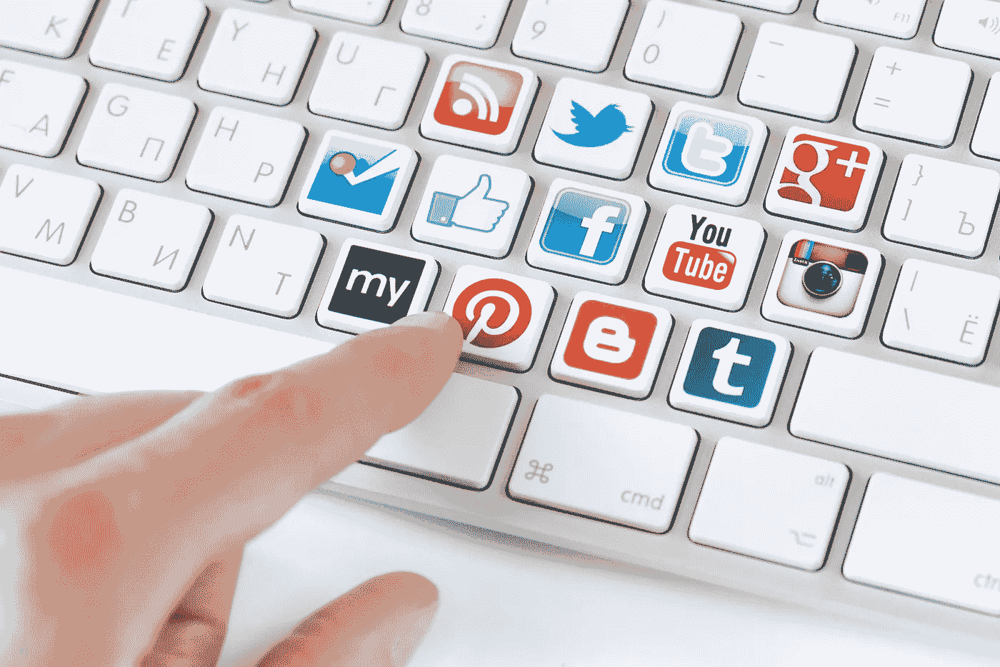

# 如何停止查看你的电子邮件、信息和社交网络

> 原文：<https://medium.com/swlh/how-to-stop-checking-your-email-messengers-and-social-networks-c9ee300398ae>

Source: crocotime.com

如果你正在阅读这篇文章，你可能正遭受着我长期以来忍受的同样的痛苦:一种不断检查你的智能手机、电子邮件、信使、社交网络、公司任务管理器以及其他任何东西的成瘾。

当我说“上瘾”时，我一点也不夸张。我认为这是我们现在面临的一个非常严重的问题。我最近在与这种上瘾的斗争中取得了重大进展，尽管我还没有完全征服它。

我想和你分享我的经历。

## **为什么是坏事？**

首先，让我们弄清楚为什么不停地查看电子邮件、即时通讯工具和社交网络是一件坏事。

**一心多用。**大多数人在做其他事情的同时，会通过即时通讯和电子邮件发送回复。很多文章都写了这样一个事实，即多任务处理与生产力是不相容的，每个人都应该很久以前就明白了这一点。然而，无论如何，我们都一直在试图一心多用。我们告诉自己，对信息的快速回复不算是转换任务。但是试着关掉你的手机，关闭你电脑上所有的应用程序，不要查看你的邮件——你的工作效率会飞速提高。

**被动地生活。**被动和主动方法之间的区别是一个众所周知的话题。当你处于被动状态时，你会对外部因素做出反应，对传入的请求做出响应，并刷新你的脸书订阅源。当你积极主动时，你可以创造、发明一些东西，并致力于长期项目。即时通讯工具和社交网络把我们拖入了一种非常难以摆脱的被动状态。你想:我现在要回答每个人，然后我就能做我一整天都打算要做的重要事情了。但是人们一直给你发信息，而且看不到尽头。

紧急的不重要的事情。另一个大家都很熟悉的概念是，重要的非紧急任务要优先于不重要的紧急事项。当你把注意力放在即时通讯工具上时，你正在做那些不重要的紧急任务。当然，如果你现在不回复某人，几个小时后再回复，什么都不会发生。但是这些小的，不重要的事情占据了你一整天的时间。我知道这是怎么回事。我有几天只是整天回复别人，没有做任何真正重要的事情。我试图在同一时间完成其他事情，但有人总是写东西，让我分心。如果一个人在一分钟内回复了我的聊天信息，或者在几分钟内回复了一封电子邮件，我知道他们现在没有在做任何重要的事情。如果有人一直这样做，我可以断定这个人效率低下。如果他们说他们有太多的工作要做，他们总是在办公室呆到很晚，我认为罪魁祸首是糟糕的时间管理。

## **是什么让我们被这些分散了注意力？**

要解决这个问题，理解它的本质很重要。当我们知道这是一个坏主意时，是什么让我们不断地阅读新消息，并在即时通讯和电子邮件中回复每个人？其实有很多原因。

**FOMO:害怕错过。**这是一个描述“如果有重要的事情发生，而我错过了怎么办？”这是一种让我们检查社交网络和刷新新闻源的感觉。大多数时候，那里根本没有什么重要的东西——我们知道这一点，但不管怎样，我们还是一遍又一遍地检查。

**永远在线的刻板印象。出于某种原因，如今告诉某人“随时打电话或写信——我 24/7 都有空”是很常见的我们从同事、朋友或随机的人那里收到信息，他们希望我们迅速回应。我们知道他们在等待快速反应，所以我们不能让他们失望。**

**收件箱零刻板印象。只有当我们在任何地方都没有任何未读消息，也没有看到任何那些红色徽章号码时，我们才会感到平静。问题是现在这种情况不常发生。**

**多巴胺。当我们经历一些积极的事情时，这是大脑中产生的东西。并且基于我们的主观感知，当我们获得新的信息或喜欢时，它会释放多巴胺。这是因为我们认为会有新的有趣的东西出现。他们说我们的大脑类似于猴子(这被称为“猴子思维”)，我们对这种化学物质相当上瘾。我不擅长科学，但我知道不看新邮件有多难，所以这听起来是真的。**

## **你该怎么做？**

可能没有适合所有人的通用公式，但我会告诉你适合我的。

彻底关闭手机和电脑上所有服务的通知。我只是在手机上一些不常打开的应用程序的图标上留下了徽章。

**人为限制你打开分散注意力服务的次数。** 帮助我的规则是每天开通某些服务不超过 X 次。例如，我每天检查两次电子邮件，每天检查 5 次 Slack，每天检查两次脸书。我甚至使用一个独立的应用程序来记录我查看了哪些服务多少次。一开始很难进入这种节奏，在“一直在线”之后。我所有的同事都习惯了可以随时联系我。有一段时间我真的退缩了——我真的想检查他们写了什么。现在我有了一套节奏，大家或多或少都习惯了，就不指望我反应快了。

明白如果你现在不回应，什么都不会发生。许多现代领导者的工作组织方式是，他们的下属可以随时提问并得到答案。但事实是，你回应得越频繁，你就越纵容其他人。他们不再自己解决问题，因为他们知道他们总是可以向你求助。他们不在乎你很忙，他们甚至不会考虑这些，因为你总是回答他们。但老实说，如果你不回答他们，什么都不会发生。大多数问题其实并没有那么紧迫。如果你不帮助你的同事，他们可以自己解决很多问题。实际上这对他们甚至有好处，因为这让他们更加自立。在紧要关头，如果问题真的超级紧急，他们会想办法找到你。

**习惯收件箱零在当今世界是不可能的这个事实。** 未读消息和信件正常。你可以不看完你所有的通知就去睡觉。你可以一觉醒来，头两个小时不看手机。是的，这并不容易做到，但重要的是要认识到，如果你现在不看你的邮件，什么都不会发生。

组织好你的工作，这样就不会有人让你分心。当然，我说起来容易，因为我没有太多需要我每天参与的实际管理问题。那么，如果你每天必须解决 30-40 个小问题，你会怎么做呢？我确信有一种方法可以留出至少一天中没有人能让你分心的部分时间。例如，你可以把上午的时间用于你自己的任务，直到下午才打开任何信息服务，那时你可以处理出现在每个人面前的问题。如果你能在大多数人还在睡觉的时候早早开始工作，这真的很有效——这类人通常效率很高。

**沉思。我发现很难解释冥想是如何影响你抵制查看即时信息和电子邮件的能力的。但总的来说，这甚至有一个科学的解释。在冥想期间，你学会观察自己的头脑，了解你的大脑在发生什么。如果你能做到这一点，就能更容易地处理你大脑的需求。你开始注意到当你想要检查电子邮件的时候。问问你自己为什么你现在要检查它。你可能会意识到你只是无聊。然后你记得有很多令人兴奋的事情要做，你不会去看你的电子邮件。基本上就是这样的。**

## **结果如何？**

除了明显的事实，我开始做更多的事情，还有一些意想不到的结果:

**我花在工作上的时间越来越少，而工作却让我更加疲惫。你有没有注意到，当你全神贯注于工作而没有任何杂念时，你会很快感到疲倦？没关系，因为不休息的话工作起来真的很难。我不相信神奇的一天有效工作八小时。如果你一天工作四个小时，但你真的很有效率，没有被各种各样的事情分心，你会比那些坐着工作 10 个小时同时做很多不同事情的人完成更多。**

我开始睡得更多了。我们睡觉前通常会做什么？自然地，我们最后一次检查我们的手机——每个人都知道这可能需要很长时间。还有一个风险是，你会看到一些会让你一段时间保持清醒的东西。现在我有了不检查手机的选项，我可以上床睡觉了。早上不看手机的选择也节省了你睡觉或锻炼的时间。

我开始做以前没有时间做的事情。例如，我有时间看书、听播客、在 YouTube 上看有趣的采访。我过去一有空闲时间就会查看脸书或电子邮件，现在我很少这样做了，所以我有机会以更有用的方式度过我的时间。实际上有很多事情我可以分享更多的细节，但是这篇文章已经太长了。

你可以在评论区分享你的想法，如果真的有什么有趣的事情发生，我会在下一篇文章中单独报道。