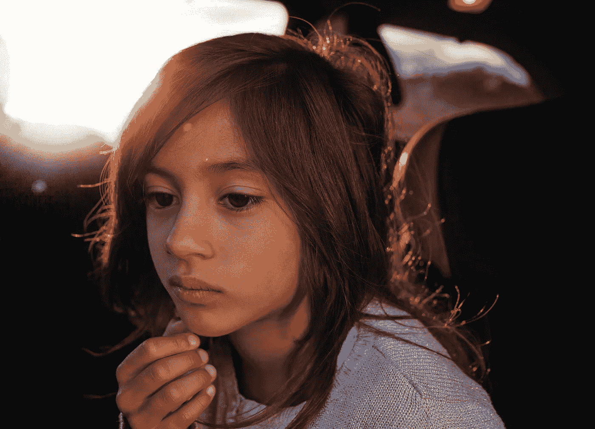

# 如何培养一种不评判的态度来更平静地生活

> 原文：<https://medium.com/swlh/how-to-stop-judging-and-start-living-91bef2834c9a>

看上图。

你看到了什么？

你可以看到“一个悲伤的女孩”，“一个陷入沉思的女孩”，或者你可以得出任何其他的结论。

作为人类，我们希望缩小信息的差距。

信教的人断定有上帝。无神论者相信没有上帝。