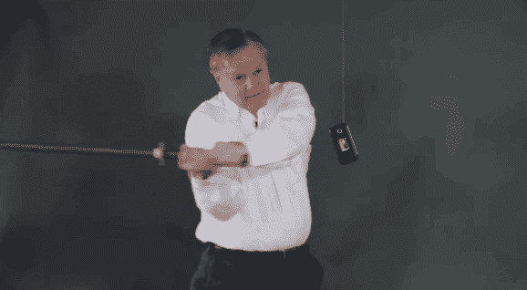
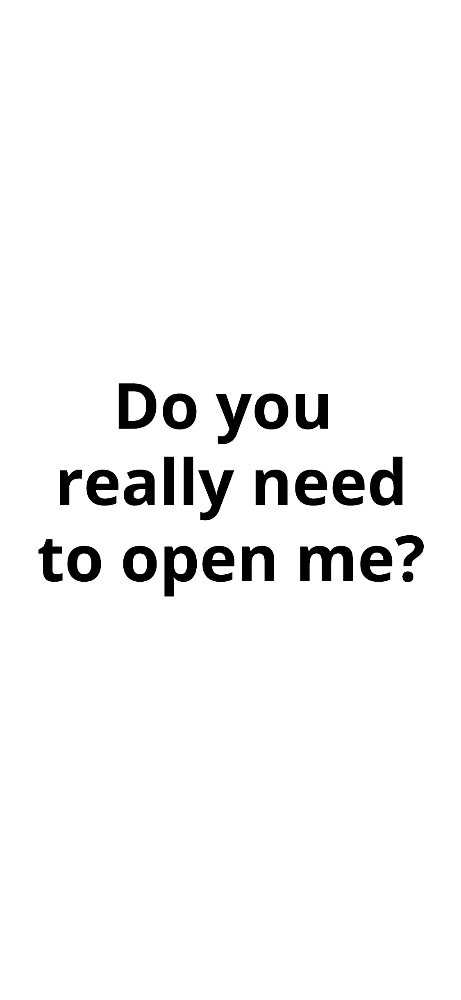

# 如何在阅读这篇文章的时间里戒掉你的手机瘾

> 原文：<https://medium.com/swlh/how-to-stop-your-phone-addiction-in-the-time-it-takes-to-read-this-article-f02266bebedd>

## 如何一步赢回你的时间

**这是给那些厌倦了沉迷于手机并想再次拥有自己时间的人的**

考虑一个我们每天使用 100-200 次的物品，我们一直把它放在口袋里，如果它离开我们几分钟，就会引起焦虑。

在过去，这种描述可能会让人联想到毒品、烟草或糖。今天，它所指的对象显然是手机。

如果你像大多数人一样，你会以不健康的速度伸手拿手机，可能是在你根本不需要的时候——在工作时，在家里，在通勤时，在厕所，在吃饭时，在醒来时，基本上，在你有空的任何时候。

这对我们真的很不利。[手机降低了我们的生产力](https://www.forbes.com/sites/kaytiezimmerman/2017/03/26/is-your-cell-phone-killing-your-productivity-at-work/#633dcd92605c)，[降低了我们的注意力持续时间](https://www.aarp.org/health/brain-health/info-2017/mental-focus-smartphone-use.html)，[增加了我们对错过](https://www.theguardian.com/teacher-network/2016/mar/08/children-mobile-phone-distraction-study-school)的恐惧，让我们在对我们毫无帮助的内容上浪费生命中的时间。

我现在就告诉你如何解决这个问题。

## 我是如何找到解决方案的

作为一名青少年，我生活的大部分时间都应该围绕着我的手机。脸书，Snapchat，Instagram，Twitter。贴在一个上，检查另一个。

我想是那天我把手机忘在家里，并因此感到身体不适，我才意识到自己有问题。我下意识地伸手去拿手机，过了一会儿，突然意识到我已经在 twitter 上滚动了 10 分钟。

在过去，我常常为自己的行为辩护说，我这样做是因为我在从我关注的人那里获取有意义的内容，花时间在社交网络上实际上对我有益。

但这次不是。我强迫自己和自己真正讲道理。知道萨姆昨天下午 3 点做了什么真的重要吗？了解这些晕倒的山羊，虽然可爱有趣，但对我的生活有任何帮助吗？

这并不是说社交媒体完全不好。像任何事情一样，它有它的优点。它非常适合在辛苦工作一天后放松，或者发布你相信的内容，或者快速休息 5 分钟来理清思绪。

一个人消费的内容在很多情况下也是有帮助的，但只是在付诸实践的时候。如果世界上最有知识的人不到现实世界中去实践他所学的东西，他也不过是个普通人。

> 当花在无聊内容上的时间大大超过了为自己的目标而努力的时间时，就有问题了。

> 如果世界上最有知识的人不到现实世界中去实践他所学的东西，他也不过是个普通人。

慢慢地，随着这种意识在我脑海中不断强化，我发现自己每次解锁手机时都会更加清醒。每次打开屏幕，我都会有一种小小的负罪感，因为我现在知道，几乎每次打开屏幕，我都不需要打开。

我最终创造了一个小习惯——每次我要打开手机时，我都会停下来 5 秒钟，然后决定是否有正当的理由打开它。事实证明，大多数时候并不是这样。

我发现最需要防止的是下意识地打开你的手机。如果你仔细注意，你可能会意识到你会在最没用的时候这样做，比如在感到一点点焦虑的时候，或者当你开始思考一点点的时候。

> 如果你能创造一个时刻，让你有意识地思考自己的行为，你就能停止无意识地解锁手机，把你原本会浪费的时间用在更有成效的事情上。

## 秘密

**这里是秘密**。为了连贯地经历这一系列的想法，我把这张图片作为我的锁屏。

就这么简单。现在，每次我尝试解锁手机时，都会看到这条信息，这让我停下来思考我到底为什么要用它。

**如果你知道你过多地使用了你的手机，我建议你现在就保存这张图片，把它设为你的锁屏*。***

## 有用吗？

没错。几乎太好了。经常不自觉的拿起手机，却被锁屏提醒那一刻真的不需要用了，简直吓人。

我每周打电话的时间减少了 5 个小时。那几乎是一整天的时间。在这 5 个小时里，我现在可以专注于做对我或他人有益的事情，比如在媒体上写作，与真人交谈，或者(尽管我不想)学习。

## **行动号召**

你可以利用这个确切的时刻来重新掌控你的时间。你可以用节省下来的 5 个小时或更多时间去做任何可以改善你生活的事情。

你可以做一个副业，创业，读更多的书，做一个在线课程，开一个博客，与人交谈，机会是无穷无尽的。

所以如果你想帮助自己，少用你的手机，开始更多的生活。

**感谢阅读，**

**萨尔瓦什**

**想聊天？在** [**Twitter**](https://twitter.com/SarvasvKulpati) **和** [**Linkedin**](https://www.linkedin.com/in/sarvasvkulpati/) 上找到我

**这是我写的其他一些帖子**

 [## 你需要进行信息节食

### 我们生活在一个吸毒者的社会里。你最好的朋友可能就是其中之一。你的家人也是。很有可能，你也是…

hackernoon.com](https://hackernoon.com/you-need-to-go-on-an-information-diet-def2f5a3fd5b)  [## 苹果的专长不是硬件或软件

### 每个人在批评苹果时都忽略了一个明显的点

medium.com](/swlh/apples-speciality-isn-t-hardware-or-software-af1e6337d5f2)  [## 为什么我在学校教年轻学生如何编码

### 以及为什么你也应该教别人如何编码

medium.freecodecamp.org](https://medium.freecodecamp.org/why-im-teaching-younger-students-at-my-school-how-to-code-f74ba3f174e3) 

## 这个故事发表在 [The Startup](https://medium.com/swlh) 上，这是 Medium 最大的创业刊物，拥有 312，043+人关注。

## 在这里订阅接收[我们的头条新闻](http://growthsupply.com/the-startup-newsletter/)。

