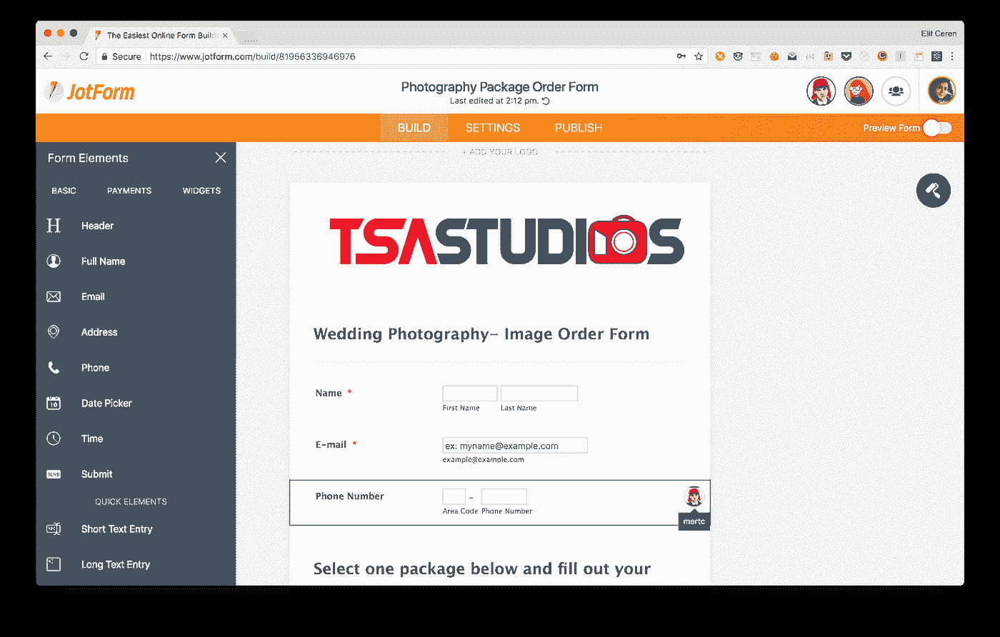
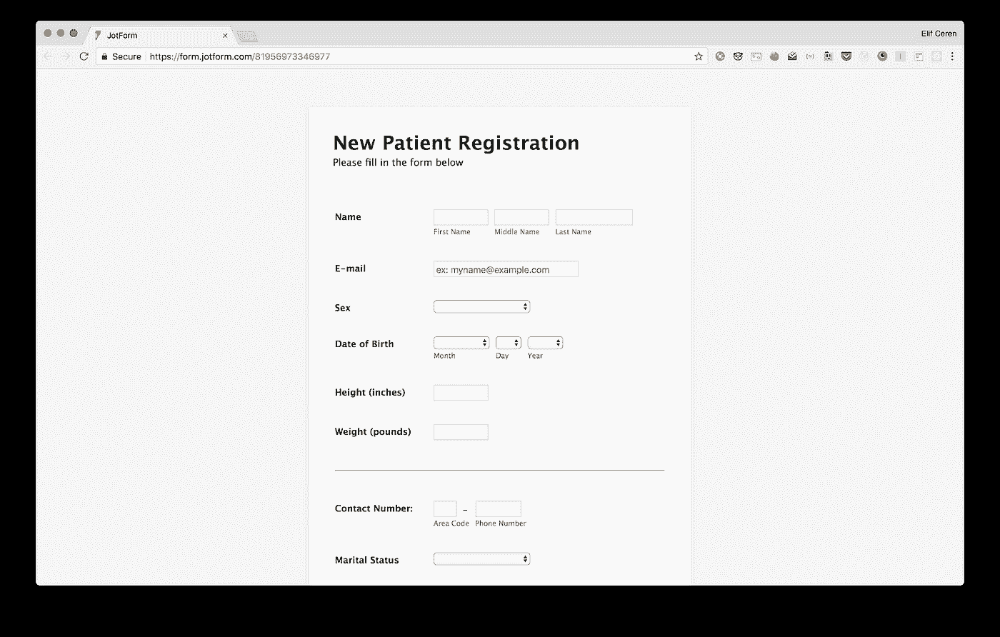
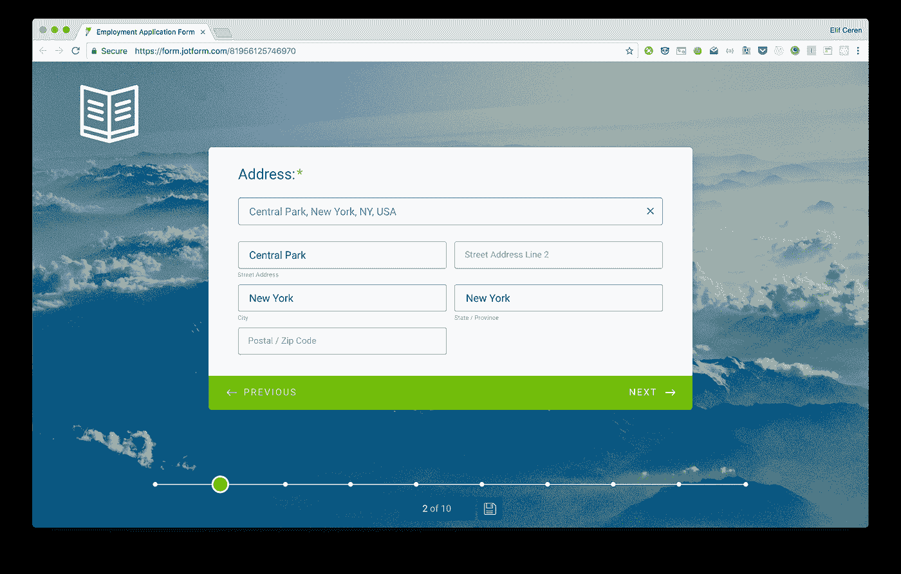

# 如何构建您的在线表单以取得成功

> 原文：<https://medium.com/swlh/how-to-structure-your-online-forms-for-success-4f0e4308cc9d>

Originally published on [**JOTFORM.COM**](http://jotform.com)

表格。

我知道，你的脉搏不会因为兴奋而加快。

表格名声不好。

不管你喜欢还是讨厌它们，从注册到收款，表格一直存在。形式平等的投入，他们意味着从任何与你的业务互动的人那里收集数据。

当一个表单吸引而不是挫败你的用户，并且提供你需要的数据时，它就是成功的。

表单由不同的部分组成。构建一个完成它需要做的事情的表单依赖于规则、原则、逻辑——以及一点游戏。

这里有一些方法来构建实际上可以转换的在线表单。

# 欺骗性的简单

表单看起来很简单。几个字段，一些文本，几个按钮。真的有比这更多的吗？

嗯，是的。

一个成功的表单对用户来说很简单。但是在明显的简单背后隐藏着一系列的决策、调整、谨慎的措辞和深思熟虑的策略。

所有这些都是创建收集有用数据的表单所必需的。没有它们，表单不会产生您需要的内容。

就像乐高建筑一样，好的形式依赖于建筑。这意味着坚实的基础、正确的结构和对细节的关注。

在构建表单时，有五条基本规则需要记住。

# 1.从问题开始，自下而上

就像在乐高游戏中一样，你的表单的组织需要通过问题来提供信息。正是这些问题从头开始构建了一种形式。

这使得列出问题成为一个很好的起点。

我总是鼓励我们的用户在思考一个表单需要实现什么的时候，从写下所有想到的问题开始。

让它们成为恰当的问题，并在结尾打上问号。给自己时间去做这件事。你可能想请同事们加入进来，并提出他们的问题。

# 2.删除任何你不需要的问题

删除不必要的问题是很重要的，因为你需要用户的合作——那些会花时间填写表单的人。

这些人有很长时间花在他们认为没有意义的事情上的可能性有多大？没有。

所以不要因为浪费用户的时间而冒犯他们。着眼于你真正需要知道的东西。然后尽可能简洁地重新表述这些问题，不要失去一英寸的清晰度。

每当你的用户感到困惑，不明白一个问题，或者不知道对他们的期望是什么，他们放弃的风险就会急剧增加。

每增加一个问题都会影响表单的转化率，以及用户完成表单的可能性。如果你不需要，就不要去要。

# 3.将问题分组

一旦你精简了你的问题列表，必要的话，把它们分成小组和子小组。

将问题组织成组将有助于创建逻辑和流程，这将支持您的用户在表单中前进。这也将使问题更容易理解，并降低整体认知负荷。

分组问题的其他一些启示:

*   一个大窗体可以分成多个部分。
*   通过设置单个跳过逻辑条件，可以跳过分组问题
*   一组问题可以针对每个单元重复，例如家庭成员
*   在数据输入期间，一组问题可以一起显示在同一屏幕上

您可以在每个部分的顶部用简短、信息丰富的标题来标记每个小组的“主题”(例如，联系方式-个人信息-工作经历)。这让用户可以快速浏览表单，看看他们需要提供什么类型的信息。

所有这些都会引出一组简洁的、深思熟虑的、清晰的问题。这些群体中有些会更大，有些会更小。你可能有一些孤儿问题。一切都好。

# 4.巧妙地排列你的问题

即使你每页有多个问题，你的用户也必须一次回答一个。

表单中的每一部分都应该把用户推到下一部分。这意味着你需要按逻辑和有意义的顺序对组和组内的问题进行排序。

所以“你是谁？”会出现在“你住在哪里？”反过来，这个问题会出现在“你的工作经验是什么?”？'

在付款表单上，你可以从记录细节开始，然后是运输信息，最后是要求付款。如果你要求用户先付费，他们就不太可能这样做。

有时候，问题需要按照特定的顺序来问，因为它们脱离了上下文就没有意义。

作为一般的经验法则，试着从易到难错开问题。这有助于用户更快地解决问题，并激励他们继续下去。

记住，在排除不必要的问题时，要毫不留情。填写完表格后，您可以随时询问可选问题——通过这种方式获得更高回复率的机会总是更大。

例如，像“您最初是如何听说我们的？”或者“您想了解我们服务的更多信息吗？”当作为一个可选的后续问题提出时，感觉不那么咄咄逼人。

你的每个问题都是整体的一半。另一半是你的用户提供的。你可以将你构建形体的方式视为一场对话或一场舞蹈的蓝图。

要记住的关键是，你需要和其他人交往，他们也需要和你交往。这将决定你如何在表格上安排问题的顺序。

# 5.在你的形体中创造运动

你的下一条，也是最后一条规则来自于此:你的身体需要运动。

每一点都需要让你的用户为下一点做好准备。本质上，它需要成为一个你和你的用户共同书写的故事。

你构建和排列表单的方式需要有某种叙事交织其中——而这种叙事将是让你的读者流连忘返的重要部分。

谁将成为你的对话人，与你共同创建表单？这是在构建表单时要记住的问题。表单不仅仅是关于无脑的数据，它们是关于有脑的人。

## 表单的关键组件

一个表单有一个首要目标——让收件人完成。引导他们走上这条路的一部分是解释

> a)他们正在填写什么类型的表格，以及
> 
> b)他们通过填充它可以完成什么。

实际上，很少有人会花时间去阅读一个表单用途的详细描述，所以你需要简洁地捕捉它。这就是标题如此重要的原因。

让你的表单标题吸引人、有信息并且贴切。不要浪费文字；说重点。您希望读者在继续填写表单时记住表单的目的。

一个好的表单不会突然开始:它会有一个欢迎页面。它也不会突然结束:它会以一句感谢的话结束。确保不要跳过这两个部分。

有些形式比其他形式需要更多的努力。例如，有些会要求用户检查外部文件(如护照)。有些需要很长时间才能完成。

不要半途而废，这会激怒用户，降低他们的积极性。如果是更复杂或要求更高的表格，从一开始就简单明了地描述一下他们可以期待什么。

**一些更技术性的东西**

# 输入字段的类型

## 选择右分隔线

为您的表单选择正确的分隔线类型至关重要。根据表单的长度，这可能非常小。

我们的新产品，[桌形卡片](https://www.jotform.com/cards/)，分别呈现每个问题。但是在传统的表格中，放置分隔物(从视觉上分割部分)可以减少压迫感。

群体之间的交流差异不需要太多的视觉差异。事实上，过多的对比会分散人们的注意力，阻止他们浏览表单。焦点应该始终放在表单的内容上，而不是它的表现形式上。

正如信息设计专家爱德华·塔夫特指出的:

> "信息由差异组成，这些差异会产生影响."

基本上，任何视觉元素，如果不积极地表示某件事，就会使事情变得更糟。

## 多页还是单页？

将每个主题分组在一个页面上更好，还是将它们划分在一系列页面上更好？应该有多少页？答案是……看情况。

根据长度、内容和用户的心理模型，某些类型的表单在一个页面上包含多个部分时效果更好，而其他类型的表单在不同的页面上效果更好。

当不同的主题足够短，可以分成几个部分时，**单页**可能效果最好。当每个部分开始变长时，可能需要多页来打断对话。

当我们发布卡片表单时，[jot Form 数据团队对我们新卡的转化率(表单查看/成功提交率)进行了研究](https://www.jotform.com/blog/how-focusing-on-the-customer-not-the-competition-brought-us-over-1-million-new-signups-in-a-year/)。该研究表明，即使是简短形式(最多 7-8 个字段)，在单个页面上提问也能提供更好的转化率。

由于这个设置，我们还添加了一个摘要页面和一个进度条。这显示了还有多少问题，有多少已经完成，激励用户，鼓励他们完成表格赋予的进展效果。

## 区分主要动作和次要动作

分组提问还有一个好处，就是区分主要动作和次要动作。主要和次要操作让用户可以顺利完成表单。

一个主要的例子鼓励你完成表格。必要时，一个辅助动作会带你回去。主要动作和次要动作最常见的例子是向前或向后移动。

但也有次要操作的用例，如保存以备后用、预览、导出和重置。

## 使用输入组和灵活输入的优势

最后，还有**灵活输入与表单验证**的问题。

> 表单验证=必填字段，例如，某人的姓名。

这些应该总是可见的。然而，当输入是灵活的时，提供折叠字段的选项以最小化淹没可能是有用的。

仔细考虑适合您要寻找的答案类型的输入字段。可能是或不是？预定义的选择？

尽可能给出启示，帮助人们快速回答问题。拥有预定义的答案或是/否问题也将有助于您更轻松地收集和分析数据。

如有必要，您可以随时添加“其他”部分。

同样，记得指出哪些字段是可选的，哪些不是。(*)符号的意思是“必需的”,这是众所周知的。

将必需或可选指标与输入标签相关联，以表明需要回答哪些问题。(*)符号的意思是“必需的”,这是众所周知的。

# 最后的想法

是的，表单的存在是为了收集数据——但是它们是通过您和您的用户之间的协作过程来实现的。熟练的形式构建不是一个机械的过程:它包括反思你试图实现什么，以及实现它的最佳方式是什么。

这意味着，除了其他事情之外，要考虑哪种数据类型对回答手头的问题最有用。重点表格最有可能产生可操作的结果。

构建一个有效的表单是一个创造性的过程，但是表单不是一个可以想象的地方。尽可能保持简单、简短和重点突出。祝你好运。

## 感谢阅读。如果你喜欢这篇文章，请随意点击那个按钮👏帮助其他人找到它。

## [在 Twitter 上打招呼](http://pix.jotform.com/lR_wcwgN)或者在 [JotForm](http://pix.jotform.com/Vci4H3l8) 查看我们正在建造的东西。

【www.jotform.com】最初发表于**。**