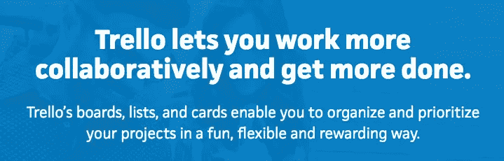

# 如何构建您的网站内容以实现最大销售额和转化率

> 原文：<https://medium.com/swlh/how-to-structure-your-website-content-for-maximum-sales-conversions-e3f6f2a30fcc>

你有没有想过为什么有些商业网站比其他网站更有效，而且似乎以某种方式关闭了更多的销售，产生了更多的线索，并享受更多的咨询？虽然这可能是因为优秀的搜索引擎优化、社交媒体营销带来了更多的流量，或者自然会有更大的用户群……但 90%的时间是因为销售信息、网站内容以及他们如何构建网站。

当涉及到在线营销和网站时，大多数企业注重视觉效果和网站外观的设计，以给他们的受众一种难忘和直观的用户体验。虽然这一点肯定很重要，但学会组织销售信息也同样重要。调整销售信息并确保其与您的客户和您的品牌精神相联系，可以使您的转化率翻一番甚至三倍，为您提供更多合格的线索，在不花费一美元广告费用的情况下完成更多的销售！

在本文中，我们将浏览您网站中影响客户购买决定的前 3 个最常访问的区域，以及如何正确构建它们以获得最大效果。

# 1.您的主页

人们离开你的主页的两个最大原因是因为你的读者不能立即理解你的价值主张，他们只是对你的业务不够信任。

那么，我们如何为您的主页构建既清晰又能激发信任的内容呢？

## 确保你的英雄部分的标题清晰明了&切中要害

你有不到 5 秒的时间用一个明确的标题吸引他们的注意力，让他们立刻知道他们能得到什么。虽然许多企业试图吸引眼球，写一个复杂且充满行话的标题，但这并不是它真正应该被呈现的方式。

当涉及到他们的在线体验时，你的潜在客户处于扫描模式，除非你的英雄部分简单明了，否则你可能会失去他们的注意力。

## 包括客户证明

现在是 2018 年，大多数读者可能已经在线浏览了数百个(如果不是数千个)网站，并产生了查看证据的需求，证明您可以宣称您的产品或服务能够做些什么。

可纳入您网站的最强有力的社会证明是客户证明。

但不仅仅是听起来积极的证明，而是遵循以下结构的证明:

*   在发现您的解决方案之前，您的客户面临的挑战
*   使用它所获得的有形和具体的好处。

*“尼尔和他的团队为 Inventium 创建了一个惊人的网站。自发布以来，我们收到了许多积极的反馈。我强烈推荐 Start Digital，它们棒极了！”*

Amantha Imber

-英业达首席执行官

# 2.您的“关于我们”页面

“关于我们”页面通常是您的潜在客户将访问的第二个最受欢迎的页面，不应被忽视或仅填充一般性信息。

有效的“关于我们”页面有助于:

*   向你的观众介绍你的公司，并开始进一步提高你企业的可信度
*   通过你的品牌故事与你的访客建立更深层次的情感联系
*   展示使您的业务成为可能的人和团队

无论您决定如何构建您的“关于我们”页面，有两个关键因素不容忽视。

a)讲述你的故事，让你的公司人性化

每个企业都有一个开始和丰富的故事要讲(你创建这个企业不只是为了赚钱吧？)

当大多数公司采取平淡的方法，仅仅描述他们的过程和产品时，聪明的企业利用他们的开端，通过一个鼓舞人心的故事带领他们的读者了解他们的企业是如何形成的。

从你的企业多年来完成的各种里程碑，到让你从零起步的旅程，每一步都是与读者沟通的机会。

b)展示你自己和你的团队

从简短的报道和团队主要成员的照片到令人难忘的公司郊游的照片，这是释放和展示团队个性的时候，团队负责运营你的业务，使一切成为可能。

# 3.您的产品页面

无论你销售的是实物产品、上门服务还是虚拟体验，你的产品描述都必须足够吸引读者采取行动。一个经过时间考验的行之有效的方法是首先带来好处，而不是证明使用功能的合理性。

大多数网站的产品描述都很糟糕，仅仅陈述了他们的解决方案能做什么或提供什么，而没有深入到激发他们潜在客户的真正原因。人们凭自己的情感做出购买决定，然后进行逻辑推理。他们想知道使用您的解决方案对他们有什么好处，以及他们的生活会有什么改变。

以 Trello 的产品描述为例。他们以他们知道他们的客户所寻求的利益为主导:在证明使利益成为可能的功能之前，一起完成更多的工作:公告板、列表和卡片。

# 结论

虽然视觉效果和基于转换的设计对你的用户体验之旅很重要，但是是你网站上的内容赢得了胜利，把你的访问者变成了付费客户。

通过组织你的内容，帮助你的读者在情感层面上与你的企业建立联系，以易于理解的方式展示你的产品优势，并通过推荐建立信任，你可以最大限度地提高你的转化率，将点击转化为线索。

想要发现更多关于内容以及它如何与设计携手共进的信息吗？

给我们写封短信，我们会很高兴带你深入内容兔子洞！

*本文原创，写给* [*起点数码*](https://startdigital.com.au)*2018 年 2 月 27 日*

## 这篇文章发表在 [The Startup](https://medium.com/swlh) 上，这是 Medium 最大的创业刊物，有 302，074+人关注。

## 在这里订阅接收[我们的头条新闻](http://growthsupply.com/the-startup-newsletter/)。

