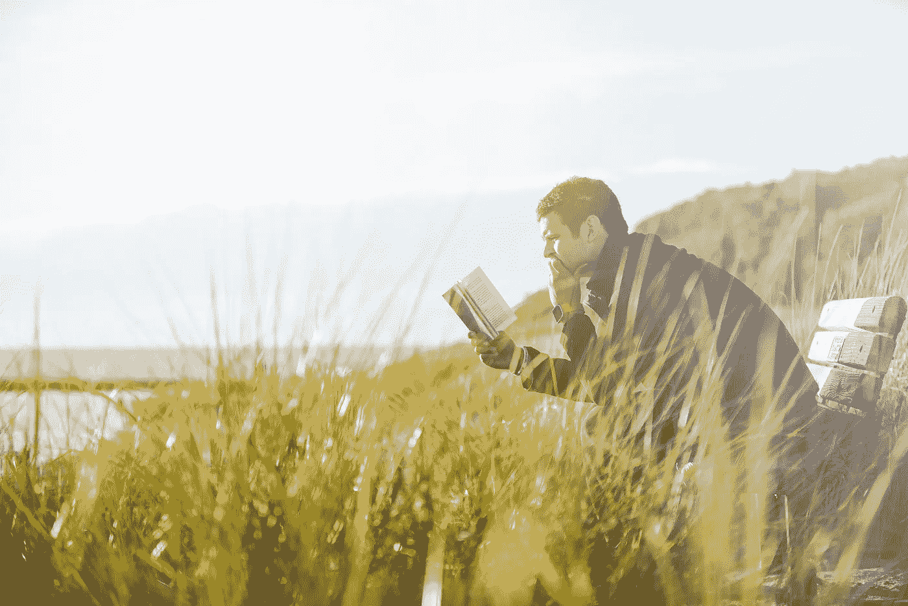

# 如何更聪明而不是更努力地学习，并在更短的时间内记住更多

> 原文：<https://medium.com/swlh/how-to-study-smarter-not-harder-and-retain-more-in-less-time-3767c5621d0a>

Photo by [Ben White](https://unsplash.com/photos/1MHU3zpTvro?utm_source=unsplash&utm_medium=referral&utm_content=creditCopyText) on [Unsplash](https://unsplash.com/search/photos/think?utm_source=unsplash&utm_medium=referral&utm_content=creditCopyText)

## “没有一个小偷，不管他多么有技巧，都不能偷走一个人的知识，这就是为什么知识是获得的最好和最安全的财富。”―L·法兰克·鲍姆

当你能记住你所学的东西，并能把它用在你最需要的地方时，学习就变得有价值了。我们已经…