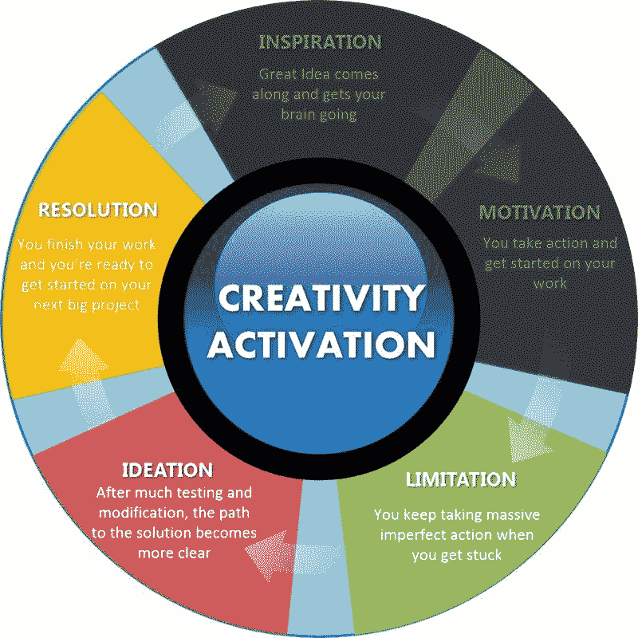

# 如何成功并创作出你最好的创意作品

> 原文：<https://medium.com/swlh/how-to-succeed-and-produce-your-best-creative-work-37dcfbc81cc0>

## 实现你急需突破的终极方法

你感到停滞不前，因为你不知道如何让你的梦想成为现实。

更糟的是，你感觉瘫痪了。

你到处尝试了一些事情，但都没有成功。

现在你不知道下一步该做什么，但你知道你想在你的生活中做一些了不起的事情。

你感到自己的肠子在往下沉，发现自己在想“这真糟糕，我一无所有”

然后你开始怀疑自己，怀疑自己是否足够优秀，能够像其他激励你的成功人士一样。

所以你什么都没做，就放弃了，把你的梦想留在那里。

你继续坐在沙发上，打开网飞，告诉自己以后会弄明白的。

你看完这部电影，这是一个非常精彩的故事，所以你再次受到启发去创作一些东西。

这让你陷入了一个恶性循环，我称之为创造力死亡陷阱。

当你遇到限制时，你开始意识到事情比你想象的要困难得多。

挑战可能会令人畏惧，以至于你不知道该做什么。

当这种情况发生时，很容易把它推迟到以后，因为它让你很头疼去试图弄明白它。

你最初认为是一个伟大的想法，现在坐在那里不发展，你开始把这个想法当作它正在生长的模具。

你不去接近它，你告诉自己，当最终想到解决办法时，你会回到它身边，但它永远不会出现。

然后项目就夭折了。

我总是在这个自我挫败的循环中挣扎，直到我开始应用我生命中重要的一课。

有一次在一个商务会议上，我看到其中一个工作人员穿着一件 t 恤，上面写着三个字。

当我看到他的衬衫时，我意识到为什么我的创造性工作没有取得足够的进展。

他衬衫上的三个字是“大规模不完美行动”。

这时我意识到我有一个大问题。

因为我愿意尝试的事情很少，所以我想取得的进步被严重拖慢了。

我想在尽可能少冒风险的情况下获得最好的结果。

后来真相大白了。

# 产生最佳作品的关键是采取大量不完美的行动

当你陷入工作中时，很容易进入分析模式。这么多的想法在你脑海中闪过，你在脑海中上演了这么多的场景。

直到我接受了采取大量不完美行动的想法，创造力死亡陷阱才变成了创造力激活循环。

以下是采取许多不完美的行动可以帮助你摆脱困境的方法。

# 大量不完美的行动让你不断出现

我上大学是为了获得药学学位。这是一个为期六年的项目，在项目进行到一半时，至少有一半的学生辍学。

我一边打三份兼职工作来支付账单，一边以 2.8 的平均绩点勉强度日，但幸运的是，我是其中一个顺利毕业的人。

原因如下。

我只是不停地出现。

我参加了考试，尽管我只学了一半的内容。结果，我在许多考试中以微弱优势过关，但我还是通过了。

这对我来说是一个巨大的教训，因为我意识到我不需要一直把事情都搞清楚。产生结果的是不放弃，不断出现。

我有一次听了兰道尔·华莱士的演讲，他创作了广受好评的电影《勇敢的心》。有人问他是如何制作出如此伟大的电影的，他的回答非常直截了当。

> “很简单，我只是不停地出现。
> 
> 我每天早上 5 点醒来。
> 
> 我发着牢骚，像其他人一样从床上爬起来。
> 
> 我屁股坐在电脑前，我刚刚出现。
> 
> 有几次，我坐在电脑前，开始一遍又一遍地写“废话，废话，废话……”但正是因为我不断出现，我才能够制作《勇敢的心》。"

所以即使你觉得自己很懒或者想放弃，也许你只需要不断出现，测试你所有不完美的想法。

# 大量不完美的行为充当你的指南针，为你指明正确的方向

毫无疑问，大量不完美的行动会产生不完美的结果，但它给了你工作的东西。

不完美的结果总比没有结果好。

这些结果会告诉你什么有效，什么无效。

你现在采取的所有不完美的行动就像一个指南针，指引你改变方向，最终你会到达你想去的地方。

奥普拉·温弗瑞有一年在哈佛毕业典礼上说:

> *“没有失败这回事。失败只是生活试图让我们朝着另一个方向前进。”*

如果我们把我们的创造力更多地作为一种探索，而不是一种成功与失败的方法，那么我们最好的作品就是这样产生的。

像苹果和微软这样的公司并没有在第一次尝试中就创造出最高性能的产品。在最终开发出您今天使用的伟大产品之前，我们花费了大量的金钱和资源来制造一个又一个低于标准的原型。

所有巨大的不完美的行为给了他们清晰。这向他们展示了下一步需要做什么的更清晰的路径。

# 大量不完美的行动让你专注于你为什么要做这项工作

我不得不承认，我对工作无所作为的最大原因是一个可怕的想法:

*“如果人们不喜欢我的工作怎么办？在做任何事情之前，我需要确保我有一个令人惊讶的计划，这样人们就不会认为我很蠢。”*

这些恐惧让我无法将自己最有潜力的想法付诸行动。

大量不完美的行动是我完美主义的解药。它让我找到了我最好的作品，因为它只有一个目标:

**继续前进。**

我首先考虑的是如何不惜一切代价完成我的项目。

这给了我继续尝试的决心，而不是无所事事地担心别人如何不认可我的工作，或者更糟的是，如果我做得不好，会嘲笑它。

**相关:** [你可能正在做的扼杀你创造力的一件大事](http://destinyhacks.co/the-one-big-thing-you-might-be-doing-to-kill-your-creativity/)

它帮助我专注于完成工作，因为它将我与为什么它对我重要联系起来。我想通过我的工作与人们联系并赋予他们力量。

因此，我不太在意失败以及失败给我带来的影响。我找到了为我最在乎的东西努力奋斗的勇气。

# 当采取大规模不完美的行动时，谦卑是必要的，也是让你达到目的地所需要的。

想象自己再次处于一个具有挑战性的创意街区。

也许你已经在你的博客上发表了一些文章，但是你没有得到你所希望的那么多回应。

或者，也许你已经尝试推出自己的业务，但你不知所措，没有多少人分享你的兴奋。

你很沮丧，但这次你决定不放弃。你已经下定决心要生产一些东西。任何事。

所以你不要想太多，直接去做。

你做了一大堆你不知道会成功的事情，但是你记得为什么这项工作对你很重要。

你仍然得到蹩脚的结果，但事情发生了。

你看着你的工作，你会发现它有什么不好，但你也开始发现它有一点潜力。

你专注于这种潜力，并根据你新产生的想法再次行动。

你看到了更多的潜力，所以你删除了蹩脚的部分，并进一步扩大潜力。

接下来你知道的是，你在这个新的测试和修改的循环中，直到你想出一个伟大的东西，你对自己有能力做到这一点感到惊讶。

最大的突破不会来自第一次尝试。它来自于你采取的大量不完美的行动，你发现你最好的工作就像你在岩石中挖掘了几天后发现了一颗钻石。

你可能会感到停滞不前，但是你坐着不动是不会有任何进步的。成长的关键是行动。大规模不完美行动。

所以从今天开始。

事实上，现在就开始。我保证你会因此成为一个更好的人。

**如果你喜欢这篇文章，那么你可能也会喜欢我的免费指南，** [**四个步骤，立即开始你有史以来最好的生活**](https://mailchi.mp/de7ebe746809/destiny-hacks-free-guide) **找到你需要的清晰，以找到你的激情、才能和社区。**

*最初发表于*[*【destinyhacks.co】*](http://destinyhacks.co/how-to-succeed-and-produce-your-best-lifes-work/)*。*

## 这个故事发表在 [The Startup](https://medium.com/swlh) 上，这是 Medium 最大的企业家出版物，拥有 292，582+人。

## 在这里订阅接收[我们的头条新闻](http://growthsupply.com/the-startup-newsletter/)。

