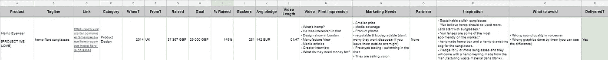
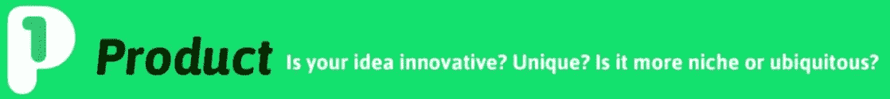
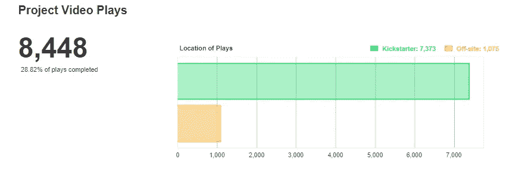
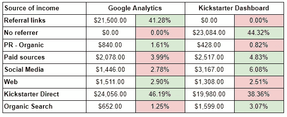
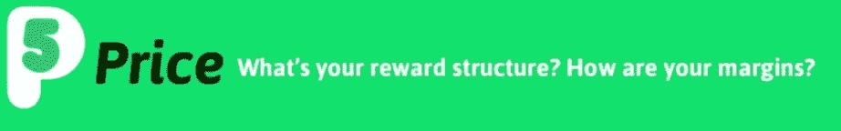
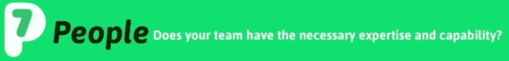

# 如何在 Kickstarter 获得成功？

> 原文：<https://medium.com/swlh/how-to-succeed-at-kickstarter-6e72d7120cb5>

你有没有想过如何分辨为什么一些活动成功，而另一些活动失败？在分析它的时候，我会比较不同的组成部分——第一视频印象、产品的营销需求、灵感来源和需要避免的事情。

这并没有错。

除了最近，我发现今天的资助的[略有不同的方法。它被称为**众筹成功的 7p**，它帮助你确定为什么一些活动成功了，而另一些却失败了。](https://www.funded.today/blog/the-7-ps-for-crowdfunding-success)

在我们[完成我们的本杰明·巴顿广告](/benjamin-button/why-we-really-cancelled-our-kickstarter-campaign-9714e5435b62)之后，我们从这个不同的角度来看待它。这是我们发现的。

为了成功，你的产品只需要几个特征。

> 它需要无处不在。它需要有独特的“技术”功能。让你不寒而栗的故事。

产品本身就很有新意。这是儿童友好的。它提供了别人没有的软件。看起来很棒

本杰明是现有外置摄像头的升级吗？是的。但是每个人的智能手机上都有摄像头。对大多数人来说，这就足够了。

它最大的优势，存储记忆，真的是小众。

## 如何做得更好:

*   关注不同的待完成工作

Kickstarter 比仅仅通过电子商务或 Indiegogo 销售给你更好的曝光率、更好的公关和更高的可信度。

> 但亚马逊上有数百个成功的儿童产品，而 Kickstarter 上只有十几个，这是有原因的。原因是缺少父母。

要解决这个问题，你要么需要以前的支持者/父母的数据库，要么你需要把你的目标群体带到 Kickstarter 之外。

第一个几乎不可能。后者更有意义。

## 如何做得更好:

*   带很多第一次的支持者/家长
*   反思通过 Kickstarter 销售是否值得

如果有一篇关于如何制作一个成功的众筹视频的文章，我肯定会包括一些简单的建议。

> 花足够的时间准备。分配适当的预算。明智地选择演员。使用用户评价。展示产品的实际效果。从强有力的钩子开始。

可惜我们没有跟着他们。

我是说视频是错的吗？不。它仍然比大多数 Kickstarter 视频要好。但是有很多事情可以做得更好。

我们的视频是在一天内拍摄的。预算是 1200 美元。没有选角。我们还没有包括证明和产品在行动中的照片。我们的钩子不起作用了。

如果我们这样做了，也许会有超过 28.82%的访问者会播放整个视频。

Please note: Don’t expect 100% completed video plays. Even if you reach 60%, you’ve made a great video.

## 如何做得更好:

*   将 Kickstarter 视频制作外包给专业人士
*   尽快展示正在运行的产品
*   在主视频中使用用户评价

最重要的营销工作是在活动开始前完成。它收集尽可能多的电子邮件，并确保你的产品发布不会很糟糕。

数学很简单。

> 如果您想以 _ _ _ _ _ _ _ _ _ _ _ _ _ _ _ 的平均订单规模达到 _ _ _ _ _ _ _ _ _ _ _ _ _ _ _ 的目标，那么您需要在头 48 小时内有 _ _ _ _ _ _ _ _ _ _ _ _ _ _ _ 个支持者。电子邮件转化率为 3%，相当于预先发送了 ____________ 封电子邮件。

我们需要至少 6250 封电子邮件。我们只有那个数字的十分之一。然而我们发起了这场运动。

如果你做了适当的准备，那么你就可以跻身于 Kickstarter 直播项目的前列，你可以获得 30-60%的“免费”Kickstarter 流量。前 48 小时卖得越多——总销量就越多。如果你将此与脸书付费广告和世界级公关结合起来，那么你就走上了成功之路。

如您所见，我们的发布约占所有承诺的 40%。然后“免费”的 Kickstarter 流量又是 40%。但是公关、社交媒体和付费资源根本没有转化。我希望我们有更多的原型，这样我们就可以把它送给有影响力的人去尝试。

## 如何做得更好:

*   在你有足够的电子邮件之前不要启动
*   活动前测试脸书广告
*   通过向有影响力的人提供你的产品，为他们建立一个网络

我们的价格从 179 美元开始。Benjamin 比 GoPro 便宜，但如果你和其他 Kickstarter 产品比较，价格标签仍然被认为有点高。由于我们想在本地生产，我们的利润率远没有达到 40%。

> 根据经验，总成本的 30%用于营销，另外 30%用于产品生产。那会给你留下 40%的利润。

由此，我们计划将资金用于软件开发。

> 永远不要用 Kickstarter 的钱来完成研发。

我们没有资金缓冲，这导致[取消了我们的活动](/benjamin-button/why-we-really-cancelled-our-kickstarter-campaign-9714e5435b62)。

## 如何做得更好:

*   计算成本，不要削减 40%的利润
*   支付 R&D 从 FFF(朋友，家人，傻瓜)或投资(如果你幸运的话)

> 如果我告诉你，所有关于你成功或失败的数据都在互联网上，你会怎么想？你只需要挖掘它们。

关注趋势，查看研究，阅读竞争对手的博客。向下滚动查看 Kickstarter 和亚马逊上的评论和评论。看看市场是否准备好了。

## 如何做得更好:

*   忽略你的直觉——至少暂时如此
*   结合你的初始客户数据和市场情况

> 和比你优秀的人在一起。

找到最优秀的人，从内部或外部雇佣他们。利用他们的能力来制造最好的产品。然后在视频中展示你的团队和伙伴作为证明。

如果你有一个强有力的故事，这是一个巨大的优势。

## 如何做得更好:

*   在活动视频中展示团队(笑脸总是有效的)
*   不要害怕提及你的伙伴。我们知道你不会孤军奋战。

# 总结一下

当考虑成功的活动时，确保考虑到每个方面。忽略哪怕是最不重要的事情都会导致灾难性的后果。

> 毕竟，你不想在一场不成功的竞选中花费这么多时间和金钱。你知道吗？

## 在你走之前…

如果你喜欢这个故事，请点击💚或者👏按钮或分享关于脸书的文章，这样你的朋友也可以从中受益。

## 这篇文章发表在[《创业](https://medium.com/swlh)》上，这是 Medium 最大的创业刊物，有 293，189+人关注。

## 订阅接收[我们的头条新闻](http://growthsupply.com/the-startup-newsletter/)。

