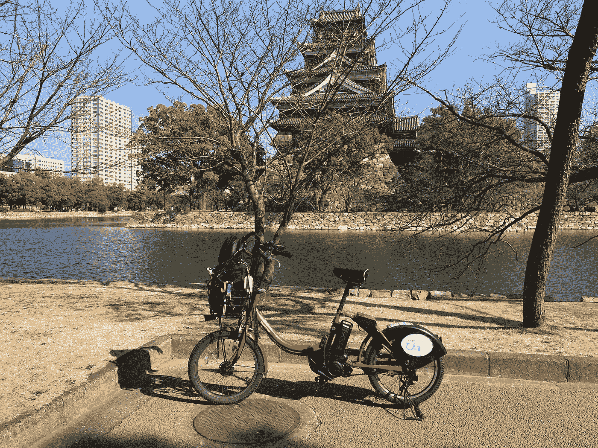

# 如何在社交媒体之外生存(并获胜)

> 原文：<https://medium.com/swlh/how-to-survive-and-win-outside-of-social-media-cb8169eaa596>

[**El Viaje**](https://www.youtube.com/playlist?list=PLEFgG_bSqaFxvbaLrOq4v1-YSg1VURGFr)…

## 寻找数字世界和现实世界之间更好平衡的快速指南

如果你想在社交媒体之外生存并获胜，你需要不时地离开。即使离开社交媒体两天也有好处。想想一周、一个月、三个月能给你多少。后退至少两周，让你的大脑创建新的神经通路，这意味着新的行为和惯例正在取代旧的。因此，如果你经常做的是在午餐时间查看你的 Instagram 主页，三周后你就会采用一种完全不同的仪式。举个例子，就像我的情况，在完成了 [***我的晨间仪式***](https://isragarcia.com/how-to-do-more-rituals) 之后，我在脸书、Google+和 LinkedIn 上发布这篇博客的帖子，以及在 Instagram 上的每日反思。经过这次实验，这个系统/行为会有所不同。会有一个新常态。

# 脱离社交媒体生存

显然，在这个世界上，你的部分价值来自你在数字平台上拥有的粉丝数量、喜欢或另一种参与方式。在这样的世界里，很难想象没有这一切是什么样子。但是，虚假内容，议论文图文，早餐照。社交平台要么非常高效，要么在大多数情况下非常低效。社交网络可以对我们的心理健康产生从吸收到有害的影响。读读这个。如果你觉得社交媒体正在夺走你的时间、精力和头脑清醒，那你就有问题了，如果你认为这种疲劳，那问题就更显著了。

如果你想在社交媒体之外生活，试试以下步骤。

# 1.手机上的应用程序

应用程序是一种令人上瘾的可怕机制，你的智能手机让它们随时可用。如果你把它们从手机上删除，你也可以通过网络访问它们，但可能性不大。您也可以从笔记本电脑或台式机访问，但您不会总是想进入它们。在我的情况下，在社交媒体关闭实验中，我没有感觉到被强迫去消除它们，我仍然没有验证它们。

# 2.建立壁垒

如果你的职业需要你使用社交媒体，根据这些需求确定利润。每天设定一个具体的时间限制来管理社交平台，然后退出并断开连接。一旦你开始测试什么是一天中的最佳时间和你需要的最佳时间量，你将开始激励自己在其他领域和使用其他工具更有效地工作。

我学到的一点是，你可以不使用社交媒体，每天只使用一个小时，也能创造同样的商业机会。我发现的另一件事是，你根本不用它也能得到同样的(积极的)结果。更好的是，你有更多的时间投入到其他任务中。

# 3.查找快捷方式

有时，如果你的工作需要时不时地使用社交网络，找到适合你的解决方案。将你在社交媒体上的时间限制在你的业务范围内。保留提供专业结果的数字作品。你不需要新的；你需要工作。

就我而言，我已经把我们所有项目和业务的社交媒体营销交给了 IG 团队的一部分。甚至报告、分析、战略和战术。不管它是什么，它可以让我不用它，至少在实验期间不用。

# 4.援军

你可能会陷入诱惑；几乎每个人都会摔倒，不用担心。有一个解决办法，首先，停止检查你的智能手机，然后远离社交网络上的任何评论。禁用通过电子邮件接收的通知。显然，你的电脑和智能手机的通知早在几年前就应该被停用了。最后，让你的环境知道联系你的最佳方式。如果还有问题，试试 [**自由**](https://freedom.to/) 或者 [**反社会**](https://antisocial.80pct.com/) 。

为了你的健康和成长，你需要学会如何在社交媒体之外生存。

【*本文首发于*[***【isragarcia.com】***](https://isragarcia.com/survive-outside-of-social-media)

# *只有当你觉得值得的时候，才让这个故事震撼吧！如果你发现任何有价值的东西，请鼓掌。*

> *Isra Garcia = 55 个客户，44 个企业建议，398 次发言，3.366 篇帖子，24 个项目，6 本书，380 场讲座，6 家公司，16 次冒险，23 次实验，∞失败。到目前为止…*
> 
> *[营销人员](https://isragarcia.com/wp/marketer)。顾问。扬声器。作家。教育家。经理。IG 的负责人。博主。企业家。颠覆性创新。数字化转型。高绩效者和生活方式实验者。*

# *行动号召>>点击[此处](http://feeds.feedburner.com/isragarcia)订阅更多类似的文章！*

**

## *这个故事发表在 [The Startup](https://medium.com/swlh) 上，这是 Medium 最大的企业家出版物，拥有 305，398+人。*

## *在这里订阅接收[我们的头条新闻](http://growthsupply.com/the-startup-newsletter/)。*

**