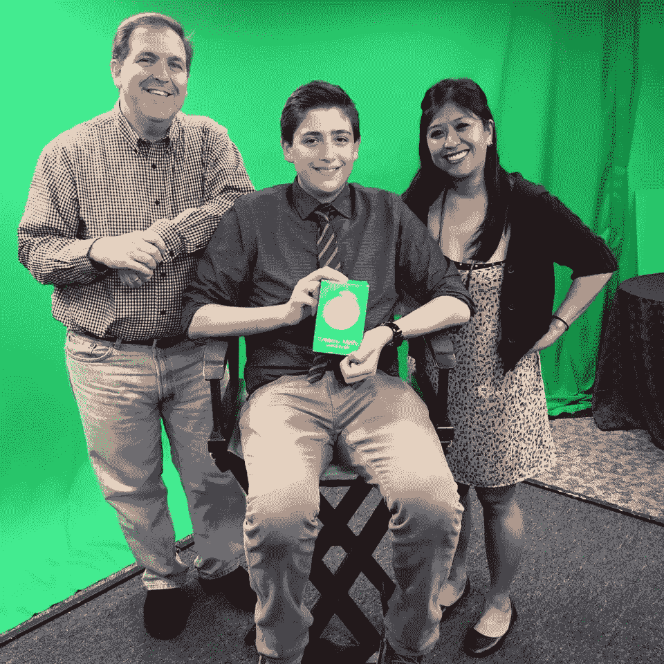

# 当马克·库班是你的导师时，如何与鲨鱼共泳

> 原文：<https://medium.com/swlh/how-to-swim-with-the-sharks-when-mark-cuban-is-your-mentor-bf6b0c7b31e2>

## Teen maker 接手了价值 25 万亿美元的美容行业来拯救地球，并发现即使有最好的支持，创业生活也充满了喧嚣

NOHBO founder Ben Stern on the set of FLORIDA TODAY with Jennifer Sangalang and Rob Landers

本·斯特恩(Ben Stern)在 14 岁时就设计出了 NOHBO Drops，这是一种一次性使用的零废物植物包装材料，可以在水中融化，并在没有浪费包装的情况下分配精确量的洗发水、护发素、沐浴露或剃须膏浓缩物。

五年后，在亿万富翁投资者马克·库班的支持和指导下，他接手了价值 25 万亿美元的美容行业，目标是消除最终被填埋的 5 亿个个人护理瓶。

他的创客之旅令人印象深刻，对有志成为社会企业家的人有着宝贵的经验。

从小就是个修补匠，他的童年是和妈妈一起制作富有想象力的发明原型，和爸爸、奶奶一起看《鲨鱼池》。NOHBO 的意思是“没有头发的瓶子”,这个想法是他在九年级看了一部纪录片后产生的，在这部纪录片中，他了解到塑料瓶需要一千年才能降解。

“我回家，洗了个澡，发现浴室里没有回收箱，”他解释说，大多数未回收的塑料来自浴室，人们把空瓶子扔进垃圾桶。"不久后，我看到我妈妈在用洗衣桶，我突然想到了这个主意！"

斯特恩在 elance.com 找到了一名自由化学家，并用公司的股份和他兼职赚的钱支付给他。他们一起开发滴剂，一旦他们有了可行的产品，斯特恩就开始给凯悦酒店(Hyatt Hotels)和 Clorox 等潜在客户打电话，并与 Tisch 家族等有影响力的人建立联系，Tisch 家族曾帮助他在众筹活动中获得 NFL 球员的代言。他从 6.9 万份申请中脱颖而出，成为 180 名参赛者之一，在《鲨鱼池》中获得了一个令人垂涎的位置。在第七季第 18 集，马克·库班以 10 万美元的价格获得了 25%的股份。

“马克·库班一直是一个令人惊叹的合作伙伴，并且仍然积极参与其中。他刚刚又给了我们一笔早期资金。我每周都和他交谈，每天都和他的顾问团队交谈。斯特恩说:“我从未见过任何人对电子邮件反应如此之快。

“NOHBO 是一种技术先进的产品，有能力改变多个行业。我们的首要目标是与大型酒店分销商合作。酒店是浪费的巨大来源。他们每年订购数十亿瓶舒适瓶，并为每瓶含有高达 85%水分的洗发水支付约 0.25 美元。化妆品行业目前最重要的事情是创造无水或无水产品。迪士尼承诺放弃 80%的一次性塑料，万豪也是如此。酒店可以通过 NOHBO 实现零浪费目标，同时降低成本，为客人提供新颖、干净的便利设施。”

“我们刚刚开始接受今冬限量版的[预购。我们的目标是收集数据并制作一份案例研究，向潜在合作伙伴展示滴滴在这个市场是可行的。我们的目标是通过像欧莱雅和多芬这样的大型化妆品公司的零售传播 NOHBO，这样我们就可以在世界上的每一个沃尔格林和 CVS。这就是我们要做出最大改变的地方。”](http://www.nohbodrops.com/order/)

至于市场采用，斯特恩提到了 2012 年推出的洗衣液胶囊的轨迹，据[财富](http://fortune.com/2016/06/09/procter-gamble-tide-pod/)报道，到 2016 年，这种胶囊占据了 70 亿美元市场的 15%。

我问他是否认为洗衣液豆荚的专利持有者是潜在的竞争对手。他解释说，“这是不同的产品和应用。洗衣液通常需要 3-5 分钟才能溶解。我们的产品可以在几秒钟内溶解。”

关于投资者利益。他解释说，尽管美容行业是一个拥有大量 M&A 交易活动的 25 万亿美元的行业，但科技仍然占据主导地位，只有 6%流向包装消费品和零售，引用了[Forbes](https://www.forbes.com/sites/ryancaldbeck/2015/06/04/venture-investing-in-consumer-and-retail-why-its-rare-and-why-its-about-to-change/)2014 年普华永道 MoneyTree 报告。

“得到钱从来都不容易，花掉钱总是很容易。我已经能够使 3 个月的预算持续 8.5 个月，但我从不缺少研发。我们雇用的化学家拥有非常宝贵的供应商关系，他们提供创新原材料的免费样品，这些样品使一切都变得不同。”他还发现，自动化不一定能节省人力成本。他引用埃隆·马斯克的一条推文说，“永远不要低估人类的力量，他们实际上是需要的。在一定程度上，简单就是幸福。有时候，与其花 4-5 万美元买一台两年后就会坏掉的机器，还不如让某人自己拧上盖子。”

最后，我们讨论了企业家的全天候生活。十几岁就和团队一起制定最后期限和投资者目标是什么感觉，以及他是否觉得自己错过了大学的社交体验，度过了一个非官方的间隔年。他回答说，“我参与了一个庞大的年轻企业家群体。我们一起参加福布斯 30 岁以下 30 岁以下活动和下一代峰会，这些都是非常社交化的活动，让我保持活跃。我也经常给包括麻省理工学院和耶鲁大学在内的大学团体演讲。至于大学，我很重视我的教育，有一天我会去的，但现在，我的首要任务是让我们去市场。很多人都指望着我。”

## 这篇文章发表在 [The Startup](https://medium.com/swlh) 上，这是 Medium 最大的创业刊物，有+ 379，306 人关注。

## 订阅接收[我们的头条](http://growthsupply.com/the-startup-newsletter/)。

