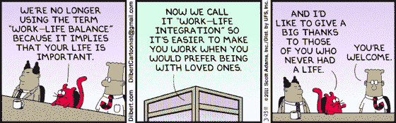

# 如何下班

> 原文：<https://medium.com/swlh/how-to-switch-off-from-work-756ca6f5aeb6>

你有没有考虑过为什么有些人比其他人更有能力处理压力？

事实证明，最重要的因素之一是你下班后能有多放松——当我们第一次开始与客户合作时，我们的许多客户都在为这个问题而努力。

为什么关机很重要？

积极地思考工作或思考一个你想解决的有趣问题并没有错。

但是当你无法停止思考工作时，你的幸福、人际关系和工作效率都会受到影响。正如我的一位客户最近所说的，“我的同事和家人都没有看到最好的我。”

心理学家发现，能够脱离工作经历的人:

[减少与工作相关的疲劳和拖延](http://psycnet.apa.org/journals/str/21/2/137/)

[在工作中更加投入](http://www.sciencedirect.com/science/article/pii/S0001879108001243)，这被定义为活力、奉献和专注(即“心流”)

[更好的工作与生活平衡，](http://journal.frontiersin.org/article/10.3389/fpsyg.2016.02036/full)这与生活质量[直接相关](http://www.sciencedirect.com/science/article/pii/S0001879102000428)

[更高的婚姻满意度](http://journal.frontiersin.org/article/10.3389/fpsyg.2016.02036/full)

[更好的精神健康](https://www.jstage.jst.go.jp/article/indhealth/54/3/54_2015-0097/_article)

**为什么很难关闭？**

很难关闭的一个原因是一种叫做[蔡加尼克效应](https://en.wikipedia.org/wiki/Zeigarnik_effect)的心理怪癖。心理学家 Bluma Zeigarnik 在 20 世纪 20 年代的维也纳注意到，服务员非常擅长记住仍然需要服务的订单，并立即忘记那些已经出去的订单。

当你是一名服务员时，这很有用，但这意味着我们会对任何尚未完成的事情产生侵入性的、焦虑的想法。

在工作中一次完成一项任务从来没有像现在这样困难，因为，除了办公室里其他人的干扰和电话铃声等等。现在，你手机上的电子邮件和通知让你很容易在任务完成前切换任务。

这样做的一个结果是，在一天结束时，你可能会打开 20 个浏览器标签，十封写了一半的电子邮件和一个你再次推迟的重要项目，这意味着你可能会在晚上考虑这些任务。

多重任务的另一个结果是你变得更慢更笨。一项研究发现，在任务之间来回切换会让两者都多花 40%的时间。这被称为“认知成本”，这是因为你的大脑需要精神能量来适应不同的活动。

当你感到心烦意乱、不知所措时，你会做出更糟糕的决定，这意味着你更有可能承担超出自己能力的事情，让任务没有完成。

**如何提高自己的关机能力:**

1.单一任务

和我一起工作的大多数人现在都采用了[番茄工作法](http://www.zenatwork.co.uk/dealing-with-distraction/)，这包括关掉所有的通知，选择一项任务在接下来的 25 分钟里专注于它。然后你有 5 分钟的休息时间。以 4 人为一组重复这个动作，然后休息 20 分钟。人们告诉我，他们在 2 小时的番茄大战中完成的工作比他们前一天完成的工作还要多。

2.完成任务

尽可能地，不要开始新的任务，直到当前的任务完成或者你已经到达一个好的停止点。

3.集群任务

减少任务转换的“认知成本”的一个有效方法是将类似的任务，如电子邮件和电话，聚集在一起。

4.与自我的会面

当你的一天紧接着会议，会让你感到压力和不知所措，还有几个未完成的任务。对付这种情况的一个技巧是在日记中安排两次半小时的“与自我的会面”,你可以用它来赶上任何意想不到的任务或你需要做的管理工作。[【K2】](#_msocom_2)

告诉别人你没空是因为你有一个“会议”,而不是因为你需要一些独处的时间。

5.工作结束仪式

每天以同样的方式洗你的咖啡杯或关闭你的笔记本电脑会向你的大脑发出一个信号，是时候离开工作模式了。同样，你可以把家里任何让你想起工作的东西藏起来，这样你的思维过程就不会被触发。

6.沉思

冥想训练你的注意力更多地集中在此时此地，当你不工作时，少去想工作。它还能提高你的注意力，让你更容易完成一项任务。我在下午 6 点冥想，作为结束一天工作的一种方式，它真的帮助我脱离工作模式。

7.做饭

一项研究发现，做饭的人比吃微波炉餐的人更容易关机，可能是因为这是一项可以完全吸引你注意力的活动。

**结论**

能够从工作中抽身出来，与你如何度过工作时间以及之后做什么一样重要。许多人痴迷于时间管理，试图最大限度地利用一天中的每一秒钟。事实上，我们应该关注的是我们注意力的质量，以及我们对最重要的人和问题的关注程度。这会让你把最好的自己带到工作中，带给你的朋友和家人。

— -

这篇文章有帮助吗？请在下面的评论中告诉我。

## 这个故事发表在 [The Startup](https://medium.com/swlh) 上，这里有 263，100 多人聚集在一起阅读 Medium 关于创业的主要故事。

## 订阅接收[我们的头条新闻](http://growthsupply.com/the-startup-newsletter/)。

