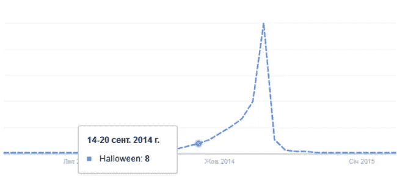
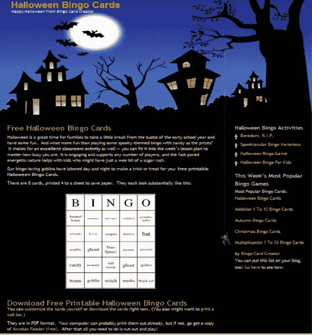
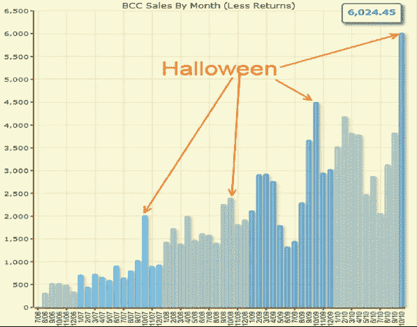
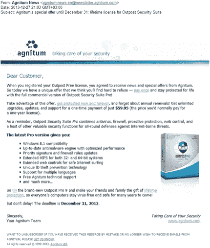
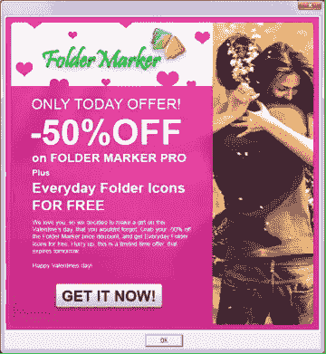

# 如何利用假期增加销售额

> 原文：<https://medium.com/swlh/how-to-take-advantage-of-holidays-to-increase-sales-82b522b08c2d>

## 如何让 1 月成为你 10 年来最成功的销售月？在本季度的前 10 天，你如何能比本季度的其他时间卖得更多？如何让万圣节成为一年中最好的销售日？我们的答案是:开展假日促销活动。这就是这篇文章的内容。你将学会感谢谁，如何正确地做这件事，以及送他们什么礼物。

# 给个理由就好

你想增加销售额吗？找到一个原因，创造特殊的有限优惠。结果:盈利！

说真的，利用假期。你会在文章末尾发现我们的一份奖励——促销日历。

除了通常的新年和国际妇女节之外，日历上还有许多其他庆祝的日子。这是一个神奇的日子，人们不再害怕那些想要拿走他们钱的人。相反:他们很高兴地把钱放进卖家的口袋。你唯一的任务就是选择一个贴近你的观众精神的节日，想出一个献给它的行动，然后把他们的钱放进你的口袋。仅此而已！

最重要的是不要过度。你可以做到——因为这很简单。但还是有细微差别。

# 创造什么样的促销

有些人问自己:“我应该提供什么？”您需要继续询问客户通过购买您的软件想要解决什么样的问题。你必须提供一些东西，帮助他更好、更快或大规模地解决问题。提供互补产品。

“你想加大那个的尺寸吗？”

*在麦当劳收银台*

例如，如果你在卖给照片添加日期的软件，为什么不提供更多的软件来去除照片中的噪声呢？(生活帮:没必要提供你自己的软件。寻找合作伙伴。)如果您销售匿名网上冲浪的软件，在 Skype 中以折扣价提供匿名服务。

对于创意，订阅你最大的竞争对手、大型软件制造商或像亚马逊、易趣或 Ozone 这样的成熟企业的邮件。他们有钱雇佣最好的营销人员，并发布很棒的促销通讯。它们是了解这些营销人员在做什么以及如何做的好方法。

# 关于折扣的一切

最明显(也是最没意思)的促销方式是提供折扣。大家都喜欢少花钱。在节日前夕，打折的消息似乎很自然，让你的报价更有吸引力。唯一的问题是折扣的大小。

我遇到过一些人说折扣对他们不起作用。例如:

*“我提供了 15%的圣诞节折扣，在我的网站上删除了购买页面上的旧价格，并没有注意到销售的激增。我少赚了 15%。”*

为了了解什么是折扣，我建议你研究一下 Groupon 上最成功的促销活动。他们的成功是有原因的。现在，用户对低于 30-40%的折扣并不敏感。(顺便说一下，在购买页面上报告折扣是个坏主意。)

“我们总是尽量给折扣。它总是有效的。折扣应该是权宜之计。在西装上，你甚至可以给 70%。对于普通产品，我们尽量给不超过 50%。”

*帕维尔·冈查罗夫，Soft Orbits 的营销人员，在打折上*

想想除了折扣，你还能给你的顾客什么。也许送一份礼物比打折更有利可图。套件中的第二个产品，附加产品的许可证，1 年免费更新，一部 iPhone。

*“好。圣诞节在街上，消费者有很多可支配收入。然而，你如何说服 PDF 转换器的用户购买 DOC 转换器呢？老实说，其实并没有真正的需要。所以，我们卖的是 PRO 版。客户购买了转换器；还有一个超级版本，有额外的选择和巨大的折扣。这个选项适合大量的人。我们不仅通过购买本身提供优惠，还通过所有未来的支付和升级提供优惠，专业版比传统版更贵。”*

*Olga Lapshinova，Coolutils 营销人员*

# 如何通知用户你的推广

好的，您已经创建了一个促销活动并决定了折扣。下一步是什么？尽可能地谈论它:

发送电子邮件。

生活帮:好的推广不仅是你自己数据库的信息指南，也是合作伙伴基础的信息指南。

将销售额的 50%提供给那些将在他们的主页上为你的推广做广告的人，并增加覆盖次数；

在网站上发布新闻；

在程序本身中显示信息；

向合作伙伴发送横幅；

允许向最近访问过您网站的人进行再销售；

写一篇关于脸书的帖子，并通过付费广告进行宣传；

为了一个好的推广，把上下文广告。

对我们来说，电子邮件仍然是最便宜的通知方式之一，因此它有助于提供最大的营销投资回报(ROMI)。我们使用 MailChimp 和 UniSender 来分发电子邮件。

“我确信人们喜欢简单的人际交流。每个人都欣赏幽默。去年我写过:

祝你和你的家人圣诞快乐！P.S .是的，我应该是正确的，改为写节日快乐。然而，在周游世界后，我注意到大多数人热爱圣诞节，即使他们相信有六只手和蓝色面孔的上帝，而不是基督。毕竟，假期应该让人团结，而不是让人分离。

*响应增加了 50%。”*

*来自 Coolutils 营销人员 Olga Lapshinova 的 life hack*

# 什么时候开始

一般规则是:当人们在考虑一个节日，但是礼物还没有买，而且有钱买的时候。例如，圣诞节促销应该在 11 月底开始。在美国，他们甚至为此想出了一个特殊的日子:“黑色星期五”。在小假期的情况下，提前 48 小时开始销售是很好的时机。

你也可以使用谷歌趋势。输入假期的名称，看看请求的浪潮什么时候到来。你必须在它开始之前做好准备:

要求为节日命名的浪潮

在 B2B 领域，联系不再是假日日期，而是财政年度的结束日期。“如果新的预算从一月份开始，而旧的没有花完，下次他们会给更少的钱。紧急把你所有的花在有用的东西上！”

# 向何处发送促销电子邮件

首先，决定你的建议是针对谁的:用户还是业务部门。沟通方式和发送竞选邮件的最佳时间取决于此。建议书应在工作日开始前一小时出现在客户的 B2B 信箱中。节假日发邮件效率很低。此外，还要考虑时区差异。人们在上班前、午餐时间、晚上和周末查看电子邮件。因此，你的信也应该在这些时候寄出。值得吗？

# 他们如何在假期中赚钱的五个例子

# **如何打造年度最佳销售月**

这里有一个来自 [Patrick McKenzie](http://www.kalzumeus.com/2010/11/01/how-a-half-broken-halloween-promotion-smashed-revenue-records/) 的案例，关于万圣节前夜玩乐透的纸牌销售。他做了以下事情:

1.9 月份，也就是活动前两个月，他做了一个单页的网站登陆，万圣节风格化。

万圣节风格登陆

2.帕特里克抓住了谷歌的一波有机流量，加强了他的 AdWords。

此外，他还通过电子邮件向他的客户发送了一张折扣券。
[并非所有的工具都奏效](http://www.kalzumeus.com/2010/11/01/how-a-half-broken-halloween-promotion-smashed-revenue-records/)，但是 Patrick 这个月赚了 6024.45 美元——这是他一年中销售最好的一个月，比他去年的最好成绩高出 30%。很酷，对吧？

万圣节日程

# 如何在 10 天内“完成”这个季度

来自 Vitali Janko 的案例分析，他曾在 Agnitum 从事营销工作。让他发言:
*我们销售产品——前哨防火墙和前哨互联网安全——保护计算机免受威胁。他们需要不断更新以保护自己免受新的不幸，当然，这些更新是有偿的。在 12 月的最后 10 天里，我们做了以下事情:*
*1。我们开发了一个特殊的应用程序，并邀请人们现在购买它，并获得终身更新。*
*2。我们给他们自己的基地发了一封信，建议他们在年底前购买，以一年订阅的价格获得终身更新。*

Vitali Janko 的案例研究

结果:在 10 天的促销活动中，我们的销售额超过了本季度前 80 天的销售额。我们喜欢它，并且我们把提议延长到一月。由此，1 月成为此前 10 年销售最好的一个月。

# 如何从已经购买的客户那里增加 1000 笔销售

来自 CoolUtils 的营销人员 Olga Lapshinova 举了一个例子:

*“在 2012 年的除夕和圣诞节，CoolUtils 进行了这样的操作:*

*1。对于那些购买了一个转换器的人，我们提出以 19.90 美元的通常价格以 9 美元的价格购买另一个转换器。这是一个很好的指标。给了不可惜就够了，赚了就够了。一些不是很必要的东西，但同时又很便宜，将来可能有用。然而，如果……*

*2。我们创建了一个简单的登录页面，以促销价选择转换器。在我们向邮件列表中的用户发送电子邮件后，他们转移到了这个列表中。结果:我们卖了大约 1000 本。这些都是对现有客户的额外销售，所以结果一般都很好。第二年，类似的销售没有带来任何利润，所以我们决定不再重复。”*

# 一天+500 美元

下面是我自己的例子。我在卖一种给电脑上的文件夹上色的产品，它可以让你突出显示常用的文件夹，组织信息。我让我的设计师快速画一个横幅，并展示给我程序的试用版用户看:

情人节的提议

结果，+500 美元在情人节那天来到了收银台。

# 在圣诞节以 80%的价格出售最贵版本的程序

CoolUtils 的另一个例子。对于购买了普通转换器的当前客户，他们发送了圣诞祝福，其中他们以 70%的折扣短暂提供了专业版作为礼物。赌注是，人们习惯于圣诞促销，会购买熟悉产品的升级版，因为这在心理上比购买新产品更容易。用户立即进入购买页面。结果当月 AMD 版本的销量增长了 80%。这是令人愉快的。更令人愉快的是:未来的付费升级和付费定制。这种推广的成本很低，大约 70 美元。专业版起价 129 美元。

# 我们的一点小奖励

我们将最有趣和最重要的节日聚集在一张桌子上:

# 点击此处下载促销日历

# 简单地说，总结一下

提供节日促销是必要的。

成功促销的组成部分包括:

诱人的促销优惠；

时间限制；

信息传播的广度；

轻松有趣的交流。

另外，这里还有 10 条如何提高网站转化率和如何销售更多软件的建议。

## 这个故事发表在[的初创企业](https://medium.com/swlh)上，这家媒体的出版物拥有超过 256，410 人的关注。

# 订阅[在这里获取头条](http://growthsupply.com/the-startup-newsletter/)。

