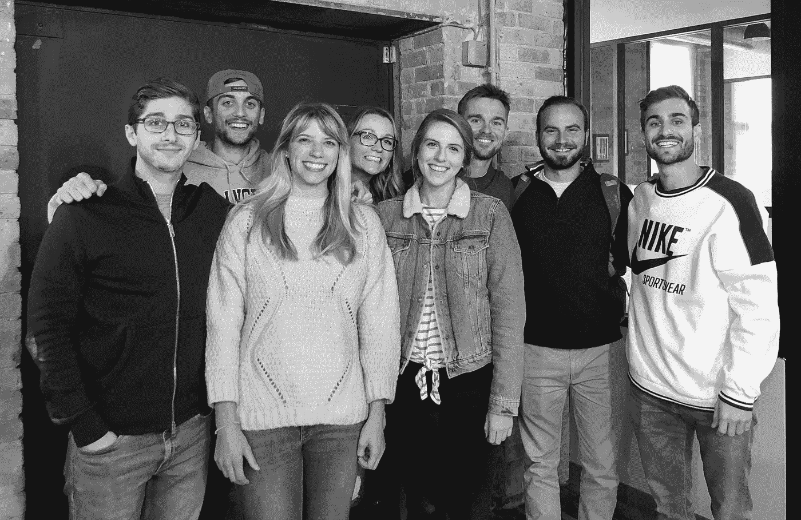

# 如何让你的创业从无到有:

> 原文：<https://medium.com/swlh/how-to-take-your-startup-from-nothing-to-something-99b127f6d967>

1/3 of the DP team, 2018 :)

这听起来像是你想参与的事情吗？”科尔问道

*“我们现在还不能付你钱，但是我们可以雇佣你做实习生。如果时机合适，一切顺利，我们会在你毕业时雇用你。”*

在我有机会思考之前，我的良心回答了这个问题:

*“当然。”*

## 2017 年 6 月。

我刚刚完成大学三年级的学业，正在拼命寻找潜在的“营销工作”(至少，我在谷歌上搜索的是这样)。

当我的一个老朋友让我联系科尔时，我已经写了一年半的个人文章。

两周后，我坐在回芝加哥西郊的火车上，科尔坐在我左边我旁边的座位上。

# **“这叫数字印刷机。”**

当时，他和他的一个最好的朋友德鲁·雷吉是唯一运营 Digital Press 的人，Digital Press 是一家思想领导机构，旨在将创始人、首席执行官和行业专家定位为他们所在领域的思想领袖。

我以前听说过“思想领导力”这个术语，但并没有真正理解，直到科尔给我解释了这个术语:

> *“思想领导力是通过提供信息、教育和娱乐，在你的行业中建立大规模的关系、建立信任和开始新的对话。”*

## *‘够简单’*我想。

那天晚上回到家，我妈问我实习的第一天怎么样——我之所以会在市中心，是因为我刚刚开始在一家保险公司实习。

她指的是实习。

当然，这不是我想的。

*“挺好的。我们晚餐吃什么？我需要为工作查找一些播客，你知道有什么好的吗？”*

*“播客？”她答道，显然很困惑。*“播客和保险有什么关系？”**

我完全忘记了我在 T21 的另一份实习工作。

Welp。

我接着告诉她，我通过一个朋友认识了另一位作家，他正在创办一家名为数字出版社的公司。我显然对此很兴奋。

接下来是所有的难题。

*   *“这家‘初创’公司成立多久了？*
*   他们有有限责任公司吗？
*   你会拿到工资吗？
*   这里有什么计划？
*   你能相信这些家伙吗？”

显然，我没有想到要问科尔这些问题。事实上，在接受我的角色和我的第一个数字媒体任务之前，我没有想过要问科尔任何问题。我去我的房间思考。

我直觉地知道数字媒体对我来说是一个“黄金”机会——我只是*感觉到了*——但我不知道*为什么*。

这家公司实际上只有两个人，德鲁和科尔自己处理一些客户。没有任何明确的角色，没有“规划”的计划，没有结构。正如我后来及时发现的那样，*整个想法*是在 2017 年 6 月那次会议前几周才构思出来的。

那么，究竟为什么我对加入这么有把握呢？为什么，在对思想领导没有任何预先了解的情况下，这一切都有意义吗？为什么我如此乐意接受一份无薪实习，却不知道公司是否能撑过 6 个月？

我疯了吗？我说“是”的决定是因为害怕大学毕业后找不到工作吗？是什么驱使我如此冲动？

我花了很多时间考虑这些问题和类似的问题。每次我问自己为什么对自己的决定如此确定，我都会得出同样的结论:

信念。

# 数字媒体建立在信念之上。

当科尔邀请我成为数字媒体的一员时，我之所以倾向于说“是”，是因为他对此很有把握。

他语气中的自信，愿景中的严肃，对思想领袖有一个*巨大*未开发市场的保证——这就是告诉我的潜意识相信我的直觉，跟着数字媒体走。

尽管这家公司只有两位创始人、几个客户和一个想法，但科尔和德鲁对他们愿景的坚定信念让数字媒体从无到有。

不"我们认为"不“我们可能”不"我们会努力的"

我们*知道。*

我们会的。

我们会做的。

## 这种信念是会传染的。

从那时起，几乎所有加入公司的人都相信科尔的理念、流程和文化，并从一开始就效仿他。

我们每个人都相信公司，相信公司的使命，相信我们的工作是有价值的。

我们的作家优先考虑内容片段中的信念。我们的编辑在提问、研究主题、生成提纲时很确定。我们的业务开发团队以绝对肯定的语气向潜在客户说话。

如我所说，数字媒体是建立在信念之上的。

信念是我们熬过 1 年大关的原因——大多数初创公司熬不过前 6 个月。

信念是我们从 3 名全职员工发展到 20 多名全职员工的原因。

信念是我们从几个试图发表文章的客户，到帮助超过 75 名创始人、首席执行官和公司领导人在各自行业树立权威的原因。

> 如果你想让你的创业从无到有，你需要有信念——对你的概念、你的团队和你自己。

## 感谢阅读:)

## 这篇文章发表在 [The Startup](https://medium.com/swlh) 上，这是 Medium 最大的创业刊物，拥有+ 377，008 读者。

## 在这里订阅接收[我们的头条新闻](http://growthsupply.com/the-startup-newsletter/)。

