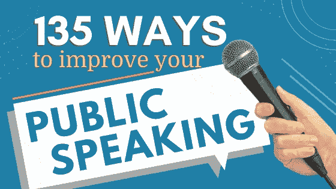

# 如何说话让人们听，听着让人们说话

> 原文：<https://medium.com/swlh/how-to-talk-so-people-listen-and-listen-so-people-talk-7290c6ad55f5>

## 成为一个人语者

随着最近对聊天机器人、人工智能和智能个人助理的所有讨论，你可能会开始认为人与人(H2H)的交流正在完全消失。但事实是，人际交流的需求不会消失。世界经济论坛在其 2016 年工作报告中指出，随着更多的物理和计算任务转移到机器上，对机器*无法掌握的软技能的需求将会增加。*

当然，很难准确预测未来会给我们每个人的个人和职业带来什么。但是，无论你是企业家、小企业主还是商业人士，知道如何说话让人们听，听着让人们说，这将永远对你有好处。

那么，你如何利用你的人性与商业伙伴、员工和同事联系和沟通呢？你可以成为一个人语者。沟通既是一门艺术，也是一门科学。你对别人说的话是你思想和想法的创造性表达。但是你说话的方式和它引起的反应通常是由我们人类的自然本能决定的。

# 成为一个人语者的秘密

为了更好地解释我的意思，我与你分享一些我最喜欢的技巧。通过对你的谈话方式做这些小小的调整——无论是对一大群人还是一个人——你可以更有效地交流，并与你周围的人建立更牢固的关系。

# 1.使用邀请参与的代词。

人类倾向于谈论自己。科学家所说的自我表露实际上是[触发了大脑中的奖励中心](http://www.pnas.org/content/109/21/8038.full)。由于这种倾向，我们在交谈时很容易陷入“我”和“我”的陷阱。然而，用包容性的语言和别人交谈，以个人的名义，会增加他们对你要说的话做出积极回应的机会。因此，选择能够引起参与并表达你与听众合作愿望的代词。如果你知道某人的名字，就用它。大多数人都喜欢被认可。

小贴士:用“你”来称呼听众会让每个人觉得你是在直接和他们说话。而使用“我们”可以建立一种团体感和共同兴趣。

# 2.与你的全身交流。

你知道有一整个领域的研究致力于解释你的身体姿势的意义吗？社会科学家称这项研究为空间学。机器人开发者甚至将人类空间学理论应用于[教授机器人如何表现得更像人类](https://link.springer.com/article/10.1007/s12369-014-0251-1)。如果你仔细想想，你可能已经意识到科学家已经获得的一些信息。例如，考虑身体的方向。如果你正视某人，肩膀与他们平行，你们两个很可能在进行私人谈话。如果你们两个想向别人打开话题，你们两个会稍微远离对方，创造一个开口。当你对一群人或一个人说话时，你可以用这些空间知识来表达你对他们的兴趣。

**小贴士:如果你在台上做演讲，不要在整个演讲过程中一直面无表情。想想一个摇滚明星是如何表演的，记得给侧翼的人唱几首歌。**

# 3.识别并回应你的听众的风格。

大多数人认同四种主要沟通方式中的一种。正如 PageGroup 的 Toreja uri 解释的那样，这些风格被称为[驱动型、分析型、表达型和亲切型](https://www.michaelpage.com.au/advice/career-advice/productivity-and-performance/understanding-your-communication-style)。虽然每个人都使用不同的风格来交流，但我们大多数人更喜欢其中的一种。我们大多数人也发现和与我们风格相似的人交流最容易。为了让你的沟通更吸引人，我建议你了解每一种风格。然后，当你和与你风格不同的人交谈时，调整你的信息以符合他们的风格而不是你自己的风格。

提示:在构思你的信息时，考虑你的听众的观点。对一些人来说，情感成分是必不可少的，而其他人可能更喜欢事实。

你准备好让人们窃窃私语了吗？只要稍微调整一下你接近他人的方式，你就能传达出你对他们和他们要说的话感兴趣。你可以与客户、同事和新的潜在客户建立真正的人际关系。机器人可能能够完成令人惊叹的壮举，但它们无法取代真人聚在一起交流或解决问题时所产生的魔力。

寻找更多的方法来提高你的公共演讲？经过广泛的研究，我们带给你 135 个想法和资源，让你成为一个更好的演讲者。查看 [135 种提高公众演讲能力的方法](https://www.bostonspeaks.com/posts/publicspeakingtips)

喜欢这篇文章吗？给它一个赞，并在下面评论。(基特实际上阅读了他的忠实粉丝的每一条评论)

****

## **准备好战胜公众演讲焦虑了吗？**

点击下面的链接注册我最受欢迎的免费培训。【https://www.bostonspeaks.com/nofearspeaking 

**Kit Pang** 传播专家， [TEDx](http://www.youtube.com/watch?v=OE3nUrTp_KQ) ，[入站](http://www.youtube.com/watch?v=fJj8ZsAmXt0&t=3s)及主讲人， [BostonSpeaks](http://www.bostonspeaks.com/) 创始人。他的使命是帮助个人成为杰出的演说家和沟通者。基特的研讨会和讲座被认为非常有趣、引人入胜、发人深省和富有洞察力。[www.bostonspeaks.com](http://www.bostonspeaks.com)| @ kit pangx，@Boston_Speaks

## 这个故事发表在 [The Startup](https://medium.com/swlh) 上，这是 Medium 最大的创业刊物，拥有 325，962+人关注。

## 在这里订阅接收[我们的头条新闻](http://growthsupply.com/the-startup-newsletter/)。

