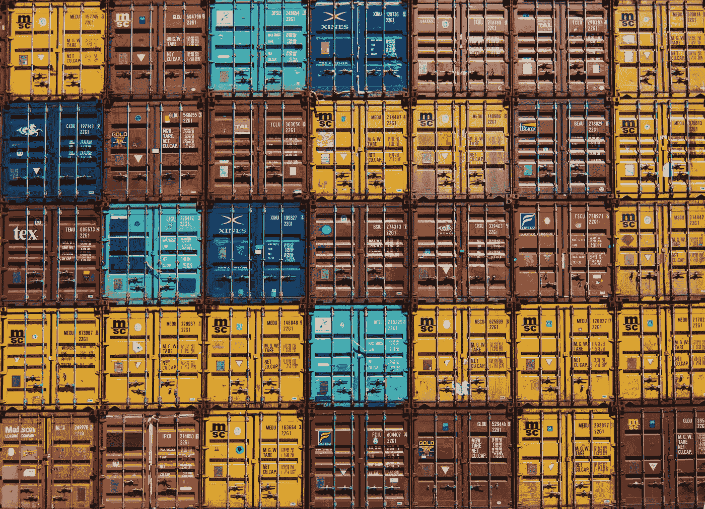
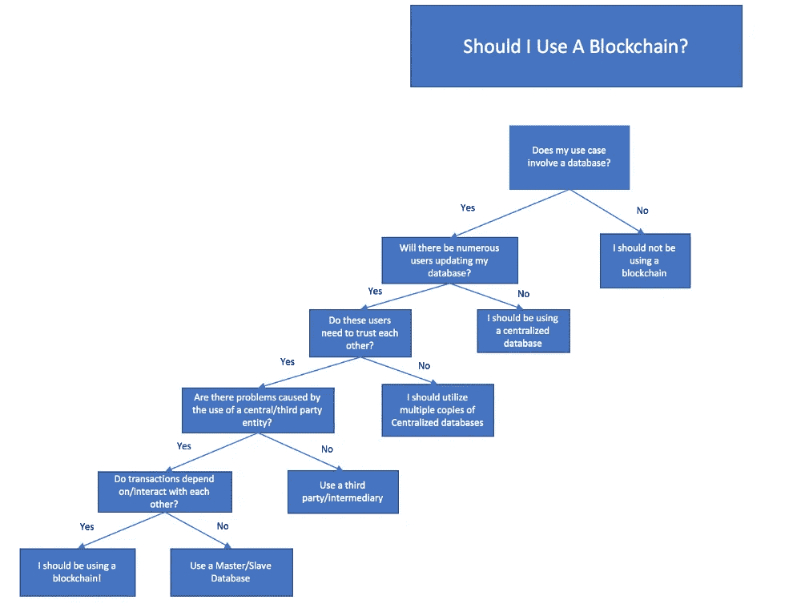
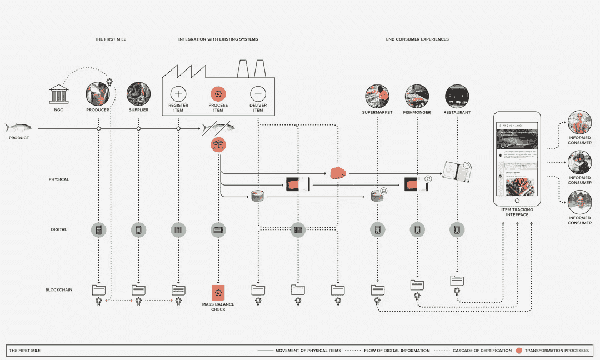
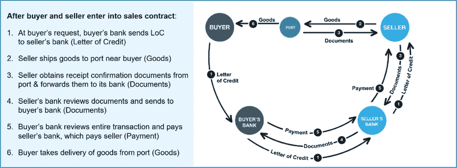
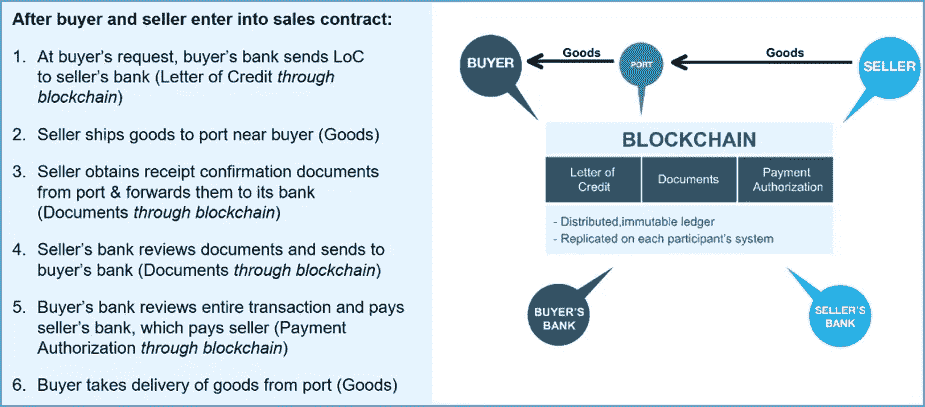

# 如何与公司谈论区块链:一个假设— 1/2

> 原文：<https://medium.com/swlh/how-to-talk-to-a-company-about-blockchain-a-hypothesis-1-2-20e72ee8268b>

## 它是什么，它是如何工作的，它能有用吗？

区块链技术开始引起公司的兴趣:首席执行官、首席技术官、业务和项目经理提出问题，表达疑虑，要求澄清。那里几乎没有专家，我也不认为自己是专家。但是我在过去的几个月——实际上将近两年——记录、研究甚至“弄脏”了代码和框架。我不想成为一个区块链开发商，但要了解一些方面，并能够给出全面的答案，至少我们需要有一个想法是什么隐藏在块。毕竟是块，不是黑匣子(以工程师身份说…)。

让我们假设一个公司代表问你关于区块链的关键问题:是什么？能对我们有用吗？

首先简单定义一下，比如:

***“区块链是一种允许建立和管理一种分布式且不可更改的数字寄存器的技术，在该寄存器中，交易(任何类型)由特定网络的节点来验证。”***

首先你应该解释一下**公共区块链**(你会举比特币或以太坊的例子)和**私人区块链** ( *许可*)之间的区别。[我已经在之前的文章](/swlh/blockchain-disambiguation-problem-ca72916bb51b)中谈过了，所以不要让我显得多余。

我只记得在**私人区块链**(或 **DLT** 、**、*分布式账本技术*、** ) **中，参与者是已知的，有有形和/或无形资产要交换，有保证保密性的程序，只允许直接参与特定交易的实体访问他们的数据(选择性访问和认可)。**通过嵌入在区块链(智能合同)中的特定程序，还可以根据在区块链内执行的定义、安全、可验证和认证的条款自动管理交易。

在我们的例子中，我们说的是列兵区块链。我们必须了解，至少大致了解，公司是否能从这项技术中获益。

网上有几个流程图可以让你很快得到一个大概的答案。我最喜欢的是下面这张。

Source: “[Building it Better: A Simple Guide to Blockchain Use Cases](https://blockchainatberkeley.blog/building-it-better-a-simple-guide-to-blockchain-use-cases-de494a8f5b60)”

简而言之，如果一家公司是一个发达的商业网络的一部分，有几个参与者，如合作伙伴、供应商、客户、托运人、卫星公司，那么可以考虑试验区块链技术的想法。

在这一点上，您需要举几个例子，然后列出采用该技术可能带来的好处。

供应链就是一个很好的例子；毫不奇怪，它是区块链最感兴趣的行业之一，被视为一种“T0”供应链操作系统。

一般来说，供应链中涉及几方，有不同的系统、协议、数据库；有时，关于货物交易和转移的相同数据以不一致或不正确的方式存储。各个阶段都要接受验证和控制，这通常是多余的。产品的精确和严格的可追溯性仍然是个问题。此外，银行、保险公司、监管机构等第三方的介入也是经常需要的。

所有这些都导致效率和成本增加的问题。

**使用区块链意味着拥有一种机制来实现和“构建”双方之间的信任:每个相关参与者都保留自己的交易“分类账”副本，并且总是更新。数据经过验证、完全相同，并且始终可用于控制。还有更直接、更快速的交互，由算法和代码片段管理(智能合约)。**

最有说服力的案例研究之一与[有关，即在印尼开发的金枪鱼溯源系统](https://www.provenance.org/tracking-tuna-on-the-blockchain)。这个平台允许公司高效透明地跟踪他们的产品。在特定情况下，供应链与产品的端到端可追溯性相关联:从渔民到加工行业，从经销商到最终消费者。

得益于移动、 [RFID 标签](https://en.wikipedia.org/wiki/Radio-frequency_identification)或 [QR 码](https://en.wikipedia.org/wiki/QR_code)等技术，捕捞金枪鱼及其部分的每个阶段都被记录在区块链中，由于智能合同，每个阶段都增加了认证并自动执行控制。

该流程图显示了供应链和区块链上记录的步骤，消费者可以通过应用程序查询这些步骤。

Source: [provenance .org](https://www.provenance.org/tracking-tuna-on-the-blockchain)

另一个视觉上有趣的用例是信用证。简化是很明显的。

Example of a letter of credit management without blockchain — Source: [IBM.com](https://www.ibm.com/developerworks/cloud/library/cl-use-blockchain-bpm-manage-legal-documents-letter-of-credit/index.html)

Example of a letter of credit management with blockchain — Source: [IBM.com](https://www.ibm.com/developerworks/cloud/library/cl-use-blockchain-bpm-manage-legal-documents-letter-of-credit/index.html)

总之，使用设计良好的区块链可能带来的优势有:

**不变性**，因为我们处理的数据结构只能添加数据，而不能修改和删除数据(仅追加)。

**安全性和冗余性**，因为数据是加密的，并且是分散的，具有由多方拥有的一致且有效的副本。

**降低成本并提高效率**，因为对第三方的依赖(或因为他们能够参与区块链)减少了，因为交易和支付更快了，因为许多步骤(检查、测量等)。)可以被自动执行、存储并提供给所有相关方。

。**可扩展性**，因为在现有的区块链中增加一个节点，如供应商，比目前用于将新实体整合到业务链中的解决方案成本更低。

如果我们接着考虑**区块链与物联网**等技术的整合，可能性和收益将呈指数级增长:例如，考虑冷链管理和控制。

大概在这一点上，我们设法引起了我们的对话者的兴趣。但迟早会有两个问题。

好吧，但是什么是区块链呢

简而言之，**区块链只不过是一个文件(我们可以将其视为日志文件)，需要一个特定的程序来读取和管理**:使用实现区块链功能的软件，而不是使用 Excel。该程序还管理网络节点之间的通信、授权、协调交易的验证及其在块中的收集等。网络的各个节点之间的通信通过使用 API 和 [REST 型架构](https://ninenines.eu/docs/en/cowboy/2.2/guide/rest_principles/)的互联网进行。

**文件和程序驻留在业务网络中相关参与者的服务器上(或云中)。**

我已经最大限度地简化了，但要了解更多，我们需要深化。事情变得有点复杂。在下一篇文章中，我将使用 IBM 的 Hyperledger Fabric 参考框架进行更详细的介绍。

第二个问题是:

*“这听起来很有趣，但是有没有可能将区块链与公司现有的系统、程序和软件(如 ERP)整合起来？”*

答案可能是“是的，**考虑到区块链对 ERP 或其他数据控制系统的控制水平**”。但这不会是一个简单的手术。还必须考虑到，甚至需要说服其业务网络的合作伙伴接受这项技术。正如提到的案例研究所证明的那样，挑战是不会缺少的。

但是采用新技术总是一个复杂且有时令人沮丧的过程。想一想在工业、商业和金融领域的公司或互联网入口采用计算机的情况。可以说，现在回想起来，付出的努力都是值得的，不是吗？

[*第二部分*](/swlh/how-to-talk-to-a-company-about-blockchain-the-ibm-hyperledger-example-2-2-fb680e9ee346)

*参考文献*

*   [*为什么使用区块链而不是数据库？什么赋予代币价值？*](https://hackernoon.com/why-use-the-blockchain-instead-of-a-database-what-gives-tokens-value-263449681153)
*   [*区块链供应链*](http://resolvesp.com/blockchains-supply-chains/)
*   [*利用物联网驱动的区块链改善供应链和制造业*](https://www.altoros.com/blog/ibm-aims-to-improve-manufacturing-and-supply-chain-by-coupling-iot-and-blockchain/)
*   [*供应链管理的顶级区块链用例*](https://www.verypossible.com/blog/top-blockchain-use-cases-for-supply-chain-management)

## 这个故事发表在 [The Startup](https://medium.com/swlh) 上，这是 Medium 最大的创业刊物，拥有 316，638+人关注。

## 在这里订阅接收[我们的头条新闻](http://growthsupply.com/the-startup-newsletter/)。

