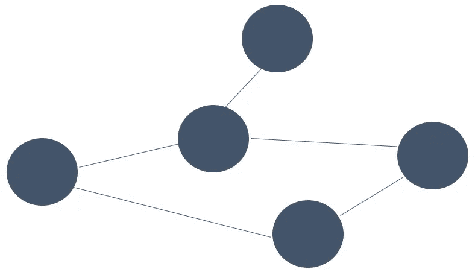
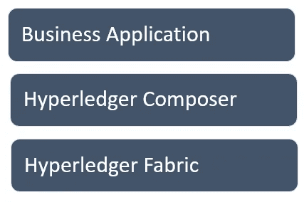
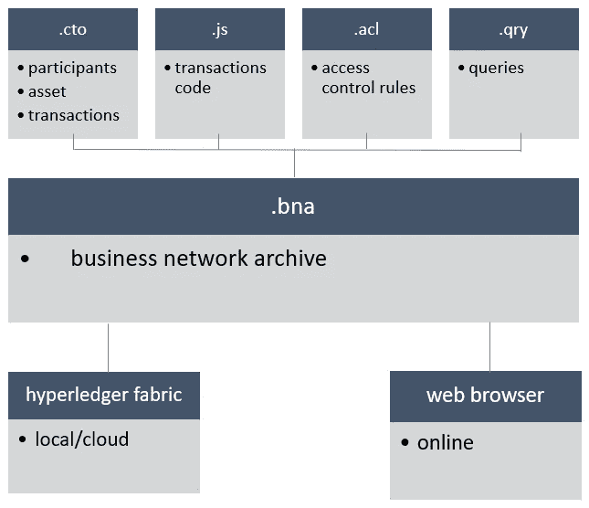
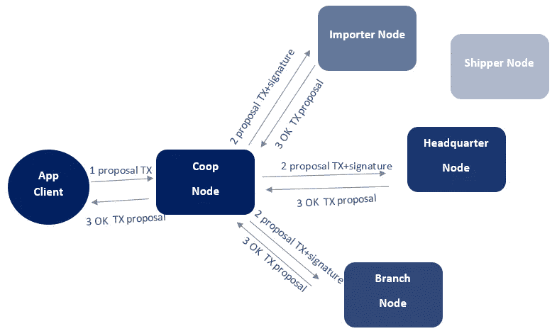
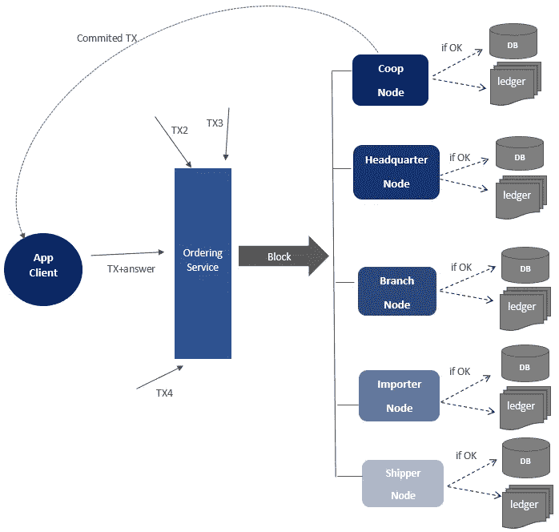

# 如何与一家公司谈论区块链:IBM Hyperledger 示例— 2/2

> 原文：<https://medium.com/swlh/how-to-talk-to-a-company-about-blockchain-the-ibm-hyperledger-example-2-2-fb680e9ee346>

在这个迷你系列的第一篇文章中，我们提出了一种向公司展示区块链技术的可能方法。

现在让我们更详细地往下说。实施企业区块链有几种解决方案。 [*Hyperledger* 是 Linux 基金会](https://www.hyperledger.org/)赞助下的开源元项目，旨在创建可互操作的跨行业区块链技术。有几种变体包括 [*锯齿*](https://www.hyperledger.org/projects/sawtooth) 和 [*Iroha*](https://www.hyperledger.org/projects/iroha) ，每种都有独特的特性和功能。另一个元项目，不开源，为区块链开发业务的是 [R3 财团](https://www.r3.com/) [*Corda 框架*](https://www.corda.net) 。

对于这个介绍，我选择了 IBM 解决方案，它由两个不同级别的模块组成，[*Hyperledger Composer*](https://hyperledger.github.io/composer/latest/introduction/introduction.html)和[*Hyperledger Fabric*](http://hyperledger-fabric.readthedocs.io/en/latest/getting_started.html)。

*Hyperledger Composer* 是一套高级应用程序，使设计业务网络成为可能；所使用的术语与商业、贸易和公司的世界相联系，使得第一个建模阶段更加简单和快速。

它从围绕公司的业务网络的真实结构开始:它创建一个开发和测试的模型，使用 API 和 REST 架构与其他业务系统进行对话。

*Hyperledger Composer* 架构提供了四个模块，它们将被集成到一个扩展名为. bna 的最终文件中。该文件将成为 *Hyperledger Fabric* (真实的区块链系统)的输入和模型。

这些模块是:
- **模型文件**，包含参与者、资产和交易的定义和特征:商业网络的三个关键实体。这是业务分析师的责任。
-**，为不同的参与者定义了不同的权限类型和级别。
- **脚本文件**，本质上包含执行交易的代码。这是开发者的责任。
- **查询文件**，实现不同类型的查询，以读取记录在区块链中的数据。**

****

**Reworked by [IBM Hyperledger Composer schema](https://hyperledger.github.io/composer/latest/introduction/introduction.html)**

**我们举一个简单的商业网络设计的例子，只是为了理清思路。**

**让我们想想巧克力生产供应链。
我们网络的参与者包括:**

*   **农民们**
*   **进口商**
*   **糖果公司**
*   **货运代理**

**资产是任何有价值的东西，可以从一个参与者转移到另一个参与者。**

**显然可可豆是一种资产，但还有其他资产。一次探险是一种资产(可以“嵌入”可可豆)；资产是进口商和糖果公司之间购买和交付一批可可豆的合同。**

**“合同”资产可以通过这些参数来识别，并与这些参与者相关联:**

*   **合同 id**
*   **到货日期**
*   **延误罚款**
*   **->货代**
*   **->进口商**
*   **->糖果公司**

**可能存在其他参数，例如运输期间的允许温度范围。在旅途中、在船上、在卡车上等通过传感器检测温度。:这些数据被传输到区块链。如果超过资产代码中规定和写入的限制，发货人将自动支付罚款。**

**装运可以具有这些参数，并且必须链接至其它资产，即合同。**

*   **发货 ID**
*   **运输状态**
*   **->合同**

**与公共区块链不同，不是所有的参与者都能获得任何信息。运输商无法访问进口商和种植商之间的交易数据。并且代运商无权查看进口商和托运人之间的交易数据。
写在脚本文件中的交易包含管理和完成交易的指令、支付和任何附属条款，如罚款。实际上，这是一系列的“如果发生了，A 执行 B，否则执行 C”。**

**了解区块链如何在所有相关方共同的单一“环境”中自动管理传统上伴随采购和运输的步骤非常重要。如果你使用物联网工具或任何能够通过移动设备、wi-fi、NFC 和蓝牙相互通话的设备，这种自动化可以升级。**

**我们还可以假设有其他参与者具有监督或控制功能。如果商业网络加入了公平交易规则，监管者可以被授权查看种植者和进口商之间的资产合同和交易，以检查是否有足够的付款。政府机构可以在监控来自特定国家的进口的背景下读取区块链。一个质量联盟将核实可可豆的原产地和运输条件。所有这些参与者都可能是区块链节点，尽管他们可能不是块签署者，我们很快就会看到这一点。**

**现在让我们分析更多的技术方面，一个假设的公司 IT 部门的能力。**

**[*Hyperledger Fabric*](http://hyperledger-fabric.readthedocs.io/en/latest/getting_started.html)是一个框架，实现了 IBM 区块链的基本功能，管理节点之间的通信、交易验证的共识机制、块的创建等等。**

**我们将在不涉及太多细节的情况下探索建筑。**

**实现区块链的中央系统执行被称为**链码**(类似于智能合约)的程序，包含状态数据并执行交易。外部应用程序可以通过 API 连接到一个节点，并执行两个基本操作:一个简单的操作，通过类似于数据库查询的查询读取区块链数据；另一个更复杂的操作，涉及区块链更新或事务请求。**

**节点是逻辑实体；在一台服务器上，可以有更多的节点共存。值得记住的是，节点在技术上是区块链和链码的实例，驻留在服务器或业务网络(授权)参与者的云中。**

**有三种类型的节点:**

*   ****对等方**，维护区块链副本并可以验证交易的节点(**背书人**)。**
*   ****订购者**，处理通信的服务节点**
*   ****客户**，发送待批准的交易提案(由背书人)。客户没有区块链的拷贝。**

**在上面的例子中，背书对等体可以驻留在公司的服务器或其南美分公司中，客户可以是种植者，他可能从他的智能手机开始进口商(背书者)对一批可可豆的支付程序(交易)。**

**通常，对等节点也使用传统的数据库，该数据库保存所谓的“世界的状态”，即存储在区块链中的最后数据(在不可变的寄存器中):那时谁负责探险、给定种植者的最后付款、可可豆最后到达农场等。数据库代表交易状态的当前时间的“照片”;它用于提高效率和信息的快速恢复，但从理论上讲，它并不是必不可少的，因为从分类账(ledger)中总是可以重建交易的历史，直到最后确认( **commit** )。请注意，区块链也包含未批准的事务处理。**

***Hyperledger Fabric* 架构的一个重要特征是**通道**；由于一个公司可能是不同业务网络的一部分，因此有必要使用安全和独立的信息流通渠道。每个通道也是受保护的空间，其中凭证和授权是有效的，仅限于该业务网络。把频道想象成独立的 Whatsapp 群组，在其中你可以和一些人交谈，但不能和其他人交谈。参与者也可以是商业网络中的背书者、另一个网络中的客户、另一个网络中的非背书者。**

**现在我们来谈谈管理事务和创建链块。这里你需要一点耐心和关注。**

**我们继续我们的糖果公司和它美味的巧克力的例子。假设对等节点是:**

*   **公司总部**
*   **南美分部**
*   **进口商**
*   **船运公司**
*   **农民合作社**

****背书者节点是前三个。****

**客户是种植者。在另一种模式中，它们也可以是对等的。**

**一个农民想出售一批可可豆。通过智能手机向网络发送交易请求；它通过它的参考对等体来这样做，在这种情况下，参考对等体是对请求进行“数字”签名的合作社。**

**这被传递给其他对等方，特别是传递给保证请求是“格式良好的”、客户被授权执行交易、数字签名是可信的、它还没有被出示等的背书者。背书者通过网络发送他们对请求的响应。**

****

**Step1- Transaction (TX) Request Approval — Based on [IBM.com schema](http://hyperledger-fabric.readthedocs.io/en/latest/peers/peers.html)**

**客户端应用程序收集答案并检查是否满足批准规则(例如，*总部节点*或*分支节点*已经批准了交易)。如果背书人不批准该请求，或者客户没有收到所有必要的售货，则交易提议被放弃，并且在区块链或州数据库中没有任何改变。否则，客户发送与*订购服务*相关的交易和批准。这个服务应用程序将事务分类和分组到块中，并将它们发送给网络中的所有对等方。**

**对等体控制块，即交易和相关的答案，并“标记”为有效或无效；**只有在这一点上，对等体将块添加到它们的区块链副本中，并在新的“世界状态”上更新数据库**。**

**客户将收到通知，告知他交易已被批准(或未被批准)。**

****

**Step 2 — Send request, block construction with other transactions (TX), blockchain commit and DB update (only if block approved), committed TX client alert — Based on [IBM.com schema](http://hyperledger-fabric.readthedocs.io/en/latest/peers/peers.html)**

**被定义为“协商一致”的程序看似复杂，但实际上遵循经典程序，包括启动、控制和核查阶段、签名和批准；不同之处在于，一切都是在极快的时间内自动发生的，相关各方共享一致的数据，并以安全且不可更改的方式存储这些数据。没有电子邮件，没有纸张，没有电话/skype 通话，没有延迟，没有数据差异。**

**[这个 wiki](https://wiki.hyperledger.org/requirements/use-cases/use-case-supply-chain-logistics) 正在收集 *Hyperledger* 的用例:在某些情况下有详细的信息，在其他情况下则更少。但这是一项正在进行的工作。**

**关于*超级账本*的最后一条信息。目前，只有在美国，IBM 已经激活了一个基于 IBM Cloud 的[预配置区块链解决方案](https://console.bluemix.net/docs/services/blockchain/index.html#ibm-blockchain-platform)，有两个可用计划:用于开发和测试的“ [*启动计划*](https://console.bluemix.net/docs/services/blockchain/starter_plan.html#overview) ，以及用于生产的“ [*企业计划*](https://console.bluemix.net/docs/services/blockchain/enterprise_plan.html) ”。第一个是免费的，允许你开发和测试一个有两个组织、两个节点和一个渠道的解决方案。第二个提供了在真实环境中管理区块链的所有基础设施。这是一个有趣的解决方案，因为一旦设置好，您可以邀请业务网络中的其他参与者成为节点，连接到他们自己在 IBM Cloud 中的实例:这包含其自己的区块链副本和典型功能(对等体，特别是事务的认可和块的提交)所需的代码。**

***来源***

 **[## 简介| Hyperledger 编写器

### 您可以使用 Hyperledger Composer 快速建立当前业务网络的模型，包括现有资产和…

hyperledger.github.io](https://hyperledger.github.io/composer/latest/introduction/introduction.html)** ** [## 在 21 天内开发超级分类帐—第 1 天

### 什么是 Hyperledger？

medium.com](/@grsind19/hyperledger-development-with-in-21-days-day-1-ed3c5df88113)  [## Hyperledger Composer 基础，第 1 部分:建模和测试您的区块链网络

### Hyperledger Composer 是一个快速建立区块链商业网络和原型区块链的工具…](https://www.ibm.com/developerworks/cloud/library/cl-model-test-your-blockchain-network-with-hyperledger-composer-playground/index.html)  [## 解释架构-hyperledger-fabric docs 主文档

### 链码信任灵活性。该架构将链码(区块链应用程序)的信任假设与…

hyperledger-fabric . readthedocs . io](http://hyperledger-fabric.readthedocs.io/en/latest/arch-deep-dive.html)  [## IBM 区块链平台

### IBM 区块链平台是一个由 Hyperledger 支持的企业级区块链应用程序开发解决方案…

www.ibm.com](https://www.ibm.com/blockchain/platform/) 

## 这篇文章发表在 [The Startup](https://medium.com/swlh) 上，这是 Medium 最大的创业刊物，有 320，131+人关注。

## 在这里订阅接收[我们的头条新闻](http://growthsupply.com/the-startup-newsletter/)。

**