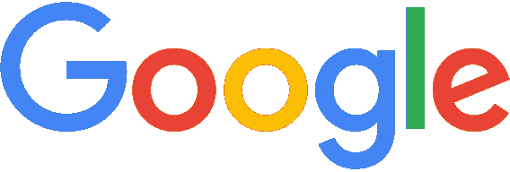

# 如何判断你的 logo 设计是否偷懒

> 原文：<https://medium.com/swlh/how-to-tell-if-your-logo-design-is-lazy-f937d69ce681>

Verizon Logo Compasison New v. Old

不要把这个标题误认为是又一个咆哮的帖子。我来这里不是为了吸引反对我的人的注意。我确实想引起你的注意。但这不一样。

我想谈谈过去一周设计界发生的事件。主要来自威瑞森和谷歌。正如你们大多数人所知，两家公司都推出了在设计领域遭到广泛批评的标志。

My sentiment exactly

然而，它们在标准上是不一样的。我是这两个标记的反对者，因此在过去的几天里，我在 Twitter 上发表了很多意见。但是随着威瑞森重新设计的展示和他们的新闻发布，我开始更加尊重谷歌的尝试。不是因为它是一个好的设计；因为我还没有完全被说服。而是因为这两种情况下传递的信息是交叉的。

现在我想说说懒人设计。

# 谷歌的新 logo 是不是“懒？”

要找到这个问题的答案，我们来看看谷歌官方关于新身份的新闻稿是怎么说的。

他们说，这个标志体现了谷歌众所周知的品质。

> 简单、整洁、多彩、友好

我不想争论这是否真的是谷歌做得最好的，但如果这是他们想在他们的标志中展示的，那么我认为他们做得很好。

它绝对整洁。

毫无疑问，这很简单

肯定是多彩的

这整个想法太幼稚了…嗯，还有什么比看起来像是直接从玩具店出来的字体更友好的呢？

在我看来，谷歌想要在他们的标志中展示的四个品质在最终产品中得到了完美再现。这并不意味着它不能更好，或者以不同的方式实现。它只是意味着重新设计这个经典标志的全部原因正如它所设想的那样已经完成。

如果你读了谷歌的博客文章，忽略任何先入为主的观念，这个标志真的很适合他们的目标。请阅读:

[谷歌设计](http://googleblog.blogspot.com/2015/09/google-update.html)

所以要回答原问题；不

这不是一个懒惰的设计。这可能不是一个伟大的设计。甚至是一个好的设计。但是它存在的目的仍然存在。

# 威瑞森的新 logo 是“懒”吗

第二个案例，威瑞森。

我们可以通过阅读官方新闻稿并确定徽标更改的目的来再次回答这个问题。

> “简而言之，我们实现了数字世界的承诺，我们需要一个标志，以真正属于我们的方式表达我们的目的。”

不幸的是，这种说法成了企业行话。他们到底在说什么？所以他们的标志表达了他们对数字世界的目标。这可以理解…

…或者，如果它不只是一个过度使用的字体和一个粗糙的勾号，它就会是。

但是抛开我个人的想法，我们必须用他们所说的来理解他们的设计是否是一种企业懒惰的行为。

> 新的品牌标识吸收了威瑞森传统的最佳元素，以其颜色和威瑞森“勾号”为代表，并将它们转化为一个新的时代。

这里的想法是使用过去的代表“威瑞森勾号”和升级到一个更现代，简单的外观设计。

然而，他们所做的不过是在 Helvetica 打出的一个单词的末尾打一张红色的支票。本可以有很多其他方式将勾号融入标志的字体中……但它看起来几乎不属于那里。

为什么一开始就使用勾号？

名字中的“Z”怎么了？它上面有线表示“超高速网络速度”

现在，让我们试着回答这个问题。这个设计懒惰吗？

根据我的衡量标准，是的。

目的是寻找旧标志的灵感。为什么整个“勾号”设计都粘在品牌名称的末尾，看起来好像不属于这个品牌。

在新的时代，这是如何改变的？当你需要给首席执行官留下深刻印象时，Helvetica 字体体现了过去，你只需要在 Helvetica 设计标志，并说它是“当代的”

在我看来，这是一个致命的例子，当一个公司试图用公司的话来混淆设计过程，误解设计的真正含义，实现一个目的。

# 结论

我不是这两个标志的超级粉丝。但是，仅仅因为某人不是粉丝，并不意味着他们不能尊重某样东西的本来面目。

当设计某样东西时，懒惰是最大的罪过。如果你所做的全部目的只是一份公关声明，并没有对最终作品进行反思，那就回到画板上来。世界上优秀的设计师会在一瞬间从你身边走过。

# 奖金

It was retracted because the Gap people got a clue.

我真的很想在写作中提到这个形象，但是我找不到一个适合它的方法。这是懒惰的最大例子之一。这也是继威瑞森马克之后的又一次失败。

*发表于* **初创公司、旅游癖和生活黑客**

-