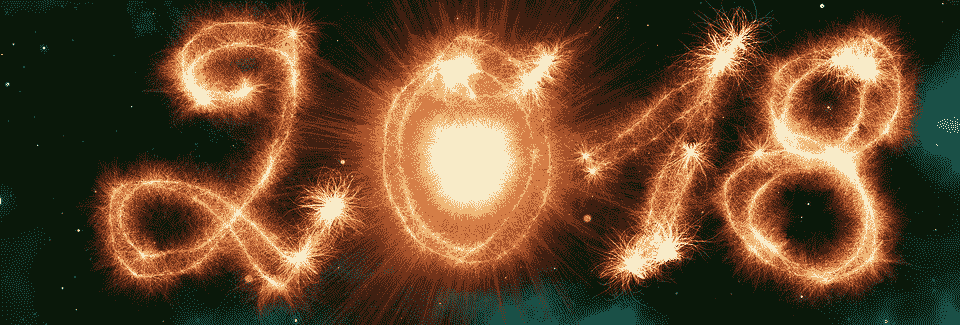

# 如何在 2018 年彻底重塑你的生活

> 原文：<https://medium.com/swlh/how-to-totally-reinvent-your-life-in-2018-b948aebb5796>

## 你是否厌倦了那些你已经许下并不断对自己许下的无数破碎的承诺？

你会继续把今天能做的事情拖到明天，几周、几个月甚至几年后才意识到明天永远不会到来吗？

你已经放弃成为最好的自己的希望了吗？

如果以上陈述中有任何一条是正确的，那么请继续阅读我关于如何在 2018 年及以后彻底重塑你的生活的建议。

你听过甘地的名言吗~ *幸福是当你所想、所言、所行和谐一致的时候~*

如果你今天之前不知道，那么至少你现在知道了。我猜你被这篇文章吸引的原因是因为你真正追求的是幸福。为什么不呢，毕竟，快乐是你与生俱来的权利。

然而。在生活中，你通常不会得到你想要的，你会得到你认为你应得的，因此，显而易见的是，要真正快乐并完全能够重塑你自己和你的生活，一切都要从自爱开始。

有许多文章、书籍和视频都围绕着自爱这个热门话题，所以我不会穷尽这个话题。不过我想说的是，当你完全爱自己时，你不会接受任何低于“最好的你”要求的东西。

当我在 2008 年第一次开始我的自爱之旅时(这是一个持续的过程，因为总有改进的空间),我决定要像对待一个新生儿一样对待自己。

这包括积极的自我对话，健康的饮食习惯，不喝酒，强烈的成功决心，对他人和自己无条件的爱，对我的生活空间的最小化，每天感恩并经常回馈。

如果你真的想重塑自己，那么你必须明白这到底意味着什么。没有捷径可走，也不可能循序渐进。我的建议对一些人来说可能是激进的，对另一些人来说可能是疯狂的。

到目前为止，你可能已经学会了一次消除一个坏习惯，或者战略性地解决你面临的每个问题。如果到目前为止这对你有用，那么向你致敬，然而，恕我直言，我完全是在明智地利用时间，如果你希望 2018 年成为你有史以来最好的一年，那么我相信你会同意没有时间可以浪费。

请考虑一下你想成为什么样的人。不仅仅是因为你的职业，而是因为你想成为什么样的人。她或他的身体看起来是什么样的，你一天中最常感受到的情绪是什么，你的银行账户每月有多少钱，你怎么说话，你和谁说话，你住在哪里，你是单身还是在谈恋爱等等。

我想你明白了。

首先在你的脑海中建立一幅画面，然后写下你看到的一切。纸上的墨水总是让事情看起来更清楚，或者我喜欢称之为(给宇宙的情书)。

一旦你知道你想要什么，你就可以开始那样做了。毕竟你也是人啊！所以，做你想做的人。

你会给新生婴儿酒精、香烟或垃圾食品吗？我猜你的答案是否定的。为什么不呢？因为你知道这会伤害婴儿，我希望你不会伤害婴儿。

现在就做决定吧，2018 年将是你发现真正的自己和自己能力的一年。我不是要求你简单地用 10 个统计上注定失败的决心开始新的一年，我是要求你对你的生活做一个 360 度的彻底转变。

*“这意味着你要改变你生活中目前感到痛苦的每一个领域。”*

你现在就改变它！

没有借口，没有游戏，没有判断。事实上，想都不要想，只管去做。思考会导致焦虑和拖延，我不希望你也这样。

如果你相信它，你就能实现它，所以相信你最好的自己。如果你发现自己在任何时候偏离了轨道，不要担心，一旦你发现自己回到了 2018 年的重塑。

# 所以，让我们快速回顾一下如何在 2018 年彻底重塑你的生活

*1。想象你想成为的人(最好的自己)。*

*2。写下来，拍照片，相信自己的眼光。*

*3。宣称它已经是你的了，并愿意为了最好的你而完全牺牲过去的你。*

*4。请记住，你就像一个新生的婴儿一样珍贵，永远不要给自己或对待自己比这更少。*

*5。开始你的 360 度人生大转变——立即消除任何对你不利的事情。*

*6。不要回头看。以前的你已经一去不复返了！*

7。保持在正确的轨道上，如果你犹豫了，就回到正确的轨道上。

我听说养成一个习惯需要 21 天，而改掉一个习惯需要同样长的时间。因此，如果你坚持你的计划至少 21 天，它会变得更容易'我保证'

你的大脑会开始把你的新习惯和习惯与你正在成为的人联系起来，直到旧的你消失。

你生来就不是为了变小和融入人群。你有这个世界需要的天赋和人生目标。这些只有由你最好的自己来传达时，才会真正有用。

所以从今天开始，愿你的余生成为你生命中最美好的时光。

直到下一次，

祝你在 2018 年及以后拥有爱和富足。

维多利亚·格兰特十世

*如果你喜欢这篇文章，让我们在我的博客空间* [*联系*](https://victorygranted.co.uk/) *，在这里你可以注册领取你的* ***免费电子书*** *释放你力量的三把钥匙*

点击这里查看我的 YouTube 频道[https://www.youtube.com/channel/UCreF8-HuO5SFyKSK2MLbNdw](https://www.youtube.com/channel/UCreF8-HuO5SFyKSK2MLbNdw)

## 这个故事发表在 [The Startup](https://medium.com/swlh) 上，这是 Medium 最大的企业家出版物，拥有 291，182+人。

## 在这里订阅接收[我们的头条新闻](http://growthsupply.com/the-startup-newsletter/)。

