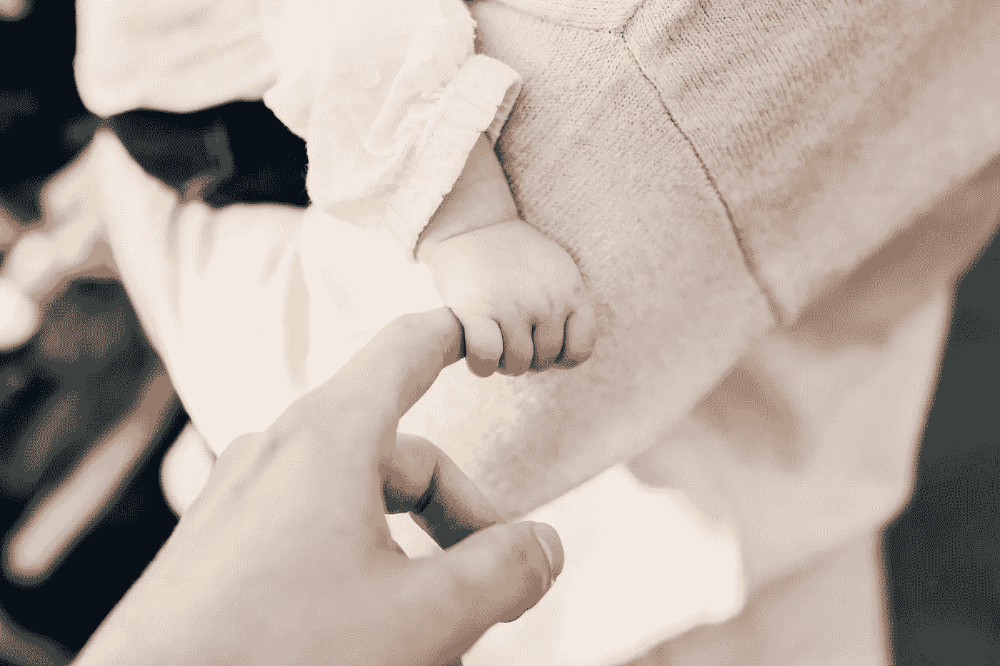

# 如何正确对待你的员工——不用那些华而不实的东西和设计师办公室

> 原文：<https://medium.com/swlh/how-to-treat-your-employees-right-without-all-the-flashy-stuff-and-a-designer-office-a77abd6bee9e>

Photo by [chuttersnap](https://unsplash.com/photos/_jFDQJfCTyA?utm_source=unsplash&utm_medium=referral&utm_content=creditCopyText) on [Unsplash](https://unsplash.com/search/photos/office?utm_source=unsplash&utm_medium=referral&utm_content=creditCopyText)

善待你的员工并不意味着给他们一间配有名牌家具的漂亮办公室、一部昂贵的公司手机和丰厚的餐费。事实上，你应该回到基础。我在瑞典和香港都工作过，你可能想学习我的经验。

# **工作，工作，工作，更多的工作。**

Photo by [Tim Gouw](https://unsplash.com/photos/NSFG5sJYZgQ?utm_source=unsplash&utm_medium=referral&utm_content=creditCopyText) on [Unsplash](https://unsplash.com/search/photos/working-at-night?utm_source=unsplash&utm_medium=referral&utm_content=creditCopyText)

当我在香港工作时，长时间工作象征着努力工作。长时间工作并不意味着一天 9 个小时没有休息，它意味着从早上 6 点工作到午夜，你在办公室，在你的电脑前吃三餐。你不能在老板之前离开，你必须在他或她之前开始你的一天。一些公司在他们的办公楼里有一两个淋浴间，不是用来在锻炼后洗澡的。它是为通宵工作的职员准备的。

大多数人留下来额外工作只是为了取悦他们的老板。一些人额外工作是因为他们有太多的事情要做，但他们不知道这样长时间的工作不仅没有帮助，反而会影响他们的生产力，更不用说长期的潜在健康问题了。

在瑞典，恰恰相反，雇主反对长时间工作。标准是每天工作 8 小时，每周工作 40 小时。如果你愿意，你可以加班，但加班并不意味着你很努力，也不能保证你会因此加薪。

这两个国家在工作时间方面有着非常不同的工作文化，但有一点是共同的——企业照常运营，长时间的工作并不会使企业更加成功和盈利。那么，为什么要建立一种有毒的工作文化来鼓励你的员工工作到他们倒下或者辞职呢？

# **我不敢生病！**

Photo by [Kelly Sikkema](https://unsplash.com/photos/RmByg5kFfQg?utm_source=unsplash&utm_medium=referral&utm_content=creditCopyText) on [Unsplash](https://unsplash.com/search/photos/sick?utm_source=unsplash&utm_medium=referral&utm_content=creditCopyText)

在香港，即使生病也要上班是很平常的事。你咳嗽，打喷嚏，甚至发高烧，如果你想保住工作，你就必须去上班。生病时工作会影响质量，发烧时呆在办公室实际上是在试图传染给你的同事。(除非这是你的目的！)

在瑞典，如果你生病了，你就呆在家里。句号。如果你长期休病假，国家会照顾你，你不必担心你的工作，你的财务或你的医疗费用。香港没有这种东西。如果你生病了，除非你有某种私人保险，否则你必须担心一切。字面上。

作为老板你应该怎么做？首先也是最重要的，要体贴。人会生病。其次，试着提供比法律规定更多的东西。你猜怎么着——额外的带薪病假可以提高忠诚度和离职率。

# 做父母很棒，但也很有挑战性，令人疲惫不堪——帮助他们。

Photo by [Joshua Reddekopp](https://unsplash.com/photos/qLFJKFBppPM?utm_source=unsplash&utm_medium=referral&utm_content=creditCopyText) on [Unsplash](https://unsplash.com/search/photos/baby?utm_source=unsplash&utm_medium=referral&utm_content=creditCopyText)

不要误解我，香港有很多爸爸妈妈。在香港成家是可能的，非常可能，但这是有代价的。你可能听说过，住房贵得离谱。然而，工作如何影响香港的家庭生活？让我们从最开始说起——产假。

**母亲有权享受几周的产假？**
10 周。这怎么可能呢？大部分宝宝还在通宵尖叫(不是通宵睡觉！).嗯，那是家里的问题，不是公司的问题。

**孩子大了，时不时会生病是很自然的。香港的家长能做什么？休假去照顾生病的孩子。平均假期待遇？7-14 天，取决于你为雇主工作的年数。**

在瑞典，父母双方每次怀孕共享 480 天的产假(或育儿假)。当你的孩子生病时，你不工作，国家支付你 80%的工资，这样你可以呆在家里直到你的孩子康复。

你好奇别的公司给员工提供什么吗？看看这张[图](https://fairygodboss.com/maternity-leave-resource-center)，它是 Fairygodboss.com 制作的。网飞提供 52 周带薪产假，Spotify 和 Etsy 提供 26 周带薪产假。这些额外的几周对父母来说意义重大！

# 我想提供更好的工作条件，我应该从哪里开始？

和你的所有员工开一次会是个好主意，讨论工作条件，并获得他们的反馈和期望。会议是一个与你的员工发展良好关系的好机会。如果会议不可行，也许你可以从调查开始，然后分享结果，不要忘记你的行动计划。作为一名领导者，你需要言行一致，这意味着你需要成为榜样，而不是长时间工作，努力实现工作和生活的平衡。如果你的盘子里有太多的食物？雇用额外的帮助和授权。好的工作条件意味着快乐的工作环境。快乐的工作场所可以提高生产力。高生产率意味着更大的利润。这不就是终极目标吗？

## 这个故事发表在 [The Startup](https://medium.com/swlh) 上，这是 Medium 最大的创业刊物，拥有 321，672+人关注。

## 在此订阅接收[我们的头条新闻](http://growthsupply.com/the-startup-newsletter/)。

