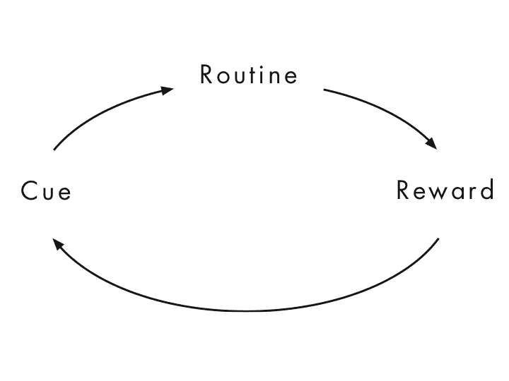

# 如何巧妙地欺骗你的大脑来帮助你成功

> 原文：<https://medium.com/swlh/how-to-trick-your-brain-into-helping-you-succeed-e380c976021b>

Photo by [JESHOOTS.COM](https://unsplash.com/@jeshoots?utm_source=medium&utm_medium=referral) on [Unsplash](https://unsplash.com?utm_source=medium&utm_medium=referral)

有多少次你后悔没有做某事？

你想出了一个好主意，然后你的大脑总是告诉你坚持下去。

当你犹豫并开始考虑事情的时候，你不知何故说服自己不要这么做。

如果你错了呢？

*如果你失败了呢？*

*如果你看起来很蠢怎么办？*

接下来你就知道了，你想要的东西都没有得到，你只剩下一堆遗憾。

这种情况经常发生，糟糕的是，这实际上是你的大脑真正帮助你解决问题的方式。

# 你的大脑寻找你的违反直觉的方式

大脑中杏仁大小的部分叫做杏仁核，它帮助你生存。如果你被美洲狮追赶，它会告诉你逃命。

虽然杏仁核在威胁生命的情况下对你有很大的帮助，但在涉及到你的个人发展时，它不是最好的。它通过做以下事情阻碍你的成长。

## 拖延

关于你的大脑为什么让你拖延的有趣的事情是帮助你缓解压力。你通常已经不知所措了，所以暂时把事情推迟会让你感觉更好，因为不必去做。

当你的大脑在这些时候寻找你的最佳利益时，你知道这是一个等待爆炸的定时炸弹。事情的结局比开始时糟糕得多。

## 害怕

恐惧是人们无法完成他们最想完成的事情的头号限制因素。这就是为什么大多数梦想在付诸行动之前就夭折了。

无论是害怕走出你的舒适区，做不熟悉的事情，还是看起来像个傻瓜，恐惧都是你的大脑用来试图保护你免受情感伤害的东西。

这样做的坏处是，你最终永远不会对那些对你重要的事情采取行动。

> 具有讽刺意味的是，恐惧是阻止你实现你最想要的东西的原因。

## 生存模式

当你的杏仁核被激活时，你处于一种生存模式，通常被称为战斗或逃跑状态，在这种状态下，你的身心完全被生存的优先权所消耗。

这种状态实际上不仅仅是在生命受到威胁的情况下才会激活，压力也会激活这种状态。因此，当你因为生活中发生的所有戏剧性事件而处于精神崩溃的边缘时，你的大脑试图通过将你置于生存模式来保护你。

但是这有一个大问题。

> 当你处于生存模式时，你不是在思考模式。

你的大脑中有一部分叫做额叶前部皮层，它涉及重要的技能，如批判性思维、决策和组织。

当你进入生存模式时，你的前额叶皮层会暂时关闭。

所以，当你有很多问题要处理，你被压力压得喘不过气来时，你的大脑实际上关闭了你需要找出解决这些问题的最佳方法的东西。

# 如何帮助你的大脑帮助你

为了让我们的大脑停止利用违反直觉的方法来帮助我们，我们现在就可以开始做几件简单的事情来摆脱困境，创造我们希望在生活中看到的结果。

## 沉思

有大量的科学证据表明冥想可以帮助你的大脑处于最佳状态。一件值得注意的事情是，大脑扫描显示，冥想的人杏仁核实际上缩小了，前额皮质变厚了。

这基本上意味着冥想帮助你处理你的压力，并利用你大脑的思考部分来帮助你处理它，以克服你的挑战。

有很多神奇的冥想指导应用程序可以帮助你平静心态，帮助你恢复精神状态。我个人最喜欢的是[顶空](http://www.headspace.com)，有免费版。

## 养成良好的习惯

研究表明，我们一天中有 40-45%的时间不是主动做出的决定，而是一种习惯。习惯的功能是帮助我们将日常生活中的日常活动自动化，这样我们就可以在这些事情上花费更少的大脑能量，从而解放我们的大脑，进行更重要的更高层次的精神活动。

习惯是一个循环，由线索、常规和奖励组成。

[http://charlesduhigg.com/how-habits-work/](http://charlesduhigg.com/how-habits-work/)

例如，压力可能是一个提示，让你开始抽根烟休息一下，而回报是你的压力暂时减轻了。

养成好习惯的关键是真正改掉一个坏习惯，用别的东西代替常规。

在吸烟的例子中，你可以试着休息一会儿冥想，而不是通过吸烟来缓解压力。

## 采取大量不完美的行动

对失败和拒绝的恐惧是不做某事的强大动力，但行动是在你的生活中创造真正结果的唯一途径。

> 不完美的行动胜过完美的不作为
> 
> —哈里·杜鲁门

我们中的许多人在最重要的时候不采取行动的原因仅仅是因为我们不喜欢它。

> 我们依靠动力和灵感来帮助我们实现目标，但事实是它不起作用。

持续不断地采取大量不完美的行动是在你的生活中激发成长和产生结果的唯一方法，因为虽然你可能有实现所有大目标的愿望，但你永远不会有这种感觉。

我很确定顶尖的健美运动员不会**觉得**喜欢每天进行剧烈而长时间的锻炼。

最好的作家不喜欢每天早上 5 点起床写 3 个小时的文章。**。**

最优秀的企业家不会**觉得**喜欢做所有不知疲倦的工作来确保他们的生意成功。

> 当你开始关注自己和可能出错的地方，而不是帮助你成长所需的东西时，你已经失败了，因为现在你没有采取行动。

想想那个过去 10 年一直梦想成为一名演员，但因为害怕自己不够优秀而从未报过表演班的人。

有什么梦想你没有去实现，因为你花了更多的时间去担心它，而不是努力去实现它？

# 当你试图成长时，你的大脑会抗拒

当你要走向有助于你成长和变得更好的东西时，你的大脑会抗拒。

因为它还不知道会发生什么，也不知道这个动作会给你带来什么结果，它会激活你的恐惧和担忧，试图保护你免受伤害。

这就是所有那些*“如果”*问题的来源。

这些都是有效的问题，但问题是这些问题总是 100%让你停滞不前。

所以下次你想做大事时，提醒自己，这不是膨胀或伤害你的自我。更多的是你为了成长需要经历的经历。

它将永远在你的舒适区之外。会疼的。这将是困难的。

这只是一个我们都必须接受的简单事实。

梦想名利很容易，但为之努力却很痛苦。

所以，大胆梦想，改变世界。

# 如何活出你独特的使命

我相信每个人都有一套独特的激情和才能，可以帮助满足世界上存在的一个重要需求。不幸的是，对大多数人来说，这些才能和激情被埋在日常生活中的所有压力和艰苦工作之下。

如果你厌倦了过着感觉离你想要的地方越来越远的生活，你可以下载我的免费练习册， [**“下一步是什么？找到你独特的使命的四个极其重要的步骤，对于一些实际的事情，你可以从今天就开始做，找到你在这个世界上找到自己位置所需要的清晰。**](https://mailchi.mp/5c5e7e88d734/a5kf1u3opu)

为保持生活的美好干杯。

## 这篇文章发表在 [The Startup](https://medium.com/swlh) 上，这是 Medium 最大的创业刊物，拥有 336，210 多名读者。

## 在这里订阅接收[我们的头条新闻](http://growthsupply.com/the-startup-newsletter/)。

