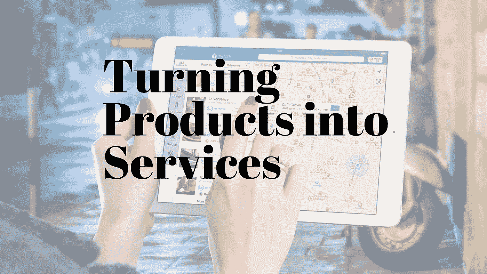
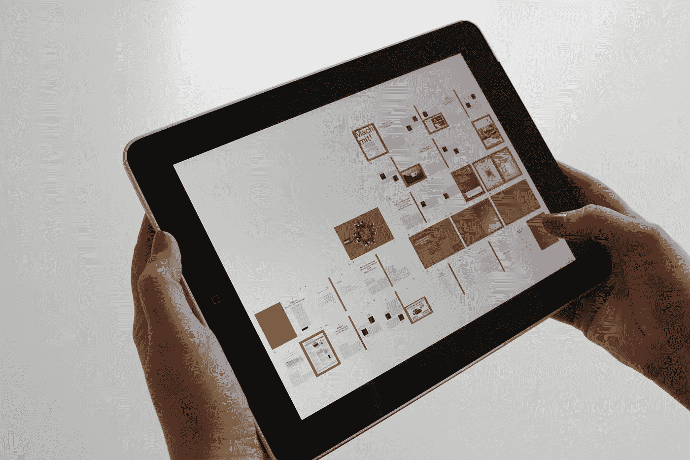

# 如何把一个产品变成一个成功的服务？

> 原文：<https://medium.com/swlh/how-to-turn-a-product-into-a-successful-service-209cc5a166cc>

仅仅从产品中榨取利润已经不像过去那样了。今天，由于互联网和全球分销，消费者有足够的选择。对他们来说是好事，但对销售这些产品的我们其他人来说就不那么好了。公司开始意识到产品只能让我们到此为止，而服务才是未来。最具创新精神的公司已经开始明白，即使在销售产品的同时，他们所做的也是销售它所提供的功能。现在，你可能明白这一点，但使用这一知识重新创造一个真正的基于服务的商业模式完全是另一回事。

服务业的崛起让许多以产品为基础的公司举步维艰，它们很难打入服务业。物联网创造了公平的竞争环境。今天，由于智能技术，很容易看到一个厨房用具，一双靴子，甚至一个板球球棒如何提供服务。现在，赚钱的不再是产品、微波炉或蝙蝠本身，而是产品背后的服务。公司实际上是在销售购买产品的服务或用途。这样，产品开始变成一种辅助手段。你问你的顾客一个月要修剪多少次草坪，而不是他们想要什么样的割草机。制造业的巨头们正朝着这个方向前进。采用这种服务模式的公司不必不断向用户转售产品。这不仅减轻了销售负担。这也意味着持续的收入流、更好的物联网产品开发和更强的客户关系。

# 今天的消费者

通过光纤传输数据很快就变得像通过铜线传输电力一样重要。无论你是对拖拉机感兴趣，还是对健身可穿戴设备感兴趣，公司都将不得不谈论他们的产品。现在，物联网不仅仅是让公司超越静态产品。物联网使公司能够满足当今不断变化的消费者的需求。

如今，消费者比十年前要求更高，信息更灵通。他们想要独特的体验和持续的价值。光靠产品已经不够了。除了贴上字母组合和选择颜色之外，独立产品的个性化不能超过一定程度。产品无法学习你的行为和偏好。它们必须不断升级。即使这样，它们也不会变得更好，很快，它们就过时了。消费者越来越把拥有任何东西视为只是观望和等待，因为他们试图控制自己实物资产的下降。在这个市场中，要想在物联网领域保持敏捷，你必须采用循环收入模式。

# 订阅体验

为了满足当今消费者的期望，公司必须创造基于行为学习和适应的服务。自主改进自己的服务，可以真正定制并最终从产品体验转向订阅体验的服务。

当然，可能总是涉及到实际的物理对象，但问题不应该是“一个支持互联网的设备能做什么？”而是“用户想要什么，我该如何提供，不是作为一个独立的产品，而是作为一个直观的服务？”

# 使用技术过渡到服务模式

这个旅程通常从智能手机和软件即服务技术开始。然而，通常情况下，营销人员不会想到用一个应用程序来宣传他们所卖的东西。那是对资源的不良利用。为什么你的用户想要下载一个链接到你的广告单或网站的应用程序，更不用说为它付费了？他们寻找的是有价值的产品，提供服务的东西。仅仅拥抱不同的技术可能会短暂地推动销售，但就其本身而言，它们不会赢得长期客户。但是，当你为用户提供与产品相关的服务时，你就不再只是一个营销人员了。你是合伙人。

# 创建基于服务的产品的步骤

连接设备的第一步必须是提高效率。但是，下一个是关于可能性。降低我们机器的价格，并选择向小实验室出售惊人的分析平台订阅，如何？如果我们能给发展中国家的医生提供和发达国家一样的技术能力会怎么样？产品本身开始从大局中淡出。了解你的客户和市场总是一个很好的起点，但以下是一些需要考虑的额外要点:

*   使用订阅模型。改造现有产品，将财务模式从销售“商品”转变为销售服务。为此，将金融模式从出售“商品”转变为出售“时间”。比如，正常运行时间、交付速度、时间节约，或者任何利用时间价值为客户创造新的、有吸引力的东西的东西。这也将帮助你预测你的收入。
*   构建新的服务来补充您已经成功完成的工作。这样你就可以扩展你所提供的价值。问问你自己，你还能做什么来增加你的销售？尝试提升体验。添加教育或其他互动体验，在进一步满足客户需求的同时强化核心业务。从更广泛的用户需求角度出发，整合更全面的服务和产品，包括如何为产品定价和融资。
*   快速建立原型来测试您的服务。在了解用户是否真的会购买之前，不要贸然进入一个基于服务的产品。原型制作的关键是构建产品的主要功能，然后让客户对其进行调整。他们的反应将成为你决定是否推进这个想法的基础，让你建立他们想要的，而不是你认为他们需要的。对于基于服务的模型，您可能需要测试不同的硬件包、服务层和用户界面。接受原型法，提前了解用户对你的服务有什么期望，以及他们愿意为此支付多少钱。
*   建立一个观众群。撰写博客。有了与成千上万每日读者的直接联系，你可以将博客作为销售订阅的主要营销工具。或者甚至举办一次会议也会帮助你建立一个自然的听众群。
*   不要给自己找借口。在服务行业中，客户永远是第一位的，所以很难找到时间为你的产品服务。这应该成为一个有机的动机:要么冒着失去客户的风险，要么更快地开发产品。记住，一旦你有了几个订户，你就开始赚到足够的钱来支付顺便咨询的收入。
*   人们不想被卖给。现在，顾客比以往任何时候都更希望在个人层面上与品牌打交道。基于服务的模型使这成为可能。你不再要求用户每次开发新产品时都掏腰包:你在问如何让企业更有效率，让他们的生活更轻松。Adobe 的 Creative Cloud 之所以如此成功，得益于“合作伙伴”的理念。客户想要的是长期关系，而不是每次公司推出新产品时的推销。

未来几个月，消费者将大量转向联网设备，从家庭到汽车再到可穿戴设备。要想成为这一浪潮的一部分，企业需要与旧的基于产品的商业模式彻底决裂。这种转变不是“即将发生”的，也不是缓慢停滞的向半心半意的订阅模式转变的标志。它要求一个人带领公司的所有部门，而不仅仅是部分部门，干净高效地完成转变。这种转变需要强大的胃。事情肯定会变得艰难，但你必须保持专注，继续将公司转向另一边，直到你安全到达那里。但如果你能实现这种转变，另一方面的回报是，你感觉自己拥有一家由自己掌控的企业。

# 结论:

随着公司将自己改造成基于订阅的平台，失败和成功一样多。在 CognitiveClouds，我们很高兴能够置身其中。我们正在和世界上一些最大最好的公司进行谈判。归根结底，物联网不仅仅是拓宽产品的功能。它是关于创造一个不同的空间，在那里产品转化为服务。您的公司不必独自完成这一旅程。给我们打个电话，了解一下 [SaaS 开发公司](https://www.cognitiveclouds.com/custom-software-development-services/saas-application-development-company)如何帮助您将您的产品提升到下一个水平，即服务水平。

*原载于* [*产品洞察博客*](https://www.cognitiveclouds.com/insights/) *来自 CognitiveClouds:* [*顶级 SaaS 开发公司*](https://www.cognitiveclouds.com/custom-software-development-services/saas-application-development-company)

## 这个故事发表在 [The Startup](https://medium.com/swlh) 上，这是 Medium 最大的企业家出版物，拥有 287，184+人。

## 在这里订阅接收[我们的头条新闻](http://growthsupply.com/the-startup-newsletter/)。

