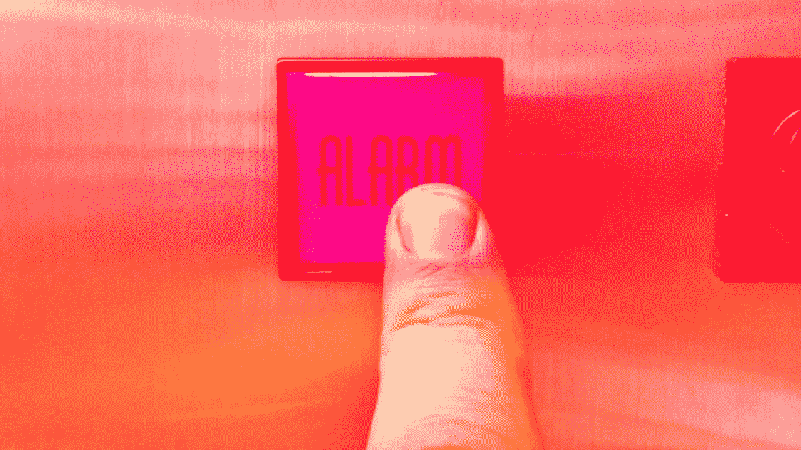
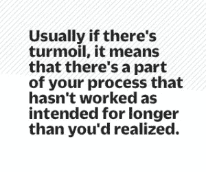
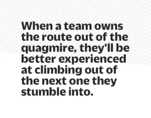
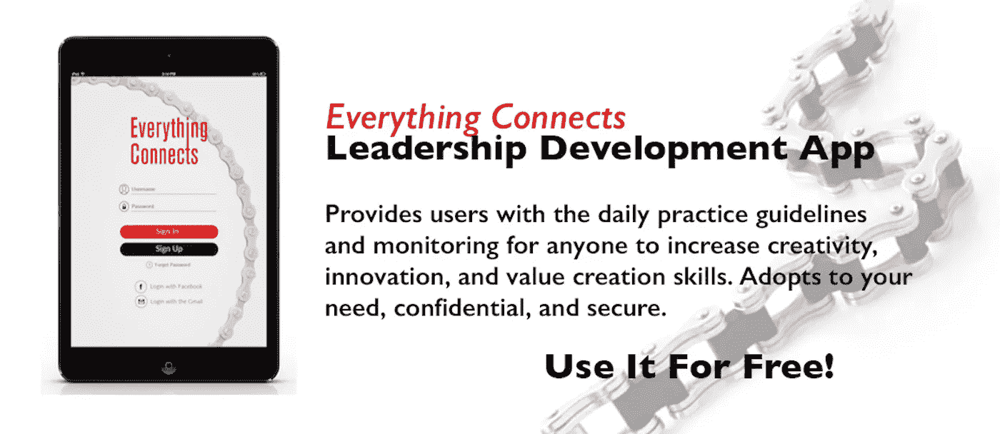

# 如何扭转一个混乱的团队

> 原文：<https://medium.com/swlh/how-to-turn-around-a-team-in-turmoil-e05f9e543373>

[Photo: Dieselducy, Andrew R via [Wikimedia Commons](http://commons.wikimedia.org/wiki/File%3ARinging_the_elevator_alarm.jpg)]

在危机时刻，领导者倾向于保守秘密，发号施令，推卸责任。那些都是糟糕的举动。

当你的团队陷入困境时，似乎任何出路都是好的出路。事实往往并非如此。在任何时候，带领团队朝着正确的方向前进都是至关重要的，但是当压力很大，事情进展不顺利时，让每个人都回到正轨就特别困难。这里有几个方法可以做到这一点，而不会陷入管理者在试图纠正事情时经常犯的错误。

## 1.看过程，而不仅仅是人

当出现问题时，太多的领导者会责怪他人——这是一种可以理解的本能。在危机情况下，第一反应通常是找出问题所在并找出错误。当然，有时确实是一个人或一群人搞砸了。但通常是他们在内*工作的系统或流程导致了他们的失误。*

这有助于在指责之前缩小一点。立即采取以下步骤:

1.  *仔细审视你当前的策略。在事情出错之前，你的团队执行得如何？什么变了？从你当前情况的角度考虑这些执行方法，以确定不断变化的环境是否降低了它们的效率。*
2.  *接下来，分析你的团队、合作伙伴和客户的工作的影响。结果从哪里开始下滑或销售额从哪里开始下降？*
3.  最后，评估你目前的能力。尽管形势不好，你目前的执行能力如何？你还有哪些资产和资源可以用来尝试新事物？

对你的过程的评估应该使你更容易重新审视你的团队或公司的战略，这样你就可以做出关于如何前进的决定，而不是基于个人或办公室政治。通常，如果出现混乱，这意味着你的过程中有一部分没有像预期的那样工作，时间比你意识到的要长。但是在做出轻率的选择之前，你需要确定这一点。当不了解决策的全部影响就匆忙做出决策时，即使是最有效的领导者也无法让他们的团队回到正轨。

2009 年，通用汽车濒临破产之际，埃德·惠特克(Ed Whitacre)被任命为董事长。他立即将通用汽车的销售和营销组织合并到一个领导之下——这是一个仓促的决定，后来证明是错误的。几个月后，通用汽车不得不再次拆分销售和营销。

正如 [*彭博*报道](http://www.bloomberg.com/news/articles/2010-04-29/ed-whitacres-battle-to-save-gm-from-itself)的那样，“惠特克意识到所有的变化都让员工感到不安，所以他给全公司发了一封电子邮件:‘一个聪明的公司会改变并适应业务需求。因此，尽管通用汽车内部总会有个人变动，但我想向你们保证，主要的领导层变动已经过去了。“他的电子邮件并不能让惠特克的团队安心，但最终，在他的指导下，公司在他的指导下进行了规模巨大的 200 亿美元的首次公开募股。

## 2.重温你们的共同目标——不要害怕改变它

当我们找到一些乐观的共同理由时，我们通常能够将这种积极的能量引导到寻找解决方案上。当事情出错时，士气会下降，所以在前进之前，有必要重新投资于一个共同的目标。许多领导者已经知道，他们需要在动荡时期强调团队的共同愿景，但很少有人以正确的方式做到这一点。你需要用具体、实际的术语解释正在进行的变化如何与你公司重新定义的目标相联系——需要采取什么新的步骤，以及这些步骤应该如何执行。

毕竟，有时候你的目标感*确实需要重新定义。可能枢轴正是医生所要求的。如果你的核心愿景误导了你，那么重新强调它可能是个坏主意。在急于指责“害群之马”的时候，挣扎中的公司往往会忽略这一点。*

相反，卓有成效的领导者会让团队成员对手头任务的紧迫性感觉良好，从而重新向他们灌输自我价值。面对危机，未来往往是模糊的，接受这一现实——然后要求你的团队也接受这种不确定性，展示你对他们能够成功的信心。领导者不一定需要单枪匹马地将他们的组织推向一个新的方向，只要在全体船员一起掌舵时保持一艘稳定的船就行了。

## 3.开始尝试和委派责任

变化可能会也可能不会融入到你的公司文化中，但有时环境需要它。不管是什么情况，都可能是好事。当人们不得不一起改变时，他们通常会更多地了解彼此。危机可以说是灌输这种团队建设态度的最佳时机。这样，当下一次动荡来袭时，你的组织将会更好地渡过难关。

要做到这一点，领导者可能需要做与他们在艰难时期习惯做的事情相反的事情；与其埋头苦干，发布指示，展示“强有力”的领导力，不如开始尝试，给别人更多而不是更少的责任。

毕竟，你能做的最糟糕的事情就是回到旧的工作方式——那些最初让你陷入困境的方式。最具创新性的解决方案往往是在危机的边缘找到的。当事情进展顺利时，创新往往会带来更多的好处，但当我们需要快速做出大规模改变时，实验的能力有时甚至可以改变最糟糕的情况。

但在这种情况下，领导力通常不仅仅来自一个人。领导者和管理者自己可能并不处于最佳位置来看到这个难题的破坏性部分。如果每个团队成员都被鼓励大胆发言，并有权承担自己解决问题的责任，那么解决方案会更加强大。

当一个团队拥有走出困境的路线时，他们将更有经验爬出他们陷入的下一个困境。

*【图片:迪塞尔杜西、安德鲁 R via* [*维基共享资源*](http://commons.wikimedia.org/wiki/File%3ARinging_the_elevator_alarm.jpg)*】*

版权所有 2016 年由费萨尔霍克。保留所有权利。

**原文*@***[***fast company***](http://www.fastcompany.com/3064371/three-ways-to-turn-around-a-team-in-turmoil)。

. . . . .

我是一名企业家和作家。 [SHADOKA](http://shadoka.com/) 等公司创始人。Shadoka 促进企业家精神、增长和社会影响。《万物互联——如何在创意、创新和可持续发展的时代进行变革和领导》(麦格劳·希尔著)和《生存与发展:富有弹性的企业家、创新者和领导者的 27 种实践》(励志出版社)。在推特上关注我。*免费使用* [*万物互联*](http://app.everythingconnectsthebook.com/login.php) *领导力 app 和* [*生存茁壮*](http://app.survivetothrive.pub/login.php) *弹性 app。*

## 这个故事发表在 [The Startup](https://medium.com/swlh) 上，这是 Medium 最大的企业家出版物，拥有 322，555+人。

## 在这里订阅接收[我们的头条新闻](http://growthsupply.com/the-startup-newsletter/)。

