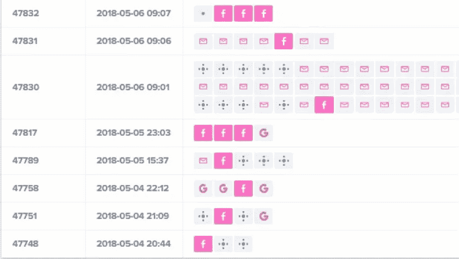

# 如何从您的电子商务分析中了解您的客户旅程

> 原文：<https://medium.com/swlh/how-to-understand-your-customer-journey-from-your-ecommerce-analytics-3f8925118f06>

顾客之旅是你销售过程的重要组成部分，因为它最终是你的销售漏斗。了解客户在研究、决定和购买你的产品时所经历的确切过程，对于了解你需要按下哪个按钮至关重要。

如今，顾客比以往任何时候都更加变化无常，要求也更高，而且这种趋势不会很快消失。客户希望个性化，他们希望事情始终与他们相关。

**了解并优化您的客户旅程意味着您可以为客户提供更多个性化服务，并在正确的时间向正确的人提供正确的信息。**

了解你的顾客之旅以及它与你的结账流程的关系的最佳方式是依靠你的分析。

# 顾客之旅:关于接触点你需要知道的一切

在处理客户旅程时，不要盲目行事，这一点很重要。

这就是你的数据发挥作用的地方:你的分析将向你展示你的客户在发现和转化之间的每一步是如何表现的。

事实是，你的电子商务商店的关键绩效指标掌握着客户旅程的每一个秘密，你的战略应该基于这些数据，这样你就可以相应地跟踪、衡量和评估你的行动。

例如，**接触点对于顾客在你的商店建立足够的信任并做出明智的购买决定至关重要**。

接触点被定义为以某种方式与你的品牌互动。现场接触点是我们可以在您的网站上直接跟踪的内容。场外接触点是在你的网站之外与你的品牌发生的互动(想想社交媒体)。

很少有顾客会在第一次拜访你时就购买。大多数顾客在决定购买之前都会反复考虑。

但是这并不一定是一件坏事——这只是当今消费者的行为方式。

**Divvit 统计出我们的商家和他们的顾客之间平均需要 5.5 个接触点才能达成购买**。

我们甚至看到了多达 20 个接触点。有些顾客比其他顾客更需要说服力。

但是你需要明白的是**每个接触点都很重要，因为这是一个机会。**

无论客户是通过谷歌 AdWords、你的某个社交账户，还是另一个网站上的横幅广告与你的品牌互动，**每次他们与你的品牌互动，他们就离转化更近了一步**。

在客户之旅中，随着客户态度和情绪的发展，这些接触点会分为几个不同的阶段。他们正处于决定是否购买的过程中，这些接触点可以很好地表明他们购买的可能性。

# 顾客旅程的各个阶段与你的电子商务结账流程

今天，我们将重点介绍电子商务客户之旅的三个主要步骤:

**意识:**

这是顾客第一次发现你和你的产品的时候。通常在第一次点击你的网站时，他们就开始了解你是谁，你能提供什么。

**考虑:**

在考虑阶段，顾客会浏览你的产品，并开始决定是否购买。这通常是客户旅程中较长的步骤之一，因为这是所有接触点发生的地方。

在考虑阶段，您将开始看到一些客户从低意向转变为高意向。低意向客户会浏览橱窗，但他们可能根本不会购买。

在这一阶段，客户参与得越多，他们购买的可能性就越大，这使他们成为更高意向的客户。

**采集:**

这是我们一直希望的转变！顾客已经做出了决定，并决定结账。

从这里开始，还有一些其他的阶段或步骤来实现再转换，但是这对于另一篇文章来说已经足够了。我们将重点关注第一次转化中我们可以跟踪和衡量的内容。

因此，到目前为止，客户之旅似乎相当简单。但是它与你的结账流程相比如何呢？

按照相同的客户旅程流程，我们可以看到您的网站结构也像一个漏斗一样，随着客户越来越接近转化，漏斗越来越窄。

在顾客旅程的认知阶段，你的顾客可能会浏览你的主页、分类页面和产品页面。一般来说，客户在你的网站上呆的时间越长，他们的旅程就越长。

当客户将产品添加到购物车时，他们就进入了考虑阶段，在这个阶段会做出最终决定。他们甚至可能在真正决定是否购买之前就开始结账。

当客户浏览您的结账流程和您的客户旅程时，我们可以从您的数据中看到表明客户意向是高还是低的行为。

来源:[https://demo.divvit.com/analytics](https://demo.divvit.com/analytics)

观察一个实际的销售漏斗，我们可以看到这个顾客之旅是如何应用到你的真实结账流程中的。

您应该比较各个渠道的转化漏斗，以便更好地了解不同渠道的客户旅程有何不同(您可以在这里看到有机流量和网站平均流量的对比)。

这也向我们展示了我们应该关注的 KPI，以了解我们的客户之旅。

# 客户旅程会影响哪些 KPI？

顾客之旅与两件不同的事情有关:

*   您的 UX 和结账流程
*   你的顾客的行为模式

当这两者结合在一起时，您就会发现客户之旅。当谈到[规划完美的客户旅程](https://www.divvit.com/blog-posts/how-boost-conversion-perfecting-customer-journey-mapping)时，记住几个关键绩效指标很重要。

*   **访问量:**有多少人从这个渠道来到你的网站
*   **页面浏览量/访问量:**您的客户在您的网站上浏览了多少页面
*   平均访问时长:客户在您的网站上停留的时间
*   跳出率:有多少访问者没有浏览登录页面就离开了你的网站
*   **失败的发现/浏览放弃率:**在购物车中添加任何东西之前，有多少浏览您站点的访问者退出了
*   **购物车放弃率:**有多少客户将产品添加到购物车，但没有完成购买
*   **转化率:**有多少客户进入了收购阶段

这些 KPI 共同构成了一份基本的客户行为报告。我总是建议按渠道细分——因为来自不同渠道的顾客会有不同的行为，并有不同的顾客旅程。

来源:[https://demo.divvit.com/analytics](https://demo.divvit.com/analytics)

乍一看，一下子查看这些 KPI 可能有点吓人。但是将它一点一点地分解，可以让你真正了解你的 UX 是如何通过渠道影响你的客户旅程的。

我们在这里还可以看到，有机谷歌这个月带来了 782 次访问，他们有相对较高的浏览量/访问量和平均访问时长。

虽然它还没有带来大量的流量，但我们可以看到来自谷歌的流量是非常合格的。跳出率低于典型的 35%的平均水平，结账放弃率也低于电子商务商店 70%的平均水平。

此外，这个渠道的转化率非常高:电子商务商店的平均转化率在 1-2%之间，这个渠道的转化率为 3.58%。

这位商家走得更远，因为这家在线商店的搜索引擎优化可能仍在开发中，所以选择做 AdWords 活动对带来更多高质量的流量非常重要，甚至会有更好的结果:

这是一个很好的方法来看看你的定位是否对你的网上商店有效。对于这些渠道，我们有一个清晰的观点，即这是正确的信息，这是正确的客户。

转化率反映了这些活动的成功程度。

让我们来看看同一家商店的另一个例子:

这是有机社交渠道脸书和 Instagram 过去一个月的顾客行为快照。脸书带来的流量是有机谷歌的近 3 倍，然而我们可以看到这种客户之旅是完全不同的。

每次访问的页面浏览量和平均访问时长比有机谷歌低很多，跳出率却高一倍。即使是结账放弃率也是 71.67%，留给我们的整体转化率是 0.73%。

让我们来细分一下:**有机谷歌带来了 28 个订单的 782 次访问，有机脸书带来了 17 个订单的 2344 次访问**。

通过这种方式，您可以开始了解不同渠道的客户旅程有何不同。与有机谷歌不同，我们可以看到来自脸书的客户是:

*   参与度低得多(从浏览量/访问量和平均访问时长来看)
*   他们发现信息不太相关(如跳出率所示)
*   他们更有可能逛商店(从高失败发现率中可以看出)
*   他们远没有做好购买的准备(从结账放弃率和转换率可以看出)。

这肯定是一个目标问题，因为社交媒体上的错误目标可能会导致这些 KPI 的趋势。但是，当我们考虑客户之旅时，确保将渠道考虑在内是至关重要的。

显然，脸书正在努力推动流量，但该频道并没有带来想要购买的客户。或者，**你的登陆页面没有向那些潜在客户提供正确的信息**。

尽管如此，脸书并不一定是一个彻底的失败。这种合作仍然会产生一个接触点，我们可以通过这个接触点了解更多信息。

# 了解您的数据告诉您的客户之旅

现在，我们已经看到了电子商务客户之旅潜在问题背后的关键绩效指标，我们注意到了有机脸书的一个问题。

让我们一点一点地检查它，以便更好地了解这一渠道对您的客户的价值。

我们可以看到，脸书实际上为您的订单带来了不少接触点。虽然它可能并不总是转化渠道，但它仍然可以让你的客户朝着正确的方向前进。

这能让他们在多大程度上改变信仰？

我们可以看到，脸书最终为这些客户的转化提供了相当多的价值。虽然一些接触点是弹跳或长度不到一分钟，但大多数都很重要，有较高的页面浏览量。

真正有趣的是，这些接触点都是在手机或平板电脑上完成的。如果通过手机从脸书来的顾客比通过台式机来的多，这肯定可以解释平均访问时间和页面浏览量较低的原因。

因为移动客户的行为方式与桌面客户不同，他们的客户旅程也不一样。

现在，我们掌握了所有这些信息。让我们总结一下我们对脸书客户的了解——因为这是我们要解决的渠道:

*   远远不够投入
*   他们发现这个信息不太相关
*   他们更有可能逛商店
*   他们远没有准备好购买
*   通常通过手机或平板电脑访问
*   他们通常通过谷歌完成购买

现在我们知道了这个渠道的关键问题，我们可以开始审视我们的客户之旅，并制定行动计划来解决这些问题。

# 如何创建数据驱动的客户旅程行动计划

在为你的网上商店制定行动计划时，重要的是要考虑你想要达到什么样的目标。

任何人都可以说他们想赚更多的收入，但这实际上不会帮助你完成任何事情。

你需要定义有意义的目标，最重要的是，它们需要是可衡量的。现在，我们手头有丰富的信息:我们知道我们需要关注什么 KPI，我们知道应该关注什么渠道，我们知道需要改进什么。

# 是时候设定一个切实的目标了:

跳出率可能是这些脸书客户的最大问题——它是谷歌流量的两倍，这是我们可以开始解决的客户之旅的第一步。因为如果你的客户不能通过你的登陆页面，旅程就不能开始。

例如，对于 51.72%的跳出率，我们应该考虑将这个数字降低到电子商务商店的平均水平 35%。

你希望你的目标可以实现:一个无法实现的目标对你来说毫无意义。

出于我们的目的，假设在接下来的 6 个月中，我们希望将跳出率降低 15%。这有助于我们定义:

*   我们将关注的 KPI
*   我们需要实现的改变的数量
*   做这件事的时间表

这给了你一些可以在你的分析中跟踪和衡量的东西。我之前提到过，你不能盲目地去做，为你的电子商务商店的顾客旅程设定目标也不例外。

一旦你有了可以努力实现的目标，你就可以开始思考可以实施哪些不同的策略来降低跳出率。

在你选择的时间范围内跟踪你的数据。

定期做检查，比如每周一次，看看每次检查的反弹率是否有差异。下载每周报告，实时跟踪您的活动执行情况。

这会给你时间来改变和调整你的活动，这样你就一定能实现你的目标。通过定期跟踪和衡量你的关键 KPI，你应该达到你的现实目标。

# 关键要点

顾客之旅是一个复杂的主题，但准确理解它如何在你的电子商务销售漏斗中发挥作用，对于确保你的商店尽可能优化至关重要。

你的数据告诉你关于你的网站、你的销售渠道和你的客户的一切。

当你能够理解你的数据时，你就可以批判性地思考这些数据告诉你关于你的顾客行为的什么，以及他们如何与你的商店互动。

一旦你明白这一点，你就可以继续优化你的电子商务商店的运作方式，随着时间的推移，获得越来越多的收入。

您认为哪些 KPI 对客户旅程最重要？

## 这个故事发表在[的创业](https://medium.com/swlh)上，这是 Medium 最大的创业刊物，有 328，729+人关注。

## 订阅接收[我们的头条新闻](http://growthsupply.com/the-startup-newsletter/)。

